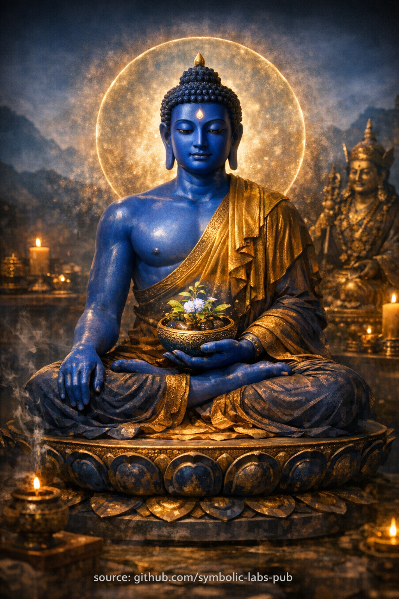

## [Medicine Buddha](https://github.com/symbolic-labs-pub/a-buddhist-view/blob/master/more/08_lineage/06_medicine_buddha/README.md#a-buddhist-teaching)

Nauka

## Nauka buddyjska

### *Uzdrawianie jest jasnym widzeniem*

**Fokus nauczania:** Medicine Buddha (Bhaisajyaguru)
**Widok:** Mądrość
**Ścieżka:** Rozumienie przyczynowości
**Rezultat:** Adaptacyjna wolność

---

### 1. Niezrozumienie uzdrawiania

Zwykłe istoty wierzą, że uzdrawianie oznacza **usuwanie bólu**.

Szukają:

* Komfortu zamiast jasności
* Ulgi zamiast zrozumienia
* Wymazania zamiast transformacji

Ale ból nie trwa, ponieważ jest okrutny.
Trwa, ponieważ **jego przyczyny pozostają niewidzialne**.

Z buddyjskiego punktu widzenia, cierpienie trwa nie z powodu losu czy kary,
ale z powodu **niezbadanych warunków**.

---

### 2. Reorientacja Medicine Buddhy

Medicine Buddha nie obiecuje ratunku.

Naucza tego:

> **Cierpienie jest wiadomością o przyczynowości.**

Choroba, zamieszanie, emocjonalna turbulencja i powtarzające się wzorce życiowe nie są wrogami.
Są **sygnałami produkowanymi przez pochodzenie współzależne**.

Uzdrawianie zaczyna się więc nie od interwencji, ale od **dokładnej percepcji**.

---

### 3. Niebieski jako kolor precyzji

Głęboki niebieski Medicine Buddhy nie jest symbolicznym komfortem.

Reprezentuje:

* Głębię bez zniekształcenia
* Chłód bez wycofania
* Dokładność bez okrucieństwa

Niebieska świadomość nie spieszy się z naprawianiem.
**Odczytuje warunki prawidłowo**.

Dlatego mądrość uzdrawiania jest spokojna:

* Panika zaciemnia przyczynowość
* Jasność ujawnia punkty dźwigni

---

### 4. Trzy domeny uzdrawiania

Nauka Medicine Buddhy odnosi się do **trzech nierozłącznych domen**:

#### 1. Umysł

Zamieszanie powstaje, gdy zdarzenia mentalne są mylone z prawdą.
Uzdrawianie następuje, gdy myśli są widziane jako **procesy**, nie rozkazy.

#### 2. Karma

Karma nie jest przeznaczeniem.
Jest **pędem**.

Gdy przyczyny są wyraźnie widoczne, pęd może zostać przekierowany.
Zrozumienie zastępuje poczucie winy.

#### 3. Warunki

Zewnętrzne okoliczności nie są ani stałe, ani całkowicie kontrolowalne.
Są **konfigurowalne w granicach**.

Mądrość działa tam, gdzie zmiana jest możliwa
i rozluźnia się tam, gdzie nie jest.

---

### 5. Uzdrawianie nie jest emocjonalnym komfortem

Z tej nauki:

* Komfort może nastąpić, ale nie jest celem
* Ból może pozostać, ale traci autorytet
* Strach rozpuszcza się, gdy przyczynowość staje się widoczna

Prawdziwe uzdrawianie czuje się tak:

> *"Wiem, co się dzieje, i wiem, co robić dalej."*

To nie jest pocieszenie.
To **funkcjonalne wyzwolenie**.

---

### 6. Przebudzenie adaptuje się do warunków

Końcowa instrukcja Medicine Buddhy jest zgodna z podstawowym wglądem Kagyü:

> **Przebudzenie jest adaptacyjne, nie sztywne.**

Nie ma jednego lekarstwa dla wszystkich istot.
Jest tylko:

* Dokładna diagnoza
* Umiejętne dostosowanie
* Ciągłe dopracowywanie

Mądrość reaguje na rzeczywistość taką, jaka jest,
nie taką, jaką chciałoby się, aby była.

---

### 7. Rezultat tej nauki

Gdy ta nauka jest zintegrowana:

* Cierpienie staje się zrozumiałe
* Praktyka staje się praktyczna
* Współczucie staje się ugruntowane
* Działanie staje się precyzyjne

Praktykujący nie pyta już:

> *"Dlaczego to przytrafia się mnie?"*

Pyta:

> **"Jaki warunek prosi o zrozumienie?"**

To pytanie samo w sobie jest lekarstwem.

---

Wyjaśnienie

### *Uzdrawianie jest jasnym widzeniem*

**Fokus nauczania:** Medicine Buddha (Bhaisajyaguru)
**Widok:** Mądrość
**Ścieżka:** Rozumienie przyczynowości
**Rezultat:** Adaptacyjna wolność

---

### 1. Niezrozumienie uzdrawiania

Zwykłe istoty wierzą, że uzdrawianie oznacza **usuwanie bólu**.

Szukają:

* Komfortu zamiast jasności
* Ulgi zamiast zrozumienia
* Wymazania zamiast transformacji

Ale ból nie trwa, ponieważ jest okrutny.
Trwa, ponieważ **jego przyczyny pozostają niewidzialne**.

Z buddyjskiego punktu widzenia, cierpienie trwa nie z powodu losu czy kary,
ale z powodu **niezbadanych warunków**.

---

### 2. Reorientacja Medicine Buddhy

Medicine Buddha nie obiecuje ratunku.

Naucza tego:

> **Cierpienie jest wiadomością o przyczynowości.**

Choroba, zamieszanie, emocjonalna turbulencja i powtarzające się wzorce życiowe nie są wrogami.
Są **sygnałami produkowanymi przez pochodzenie współzależne**.

Uzdrawianie zaczyna się więc nie od interwencji, ale od **dokładnej percepcji**.

---

### 3. Niebieski jako kolor precyzji

Głęboki niebieski Medicine Buddhy nie jest symbolicznym komfortem.

Reprezentuje:

* Głębię bez zniekształcenia
* Chłód bez wycofania
* Dokładność bez okrucieństwa

Niebieska świadomość nie spieszy się z naprawianiem.
**Odczytuje warunki prawidłowo**.

Dlatego mądrość uzdrawiania jest spokojna:

* Panika zaciemnia przyczynowość
* Jasność ujawnia punkty dźwigni

---

### 4. Trzy domeny uzdrawiania

Nauka Medicine Buddhy odnosi się do **trzech nierozłącznych domen**:

#### 1. Umysł

Zamieszanie powstaje, gdy zdarzenia mentalne są mylone z prawdą.
Uzdrawianie następuje, gdy myśli są widziane jako **procesy**, nie rozkazy.

#### 2. Karma

Karma nie jest przeznaczeniem.
Jest **pędem**.

Gdy przyczyny są wyraźnie widoczne, pęd może zostać przekierowany.
Zrozumienie zastępuje poczucie winy.

#### 3. Warunki

Zewnętrzne okoliczności nie są ani stałe, ani całkowicie kontrolowalne.
Są **konfigurowalne w granicach**.

Mądrość działa tam, gdzie zmiana jest możliwa
i rozluźnia się tam, gdzie nie jest.

---

### 5. Uzdrawianie nie jest emocjonalnym komfortem

Z tej nauki:

* Komfort może nastąpić, ale nie jest celem
* Ból może pozostać, ale traci autorytet
* Strach rozpuszcza się, gdy przyczynowość staje się widoczna

Prawdziwe uzdrawianie czuje się tak:

> *"Wiem, co się dzieje, i wiem, co robić dalej."*

To nie jest pocieszenie.
To **funkcjonalne wyzwolenie**.

---

### 6. Przebudzenie adaptuje się do warunków

Końcowa instrukcja Medicine Buddhy jest zgodna z podstawowym wglądem Kagyü:

> **Przebudzenie jest adaptacyjne, nie sztywne.**

Nie ma jednego lekarstwa dla wszystkich istot.
Jest tylko:

* Dokładna diagnoza
* Umiejętne dostosowanie
* Ciągłe dopracowywanie

Mądrość reaguje na rzeczywistość taką, jaka jest,
nie taką, jaką chciałoby się, aby była.

---

### 7. Rezultat tej nauki

Gdy ta nauka jest zintegrowana:

* Cierpienie staje się zrozumiałe
* Praktyka staje się praktyczna
* Współczucie staje się ugruntowane
* Działanie staje się precyzyjne

Praktykujący nie pyta już:

> *"Dlaczego to przytrafia się mnie?"*

Pyta:

> **"Jaki warunek prosi o zrozumienie?"**

To pytanie samo w sobie jest lekarstwem.

---

## Medytacja Medicine Buddhy

### *Uzdrawianie jako jasne widzenie*

**Cel medytacji:** Medicine Buddha (Bhaisajyaguru)
**Funkcja:** Uzdrawianie przez wgląd w przyczynę i skutek
**Tryb:** Spokojne trwanie nasycone analityczną jasnością

> ⚠️ **Uwaga dotycząca zakresu**
> To, co następuje, jest **nie-inicjacyjną formą kontemplacyjną** (praktyką znaczenia).
> **Nie** zastępuje transmisji linii przekazu (*wang, lung, tri*).
> Jej funkcją jest **stabilizacja, aspiracja i wyrównanie przyczynowe**, nie autoryzacja tantryczna.

---

### 1. Przygotowanie — ustalenie podstawy

Usiądź w stabilnej postawie.
Pozwól kręgosłupowi być wyprostowanym, ale nie wymuszonym.
Ręce spoczywają naturalnie.

Weź **trzy powolne oddechy**.

Przy każdym wydechu, cicho zauważ:

> *"Nic jeszcze nie musi być naprawione."*

To przygotowuje umysł na **precyzję zamiast pilności**.

---

### 2. Wizualizacja — pojawia się niebieska jasność

Wizualizuj **Medicine Buddhę** przed sobą lub nad koroną twojej głowy.

* Jego ciało jest **głęboko lazurytowoniebieski** — nie symboliczna dekoracja, ale **głębia i dokładność**
* Jego spojrzenie jest spokojne, dokładne i nie osądzające
* W lewej ręce: **miska z lekarstwem**, świecąca delikatnie
* Jego obecność jest **chłodna, świetlista i przebudzona**

To niebieskie światło nie jest emocjonalnym komfortem.
Jest **diagnostyczną świadomością**.

Pozwól obrazowi się ustabilizować.

---

### 3. Otrzymywanie uzdrowienia — umysł, karma, warunki

Z serca Medicine Buddhy, **niebieskie światło** promieniuje i wchodzi do twojego ciała.

Pozwól mu poruszać się w **trzech przejściach**:

#### Pierwsze przejście — Umysł

* Myśli zwalniają
* Zamieszanie staje się czytelne
* Emocjonalny hałas traci autorytet

Cicho zauważ:

> *"Widzę jasno."*

#### Drugie przejście — Karma

* Habitualne reakcje pojawiają się jako **wzorce**, nie tożsamości
* Widzisz, jak działania produkują rezultaty
* Poczucie winy łagodnieje w zrozumienie

Cicho zauważ:

> *"Przyczyny mają konsekwencje."*

#### Trzecie przejście — Warunki

* Zewnętrzne przeszkody są widziane jako **modyfikowalne warunki**
* Co może być zmienione, staje się oczywiste
* Co nie może być zmienione, staje się wykonalne

Cicho zauważ:

> *"Dostosowanie jest możliwe."*

---

### 4. Podstawowa kontemplacja — uzdrawianie jako wgląd

Teraz porzuć wizualizację.

Spoczywaj z jednym zapytaniem (nie wymuszaj odpowiedzi):

> **"Co, jeśli wyraźnie zobaczone, naturalnie by się zmieniło?"**

Nie analizuj agresywnie.
Pozwól wglądowi **wypłynąć samemu**.

To jest serce praktyki Medicine Buddhy:

* Uzdrawianie nie oznacza *usunięcia*
* Uzdrawianie oznacza *dokładną percepcję*
* Dokładna percepcja rozpuszcza wiele problemów sama

---

### 5. Integracja — działanie bez dramatu

Przed zamknięciem, przynieś do umysłu **jedno małe dostosowanie**, które mógłbyś realistycznie zrobić:

* Nawyk
* Wzorzec myślowy
* Odpowiedź

Bez ślubowań. Bez presji.

Po prostu to rozpoznaj.

To jest zgodne z zasadą:

> **Przebudzenie adaptuje się do warunków.**

---

### 6. Dedykacja — stabilizacja rezultatu

Zakończ cichą dedykacją:

> *"Niech jasność przyniesie ulgę cierpieniu—
> we mnie i gdziekolwiek przyczyny pozwolą."*

Pozwól oddechowi wrócić do normalności.
Otwórz oczy powoli.

---

## Uwagi dotyczące praktyki (ważne)

* Ta medytacja działa najlepiej **bez emocjonalnej dramatyzacji**
* Jest szczególnie skuteczna podczas:

  * Choroby
  * Wypalenia
  * Zamieszania etycznego
  * Powtarzających się problemów życiowych
* Krótkie, częste sesje (10–15 minut) przewyższają długie heroiczne

---

## Wgląd strukturalny (dlaczego to działa)

Ta praktyka jest potężna, ponieważ:

* Traktuje cierpienie jako **system, nie moralną porażkę**
* Trenuje **diagnostyczną mądrość**, nie zależność
* Wyrównuje uzdrawianie z **pochodzeniem współzależnym**, nie wishful thinking

Uzdrawianie tutaj oznacza:

---

Medytacja

## Medytacja Medicine Buddhy

### *Uzdrawianie jako jasne widzenie*

**Cel medytacji:** Medicine Buddha (Bhaisajyaguru)
**Funkcja:** Uzdrawianie przez wgląd w przyczynę i skutek
**Tryb:** Spokojne trwanie nasycone analityczną jasnością

> ⚠️ **Uwaga dotycząca zakresu**
> To, co następuje, jest **nie-inicjacyjną formą kontemplacyjną** (praktyką znaczenia).
> **Nie** zastępuje transmisji linii przekazu (*wang, lung, tri*).
> Jej funkcją jest **stabilizacja, aspiracja i wyrównanie przyczynowe**, nie autoryzacja tantryczna.

---

### 1. Przygotowanie — ustalenie podstawy

Usiądź w stabilnej postawie.
Pozwól kręgosłupowi być wyprostowanym, ale nie wymuszonym.
Ręce spoczywają naturalnie.

Weź **trzy powolne oddechy**.

Przy każdym wydechu, cicho zauważ:

> *"Nic jeszcze nie musi być naprawione."*

To przygotowuje umysł na **precyzję zamiast pilności**.

---

### 2. Wizualizacja — pojawia się niebieska jasność

Wizualizuj **Medicine Buddhę** przed sobą lub nad koroną twojej głowy.

* Jego ciało jest **głęboko lazurytowoniebieski** — nie symboliczna dekoracja, ale **głębia i dokładność**
* Jego spojrzenie jest spokojne, dokładne i nie osądzające
* W lewej ręce: **miska z lekarstwem**, świecąca delikatnie
* Jego obecność jest **chłodna, świetlista i przebudzona**

To niebieskie światło nie jest emocjonalnym komfortem.
Jest **diagnostyczną świadomością**.

Pozwól obrazowi się ustabilizować.

---

### 3. Otrzymywanie uzdrowienia — umysł, karma, warunki

Z serca Medicine Buddhy, **niebieskie światło** promieniuje i wchodzi do twojego ciała.

Pozwól mu poruszać się w **trzech przejściach**:

#### Pierwsze przejście — Umysł

* Myśli zwalniają
* Zamieszanie staje się czytelne
* Emocjonalny hałas traci autorytet

Cicho zauważ:

> *"Widzę jasno."*

#### Drugie przejście — Karma

* Habitualne reakcje pojawiają się jako **wzorce**, nie tożsamości
* Widzisz, jak działania produkują rezultaty
* Poczucie winy łagodnieje w zrozumienie

Cicho zauważ:

> *"Przyczyny mają konsekwencje."*

#### Trzecie przejście — Warunki

* Zewnętrzne przeszkody są widziane jako **modyfikowalne warunki**
* Co może być zmienione, staje się oczywiste
* Co nie może być zmienione, staje się wykonalne

Cicho zauważ:

> *"Dostosowanie jest możliwe."*

---

### 4. Podstawowa kontemplacja — uzdrawianie jako wgląd

Teraz porzuć wizualizację.

Spoczywaj z jednym zapytaniem (nie wymuszaj odpowiedzi):

> **"Co, jeśli wyraźnie zobaczone, naturalnie by się zmieniło?"**

Nie analizuj agresywnie.
Pozwól wglądowi **wypłynąć samemu**.

To jest serce praktyki Medicine Buddhy:

* Uzdrawianie nie oznacza *usunięcia*
* Uzdrawianie oznacza *dokładną percepcję*
* Dokładna percepcja rozpuszcza wiele problemów sama

---

### 5. Integracja — działanie bez dramatu

Przed zamknięciem, przynieś do umysłu **jedno małe dostosowanie**, które mógłbyś realistycznie zrobić:

* Nawyk
* Wzorzec myślowy
* Odpowiedź

Bez ślubowań. Bez presji.

Po prostu to rozpoznaj.

To jest zgodne z zasadą:

> **Przebudzenie adaptuje się do warunków.**

---

### 6. Dedykacja — stabilizacja rezultatu

Zakończ cichą dedykacją:

> *"Niech jasność przyniesie ulgę cierpieniu—
> we mnie i gdziekolwiek przyczyny pozwolą."*

Pozwól oddechowi wrócić do normalności.
Otwórz oczy powoli.

---

## Uwagi dotyczące praktyki (ważne)

* Ta medytacja działa najlepiej **bez emocjonalnej dramatyzacji**
* Jest szczególnie skuteczna podczas:

  * Choroby
  * Wypalenia
  * Zamieszania etycznego
  * Powtarzających się problemów życiowych
* Krótkie, częste sesje (10–15 minut) przewyższają długie heroiczne

---

## Wgląd strukturalny (dlaczego to działa)

Ta praktyka jest potężna, ponieważ:

* Traktuje cierpienie jako **system, nie moralną porażkę**
* Trenuje **diagnostyczną mądrość**, nie zależność
* Wyrównuje uzdrawianie z **pochodzeniem współzależnym**, nie wishful thinking

Uzdrawianie tutaj oznacza:

> **Wyraźne widzenie tego, co musi być zmienione—i tego, z czym nie trzeba walczyć.**

---

< [Nauka buddyjska: **przebudzenie jako umiejętna adaptacja**](../05_padmasambhava/README.md) | [Kalu Rinpoche](../07_kalu_rinpoche/README.md) >

_źródło: [github.com/symbolic-labs-pub](https://github.com/symbolic-labs-pub)_

---
