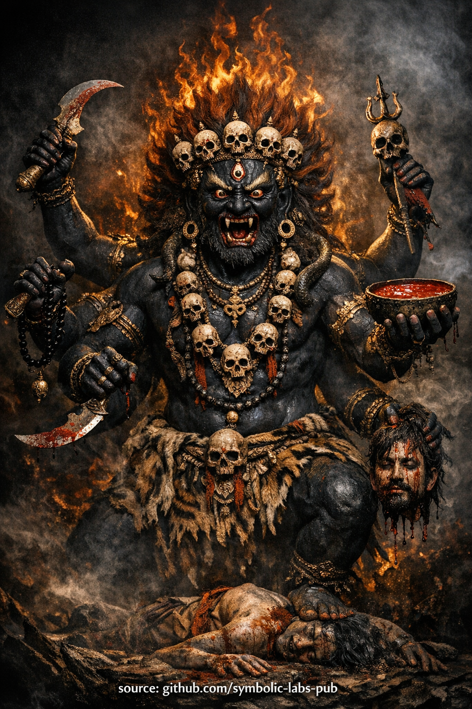

## [Mahākāla jako dyscyplina przebudzenia](https://github.com/symbolic-labs-pub/a-buddhist-view/blob/master/more/08_lineage/12_six_armed_mahakala/README.md#mahākāla-as-the-discipline-of-awakening)

Nauka

# Nauka gniewnego ochroniarza

## Mahākāla jako dyscyplina przebudzenia

### 1. Dlaczego gniew pojawia się na ścieżce

W buddyzmie **gniew nie jest złością**.

Gniewne formy powstają **tylko gdy łagodniejsze metody zawodzą**.
Pojawiają się, gdy współczucie musi działać **bez opóźnienia**, **bez negocjacji** i **bez sentymentalizmu**.

Mahākāla ucieleśnia tę zasadę:

> *Gdy ignorancja nie reaguje już na cierpliwość,
> mądrość pojawia się jako siła.*

To nie jest przemoc.
To jest **chirurgiczna jasność**.

---

### 2. Co Mahākāla faktycznie chroni

Powszechnym nieporozumieniem jest to, że ochroniarze strzegą **ludzi**, **komfortu** lub **sukcesu**.

Mahākāla chroni **tylko jedną rzecz**:

> **Warunki dla realizacji.**

Obejmuje to:

* Dyscyplinę
* Integralność etyczną
* Ciągłość praktyki
* Wierność linii przekazu
* Nie-odchylenie od prawdy

Cokolwiek podważa te—nawet jeśli wydaje się przyjemne lub duchowe—jest traktowane jako **przeszkoda**.

Zatem nauka jest bezkompromisowa:

> *Jeśli coś przeszkadza przebudzeniu, nie jest twoim sprzymierzeńcem—
> bez względu na to, jak znajome czy uspokajające się wydaje.*

---

### 3. Sześć ramion — panowanie nad sześcioma światami

Sześć ramion symbolizuje **kontrolę nad sześcioma światami cyklicznej egzystencji**:

* Bogowie (duma, rozproszenie)
* Pół-bogowie (współzawodnictwo, zazdrość)
* Ludzie (pragnienie, niepokój)
* Zwierzęta (ignorancja, nawyk)
* Głodne duchy (uzależnienie, brak)
* Istoty piekielne (nienawiść, załamanie)

Te światy nie są lokalizacjami.
Są **wzorcami umysłu**.

Mahākāla nie niszczy istot w tych światach.
**Przecina dynamiki mentalne, które wiążą świadomość z nimi**.

Nauka tutaj jest precyzyjna:

> *Wyzwolenie nie jest osiągane przez ucieczkę od stanów umysłu,
> ale przez przecięcie mechanizmów, które je generują.*

---

### 4. Gniewne współczucie vs emocjonalne współczucie

Zwykłe współczucie często próbuje **zmniejszyć dyskomfort**.

Gniewne współczucie priorytetyzuje **prawdę nad komfortem**.

Nie pyta:

* "Czy czujesz się bezpiecznie?"
* "Czy jesteś uspokojony?"
* "Czy to jest przyjemne?"

Pyta:

* "Czy ignorancja słabnie?"
* "Czy przywiązanie się rozpuszcza?"
* "Czy świadomość się stabilizuje?"

Zatem obecność Mahākāla może wydawać się **intensywna**, **trzeźwiąca** lub **odsłaniająca**.

To jest zamierzone.

> *To, co wydaje się surowe dla ego,
> jest często życzliwością dla przebudzenia.*

---

### 5. Wewnętrzne przeszkody są prawdziwym przeciwnikiem

Najbardziej zaciekła aktywność Mahākāla jest **wewnętrzna**.

Główni wrogowie to:

* Lenistwo zamaskowane jako równowaga
* Komfort zamaskowany jako mądrość
* Wgląd bez dyscypliny
* Oddanie bez praktyki
* Pustka używana do unikania odpowiedzialności

Te są subtelne, nie dramatyczne.
Dlatego potrzebny jest zaciekły ochroniarz.

Nauka jest jasna:

> *Grube cierpienie budzi początkujących.
> Subtelna korupcja wykoleja zaawansowanych praktykujących.*

Mahākāla strzeże przed tym ostatnim.

---

### 6. Dlaczego ta praktyka jest ograniczona

Praktyki gniewnego ochroniarza nie są ograniczone, ponieważ są "niebezpieczne" w mistycznym sensie.

Są ograniczone, ponieważ:

* Bez etycznego ugruntowania gniew zamienia się w agresję
* Bez mądrości siła staje się ego
* Bez pokory ochrona staje się tożsamością

Dlatego nauka stwierdza:

> *Tylko gdy współczucie jest stabilne,
> gniewowi można zaufać.*

To zachowuje **integralność ścieżki**.

---

### 7. Końcowy punkt: Mahākāla nie jest Inny

Na najgłębszym poziomie Mahākāla **nie jest odrębną istotą**.

Reprezentuje:

* **Samo-chroniącą inteligencję przebudzonego umysłu**
* Świadomość, która **przecina samo-oszukiwanie**
* Mądrość, która **nie pójdzie na kompromis z ignorancją**

Gdy praktyka dojrzewa, ochroniarz jest rozpoznawany jako:

> *Świadomość broniąca się
> przed własnymi zaciemnieniami.*

W tym punkcie żadna inwokacja nie jest potrzebna.
Funkcja jest **zinternalizowana**.

---

## Końcowa instrukcja

> **Nie proś ochroniarza, by uczynił życie łatwiejszym.**
> Poproś go, by uczynił **przebudzenie nieuniknionym**.

Gdy ta nauka jest rozumiana poprawnie:

* Strach maleje
* Dyscyplina się stabilizuje
* Praktyka staje się nienegocjowalna
* Współczucie staje się precyzyjne

To jest prawdziwa ochrona.

---

<parameter name="summary">Wyjaśnienie

## Mahākāla jako dyscyplina przebudzenia

### 1. Dlaczego gniew pojawia się na ścieżce

W buddyzmie **gniew nie jest złością**.

Gniewne formy powstają **tylko gdy łagodniejsze metody zawodzą**.
Pojawiają się, gdy współczucie musi działać **bez opóźnienia**, **bez negocjacji** i **bez sentymentalizmu**.

Mahākāla ucieleśnia tę zasadę:

> *Gdy ignorancja nie reaguje już na cierpliwość,
> mądrość pojawia się jako siła.*

To nie jest przemoc.
To jest **chirurgiczna jasność**.

---

### 2. Co Mahākāla faktycznie chroni

Powszechnym nieporozumieniem jest to, że ochroniarze strzegą **ludzi**, **komfortu** lub **sukcesu**.

Mahākāla chroni **tylko jedną rzecz**:

> **Warunki dla realizacji.**

Obejmuje to:

* Dyscyplinę
* Integralność etyczną
* Ciągłość praktyki
* Wierność linii przekazu
* Nie-odchylenie od prawdy

Cokolwiek podważa te—nawet jeśli wydaje się przyjemne lub duchowe—jest traktowane jako **przeszkoda**.

Zatem nauka jest bezkompromisowa:

> *Jeśli coś przeszkadza przebudzeniu, nie jest twoim sprzymierzeńcem—
> bez względu na to, jak znajome czy uspokajające się wydaje.*

---

### 3. Sześć ramion — panowanie nad sześcioma światami

Sześć ramion symbolizuje **kontrolę nad sześcioma światami cyklicznej egzystencji**:

* Bogowie (duma, rozproszenie)
* Pół-bogowie (współzawodnictwo, zazdrość)
* Ludzie (pragnienie, niepokój)
* Zwierzęta (ignorancja, nawyk)
* Głodne duchy (uzależnienie, brak)
* Istoty piekielne (nienawiść, załamanie)

Te światy nie są lokalizacjami.
Są **wzorcami umysłu**.

Mahākāla nie niszczy istot w tych światach.
**Przecina dynamiki mentalne, które wiążą świadomość z nimi**.

Nauka tutaj jest precyzyjna:

> *Wyzwolenie nie jest osiągane przez ucieczkę od stanów umysłu,
> ale przez przecięcie mechanizmów, które je generują.*

---

### 4. Gniewne współczucie vs emocjonalne współczucie

Zwykłe współczucie często próbuje **zmniejszyć dyskomfort**.

Gniewne współczucie priorytetyzuje **prawdę nad komfortem**.

Nie pyta:

* "Czy czujesz się bezpiecznie?"
* "Czy jesteś uspokojony?"
* "Czy to jest przyjemne?"

Pyta:

* "Czy ignorancja słabnie?"
* "Czy przywiązanie się rozpuszcza?"
* "Czy świadomość się stabilizuje?"

Zatem obecność Mahākāla może wydawać się **intensywna**, **trzeźwiąca** lub **odsłaniająca**.

To jest zamierzone.

> *To, co wydaje się surowe dla ego,
> jest często życzliwością dla przebudzenia.*

---

### 5. Wewnętrzne przeszkody są prawdziwym przeciwnikiem

Najbardziej zaciekła aktywność Mahākāla jest **wewnętrzna**.

Główni wrogowie to:

* Lenistwo zamaskowane jako równowaga
* Komfort zamaskowany jako mądrość
* Wgląd bez dyscypliny
* Oddanie bez praktyki
* Pustka używana do unikania odpowiedzialności

Te są subtelne, nie dramatyczne.
Dlatego potrzebny jest zaciekły ochroniarz.

Nauka jest jasna:

> *Grube cierpienie budzi początkujących.
> Subtelna korupcja wykoleja zaawansowanych praktykujących.*

Mahākāla strzeże przed tym ostatnim.

---

### 6. Dlaczego ta praktyka jest ograniczona

Praktyki gniewnego ochroniarza nie są ograniczone, ponieważ są "niebezpieczne" w mistycznym sensie.

Są ograniczone, ponieważ:

* Bez etycznego ugruntowania gniew zamienia się w agresję
* Bez mądrości siła staje się ego
* Bez pokory ochrona staje się tożsamością

Dlatego nauka stwierdza:

> *Tylko gdy współczucie jest stabilne,
> gniewowi można zaufać.*

To zachowuje **integralność ścieżki**.

---

### 7. Końcowy punkt: Mahākāla nie jest Inny

Na najgłębszym poziomie Mahākāla **nie jest odrębną istotą**.

Reprezentuje:

* **Samo-chroniącą inteligencję przebudzonego umysłu**
* Świadomość, która **przecina samo-oszukiwanie**
* Mądrość, która **nie pójdzie na kompromis z ignorancją**

Gdy praktyka dojrzewa, ochroniarz jest rozpoznawany jako:

> *Świadomość broniąca się
> przed własnymi zaciemnieniami.*

W tym punkcie żadna inwokacja nie jest potrzebna.
Funkcja jest **zinternalizowana**.

---

## Końcowa instrukcja

> **Nie proś ochroniarza, by uczynił życie łatwiejszym.**
> Poproś go, by uczynił **przebudzenie nieuniknionym**.

Gdy ta nauka jest rozumiana poprawnie:

* Strach maleje
* Dyscyplina się stabilizuje
* Praktyka staje się nienegocjowalna
* Współczucie staje się precyzyjne

To jest prawdziwa ochrona.

---

# Czarny sześcioramienny Mahākāla

> ⚠️ **Uwaga dotycząca zakresu**
> To, co następuje, jest **nie-inicjacyjną formą kontemplacyjną** (praktyką znaczenia).
> **Nie** zastępuje transmisji linii przekazu (*wang, lung, tri*).
> Jej funkcją jest **stabilizacja, aspiracja i wyrównanie przyczynowe**, nie autoryzacja tantryczna.

## Medytacja inwokacji ochroniarza

*(Dla ochrony realizacji i dyscypliny)*

> **Cel**
> Ta praktyka nie jest dla komfortu, emocjonalnego uspokojenia czy spełniania życzeń.
> Ma **przeciąć przeszkody**, **ustabilizować dyscyplinę** i **chronić integralność przebudzenia**.

---

## 1. Przygotowanie — ustanowienie podstawy (2–3 minuty)

Usiądź w **stabilnej postawie medytacyjnej**.

Pozwól kręgosłupowi być wyprostowanym, oddechowi naturalnemu.

Krótko wygeneruj **bodhicittę**:

> *"Niech ta praktyka usunie wszystkie wewnętrzne i zewnętrzne przeszkody,
> aby realizacja mogła powstać dla dobra wszystkich istot."*

Pozwól umysłowi stać się **jasnym, trzeźwym i czujnym** — ani rozluźnionym, ani napiętym.

---

## 2. Wizualizacja — obecność ochroniarza (3–5 minut)

W przestrzeni **przed tobą**, nieco powyżej poziomu oczu, wizualizuj:

**Czarny sześcioramienny Mahākāla**, rozległy i świetlisty, powstający z pustki.

* Ciało: **głęboko czarne**, jak przestrzeń pochłaniająca całe światło
* Wyraz: **gniewny, przebudzony, bezkompromisowy**
* Sześć ramion trzymających narzędzia **cięcia, wiązania i ofiarowania**
* Otoczony **ryczącym ogniem mądrości** — nie paląc ciebie, ale paląc **przeszkody**
* Stojący na siłach ignorancji i korupcji — już poskromionych

Ważne:
**Nie** wyobrażaj agresji.
Rozpoznaj **precyzję**.

To jest **współczucie, które nie negocjuje z ego**.

---

## 3. Inwokacja — wzywanie ochroniarza (3–5 minut)

Z twojego serca recytuj powoli (głośno lub cicho):

> *Mahākāla, Wielki Ochroniarzu Dharmy,*
> *Emanacja przebudzonego współczucia w gniewnej formie,*
> *Strażniku linii przekazu Kagyü i ścieżki Vajrayāny,*
>
> *Zwróć tu swoją uwagę.*
> *Usuń przeszkody dla realizacji.*
> *Zniszcz czepianie się ego, lenistwo, korupcję i rozproszenie.*
> *Chroń dyscyplinę, jasność i niezachwiane zaangażowanie w prawdę.*

Pozwól słowom pochodzić z **determinacji**, nie strachu.

Po werbalnej inwokacji pozostań cicho i **poczuj, jak obecność się stabilizuje**.

---

## 4. Faza cięcia — usuwanie wewnętrznych przeszkód (5–10 minut)

Teraz przesuń uwagę do wewnątrz.

Jedna po drugiej **pozwól przeszkodom wyłonić się**:

* Prokrastynacja
* Duchowa duma
* Emocjonalne unikanie
* Szukanie komfortu
* Wątpliwość zmieszana z lenistwem
* Rozwodnienie praktyki

**Nie** analizuj.

Gdy każda powstaje, wizualizuj narzędzia Mahākāla **natychmiast ją przecinające** — czysto, bez dramatu.

Nic osobistego.
Nic emocjonalnego.
Tylko **usunięcie**.

Poczuj **przestrzeń, która pozostaje**.

---

## 5. Absorbcja — ochroniarz i umysł jednoczą się (3–5 minut)

Mahākāla rozpuszcza się w **czarne światło**.

To światło wpływa **do twojego serca**, łącząc się z samą świadomością.

Żadne bóstwo nie pozostaje "na zewnątrz".

Co pozostaje to:

* **Bezkompromisowa jasność**
* **Bezstraszna obecność**
* **Nienegocjowalne zaangażowanie w przebudzenie**

Spoczywaj w tym stanie **bez wizualizacji**.

---

## 6. Dedykacja — przypieczętowanie praktyki (1 minuta)

Dedykuj energię:

> *Niech ta ochrona strzeże ścieżki realizacji.*
> *Niech wszystkie przeszkody zapadają się w mądrość.*
> *Niech ta siła służy wyzwoleniu wszystkich istot.*

Pozwól obrazowi zupełnie zanikn

ąć.

Pozostań nieruchomy przez kilka oddechów.

---

## Kluczowe notatki praktyczne (ważne)

* To jest **inwokacja ochroniarza**, nie tantryczna samo-generacja.
* Powinna **wspierać** Mahāmudrā, śamatha-vipaśyanā lub dyscyplinę odosobnienia.
* Jeśli powstają silne emocje, **ugruntuj się w oddechu i postawie** — nie dramatyzuj.
* Regularna krótka praktyka jest lepsza niż rzadka intensywność.

---

## Kiedy używać tej praktyki

✔ Przed odosobnieniem lub intensywną praktyką
✔ Gdy dyscyplina słabnie
✔ Gdy praktyka staje się rozwodniona lub sentymentalna
✔ Gdy przeszkody powtarzają się pomimo wglądu

❌ Nie dla emocjonalnego uspokojenia
❌ Nie dla doczesnego zysku
❌ Nie jako zastępstwo etycznego postępowania czy medytacji

---

### Podstawowy wgląd

---

<parameter name="summary">Inwokacja

# Czarny sześcioramienny Mahākāla

> ⚠️ **Uwaga dotycząca zakresu**
> To, co następuje, jest **nie-inicjacyjną formą kontemplacyjną** (praktyką znaczenia).
> **Nie** zastępuje transmisji linii przekazu (*wang, lung, tri*).
> Jej funkcją jest **stabilizacja, aspiracja i wyrównanie przyczynowe**, nie autoryzacja tantryczna.

## Medytacja inwokacji ochroniarza

*(Dla ochrony realizacji i dyscypliny)*

> **Cel**
> Ta praktyka nie jest dla komfortu, emocjonalnego uspokojenia czy spełniania życzeń.
> Ma **przeciąć przeszkody**, **ustabilizować dyscyplinę** i **chronić integralność przebudzenia**.

---

## 1. Przygotowanie — ustanowienie podstawy (2–3 minuty)

Usiądź w **stabilnej postawie medytacyjnej**.

Pozwól kręgosłupowi być wyprostowanym, oddechowi naturalnemu.

Krótko wygeneruj **bodhicittę**:

> *"Niech ta praktyka usunie wszystkie wewnętrzne i zewnętrzne przeszkody,
> aby realizacja mogła powstać dla dobra wszystkich istot."*

Pozwól umysłowi stać się **jasnym, trzeźwym i czujnym** — ani rozluźnionym, ani napiętym.

---

## 2. Wizualizacja — obecność ochroniarza (3–5 minut)

W przestrzeni **przed tobą**, nieco powyżej poziomu oczu, wizualizuj:

**Czarny sześcioramienny Mahākāla**, rozległy i świetlisty, powstający z pustki.

* Ciało: **głęboko czarne**, jak przestrzeń pochłaniająca całe światło
* Wyraz: **gniewny, przebudzony, bezkompromisowy**
* Sześć ramion trzymających narzędzia **cięcia, wiązania i ofiarowania**
* Otoczony **ryczącym ogniem mądrości** — nie paląc ciebie, ale paląc **przeszkody**
* Stojący na siłach ignorancji i korupcji — już poskromionych

Ważne:
**Nie** wyobrażaj agresji.
Rozpoznaj **precyzję**.

To jest **współczucie, które nie negocjuje z ego**.

---

## 3. Inwokacja — wzywanie ochroniarza (3–5 minut)

Z twojego serca recytuj powoli (głośno lub cicho):

> *Mahākāla, Wielki Ochroniarzu Dharmy,*
> *Emanacja przebudzonego współczucia w gniewnej formie,*
> *Strażniku linii przekazu Kagyü i ścieżki Vajrayāny,*
>
> *Zwróć tu swoją uwagę.*
> *Usuń przeszkody dla realizacji.*
> *Zniszcz czepianie się ego, lenistwo, korupcję i rozproszenie.*
> *Chroń dyscyplinę, jasność i niezachwiane zaangażowanie w prawdę.*

Pozwól słowom pochodzić z **determinacji**, nie strachu.

Po werbalnej inwokacji pozostań cicho i **poczuj, jak obecność się stabilizuje**.

---

## 4. Faza cięcia — usuwanie wewnętrznych przeszkód (5–10 minut)

Teraz przesuń uwagę do wewnątrz.

Jedna po drugiej **pozwól przeszkodom wyłonić się**:

* Prokrastynacja
* Duchowa duma
* Emocjonalne unikanie
* Szukanie komfortu
* Wątpliwość zmieszana z lenistwem
* Rozwodnienie praktyki

**Nie** analizuj.

Gdy każda powstaje, wizualizuj narzędzia Mahākāla **natychmiast ją przecinające** — czysto, bez dramatu.

Nic osobistego.
Nic emocjonalnego.
Tylko **usunięcie**.

Poczuj **przestrzeń, która pozostaje**.

---

## 5. Absorbcja — ochroniarz i umysł jednoczą się (3–5 minut)

Mahākāla rozpuszcza się w **czarne światło**.

To światło wpływa **do twojego serca**, łącząc się z samą świadomością.

Żadne bóstwo nie pozostaje "na zewnątrz".

Co pozostaje to:

* **Bezkompromisowa jasność**
* **Bezstraszna obecność**
* **Nienegocjowalne zaangażowanie w przebudzenie**

Spoczywaj w tym stanie **bez wizualizacji**.

---

## 6. Dedykacja — przypieczętowanie praktyki (1 minuta)

Dedykuj energię:

> *Niech ta ochrona strzeże ścieżki realizacji.*
> *Niech wszystkie przeszkody zapadają się w mądrość.*
> *Niech ta siła służy wyzwoleniu wszystkich istot.*

Pozwól obrazowi zupełnie zaniknąć.

Pozostań nieruchomy przez kilka oddechów.

---

## Kluczowe notatki praktyczne (ważne)

* To jest **inwokacja ochroniarza**, nie tantryczna samo-generacja.
* Powinna **wspierać** Mahāmudrā, śamatha-vipaśyanā lub dyscyplinę odosobnienia.
* Jeśli powstają silne emocje, **ugruntuj się w oddechu i postawie** — nie dramatyzuj.
* Regularna krótka praktyka jest lepsza niż rzadka intensywność.

---

## Kiedy używać tej praktyki

✔ Przed odosobnieniem lub intensywną praktyką
✔ Gdy dyscyplina słabnie
✔ Gdy praktyka staje się rozwodniona lub sentymentalna
✔ Gdy przeszkody powtarzają się pomimo wglądu

❌ Nie dla emocjonalnego uspokojenia
❌ Nie dla doczesnego zysku
❌ Nie jako zastępstwo etycznego postępowania czy medytacji

---

### Podstawowy wgląd

> **Mahākāla nie chroni cię przed trudnością.**
> **Chroni cię przed odchyleniem.**

---

< [Vajradhara i nauka rozpoznania](../11_vajradhara/README.md) | [Vajrasattva (Dorje Sempa)](../13_vajrasattva/README.md) >

_źródło: [github.com/symbolic-labs-pub](https://github.com/symbolic-labs-pub)_

---
