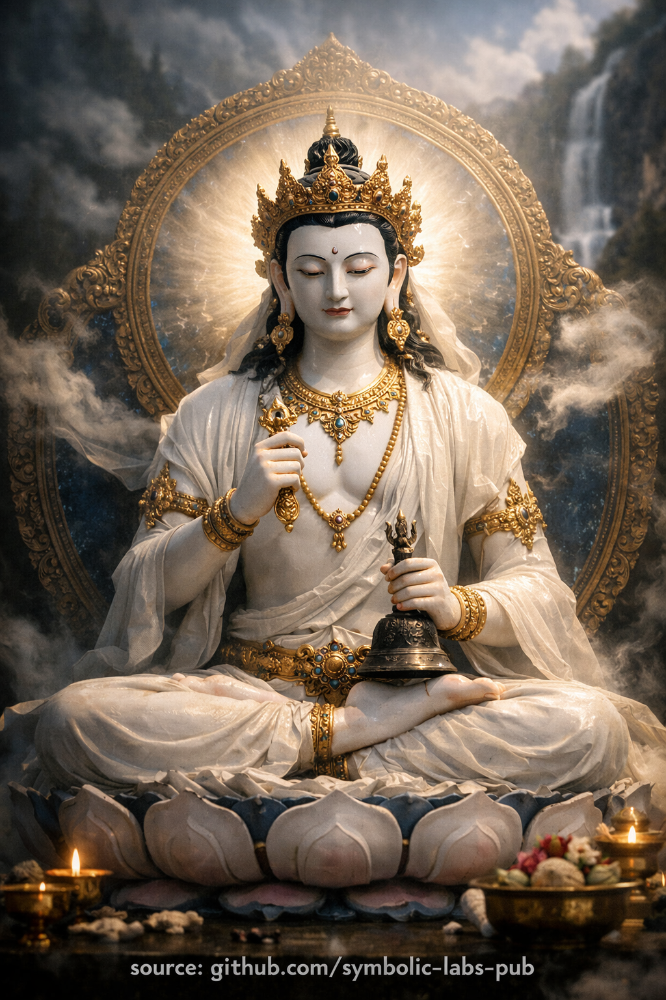

## [Vajrasattva (Dorje Sempa)](https://github.com/symbolic-labs-pub/a-buddhist-view/blob/master/more/08_lineage/13_vajrasattva/README.md#vajrasattva-dorje-sempa)

Nauka

## Nauka buddyjska o **Vajrasattva**

**Oczyszczanie jako rozpoznanie diamentowego umysłu**

### 1) Wskazywanie

Wszystkie buddyjskie ścieżki zbiegają się w jednym wglądzie: **umysł jest możliwy do pracy**.
Vajrayāna ostrzy to, stwierdzając coś silniejszego: **umysł jest już czysty**. To, co wydaje się zamieszaniem, nie jest wadą w samym umyśle, ale **tymczasowym zaciemnieniem**—jak chmury przecinające otwarte niebo.

Vajrasattva ucieleśnia tę naukę w formie: **diamentowy umysł**, który nie może być uszkodzony przez błąd, emocję czy karmę.

---

### 2) Co naprawdę oznacza "oczyszczanie"

Oczyszczanie jest często błędnie rozumiane jako moralna naprawa. W tej nauce jest **epistemiczne**, a nie karne.

* Karma jest **nawykiem pędu**, nie grzechem.
* Zaciemnienia są **wzorcami**, nie plamami.
* Oczyszczanie jest **rozpoznaniem**, nie wymazaniem.

Gdy następuje rozpoznanie, wzorce tracą spójność—**rozpuszczają się bez siły**.

---

### 3) Unia, która wyzwala

Vajrasattva trzyma:

* **Vajra** → metoda, współczujące zaangażowanie
* **Dzwonek** → mądrość, pustka

Rozdzielone, metoda staje się ślepym wysiłkiem; mądrość staje się jałowym wglądem.
Zjednoczone, tworzą **diamentową kognicję**, która działa bez chwytania i poznaje bez utrwalania.

**Nauka:** Wyzwolenie nie jest wycofaniem z życia, ale **precyzyjnym uczestnictwem bez chwytania**.

---

### 4) Cztery Moce jako kompletna ścieżka

Cztery Moce nie są krokami do zarobienia przebaczenia; są **kompletnym cyklem przebudzenia**:

1. **Rozpoznanie** — jasne widzenie przyczyny i skutku
2. **Orientacja** — wyrównanie z przebudzoną kierunkowością
3. **Aplikacja** — ucieleśniona świadomość przez mantrę i wizualizację
4. **Stabilność** — postanowienie pozostania wyrównanym, nie przez śluby, ale przez wgląd

Ten cykl powtarza się naturalnie, aż **samo-korekta staje się spontaniczna**.

---

### 5) Mantra jako strukturalna medycyna

Mantra działa, ponieważ umysł reaguje na **wzorzec**, nie wiarę.

Dźwięk + obraz + uwaga:

* dostrajają układ nerwowy,
* przerywają rekurencyjne pętle myślowe,
* pozwalają ukrytej jasności się wynurzyć.

Zatem mantra jest **medycyną dla struktury**, nie afirmacją dla emocji.

---

### 6) Dlaczego ta nauka przychodzi pierwsza

Wyższe nauki—Mahāmudrā, Dzogchen—wskazują bezpośrednio na naturę umysłu.
Bez oczyszczania to wskazywanie ląduje na **nieprzygotowanym gruncie**.

Vajrasattva zapewnia:

* jasność przed wglądem,
* integralność przed mocą,
* pokorę przed realizacją.

**Nauka:** oczyszczanie nie jest wstępne, ponieważ jest mniejsze, ale ponieważ jest **fundamentalne**.

---

### 7) Konsekwencja etyczna

Gdy się rozpoznaje diamentową naturę umysłu:

* krzywda traci uzasadnienie,
* współczucie staje się strukturalne,
* etyka powstaje **bez wymuszania**.

Właściwe działanie płynie naturalnie z **niezaciemnionej percepcji**.

---

### 8) Końcowa instrukcja

Nie próbuj stać się czystym.
Nie walcz, by usunąć nieczystość.

**Spoczywaj w rozpoznaniu.**
To, co nie może być zniszczone, się ujawni.

To jest nauka Vajrasattva:
**Przebudzenie jest odejmowaniem, nie konstruowaniem.**

---

Wyjaśnienie

### 1. Kim jest Vajrasattva według nauk buddyjskich?

Vajrasattva **nie jest historycznym Buddą**, ale **symbolicznym ucieleśnieniem pierwotnej czystości umysłu**.
Termin *vajra* oznacza *diament* lub *piorun*—to, co jest **niezniszczalne i doskonale jasne**. *Sattva* oznacza *istota*. Razem oznaczają **niezniszczalną przebudzoną świadomość**, która nie może być uszkodzona przez zamieszanie, emocję czy karmę.

W buddyzmie Vajrayāna Vajrasattva reprezentuje **czystą podstawę umysłu**, która jest zawsze obecna, nawet gdy zaciemniona nawykami. Praktyka nie dotyczy tworzenia czystości, ale **ujawniania tego, co zawsze tam było**.

---

### 2. Dlaczego Vajrasattva jest biały?

Biel symbolizuje **całkowitą czystość i transparentność**.
Nie jest moralną "dobrocią", ale **jasnością bez zniekształcenia**. Biel zawiera wszystkie kolory, tak jak przebudzony umysł zawiera wszystkie doświadczenia bez bycia przez nie splamionym.

Biel Vajrasattva naucza, że przebudzenie jest **odkrywaniem**, nie ulepszaniem.

---

### 3. Ikonografia jako bezpośrednia nauka

Każdy szczegół jest instruktywny, nie dekoracyjny:

* **Vajra (prawa ręka)** → umiejętne środki, współczujące działanie
* **Dzwonek (lewa ręka)** → mądrość, pustka (*śūnyatā*)
* **Królewskie ozdoby** → przebudzenie wyrażone **wewnątrz świata**, nie wycofanie z niego
* **Postawa lotosu** → czystość, która powstaje **przez warunki**, nie oddzielnie od nich

> **Kluczowa nauka:** diamentowy umysł jest **unią metody i mądrości**.

---

### 4. Cztery Moce oczyszczania

Praktyka Vajrasattva jest ustrukturyzowana wokół **Czterech Mocy**, podstawowego frameworku Vajrayāny:

1. **Rozpoznanie / żal** – jasne widzenie przyczyny i skutku, nie wina
2. **Poleganie** – przyjmowanie schronienia w przebudzonej świadomości i kierunku
3. **Aplikacja odtrutkowa** – mantra, wizualizacja, uważna obecność
4. **Postanowienie** – strukturalne przekierowanie umysłu i zachowania

To jest **głębokie przeformowanie poznawcze i karmiczne**, nie moralny osąd.

---

### 5. Mantra: dlaczego działa

Najczęstsza mantra to:

> **OM VAJRASATTVA HUM**
> (lub długa Mantra Stusylabowa)

Mantra nie jest modlitwą o przebaczenie. Działa przez:

* **dźwięk** (wibracja),
* **obraz** (wizualizacja),
* **uwagę** (świadomość).

Razem synchronizują **ciało, mowę i umysł**, pozwalając zaciemnieniom naturalnie się rozpuścić.

---

### 6. Rola Vajrasattva na ścieżce

* Centralna dla **Ngöndro** (praktyki wstępne)
* Fundament dla **Mahāmudrā** i **Dzogchen**
* Uważana za **oczyszczanie strukturalne**, nie opcjonalne oddanie

Bez oczyszczania wyższa realizacja staje się niestabilna.

---

### 7. Powszechne nieporozumienia

* ❌ Nie jest praktyką konfesyjną czy opartą na winie
* ❌ Nie jest zewnętrznym bóstwem przyznającym rozgrzeszenie
* ❌ Nie jest zwykłą relaksacją

✅ Jest **samo-wyzwalającą świadomością rozpoznającą własną diamentową naturę**.

---

### 8. W jednym zdaniu

**Vajrasattva naucza, że umysł jest pierwotnie czysty, a praktyka usuwa zaciemnienia zamiast dodawać coś nowego.**

---

Medytacja

## Medytacja Vajrasattva

> ⚠️ **Uwaga dotycząca zakresu**
> To, co następuje, jest **nie-inicjacyjną formą kontemplacyjną** (praktyką znaczenia).
> **Nie** zastępuje transmisji linii przekazu (*wang, lung, tri*).
> Jej funkcją jest **stabilizacja, aspiracja i wyrównanie przyczynowe**, nie autoryzacja tantryczna.

---

*(Oczyszczanie zaciemnień i przywracanie samaya)*

### Cel (dlaczego ta praktyka istnieje)

Praktyka Vajrasattva jest używana do:

* Oczyszczania **negatywnej karmy** (działania, mowa i myśli)
* Oczyszczania **zaciemnień mentalnych** (ignorancja, utrwalenie, emocjonalne wzorce)
* Naprawy **złamanej samaya** (tantryczne zobowiązania)
* Ponownego łączenia świadomości z jej **pierwotnie czystą naturą**

W Vajrayānie oczyszczanie **nie jest moralistyczne**.
Jest *rozpoznaniem, że nieczystość nigdy nie była wewnętrzna*.

---

## Warunki wstępne (tradycyjne ujęcie)

Idealnie, ta praktyka jest przyjmowana po:

* Schronieniu i Bodhicitcie
* Ustnej transmisji (*lung*) mantry
  Jednakże **nie-inicjowani praktykujący** mogą nadal praktykować **wizualizację + mantrę z pokorą**, koncentrując się na oczyszczaniu i współczuciu zamiast tożsamości z bóstwem.

---

## Struktura praktyki (architektura czteroczęściowa)

1. **Schronienie i Bodhicitta**
2. **Wizualizacja**
3. **Recytacja mantry**
4. **Rozpuszczenie w pustce**

To odzwierciedla **Cztery Moce Przeciwdziałające**, kluczowy framework oczyszczania Vajrayāny:

* Wsparcie
* Żal
* Remedium
* Postanowienie

---

## 1. Schronienie i Bodhicitta

Usiądź wygodnie. Kręgosłup wyprostowany, oddech naturalny.

Cicho lub głośno:

> *Przyjmuję schronienie w Buddzie, Dharmie i Sanghy.*
> *Dla dobra wszystkich czujących istot,*
> *angażuję się w tę praktykę, by oczyścić zaciemnienia*
> *i w pełni się przebudzić dla dobra wszystkich.*

Pauza. Pozwól intencji się uspokoić—nie jako myśl, ale jako orientacja.

---

## 2. Wizualizacja

Powyżej korony twojej głowy, około długości przedramienia, wizualizuj **Vajrasattva**:

* **Błyszczący biały**, świetlisty jak czysty kryształ
* Młodzieńczy, spokojny, współczujący
* Siedzący w postawie vajra na księżycowym dysku i lotosie
* Prawa ręka trzyma **vajra** przy sercu
* Lewa ręka trzyma **dzwonek** przy biodrze
* Ozdobiony jedwabiami i klejnotami (symbol przebudzonych jakości)
* W jego sercu: **księżycowy dysk**, z **sylabą nasienną HŪṂ**

Nie jest **zewnętrzny** w zwykłym sensie—
Jest **czystą naturą twojego własnego umysłu**, pojawiającą się w formie.

Powyżej głowy Vajrasattva wizualizuj linię przekazu przebudzonych nauczycieli, jeśli to jest dla ciebie znaczące; w przeciwnym razie utrzymuj wizualizację prostą i stabilną.

---

## 3. Wyznanie i żal (nie-osądzający)

Z serca uznaj:

> *Przez ignorancję i nawyk stworzyłem szkodliwe działania,*
> *wypowiedziałem szkodliwe słowa i bawiłem się zamieszanymi myślami.*
> *Uznaję je otwarcie, bez zaprzeczenia i bez wstydu.*

Ważne:
To jest **jasność**, nie wina.
Żal oznacza *rozpoznanie*, nie samo-atak.

---

## 4. Recytacja mantry (silnik oczyszczania)

Z **HŪṂ** w sercu Vajrasattva płynie strumień **białego nektaru-światła**:

* Wchodzi przez koronę twojej głowy
* Wypełnia twoje ciało całkowicie
* Zmywa wszystkie zaciemnienia:

  * Chorobę, emocjonalne pozostałości, karmiczne odciski
* Wychodzą jako **ciemny dym lub płyn**, rozpuszczając się w pustce poniżej

Recytuj powoli, jasno lub mentalnie:

### Mantra Stusylabowa (sanskryt – forma standardowa)

> **Oṁ Vajrasattva Samaya
> Manupālaya
> Vajrasattva Tvenopatiṣṭha
> Dṛḍho Me Bhava
> Sutoṣyo Me Bhava
> Supoṣyo Me Bhava
> Anurakto Me Bhava
> Sarva Siddhiṁ Me Prayaccha
> Sarva Karma Su Ca Me
> Cittaṁ Śreyaḥ Kuru Hūṁ
> Ha Ha Ha Ha Hoḥ
> Bhagavan Sarva Tathāgata
> Vajra Mā Me Muñca
> Vajrī Bhava Mahā Samaya Sattva Āḥ**

Możesz recytować:

* 21 razy (minimum)
* 108 razy (tradycyjne)
* Lub ciągle przez ustalony okres

Jeśli ta mantra jest zbyt długa, **krótka mantra** jest też szeroko używana:

> **Oṁ Vajrasattva Hūṁ**

---

## 5. Postanowienie

Po recytacji delikatnie sformułuj postanowienie:

> *W miarę moich możliwości,*
> *powstrzymam się od powtarzania tych szkodliwych wzorców,*
> *i będę kultywował jasność, współczucie i mądrość.*

Brak perfekcjonizmu. Tylko szczerość.

---

## 6. Rozpuszczenie w pustce (krytyczny krok)

Vajrasattva się uśmiecha.

* Rozpuszcza się w **światło**
* Światło zstępuje przez twoją koronę
* Rozpuszcza się w twoim sercu
* **Żadne bóstwo nie pozostaje**
* Żaden podmiot, żaden przedmiot
* Tylko **jasna, otwarta świadomość**

Spoczywaj tutaj.

To jest **rzeczywiste oczyszczanie**.

---

## 7. Dedykacja

> *Niech zasługa tej praktyki*
> *Przyniesie korzyść wszystkim czującym istotom,*
> *Usuwając cierpienie i jego przyczyny,*
> *I ustanawiając wszystkich w przebudzeniu.*

---

## Kluczowe wyjaśnienia (często błędnie rozumiane)

* **Vajrasattva nie "przebacza ci"**
  → Oczyszczanie następuje przez *rozpoznanie pierwotnej czystości*

* **Mantra nie jest samym magicznym dźwiękiem**
  → Działa przez *wyrównanie ciała, mowy i umysłu*

* **Jakość wizualizacji liczy się mniej niż szczerość**
  → Stabilność > żywość

---

## Praktyczna rada (współczesna, realistyczna)

* 10–15 minut dziennie jest potężne
* Najlepiej praktykowane **przed snem** lub **po emocjonalnej turbulencji**
* Jeśli powstają emocje → pozwól obrazom oczyszczania *kontynuować przez nie*
* Unikaj przekształcania tego w samo-krytykę

---

< [Czarny sześcioramienny Mahākāla](../12_six_armed_mahakala/README.md) | [Amitābha](../14_amitabha/README.md) >

_źródło: [github.com/symbolic-labs-pub](https://github.com/symbolic-labs-pub)_

---
