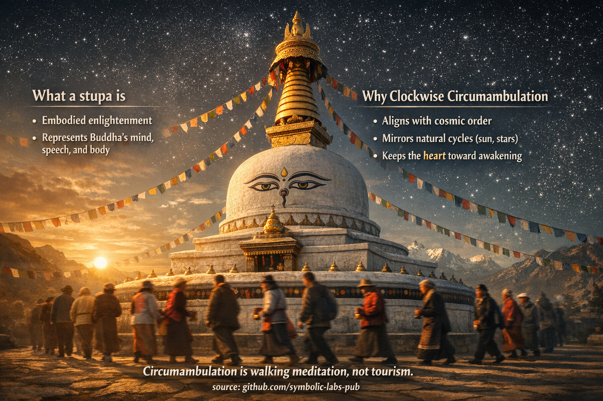

## [Czym stupa *jest* (poza architekturą)](https://github.com/symbolic-labs-pub/a-buddhist-view/blob/master/languages/pl/more/09_symbols/09_stupa/README.md#czym-stupa-jest-poza-architekturą)

---

W nauczaniu buddyjskim stupa **nie jest pomnikiem**. Jest **trójwymiarowym nauczaniem**.

### a) Wcielone oświecenie

Stupa reprezentuje **sam stan przebudzenia** — realizację Buddy uczynioną widoczną.
Tradycyjnie ucieleśnia:

* **Ciało** → fizyczną formę [przebudzenia](../../../10_concepts/README.md#3-enlightenment-bodhi-awakening)
* **Mowę** → Dharmę zakodowaną w proporcji, [mantrze](../../../09_symbols/10_mantra/README.md#what-a-mantra-is-buddhist-view) i geometrii
* **Umysł** → oświeconą [świadomość](../../../10_concepts/README.md#2-awareness-rigpa-vijñāna-knowing), na którą wskazuje struktura

Dlatego stupy są traktowane **jako żywe obecności**, nie obiekty.

> Nie *patrzysz na* stupę.
> **Odnosisz się** do niej.

---

### b) Pięć elementów (dopasowanie kosmiczne)

Kształt stupy mapuje bezpośrednio na **pięć elementów**, które tworzą zarówno kosmos, jak i istotę ludzką:

| Część stupy   | Element     | Znaczenie                      |
| ------------- | ----------- | ------------------------------ |
| Kwadratowa podstawa | Ziemia | Stabilność, etyczne ugruntowanie |
| Kopuła        | Woda        | Ciągłość, [współczucie](../../../02_from_ignorance_to_awakening/7_compassion/README.md#compassion-as-a-structural-principle-in-buddhist-teaching)       |
| Iglica        | Ogień       | Transformacja, wysiłek         |
| Dyski parasola | Powietrze  | Ruch, aktywność                |
| Klejnot/szczyt | Przestrzeń | Otwartość, [mądrość](../../../01_core_teachings/the_noble_eightfold_path/README.md#1-wisdom-paññā)            |

Obchodzenie oznacza **umieszczenie własnego ciała w tej elementarnej [mandali](../../../09_symbols/07_mandala/README.md#mandala--explained-according-to-buddhist-teachings)**.

---

## 2. Dlaczego obchodzenie jest zgodnie z ruchem wskazówek zegara

Ruch zgodny z ruchem wskazówek zegara nie jest kulturowy — jest **kosmologiczny i psychologiczny**.

### a) Dopasowanie do porządku Dharmy

W kosmologii buddyjskiej **ruch zgodny z ruchem wskazówek zegara odzwierciedla naturalny porządek**:

* Słońce i gwiazdy (jak postrzegane z Ziemi)
* Tradycyjny ruch energii w rytuale
* Rozwijanie przyczyna → skutek → wyzwolenie

Ruch zgodny z ruchem wskazówek zegara oznacza **nie opieranie się rzeczywistości**, ale płynięcie *z* nią.

---

### b) Utrzymywanie serca ku przebudzeniu

Podczas chodzenia zgodnie z ruchem wskazówek zegara:

* Twoja **prawa strona** jest zwrócona do stupy
* **Strona serca** jest zwrócona do wewnątrz
* Stan przebudzony pozostaje **centrum grawitacji**

Symbolicznie:

> *Przebudzenie pozostaje centralne, podczas gdy życie porusza się wokół niego.*

To subtelnie trenuje umysł by **orientować doświadczenie wokół [mądrości](../../../01_core_teachings/the_noble_eightfold_path/README.md#1-wisdom-paññā)**, nie ego.

---

## 3. Obchodzenie jako medytacja chodząca

W nauczaniu buddyjskim ta praktyka integruje **ciało, mowę i umysł**:

* **Ciało** → chodzenie ze świadomością
* **Mowa** → mantry, modlitwy lub cicha intencja
* **Umysł** → przypomnienie schronienia, [nietrwałości](../../../01_core_teachings/impermanence/README.md#2-impermanence-anicca-is-structural-not-accidental), [współczucia](../../../02_from_ignorance_to_awakening/7_compassion/README.md#compassion-as-a-structural-principle-in-buddhist-teaching)

Jest to zatem **kompletna praktyka**, nie dewocyjny dodatek.

Nawet pojedyncze [uważne](../../../01_core_teachings/the_noble_eightfold_path/README.md#7-right-mindfulness-sammā-sati) obejście jest uważane za **zasługowe**, ponieważ:

* Ciało ucieleśnia oddanie
* Umysł ćwiczy orientację ku przebudzeniu
* Ego rozluźnia swoje roszczenie do centralności

---

## 4. Dlaczego to *nie* jest turystyka

Turystyka porusza się **wokół obiektu**.
Obchodzenie porusza się **wokół znaczenia**.

Z buddyjskiej perspektywy:

* Prędkość jest nieistotna
* Liczba okrążeń jest drugorzędna
* **Orientacja umysłu** jest decydująca

Roztargniony mnich zyskuje mało.
Szczery przechodzień zyskuje korzyść.

---

## 5. Głębokie nauczanie zakodowane w akcie

Na najgłębszym poziomie obchodzenie uczy:

* Nie ma **ustalonego ja w centrum**
* Przebudzenie jest **stabilne; zjawiska krążą**
* Wyzwolenie dzieje się przez **właściwą relację**, nie ucieczkę

Nie podbijasz stupy.
**Krążysz wokół niej** — jak planety krążą wokół prawdy.

---

## W jednym zdaniu (tradycyjny wgląd)

> **Chodzenie zgodnie z ruchem wskazówek zegara wokół stupy jest próbą oświecenia z ciałem, zanim umysł w pełni je zrozumie.**

---

< [Waza skarbów (sanskr. *Nidhāna-kumbha*, tybetański *Bumpa*)](../08_treasure_vase/README.md) | [Mala (koraliki do modlitwy) — wyjaśnione według nauk buddyjskich](../10_mala/README.md) >

_źródło: [github.com/symbolic-labs-pub](https://github.com/symbolic-labs-pub)_

---
