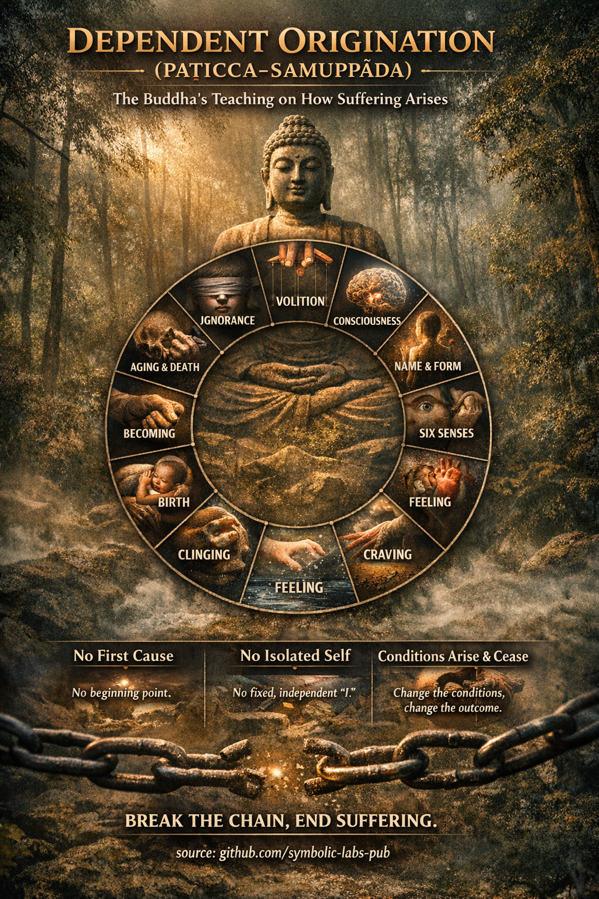

# [Originação Dependente (Paṭicca-samuppāda)](https://github.com/symbolic-labs-pub/a-buddhist-view/blob/languages/pt/master/more/02_from_ignorance_to_awakening/3_dependent_origination/README.md#dependent-origination-paṭicca-samuppāda)

**— a análise do Buda de como o sofrimento surge e cessa**

Nos ensinamentos budistas, **Originação Dependente** não é uma teoria metafísica sobre o universo. É um **modelo diagnóstico da experiência**—uma explicação precisa de **como o sofrimento vem a ser momento a momento**, e portanto **como ele pode terminar**.

Como ensinado por **Siddhārtha Gautama**, o princípio é simples mas radical:

> **Quando isto existe, aquilo surge.
> Quando isto cessa, aquilo cessa.**

Nada aparece por si só. Nada fica sozinho. Tudo depende das condições.

---

## O Significado Central

Originação Dependente afirma três verdades inseparáveis:

1. **Condicionalidade**
   Todos os fenômenos surgem **apenas quando as condições de apoio estão presentes**.

2. **[Não-eu (anattā)](../1_the_three_marks_of_existence/README.md#3-non-self-anattā)**
   Porque as coisas dependem das condições, **nada tem uma essência independente e permanente**.

3. **Processo sobre substância**
   A realidade não é feita de "coisas," mas de **processos dinâmicos desdobrando-se em relação**.

Isto diretamente evita os dois extremos que o Buda advertiu contra:

* **Eternalismo** — acreditar que algo existe permanentemente, independentemente
* **Niilismo** — acreditar que nada tem significado ou consequência causal

Originação Dependente mostra um **caminho do meio**:
as coisas são **reais como processos**, mas **[vazias](../../10_concepts/01_emptiness/README.md#emptiness-śūnyatā-in-vajrayāna-buddhism) de essência fixa**.

---

## Os Doze Elos (A Formulação Clássica)

O Buda frequentemente expressava Originação Dependente como **12 elos interdependentes** (*nidānas*). Estes não são uma linha do tempo linear mas um **ciclo auto-reforçador**.

### A Cadeia

1. **Ignorância (avijjā)**
   Não ver [impermanência](../../01_core_teachings/impermanence/README.md#2-impermanence-anicca-is-structural-not-accidental), [sofrimento](../2_the_four_noble_truths/README.md#1-there-is-suffering--dukkha) e não-eu.

2. **Formações volitivas (saṅkhārā)**
   Intenções habituais e padrões kármicos moldados pela ignorância.

3. **Consciência (viññāṇa)**
   [Consciência](../../10_concepts/README.md#2-awareness-rigpa-vijñāna-knowing) condicionada moldada por padrões passados.

4. **Nome-e-forma (nāma-rūpa)**
   Mente e corpo como um sistema experiencial.

5. **Seis bases sensoriais (saḷāyatana)**
   Olho, ouvido, nariz, língua, corpo, mente.

6. **Contato (phassa)**
   Sentido + objeto + consciência.

7. **Sentimento (vedanā)**
   Tonalidade agradável, desagradável ou neutra.

8. **Desejo (taṇhā)**
   Querer prazer, resistir à dor, apego à neutralidade.

9. **Apego (upādāna)**
   Identificação, apego, "isto é meu / eu."

10. **Tornar-se (bhava)**
    Momentum de identidade e existência.

11. **Nascimento (jāti)**
    O surgimento de uma história-do-eu, papel ou situação de vida.

12. **Envelhecimento e morte (jarā-maraṇa)**
    Decadência, perda, luto, desespero—**dukkha**.

---

## A Visão Crucial: Isto É Reversível

Este ensinamento é **não-fatalista**.

O Buda enfatizou o **colapso condicional**:

* Se **a ignorância enfraquece**, as formações enfraquecem
* Se **o desejo cessa**, o apego cessa
* Se **o apego cessa**, o sofrimento não surge

Não há **primeira causa** para caçar.
Não há **entidade sólida** para destruir.

Apenas as condições—surgindo e cessando.

---

## Por Que Isto É Tão Radical

### 1. Sem Primeira Causa

O Buda explicitamente rejeitou histórias metafísicas de origem. Procurar um "começo" é **não útil para a libertação**.

### 2. Sem Self Isolado

O que chamamos de "eu" é um **nó temporário em uma teia de condições**—hábitos, sensações, percepções, intenções.

### 3. A Ética Ainda Importa

Porque as ações condicionam a experiência futura, **a responsabilidade permanece**, sem exigir uma alma permanente.

---

## Significado Prático na Prática

Na [meditação](../../08_lineage/README.md) e na vida diária, Originação Dependente se torna **diretamente observável**:

* Uma sensação surge
* Sentimento aparece
* Desejo segue
* Identificação aperta
* Sofrimento se forma

Com [atenção plena](../../01_core_teachings/the_noble_eightfold_path/README.md#7-right-mindfulness-sammā-sati), a cadeia é **vista em tempo real**—e interrompida.

É por isso que o Buda disse:

> "Aquele que vê originação dependente vê o [Dharma](../../01_core_teachings/the_three_jewels/README.md#2-dharma--the-path-and-the-law-of-reality).
> Aquele que vê o Dharma vê originação dependente."

---

## Em Uma Sentença

**Originação Dependente é a explicação precisa do Buda de como o sofrimento surge sem um eu—e como a liberdade é possível sem aniquilação.**

---

< [As Quatro Verdades Nobres — como o Buda as significava](../2_the_four_noble_truths/README.md) | [Vacuidade (Śūnyatā) no Budismo Mahāyāna](../4_emptiness/README.md) >

_fonte: [github.com/symbolic-labs-pub](https://github.com/symbolic-labs-pub)_

---
