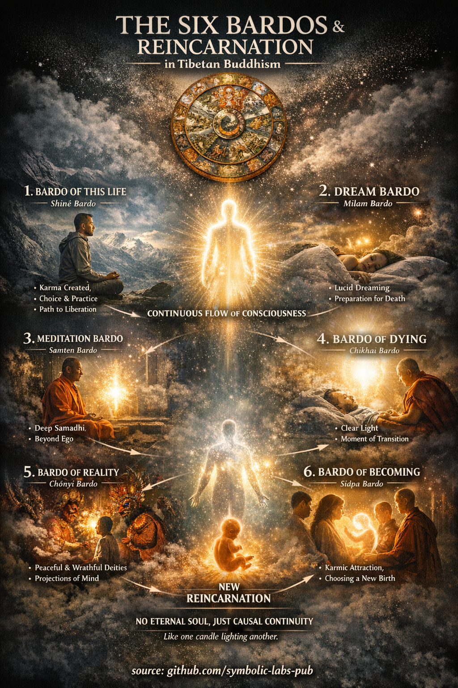
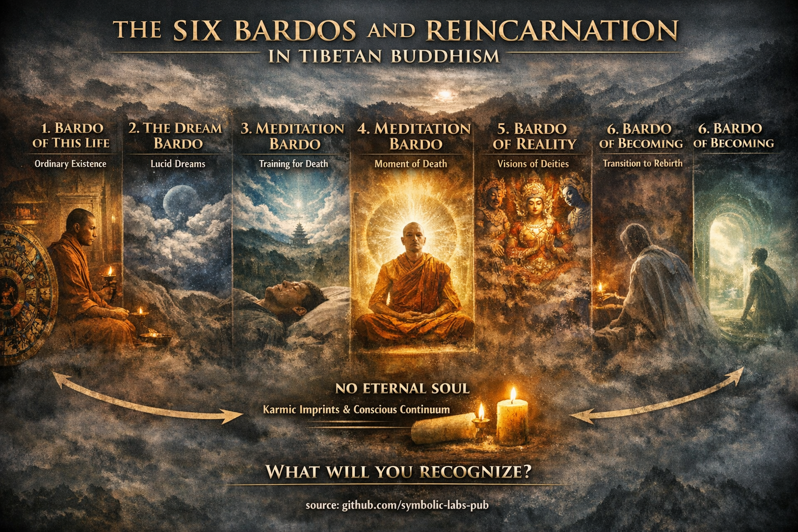

## [Estados Intermediários (*Bardo*) e Reencarnação](https://github.com/symbolic-labs-pub/a-buddhist-view/blob/languages/pt/master/more/06_intermediate_states_and_reincarnation/README.md#intermediate-states-bardo-and-reincarnation)

Ensinamento

## Um Ensinamento Budista sobre Os Seis Bardos

*(Um ensinamento prático destilado do mapa bardo)*

### O Ensinamento

Toda experiência se desdobra em **intervalos**.
Sempre que uma forma se dissolve e uma nova não se solidificou ainda, **a liberdade é possível**.

Estes intervalos são chamados **bardos**.

O ensinamento tibetano dos seis bardos não é uma teoria sobre a morte—é um **manual para reconhecer [consciência](../10_concepts/README.md#2-awareness-rigpa-vijñāna-knowing) nos momentos de mudança**.

---

### A Visão Central

> **O [sofrimento](../02_from_ignorance_to_awakening/2_the_four_noble_truths/README.md#1-there-is-suffering--dukkha) continua não porque a mudança acontece,
> mas porque a consciência falha em reconhecer a mudança conforme ela ocorre.**

Todo bardo é um momento quando a identidade habitual se afrouxe.
Naquele afrouxamento, duas possibilidades aparecem:

* **Reconhecimento → libertação**
* **Confusão → continuação**

---

### Os Seis Bardos Como Um Ensinamento

#### 1. O Bardo Desta Vida

Aqui é onde o treinamento acontece.

* Cada reação planta uma semente kármica
* Cada momento de [atenção plena](../01_core_teachings/the_noble_eightfold_path/README.md#7-right-mindfulness-sammā-sati) enfraquece confusão futura

**Ensinamento:**
*Não espere pela morte para praticar o reconhecimento. Pratique agora, onde o apoio existe.*

---

#### 2. O Bardo do Sonho

Aqui a mente cria mundos sem esforço.

**Ensinamento:**
*Se você não consegue reconhecer ilusão enquanto sonha, você lutará para reconhecer ilusão depois da morte.*

Treine levemente. Note [impermanência](../01_core_teachings/impermanence/README.md#2-impermanence-anicca-is-structural-not-accidental). Note construção.

---

#### 3. O Bardo da Meditação

Aqui o senso de um eu sólido se afina.

**Ensinamento:**
*Meditação é ensaio para morrer—sem trauma.*

Familiaridade com abertura agora se torna confiança depois.

---

#### 4. O Bardo do Momento da Morte

Os elementos se dissolvem. Conceitos caem.
A **Luz Clara** aparece.

**Ensinamento:**
*A libertação é sempre imediata—mas o reconhecimento é raro.*

Nada novo é criado aqui. Apenas ver importa.

---

#### 5. O Bardo da Realidade

Visões surgem—pacíficas, iradas, avassaladoras.

**Ensinamento:**
*Medo é má-reconhecimento.*

O que quer que apareça é **mente aparecendo para si mesma**.

Se conhecido → liberdade
Se temido → fuga

---

#### 6. O Bardo do Tornar-se

Momentum retorna. O hábito busca forma.

**Ensinamento:**
*Desejo não examinado escolhe a próxima vida.*

Clareza enfraquece o momentum. Confusão o capacita.

---

### Reencarnação: A Lição Silenciosa

A reencarnação **não é punição**.
É **reconhecimento inacabado repetindo-se a si mesmo**.

O que continua não é um eu—mas **um padrão**.

Mude o padrão → o futuro muda
Veja através do padrão → o ciclo termina

---

### A Instrução em Uma Linha

> **Reconheça tudo o que surge como a própria consciência.**

Se isto é feito:

* na vida → a vida é libertada
* nos sonhos → os sonhos se dissolvem
* na morte → a morte se abre
* na reencarnação → a reencarnação é desnecessária

---

### Ensinamento de Fechamento

Os bardos não estão esperando por você depois da morte.
Eles estão acontecendo **agora**:

* entre pensamentos
* entre respirações
* entre emoções

Treine lá.

> Quem quer que reconheça os pequenos bardos
> não será perdido no grande.

---

Explicação

*(De acordo com os ensinamentos budistas tibetanos)*

No budismo tibetano, **vida, morte e reencarnação** são entendidos como um **fluxo contínuo de consciência** (*santāna*), não como eventos isolados. O conceito-chave que explica esta continuidade é **bardo** (*bar do*), literalmente significando **"estado intermediário".**

Um *bardo* é qualquer **fase transitória** na qual a consciência não está fixada em uma forma estável. Importantemente, os bardos **não estão limitados ao tempo após a morte**—toda a nossa experiência vivida se desdobra através de bardos.

---

## O que é um *Bardo*?

Um *bardo* é uma **lacuna, intervalo ou limiar**—um momento quando a identidade habitual se afrouxe e **a transformação é possível**. A tradição tibetana sistematiza este insight em **seis bardos**, oferecendo um preciso **mapa para [despertar](../10_concepts/README.md#3-enlightenment-bodhi-awakening)**.

---

## Os Seis Bardos

### 1. **O Bardo Desta Vida** (*Shiné Bardo*)

Esta é a vida ordinária de vigília.

* O karma é ativamente criado aqui
* A escolha ética e a prática são possíveis
* A libertação pode ocorrer **agora**

👉 Isto é considerado **o bardo mais precioso**, porque ensinamentos, mestres e esforço consciente estão disponíveis.

---

### 2. **O Bardo do Sonho** (*Milam Bardo*)

* A consciência é mais fluida
* O yoga do sonho e a consciência lúcida podem surgir
* Serve como treinamento para estados pós-morte

👉 Os sonhos são frequentemente chamados *"a pequena morte".*

---

### 3. **O Bardo da Meditação** (*Samten Bardo*)

* Absorção meditativa profunda (*[samādhi](../01_core_teachings/the_noble_eightfold_path/README.md#8-right-concentration-sammā-samādhi)*)
* O senso de um eu sólido se dissolve
* O reconhecimento direto da natureza da mente é possível

👉 Familiaridade aqui possibilita reconhecimento na morte.

---

### 4. **O Bardo do Momento da Morte** (*Chikhai Bardo*)

* Os elementos físicos se dissolvem
* A **Luz Clara da mente** aparece
* Uma oportunidade direta para libertação

👉 Se a Luz Clara é reconhecida como a própria consciência → **despertar imediato**.

---

### 5. **O Bardo da Realidade** (*Chönyi Bardo*)

* Deidades pacíficas e iradas aparecem
* Estas são **projeções da própria mente**
* O medo leva à confusão; o reconhecimento leva à libertação

👉 A instrução central: **"Não tema—isto é a sua própria mente."**

---

### 6. **O Bardo do Tornar-se** (*Sidpa Bardo*)

* O momentum kármico se reafirma
* Atração e aversão surgem
* A consciência é atraída para uma nova reencarnação

👉 Aqui é onde **a reencarnação é determinada**.

---

## O que é Reencarnação no Budismo Tibetano?

Não há **alma eterna** que transmigra.

O que continua é:

* impressões kármicas
* tendências e hábitos
* continuidade causal de consciência

Uma analogia clássica:

* Uma vela acendendo outra
* Não é a mesma chama, não é uma diferente

Isto é **continuidade sem identidade**.

---

## O que Determina a Reencarnação?

1. **Karma** (ações intencionais)
2. **Estado mental na morte**
3. **Tendências habituais**
4. **Reconhecimento ou não-reconhecimento da natureza da mente**

📌 Um único momento de reconhecimento claro pode **superar vasta acumulação kármica**.

---

## Por que O Sistema Tibetano É Tão Detalhado?

O budismo tibetano oferece uma **tecnologia prática de morrer e reencarnação**:

* Como se preparar para a morte
* Como assistir o moribundo
* Como reconhecer a mente em cada transição

É por isto que textos como o **Bardo Thödol** existem—designados para ser **ouvidos**, guiando a consciência pelos bardos em direção à libertação.

---

## Ensinamento Central em Uma Linha

> A questão não é se a reencarnação ocorre,
> mas se **você reconhece o que está acontecendo**.

O bardo não é uma punição ou recompensa—é uma **janela de possibilidade**.
Para alguém treinado em consciência durante a vida, a morte se torna **não uma ameaça, mas um portal**.

---

Meditação

## Uma Meditação dos Seis Bardos

*Uma prática contemplativa completa baseada na visão budista tibetana*

Isto é uma **meditação progressiva mas simples** que treina o reconhecimento através de todos os bardos ao trabalhar com **micro-bardos** ocorrendo agora.

Você não está visualizando a morte.
Você está treinando **reconhecimento em transições**.

---

## Princípio Central (segure isto levemente)

> **O que quer que surja não é um problema.
> Não reconhecê-lo é.**

A prática é sobre **ver**, não controlar.

---

## Estrutura da Prática

* **Duração**: 20–40 minutos
* **Postura**: Sentado, estável, relaxado
* **Atitude**: Curiosa, gentil, destemida

Esta prática tem **seis fases**, espelhando os seis bardos.

---

## 1. Meditação Bardo da Vida

*Estabilizando consciência na experiência ordinária*

**Prática**

1. Sente-se e sinta o corpo respirando
2. Não ajuste a respiração
3. Note sensações, sons, pensamentos conforme surgem

**Instrução**

* Não rotule nada
* Deixe a experiência ser ordinária

**Reconhecimento a cultivar**

> "Este momento não precisa de melhoria."

Isto estabelece **confiança na consciência durante a vida**.

---

## 2. Meditação Bardo do Sonho

*Vendo a experiência como construída*

**Prática**

1. Note como os pensamentos aparecem subitamente
2. Observe como imagens, memórias, planos surgem e se dissolvem
3. Observe sem seguir

**Instrução**

* Trate os pensamentos como sonhos acontecendo enquanto acordado

**Reconhecimento a cultivar**

> "Isto está aparecendo, não é sólido."

Isto enfraquece a fixação e prepara a mente para estados não-físicos.

---

## 3. Meditação Bardo da Meditação

*Repousando na abertura*

**Prática**

1. Deixe a atenção se ampliar
2. Pare de focar em objetos
3. Permita que a consciência repousa em si mesma

**Instrução**

* Não procure pela consciência
* Não comente sobre ela

**Reconhecimento a cultivar**

> "A consciência já está presente."

Isto constrói **familiaridade com clareza sem fundamento**.

---

## 4. Meditação Bardo da Morte

*Praticando a dissolução*

**Prática**

1. Imagine deixar ir o corpo
2. Deixe as sensações desaparecerem no espaço
3. Deixe os pensamentos deixarem de ser importantes

**Instrução**

* Não imagine morrer
* Imagine **soltar a propriedade**

**Reconhecimento a cultivar**

> "Nada essencial está sendo perdido."

Isto treina o destemor em relação à dissolução.

---

## 5. Meditação Bardo da Realidade

*Encontrando aparências intensas*

**Prática**

1. Permita que emoções, memórias ou imageria interna surjam
2. Não suprima ou analise
3. Olhe diretamente para sua textura

**Instrução**

* Especialmente note medo ou intensidade
* Não se retire

**Reconhecimento a cultivar**

> "Isto, também, é a mente aparecendo."

Isto dissolve o medo da experiência interna forte.

---

## 6. Meditação Bardo do Tornar-se

*Interrompendo o momentum*

**Prática**

1. Note desejo, aversão ou impulso
2. Pause antes de segui-lo
3. Deixe-o se auto-liberar

**Instrução**

* Não julgue o impulso
* Apenas não o obedeça

**Reconhecimento a cultivar**

> "Eu não tenho que me mover."

Isto enfraquece o momentum kármico em sua raiz.

---

## Integração de Fechamento (5 minutos)

Repousa naturalmente.

Então reflit silenciosamente:

> "Toda experiência surge, fica brevemente, e se dissolve.
> O que nota isto não vem nem vai."

Dedique a prática à clareza—para você e outros.

---

## Como Esta Prática Funciona (Quietamente, Precisamente)

* **Bardo da vida** → estabiliza atenção plena
* **Bardo do sonho** → afrouxe fixação
* **Bardo da meditação** → revela consciência
* **Bardo da morte** → dissolve medo
* **Bardo da realidade** → termina projeção
* **Bardo do tornar-se** → quebra compulsão

Praticada diariamente, esta meditação **pré-treina a mente** para que a morte se torne **reconhecimento, não choque**.

---

## Versão Diária Mínima (10 minutos)

1. Sente-se (2 min)
2. Observe os pensamentos surgirem e se dissolverem (3 min)
3. Repousa como consciência (3 min)
4. Note um impulso e não o siga (2 min)

Isto sozinho é suficiente.

---

## Instrução Final

> Você não se prepara para a morte pensando na morte.
> Você se prepara ao **reconhecer a consciência sempre que as coisas mudam**.

Cada pausa entre respirações é um bardo.
Treine lá.

---

---

< [1) Como eles *estruturam* o caminho](../05_yanas/zen_and_theravada/README.md) | [Orientação Central da Escola Kagyu](../07_history/README.md) >

_fonte: [github.com/symbolic-labs-pub](https://github.com/symbolic-labs-pub)_

---
