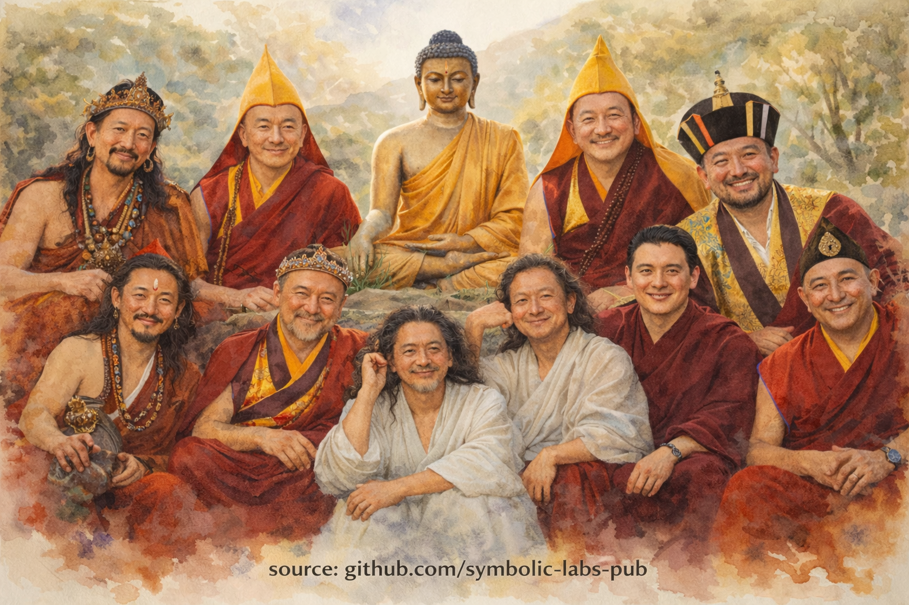
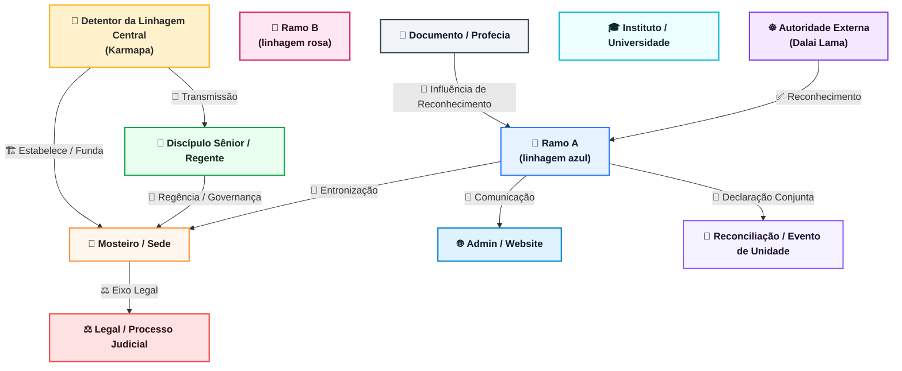
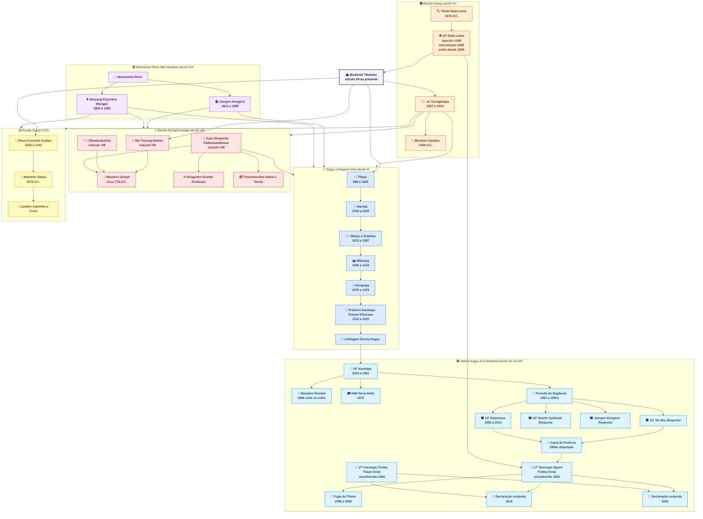

# Ontem

---

# Uma Única Chama, Muitas Lâmpadas

Quando o budismo tibetano é visto apenas como uma coleção de escolas, títulos e vestes, sua coerência mais profunda pode ser perdida. Mas quando visto através da lente da linhagem, ele se revela como algo muito mais orgânico: **uma única chama carregada de lâmpada em lâmpada**, adaptando sua forma sem perder sua luz.

As figuras que você reuniu—**Buda Gautama**, **Tilopa**, **Naropa**, **Marpa**, **Milarepa**, **Gampopa**, **Dusum Khyenpa**, **Rangjung Rigpe Dorje**, **Trinley Thaye Dorje**, **Je Tsongkhapa**, e **Gedun Drupa**—formam não uma assembleia aleatória, mas uma **coluna vertebral histórica de realização**.

Elas diferem radicalmente em temperamento, método e papel social. Ainda assim, cada uma responde a mesma pergunta:

> *Como a iluminação pode ser tornada possível para seres vivendo neste tempo, corpo e mundo particular?*

---

## 1. Buda Gautama: A Fonte Sem uma Escola

**Buda Gautama** (século V a.C.) se distingue não como uma figura tibetana, mas como a **origem do experimento mesmo**. Seu insight não era especulação metafísica, mas um diagnóstico:

* Soffrimento existe
* Tem causas
* Pode cessar
* Há um caminho

Tudo que se segue—disciplina monástica, ritual tântrico, intensidade yógica, precisão escolástica—é uma **resposta de engenharia** àquele descobrimento original.

Importantemente, o Buda **não fundou um "Budismo."** Ele fundou um *método*: ética, meditação e sabedoria testados contra experiência vivida. O budismo tibetano herda este pragmatismo mesmo quando suas formas exteriores parecem ornadas.

---

## 2. Tilopa e Naropa: Iluminação Sem Instituições

Com **Tilopa** (séculos X–XI) e **Naropa**, a linhagem passa para o mundo dos **mahasiddhas**—figuras que deliberadamente rejeitaram respeitabilidade social.

A realização de Tilopa não surgiu de mosteiros, mas de **trabalho ordinário** e confiança radical em experiência direta. Naropa, uma vez um erudito celebrado em Nalanda, teve que **desaprender certeza intelectual** através de uma série de provações humilhantes antes de realização amadurecer.

Sua mensagem era perigosa e libertadora:

> *Iluminação não é concedida por instituições.
> Instituições existem para servir iluminação.*

Este princípio ecoará repetidamente ao longo da história tibetana.

---

## 3. Marpa e Milarepa: Transmissão Através de Custo Humano

**Marpa o Tradutor** trouxe estes ensinamentos para o Tibete, não como um místico, mas como um **chefe de família, comerciante e tradutor**. Seu papel não era ser santo, mas ser *preciso*. Ele preservou os ensinamentos intactos, mesmo quando fazê-lo exigia dureza.

Seu discípulo **Milarepa** representa o extremo oposto: um assassino transformado em yogue através de disciplina insuportável. Sua vida demonstra um insight central tibetano:

> *Karma não é apagado por crença—mas pode ser metabolizado por prática.*

As canções de Milarepa mostram que realização não é serenidade estéril. É crua, humana, encarnada, e frequentemente alegre apenas após sofrimento profundo.

---

## 4. Gampopa: A Grande Integração

**Gampopa** realizou uma das sínteses mais importantes na história budista. Treinado primeiro na tradição monástica Kadampa, ele uniu:

* **Disciplina monástica**
* **Compaixão Mahāyāna**
* **Imediatismo tântrico**

Esta fusão permitiu a linhagem Kagyu **escalar**—a mover-se além de yogues solitários para comunidades sem perder profundidade experiencial. Sem Gampopa, não haveria uma escola Kagyu durável.

---

## 5. Dusum Khyenpa e o Princípio do Karmapa

Com **Dusum Khyenpa**, o Primeiro Karmapa, algo sem precedentes aparece: **o sistema tulku como um mecanismo de continuidade consciente**.

O Karmapa não é meramente renascido; ele **reconhece sua própria reencarnação**. Isto é menos místico do que parece—é uma solução radical para um problema prático:

> *Como uma tradição de realização sobrevive séculos sem se tornar corrupta ou diluída?*

A resposta foi continuidade de responsabilidade, não de poder.

---

## 6. Je Tsongkhapa e Gedun Drupa: Precisão como Compaixão

Paralelo à corrente Kagyu, **Je Tsongkhapa** fundou a tradição Gelug no século XIV–XV. Seu gênio não estava inventando novo insight, mas **insistindo em clareza epistemológica**.

Tsongkhapa acreditava que compaixão sem precisão desmorona em sentimentalismo, e meditação sem análise arrisca auto-engano.

Seu discípulo **Gedun Drupa**, posteriormente reconhecido como o Primeiro Dalai Lama, encarnou esta clareza em forma institucional—estabelecendo mosteiros que equilibravam erudição rigorosa com disciplina ética.

Esta linhagem produziria posteriormente a instituição Dalai Lama como uma **voz moral além do sectarismo**.

---

## 7. Rangjung Rigpe Dorje: Linhagem no Exílio

O **16º Karmapa**, Rangjung Rigpe Dorje, enfrentou um desafio que nenhum detentor anterior havia enfrentado: **a destruição da civilização tibetana mesmo**.

Sua resposta não foi retiro, mas **tradução para um contexto global**:

* Reconstruindo o Mosteiro Rumtek (1966)
* Viajando para o Ocidente (1974 em diante)
* Transmitindo a linhagem Kagyu fora da cultura tibetana

Ele demonstrou que linhagem não é vinculada a geografia. **Realização migra.**

---

## 8. Trinley Thaye Dorje: Linhagem Sob Condições Modernas

**Trinley Thaye Dorje**, um dos Karmapas 17º reconhecidos, representa linhagem sob restrições modernas: diáspora, sistemas legais, escrutínio midiático e praticantes globais.

O que importa aqui não é controvérsia, mas continuidade. Sua presença demonstra que a questão Kagyu permanece viva:

> *Pode realização profunda sobreviver transparência, pluralismo e psicologia moderna?*

A resposta ainda está se desdobrando.

---

## 9. Uma Unidade Oculta

Embora estas figuras pertençam a diferentes escolas—Kagyu e Gelug em particular—elas **não são competidoras**. O budismo tibetano sempre soube que métodos diferem porque **seres diferem**.

O que as une não é doutrina, mas **função**:

* Reduzir sofrimento
* Preservar insight
* Transmitir realização sem distorção

Elas sorriem em sua imagem porque não estão ansiosas sobre ortodoxia. A linhagem não depende de rigidez. Depende de **integridade**.

---

## Conclusão: Por Que Esta Linhagem Ainda Importa

Esta linhagem não é sobre o passado. É sobre **como sabedoria sobrevive tempo**.

Cada figura respondeu a mesma pergunta diferentemente:

* O Buda: *Desperte.*
* Tilopa: *Confie na experiência.*
* Milarepa: *Suporte transformação.*
* Tsongkhapa: *Seja preciso.*
* Os Karmapas: *Continue.*

Juntas, formam um único sistema vivo—adaptativo, resiliente e silenciosamente radical.

Não um museu.

Uma transmissão.

---

---

< [História](README.md) | [Hoje](present.md) >

_fonte: [github.com/symbolic-labs-pub](https://github.com/symbolic-labs-pub)_

---
