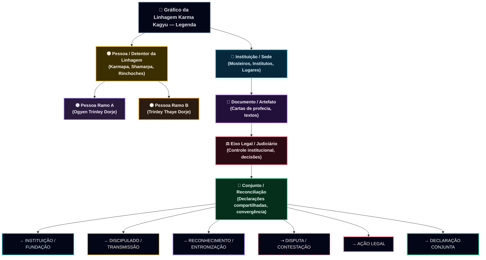

# Detentores da Linhagem





---


**[Guru Rinpoche (Padmasambhava)](https://en.wikipedia.org/wiki/Padmasambhava)** é fundacional principalmente para a **[Nyingma](https://www.rigpawiki.org/index.php?title=Nyingma)** ("Antiga") escola e seus dois fluxos de transmissão: **Kama (oral)** e **Terma (tesouro)**. ([Wikipedia][1])

O **Karmapa** é o chefe da linhagem **Karma Kagyu** (uma escola Kagyu), que tem sua própria "espinha dorsal" primária de transmissão (Marpa → Milarepa → Gampopa → …). Mas na prática, as linhagens tibetanas polinizam-se muito (especialmente desde o **movimento Rimé/não-sectário**), então você frequentemente verá **práticas de Guru Rinpoche** e transmissões Nyingma aparecendo dentro de currículos e empoderamentos Kagyu—sem Guru Rinpoche ser a *raiz formal* da linhagem Kagyu.

---

## 1) A "espinha dorsal" Karma Kagyu

Karma Kagyu está dentro da mais ampla **[tradição Kagyu](https://www.rigpawiki.org/index.php?title=The_Kagyu_Tradition)** (uma das quatro grandes escolas tibetanas). Kagyu rastreia volta através de:
**Marpa (tradutor) → Milarepa → Gampopa → (ramo Karma Kagyu) → Karmapas (linha tulku).** ([Rigpa Wiki][2])

Nós começaremos no **16º Karmapa**, então é ali que a cronologia detalhada começa.

---

## 2) S.S. o 16º Karmapa (1924–1981): eventos-chave e por que importa

**S.S. 16º Karmapa Rangjung Rigpe Dorje (nascido 1924, falecido 1981)** é amplamente creditado por **reconstruir a base institucional do Karma Kagyu no exílio** e **estabelecer grandes postos avançados ocidentais**. ([Karmapa Official][3])

### Cronologia central (d.C.)

* **1959** — Deixa o Tibete e vai a **Sikkim** (Índia). ([Wikipedia][4])
* **1962–1966** — Reconstrói **[Mosteiro Rumtek](https://en.wikipedia.org/wiki/Rumtek_Monastery)** como a **sede do Karmapa no exílio**; **inaugurado 1966**. ([Wikipedia][4])
* **1972** — Grande peregrinação através da Índia com principais discípulos (incluindo Shamar Rinpoche). ([Karmapa Official][3])
* **1974** — **Primeira grande visita de um Karmapa ao Ocidente** (Europa/EUA/Canadá); Cerimônias da Coroa Negra amplamente testemunhadas. ([Karmapa Official][3])
* **Meados-janeiro 1974** — Encontra **Papa Paulo VI** em Roma durante a turnê europeia. ([Karmapa Official][3])
* **1976–1977** — Turnês de ensino ocidentais adicionais; disseminação rápida de centros Kagyu na Europa. ([Karmapa Official][3])
* **Nov 1979** — Coloca pedra fundamental para **Instituto Budista Internacional Karmapa (KIBI)** em Nova Delhi. ([Karmapa Official][3])
* **1981** — Passa (parinirwana). ([Rigpa Wiki][5])

### Nós de "ramo" institucional que ele fortaleceu (ainda importantes hoje)

* **Rumtek** (sede no exílio, Sikkim) ([Wikipedia][4])
* **KIBI** (Nova Delhi) ([Karmapa Official][3])
* Expansão de centros Kagyu na **Europa/América do Norte** ([Karmapa Official][3])

---

## 3) Depois de 1981: a regência dos "Quatro Filhos do Coração" (a junção crítica)

Após o parinirvana do 16º Karmapa, um conselho/regência foi formado por seus quatro discípulos principais ("filhos do coração"), comumente listados como:

* **14º Shamarpa (Mipham Chökyi Lodrö, 1952–2014)** ([Wikipedia][6])
* **12º Tai Situ Rinpoche** ([Kagyu Office][7])
* **(3º) Jamgön Kongtrül Rinpoche** (detentor da sede da linhagem na época) ([Wikipedia][8])
* **12º Goshir Gyaltsab Rinpoche** ([Wikipedia][8])

Esta estrutura de regência é central porque a divisão posterior rastreia amplamente para **como o reconhecimento do 17º Karmapa foi tratado e contestado**. ([Wikipedia][8])

---

## 4) A divisão de reconhecimento do 17º Karmapa (1992 → presente): dois ramos

### Ramo A — **Ogyen Trinley Dorje** (reconhecido 1992; entronizado em Tsurphu)

Marcos-chave de alta confiança:

* **30 Jun 1992** — Declaração de confirmação pública por **S.S. o 14º Dalai Lama** reconhecendo a reencarnação do 16º Karmapa como **Ogyen Trinley Dorje**. ([Wikipedia][9])
* **27 Set 1992** — Entronizado como 17º Karmapa no **Mosteiro Tsurphu** (sede tradicional no Tibete). ([Wikipedia][9])
* **28 Dez 1999 → 5 Jan 2000** — Foge do Tibete; chega em **Dharamsala, Índia**. ([Kagyu Office][10])

Este é o ramo frequentemente associado com a presença web oficial **[kagyuoffice.org](https://kagyuoffice.org/karmapa/)**. ([Kagyu Office][11])

### Ramo B — **Trinley Thaye Dorje** (apresentado 1994; entronizado 1996)

Marcos-chave:

* **Mar 1994** — Apresentado/entronizado em Nova Delhi por **14º Shamarpa** (conforme descrito em múltiplas fontes alinhadas com Karma Kagyu). ([Wikipedia][12])
* **Dez 1996** — Formalmente entronizado em **Bodh Gaya**. ([Wikipedia][12])
* Este ramo está associado com **[karmapa.org](https://www.karmapa.org/)** e redes relacionadas. ([Karmapa Official][13])

### O que causou a divisão (em uma frase)

Um ponto de inflamação importante foi uma **carta de profecia** (relatada como deixada pelo 16º Karmapa e apresentada por Tai Situ), que foi **aceita por algumas figuras sênior e contestada por outras**—notavelmente o Shamarpa—levando a duas entronizações e administrações paralelas. ([Wikipedia][8])

---

## 5) Rumtek e efeitos de ramo institucional/legal (2003–2004 e além)

Rumtek se tornou não apenas uma sede espiritual, mas também um **ponto focal legal/administrativo** na disputa pós-1981.

* **26 Ago 2003** — Tribunal Superior de Sikkim manteve uma negação (especificidades do caso vinculadas ao litígio de Rumtek).
* **5 Jul 2004** — **Suprema Corte da Índia** afirmou a ordem do Tribunal Superior (per liberação do Kagyuoffice). ([Kagyu Office][14])

Há também relatos jornalísticos contemporâneos descrevendo a **disputa de Rumtek** como uma linha de falha importante na era de controvérsia. ([Phayul][15])

---

## 6) Sinais de reconciliação (2018 → 2023): uma nova "meta-ramo" em direção à unidade

Um desenvolvimento importante (frequentemente negligenciado) é que os dois claimantes começaram uma **trajetória de reconciliação pública**:

* **11 Out 2018** — **Declaração conjunta** após encontro na França: intenção de fortalecer/preservar a linhagem Karma Kagyu juntos. ([Karmapa Official][16])
* **4 Dez 2023** — Declaração conjunta de que eles **trabalharão juntos em relação à reencarnação do Shamarpa**, incluindo supervisão de reconhecimento e treinamento (redação difere por site, mas a essência é consistente). ([Karmapa Official][17])

Esta "pista de unidade" importa porque ela remodela o que "a linhagem desde o 16º Karmapa adiante" parece ser na prática: **dois fluxos institucionais, com tentativas explícitas de convergir em processos de sucessão-chave.**

---

## 7) A linhagem do Shamarpa como um "tronco de ramo" paralelo dentro de Karma Kagyu

Dentro de Karma Kagyu, o **Shamarpa** é tradicionalmente considerado excecionalmente sênior—frequentemente descrito como **segundo em proeminência após o Karmapa**.

* **14º Shamarpa: Mipham Chökyi Lodrö (1952–2014)** — reconhecido pelo 16º Karmapa; faleceu **11 Jun 2014**. ([Wikipedia][6])
* **2014** — Organizações ocidentais de Karma Kagyu formalmente solicitaram a Thaye Dorje reconhecer o **15º Shamarpa** (estágio de solicitação). ([London Diamond Way Buddhist Centre][18])
* **2023** — Dois Karmapas comprometem-se publicamente com uma **abordagem conjunta** em relação ao processo de reencarnação do Shamarpa (reconhecimento/educação). ([Karmapa Official][17])

---

## 8) "Ramos" no sentido mais amplo do budismo tibetano (ampliando o zoom)

### Ramos Kagyu (estrutural)

Kagyu é tradicionalmente descrito como:

* "Escolas Kagyu Anteriores" (incluindo **Karma Kagyu**) e "Escolas Kagyu Posteriores" (p.ex., **Drikung**, **Drukpa**, etc.). ([Rigpa Wiki][2])

Então quando alguém diz "linhagem budista tibetana," eles podem significar:

1. **a linha de sucessão tulku** (Karmapas),
2. **a linha de transmissão de prática** (professores → discípulos), e/ou
3. **a linha de rede institucional/monástica** (sedes, mosteiros, centros).

### Ramo Nyingma / Guru Rinpoche (estrutural)

A auto-compreensão do Nyingma proeminentemente centra **Padmasambhava** e os dois fluxos:

* **Kama** (transmissão oral contínua)
* **Terma** (tesouros ocultos, revelados por tertöns) ([Padmasambhava.Org][19])

---


```mermaid
flowchart LR
  %% ==========================================
  %% 🌈 Gráfico de linhagem Karma Kagyu
  %% - Grupos de cores via classDef + subgráficos
  %% - Linhas coloridas por significado via linkStyle (sensível à ordem)
  %% ==========================================

  %% ---------- Pessoas ----------
  K16["👑 S.S. 16º Karmapa<br/>Rangjung Rigpe Dorje<br/>(1924–1981)"]
  K17A["👑 17º Karmapa (Ramo A)<br/>Ogyen Trinley Dorje<br/>(n. 1985)"]
  K17B["👑 17º Karmapa (Ramo B)<br/>Trinley Thaye Dorje<br/>(n. 1983)"]

  SH14["🟥 14º Shamarpa<br/>Mipham Chökyi Lodrö<br/>(1952–2014)"]
  TS12["🟦 12º Tai Situ Rinpoche"]
  GY12["🟩 12º Goshir Gyaltsab Rinpoche"]
  JKX["🟪 Jamgön Kongtrül Rinpoche<br/>(era de regência)"]

  DL14["☸️ S.S. 14º Dalai Lama"]

  %% ---------- Instituições / Sedes ----------
  Rumtek["🏯 Mosteiro Rumtek<br/>(Sikkim, Índia)<br/>Sede no exílio"]
  Tsurphu["🏯 Mosteiro Tsurphu<br/>(Tibete)<br/>Sede tradicional"]
  KIBI["🎓 KIBI<br/>Nova Delhi, Índia"]
  Dharamsala["🏔️ Dharamsala<br/>HP, Índia"]
  BodhGaya["🕯️ Bodh Gaya<br/>Bihar, Índia"]

  KagyuOffice["🌐 Kagyu Office<br/>(kagyuoffice.org)<br/>Comuns Ramo A"]
  KarmapaOrg["🌐 karmapa.org<br/>Comuns Ramo B"]

  %% ---------- Documentos / Eventos ----------
  PredLetter["📜 "Carta de Profecia" Contestada<br/>(processo de reconhecimento)"]
  Joint2018["🤝 Declaração Conjunta<br/>2018-10-11<br/>(encontro na França)"]
  Joint2023["🤝 Declaração Conjunta<br/>2023-12-04<br/>(cooperação reencarnação Shamarpa)"]

  RumtekCase["⚖️ Decisões legais Rumtek<br/>2003-08-26 (Sikkim HC)<br/>2004-07-05 (India SC)"]

  %% ==========================================
  %% AGRUPAMENTO (subgráficos)
  %% ==========================================
  subgraph A["🧡 Âncora de Linhagem Central"]
    K16
  end

  subgraph B["💛 Ramos de Reconhecimento e Entronização (Pós-1981)"]
    K17A
    K17B
    PredLetter
  end

  subgraph C["💙 Regência / Discípulos Sênior (era Filhos-do-Coração)"]
    SH14
    TS12
    GY12
    JKX
  end

  subgraph D["💚 Sedes & Instituições"]
    Rumtek
    Tsurphu
    KIBI
    Dharamsala
    BodhGaya
  end

  subgraph E["🩶 Governança / Legal / Admin"]
    RumtekCase
    KagyuOffice
    KarmapaOrg
  end

  subgraph F["💜 Reconciliação / Pista de Unidade"]
    Joint2018
    Joint2023
  end

  %% ==========================================
  %% ARESTAS (manter ordem; linkStyle índices referem a estas)
  %% ==========================================

  %% (1) Construção institucional
  K16 -->|🏗️ ESTABELECE SEDE • 1966| Rumtek
  K16 -->|🏗️ FUNDA • 1979-11| KIBI

  %% (2) Discipulado / transmissão
  K16 -->|🧘 TRANSMISSÃO • pré-1981| SH14
  K16 -->|🧘 TRANSMISSÃO • pré-1981| TS12
  K16 -->|🧘 TRANSMISSÃO • pré-1981| GY12
  K16 -->|🧘 TRANSMISSÃO • pré-1981| JKX

  %% (3) Papéis de regência
  SH14 -->|🧭 REGÊNCIA • 1981→1990s| Rumtek
  TS12 -->|🧭 REGÊNCIA • 1981→1990s| Rumtek
  GY12 -->|🧭 REGÊNCIA • 1981→1990s| Rumtek
  JKX -->|🧭 REGÊNCIA • 1981→1990s| Rumtek

  %% (4) Mecânica de divisão de reconhecimento
  TS12 -->|📜 APRESENTA • início 1990s| PredLetter
  SH14 -->|❗ CONTESTA • 1990s| PredLetter
  PredLetter -->|🧩 INFLUENCIA • 1992| K17A

  DL14 -->|✅ RECONHECIMENTO • 1992-06-30| K17A
  K17A -->|👑 ENTRONIZADO • 1992-09-27| Tsurphu
  K17A -->|🧳 CHEGADA • 2000-01-05| Dharamsala

  SH14 -->|✅ RECONHECIMENTO • 1994-03| K17B
  K17B -->|👑 ENTRONIZADO • 1996-12| BodhGaya

  %% (5) Admin / comuns
  K17A -->|📣 COMUNS • 2000s→| KagyuOffice
  K17B -->|📣 COMUNS • 1990s→| KarmapaOrg

  %% (6) Eixo legal
  Rumtek -->|⚖️ LEGAL • 2003–2004| RumtekCase
  RumtekCase -->|🏛️ AFETA ADMIN • 2000s→| Rumtek

  %% (7) Reconciliação
  K17A -->|🤝 CONJUNTO • 2018-10-11| Joint2018
  K17B -->|🤝 CONJUNTO • 2018-10-11| Joint2018
  K17A -->|🤝 CONJUNTO • 2023-12-04| Joint2023
  K17B -->|🤝 CONJUNTO • 2023-12-04| Joint2023
  Joint2023 -->|🧬 PROCESSO LINHAGEM • futuro| SH14

  %% ==========================================
  %% ESTILOS (nós)
  %% ==========================================
  classDef core fill:#FFF1CC,stroke:#FFB020,stroke-width:2px,color:#2B2B2B,font-weight:700;
  classDef branchA fill:#E6F2FF,stroke:#2B7CFF,stroke-width:2px,color:#0F1A2B,font-weight:700;
  classDef branchB fill:#FFE6F2,stroke:#D81B60,stroke-width:2px,color:#2B0F1A,font-weight:700;

  classDef regent fill:#E9FFEF,stroke:#14A44D,stroke-width:2px,color:#0F2B17,font-weight:700;
  classDef dalai fill:#F3E8FF,stroke:#7C3AED,stroke-width:2px,color:#1D102B,font-weight:700;

  classDef seat fill:#FFF7ED,stroke:#FB923C,stroke-width:2px,color:#2B1A0F,font-weight:700;
  classDef institute fill:#ECFEFF,stroke:#06B6D4,stroke-width:2px,color:#0B2B2A,font-weight:700;

  classDef doc fill:#F1F5F9,stroke:#334155,stroke-width:2px,color:#0F172A,font-weight:700;
  classDef legal fill:#FEE2E2,stroke:#EF4444,stroke-width:2px,color:#2B0F0F,font-weight:700;
  classDef web fill:#E0F2FE,stroke:#0284C7,stroke-width:2px,color:#0B1F2B,font-weight:700;
  classDef unity fill:#F5F3FF,stroke:#8B5CF6,stroke-width:2px,color:#1E1033,font-weight:700;

  class K16 core
  class K17A branchA
  class K17B branchB

  class SH14 regent
  class TS12 regent
  class GY12 regent
  class JKX regent
  class DL14 dalai

  class Rumtek seat
  class Tsurphu seat
  class BodhGaya seat
  class Dharamsala seat
  class KIBI institute

  class PredLetter doc
  class Joint2018 unity
  class Joint2023 unity

  class RumtekCase legal
  class KagyuOffice web
  class KarmapaOrg web

  %% ==========================================
  %% ESTILOS (arestas por significado) — sensível à ordem
  %% 0-1: construção/instituição (laranja)
  %% 2-5: transmissão (verde)
  %% 6-9: regência (azul-petróleo)
  %% 10-12: mecânica de reconhecimento (cinza)
  %% 13-15: Reconhecimento/entronização/relocação Ramo A (azul)
  %% 16-17: Reconhecimento/entronização Ramo B (rosa)
  %% 18-19: comuns/admin (ciano)
  %% 20-21: eixo legal (vermelho)
  %% 22-26: reconciliação (roxo)
  %% ==========================================
```


---


[1]: https://en.wikipedia.org/wiki/Padmasambhava?utm_source=chatgpt.com "Padmasambhava"
[2]: https://www.rigpawiki.org/index.php?title=The_Kagyu_Tradition&utm_source=chatgpt.com "The Kagyu Tradition"
[3]: https://www.karmapa.org/life-16th-karmapa/?utm_source=chatgpt.com "The Life of the 16th Karmapa Rangjung Rigpe Dorje"
[4]: https://en.wikipedia.org/wiki/Rumtek_Monastery?utm_source=chatgpt.com "Rumtek Monastery"
[5]: https://www.rigpawiki.org/index.php?title=Karmapa_Rangjung_Rigp%C3%A9_Dorje&utm_source=chatgpt.com "Karmapa Rangjung Rigpé Dorje"
[6]: https://en.wikipedia.org/wiki/Mipham_Chokyi_Lodro?utm_source=chatgpt.com "Mipham Chokyi Lodro"
[7]: https://kagyuoffice.org/official-releases/?utm_source=chatgpt.com "The Official Website of the 17th Karmapa"
[8]: https://en.wikipedia.org/wiki/Karmapa_controversy?utm_source=chatgpt.com "Karmapa controversy"
[9]: https://en.wikipedia.org/wiki/Ogyen_Trinley_Dorje?utm_source=chatgpt.com "Ogyen Trinley Dorje"
[10]: https://kagyuoffice.org/in-india/the-karmapas-great-escape-december-28-1999-january-5-2000/?utm_source=chatgpt.com "Escape from Tibet"
[11]: https://kagyuoffice.org/karmapa/?utm_source=chatgpt.com "The Official Website of the 17th Karmapa"
[12]: https://en.wikipedia.org/wiki/Trinley_Thaye_Dorje?utm_source=chatgpt.com "Trinley Thaye Dorje"
[13]: https://www.karmapa.org/?utm_source=chatgpt.com "The 17th Karmapa Thaye Dorje: Official Website of His ..."
[14]: https://kagyuoffice.org/official-releases/the-supreme-court-of-india-decision-regarding-litigation-in-sikkim-district-court/?utm_source=chatgpt.com "The Supreme Court of India Decision Regarding Litigation ..."
[15]: https://www.phayul.com/2003/12/24/5724/?utm_source=chatgpt.com "The tale of two Karmapas"
[16]: https://www.karmapa.org/joint-statement-of-his-holiness-trinley-thaye-dorje-and-his-holiness-ogyen-trinley-dorje/?utm_source=chatgpt.com "Joint statement of His Holiness Trinley Thaye Dorje and His ..."
[17]: https://www.karmapa.org/a-joint-statement-regarding-the-reincarnation-of-kunzig-shamar-rinpoche/?utm_source=chatgpt.com "A joint statement regarding the reincarnation of Kunzig ..."
[18]: https://www.buddhism-london.org/recognition-of-the-15th-shamarpa-karma-kagyu-organizations-request-of-hh-karmapa/?utm_source=chatgpt.com "Recognition of the 15th Shamarpa: Karma Kagyu ..."
[19]: https://www.padmasambhava.org/the-nyingma-lineage?utm_source=chatgpt.com "The Nyingma Lineage | Padmasambhava.Org"

---

< [Ontem](past.md) | [História](README.md) >

_fonte: [github.com/symbolic-labs-pub](https://github.com/symbolic-labs-pub)_

---
