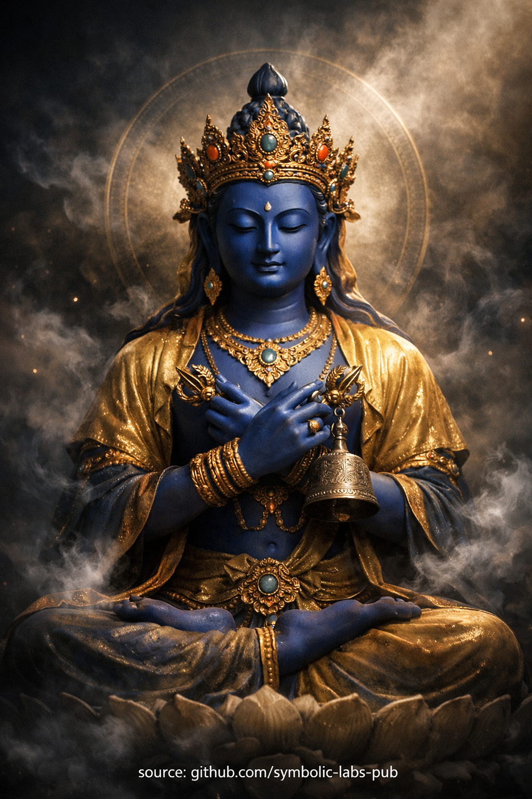

## [Vajradhara și învățătura recunoașterii](https://github.com/symbolic-labs-pub/a-buddhist-view/blob/master/more/08_lineage/11_vajradhara/README.md#vajradhara-and-the-teaching-of-recognition)

Învățătură

## Vajradhara și învățătura recunoașterii

**O învățătură Mahāmudrā a lineajului Kagyü**

### Teza centrală

**Vajradhara** nu este un Buddha îndepărtat, un zeu sau o origine metafizică.
Vajradhara numește **natura deja-prezentă a minții**—trezirea **înainte de apariția conceptelor**.

Această învățătură este radicală în simplitatea sa:

> Eliberarea nu este produsă.
> Trezirea nu este atinsă.
> **Realitatea este recunoscută.**

---

## 1. Fundamentul: Conștiință fără timp

În înțelegerea Kagyü, Vajradhara reprezintă **starea fundamentală** (gzhi):

* Nenăscut
* Neîncetat
* Auto-cunoscător
* Liber de centru sau margine

Acest fundament **nu este creat de practică**.
Practica doar elimină **nerecunoașterea**.

Așa cum norii nu deteriorează cerul,
confuzia nu pătează conștiința.

---

## 2. Eroarea: Căutarea a ceea ce este deja prezent

Ființele obișnuite suferă nu pentru că conștiința este absentă, ci pentru că este **trecută cu vederea**.

Eroarea fundamentală este subtilă:

* Căutăm conștiința *ca* un obiect
* Tratăm mintea ca pe ceva de îmbunătățit
* Presupunem că trezirea se află în viitor

Acest lucru creează efort fără sfârșit și anxietate spirituală.

Vajradhara corectează această eroare indicând direct:

> *Cel care caută este deja ceea ce este căutat.*

---

## 3. Metoda și înțelepciunea unite

Vajradhara ține **vajra și clopot** încrucișate la inimă:

* **Vajra (metodă)** — claritate, precizie, angajare fără teamă
* **Clopot (înțelepciune)** — golire, deschidere, ne-fixare

Unirea lor învață:

* Compasiunea fără înțelepciune devine sentimentalism
* Înțelepciunea fără compasiune devine abstracție rece

Mahāmudrā este **inseparabilitatea lor**, trăită direct.

---

## 4. Calea: Recunoaștere, nu construcție

Învățătura Kagyü subliniază **instrucțiunea de indicare**:

* Profesorul nu dă ceva nou
* Studentul este ghidat să **recunoască** ceea ce funcționează deja

Când conștiința se recunoaște pe sine:

* Gândurile se auto-eliberează
* Emoțiile pierd soliditatea
* Experiența devine lucrabilă mai degrabă decât amenințătoare

Această recunoaștere nu este fragilă.
Nu depinde de tăcere, postură sau retragere.

---

## 5. Fructul: Prezență naturală în viața de zi cu zi

Fructul realizării Vajradhara nu este retragerea din viață, ci **prezență necontrăfăcută**:

* Acțiune fără efort de ego
* Compasiune fără epuizare
* Claritate fără rigiditate

O persoană trezită încă:

* Simte durere
* Ia decisii
* Se angajează în societate

Dar fără povara suplimentară a auto-fabricării.

---

## 6. De ce această învățătură este dată ultima

Învățăturile Vajradhara sunt date tradițional **după** etică, devoțiune și disciplină pentru că:

* Fără fundament etic → recunoașterea devine nihilism
* Fără compasiune → claritatea devine aroganță
* Fără umilință → înțelegerea devine identitate

Când fundamentele sunt stabile, Mahāmudrā este **sigură și liberatoare**.

---

## Sigiliu rezumativ

* Vajradhara nu este istoric — **este fără timp**
* Mahāmudrā nu este graduală — **este imediată**
* Trezirea nu este îndepărtată — **este prezentă acum**

> Nu îmbunătăți conștiința.
> Nu judeca conștiința.
> **Recunoaște conștiința.**

Această recunoaștere este Vajradhara.

---

Explicație

**O învățătură Mahāmudrā a lineajului Kagyü**

### Teza centrală

**Vajradhara** nu este un Buddha îndepărtat, un zeu sau o origine metafizică.
Vajradhara numește **natura deja-prezentă a minții**—trezirea **înainte de apariția conceptelor**.

Această învățătură este radicală în simplitatea sa:

> Eliberarea nu este produsă.
> Trezirea nu este atinsă.
> **Realitatea este recunoscută.**

---

## 1. Fundamentul: Conștiință fără timp

În înțelegerea Kagyü, Vajradhara reprezintă **starea fundamentală** (gzhi):

* Nenăscut
* Neîncetat
* Auto-cunoscător
* Liber de centru sau margine

Acest fundament **nu este creat de practică**.
Practica doar elimină **nerecunoașterea**.

Așa cum norii nu deteriorează cerul,
confuzia nu pătează conștiința.

---

## 2. Eroarea: Căutarea a ceea ce este deja prezent

Ființele obișnuite suferă nu pentru că conștiința este absentă, ci pentru că este **trecută cu vederea**.

Eroarea fundamentală este subtilă:

* Căutăm conștiința *ca* un obiect
* Tratăm mintea ca pe ceva de îmbunătățit
* Presupunem că trezirea se află în viitor

Acest lucru creează efort fără sfârșit și anxietate spirituală.

Vajradhara corectează această eroare indicând direct:

> *Cel care caută este deja ceea ce este căutat.*

---

## 3. Metoda și înțelepciunea unite

Vajradhara ține **vajra și clopot** încrucișate la inimă:

* **Vajra (metodă)** — claritate, precizie, angajare fără teamă
* **Clopot (înțelepciune)** — golire, deschidere, ne-fixare

Unirea lor învață:

* Compasiunea fără înțelepciune devine sentimentalism
* Înțelepciunea fără compasiune devine abstracție rece

Mahāmudrā este **inseparabilitatea lor**, trăită direct.

---

## 4. Calea: Recunoaștere, nu construcție

Învățătura Kagyü subliniază **instrucțiunea de indicare**:

* Profesorul nu dă ceva nou
* Studentul este ghidat să **recunoască** ceea ce funcționează deja

Când conștiința se recunoaște pe sine:

* Gândurile se auto-eliberează
* Emoțiile pierd soliditatea
* Experiența devine lucrabilă mai degrabă decât amenințătoare

Această recunoaștere nu este fragilă.
Nu depinde de tăcere, postură sau retragere.

---

## 5. Fructul: Prezență naturală în viața de zi cu zi

Fructul realizării Vajradhara nu este retragerea din viață, ci **prezență necontrăfăcută**:

* Acțiune fără efort de ego
* Compasiune fără epuizare
* Claritate fără rigiditate

O persoană trezită încă:

* Simte durere
* Ia decisii
* Se angajează în societate

Dar fără povara suplimentară a auto-fabricării.

---

## 6. De ce această învățătură este dată ultima

Învățăturile Vajradhara sunt date tradițional **după** etică, devoțiune și disciplină pentru că:

* Fără fundament etic → recunoașterea devine nihilism
* Fără compasiune → claritatea devine aroganță
* Fără umilință → înțelegerea devine identitate

Când fundamentele sunt stabile, Mahāmudrā este **sigură și liberatoare**.

---

## Sigiliu rezumativ

* Vajradhara nu este istoric — **este fără timp**
* Mahāmudrā nu este graduală — **este imediată**
* Trezirea nu este îndepărtată — **este prezentă acum**

> Nu îmbunătăți conștiința.
> Nu judeca conștiința.
> **Recunoaște conștiința.**

Această recunoaștere este Vajradhara.

---

### Meditația Mahāmudrā Vajradhara

> ⚠️ **Notă despre domeniu**
> Ceea ce urmează este o **formă contemplativă fără împuternicire** (o *practică de sens*).
> **Nu** înlocuiește transmiterea lineajului (*wang, lung, tri*).
> Funcția sa este **stabilizare, aspirație și aliniere cauzală**, nu autorizare tantrică.

**Recunoașterea stării fundamentale a minții**

Aceasta este o **practică de recunoaștere**, nu o vizualizare pentru a fabrica ceva nou. Se aliniază cu înțelegerea Kagyü a **Mahāmudrā** ca *cunoaștere directă* mai degrabă decât construcție graduală.

---

## Orientare

**Vajradhara** reprezintă **conștiința fără timp însăși**—*natura deja-prezentă a minții*.
Această meditație antrenează **recunoașterea**, nu atingerea.

> Nimic nu este adăugat. Nimic nu este eliminat.
> Conștiința se recunoaște pe sine.

---

## 1. Pregătire (2–3 minute)

* Stai confortabil: pernă sau scaun, coloană vertebrală dreaptă dar relaxată.
* Mâinile pot să se odihnească în poală, sau ușor încrucișate la inimă (simbol al **metodei și înțelepciunii unificate**).
* Ochi: pe jumătate deschiși sau blând închiși.
* Lasă respirația să se așeze **fără să o controlezi**.

Recunoaște în tăcere:

> *"Această minte este deja completă."*

---

## 2. Așezarea minții (5 minute)

* Permite gândurilor, senzațiilor și emoțiilor să apară liber.
* **Nu** suprima, nu analiza, nu urmări.
* Fiecare apariție este tratată în mod egal—sunet, gând, memorie, senzație.

Instrucțiune cheie:

> Lasă fenomenele să apară și să se dizolve **ca reflexii într-o oglindă**.

Nu te uita *la* gânduri.
Observă **spațiul în care apar**.

---

## 3. Recunoaștere prin indicare (10–15 minute)

Întreabă blând—nu conceptual, ci experiențial:

* Ce este conștient de această respirație?
* Ce cunoaște acest gând?
* Are conștiința formă, culoare, locație?

Apoi **lasă întrebările**.

Odihnește **ca cunoașterea însăși**.

Aceasta este mișcarea critică Mahāmudrā:

* Conștiința nu observă ceva altceva.
* Conștiința este **auto-cunoscătoare**, fără efort și clară.

Dacă apare distracție:

* Nu o corecta.
* Recunoaște distracția **ca fiind conștiință însăși**.

Această recunoaștere *este* natura-Vajradhara.

---

## 4. Sigiliu simbolic (opțional, 2 minute)

Amintește-ți pe scurt Vajradhara:

* Albastru, luminos, fără timp
* Vajra și clopot unificate la inimă

Apoi dizolvă complet imaginea în **prezență pură**.

Acest lucru amintește minții:

> Vajradhara nu este un obiect —
> Vajradhara este **această cunoaștere**.

---

## 5. Integrare (2–3 minute)

Înainte de a termina, reflectează blând:

* Această conștiință continuă în timp ce stai, vorbești, lucrezi.
* Mahāmudrā nu este confinată la pernă.

Dedicare (opțional):

> *"Fie ca această recunoaștere să beneficieze toate ființele,
> fără distorsiune sau pierdere."*

---

## Capcane comune (și corecții)

* ❌ **Încercând să oprești gândurile** → ✔ Lasă-le să se auto-elibereze
* ❌ **Căutând o stare specială** → ✔ Recunoaște ceea ce este deja aici
* ❌ **Super-efort** → ✔ Relaxează *în* claritate
* ❌ **Intelectualizare** → ✔ Rămâi cu experiența directă

---

## Înțelegere structurală (perspectiva Kagyü)

* Etica stabilizează câmpul
* Devoțiunea deschide receptivitatea
* Mahāmudrā **revelează fundamentul**

Vajradhara nu este atins la sfârșit.
Vajradhara este **recunoscut la început**.

---

Dacă dorești, următorul poate fi:

* Traducerea acesteia într-o **versiune zilnică scurtă de 10 minute**

---

Meditație

### Meditația Mahāmudrā Vajradhara

> ⚠️ **Notă despre domeniu**
> Ceea ce urmează este o **formă contemplativă fără împuternicire** (o *practică de sens*).
> **Nu** înlocuiește transmiterea lineajului (*wang, lung, tri*).
> Funcția sa este **stabilizare, aspirație și aliniere cauzală**, nu autorizare tantrică.

**Recunoașterea stării fundamentale a minții**

Aceasta este o **practică de recunoaștere**, nu o vizualizare pentru a fabrica ceva nou. Se aliniază cu înțelegerea Kagyü a **Mahāmudrā** ca *cunoaștere directă* mai degrabă decât construcție graduală.

---

## Orientare

**Vajradhara** reprezintă **conștiința fără timp însăși**—*natura deja-prezentă a minții*.
Această meditație antrenează **recunoașterea**, nu atingerea.

> Nimic nu este adăugat. Nimic nu este eliminat.
> Conștiința se recunoaște pe sine.

---

## 1. Pregătire (2–3 minute)

* Stai confortabil: pernă sau scaun, coloană vertebrală dreaptă dar relaxată.
* Mâinile pot să se odihnească în poală, sau ușor încrucișate la inimă (simbol al **metodei și înțelepciunii unificate**).
* Ochi: pe jumătate deschiși sau blând închiși.
* Lasă respirația să se așeze **fără să o controlezi**.

Recunoaște în tăcere:

> *"Această minte este deja completă."*

---

## 2. Așezarea minții (5 minute)

* Permite gândurilor, senzațiilor și emoțiilor să apară liber.
* **Nu** suprima, nu analiza, nu urmări.
* Fiecare apariție este tratată în mod egal—sunet, gând, memorie, senzație.

Instrucțiune cheie:

> Lasă fenomenele să apară și să se dizolve **ca reflexii într-o oglindă**.

Nu te uita *la* gânduri.
Observă **spațiul în care apar**.

---

## 3. Recunoaștere prin indicare (10–15 minute)

Întreabă blând—nu conceptual, ci experiențial:

* Ce este conștient de această respirație?
* Ce cunoaște acest gând?
* Are conștiința formă, culoare, locație?

Apoi **lasă întrebările**.

Odihnește **ca cunoașterea însăși**.

Aceasta este mișcarea critică Mahāmudrā:

* Conștiința nu observă ceva altceva.
* Conștiința este **auto-cunoscătoare**, fără efort și clară.

Dacă apare distracție:

* Nu o corecta.
* Recunoaște distracția **ca fiind conștiință însăși**.

Această recunoaștere *este* natura-Vajradhara.

---

## 4. Sigiliu simbolic (opțional, 2 minute)

Amintește-ți pe scurt Vajradhara:

* Albastru, luminos, fără timp
* Vajra și clopot unificate la inimă

Apoi dizolvă complet imaginea în **prezență pură**.

Acest lucru amintește minții:

> Vajradhara nu este un obiect —
> Vajradhara este **această cunoaștere**.

---

## 5. Integrare (2–3 minute)

Înainte de a termina, reflectează blând:

* Această conștiință continuă în timp ce stai, vorbești, lucrezi.
* Mahāmudrā nu este confinată la pernă.

Dedicare (opțional):

> *"Fie ca această recunoaștere să beneficieze toate ființele,
> fără distorsiune sau pierdere."*

---

## Capcane comune (și corecții)

* ❌ **Încercând să oprești gândurile** → ✔ Lasă-le să se auto-elibereze
* ❌ **Căutând o stare specială** → ✔ Recunoaște ceea ce este deja aici
* ❌ **Super-efort** → ✔ Relaxează *în* claritate
* ❌ **Intelectualizare** → ✔ Rămâi cu experiența directă

---

## Înțelegere structurală (perspectiva Kagyü)

* Etica stabilizează câmpul
* Devoțiunea deschide receptivitatea
* Mahāmudrā **revelează fundamentul**

Vajradhara nu este atins la sfârșit.
Vajradhara este **recunoscut la început**.

---

< [**O învățătură budistă: Marpa traducătorul — Dharma care refuză să fie înmuiată**](../10_marpa/README.md) | [Învățătura protectorului mânios](../12_six_armed_mahakala/README.md) >

_sursă: [github.com/symbolic-labs-pub](https://github.com/symbolic-labs-pub)_

---
