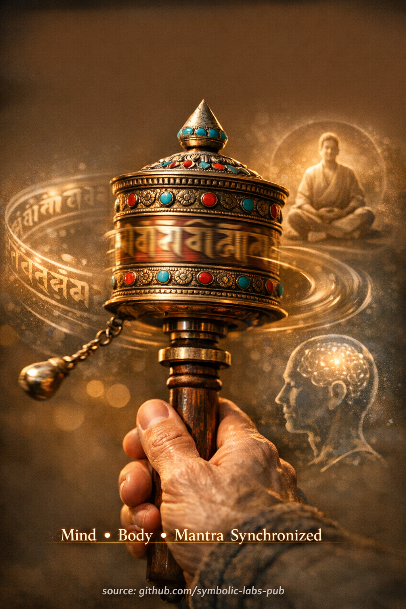

## [Roată de Rugăciune (Mani Wheel) — Explicată Prin Învățăturile Budiste](https://github.com/symbolic-labs-pub/a-buddhist-view/blob/master/more/09_symbols/03_prayer_wheel/README.md#prayer-wheel-mani-wheel--explained-through-buddhist-teachings)

---

**Roata de rugăciune** (*mani wheel*) nu este o scurtătură, superstiție sau truc mecanic. În înțelegerea budistă autentică—în special în **[Vajrayāna](../../05_yanas/README.md#4-vajrayāna-tantrayāna-mantrayāna---the-diamond-vehicle) tibetană**—este un **dispozitiv de antrenament pentru continuitatea [trezirii](../../10_concepts/README.md#3-enlightenment-bodhi-awakening)**.

---

## 1. Ce Reprezintă Cu Adevărat Roata de Rugăciune

La bază, roata de rugăciune întruchipează **[originea dependentă](../../02_from_ignorance_to_awakening/3_dependent_origination/README.md#the-twelve-links-the-classic-formulation) în acțiune**.

În interiorul roții sunt scrise [mantra](../10_mantra/README.md#what-a-mantra-is-buddhist-view)-uri—cel mai frecvent **Om Mani Padme Hum**, mantra [compasiunii](../../02_from_ignorance_to_awakening/7_compassion/README.md#compassion-as-a-structural-principle-in-buddhist-teaching). Acestea nu sunt "rugăciuni stocate" ci **amprente de vorbire trezită**.

Când roata se învârte:

* **Corpul** efectuează o acțiune disciplinată
* **Vorbirea** este reprezentată de mantra
* **Mintea** menține intenția și [conștiința](../../10_concepts/README.md#2-awareness-rigpa-vijñāna-knowing)

Aceasta unifică **Cele Trei Porți** (corp, vorbire, minte), care este **întreaga cale a practicii în formă condensată**.

> În budism, trezirea are loc **când Cele Trei Porți se aliniază**.

---

## 2. De Ce Contează Rotația În Sensul Acelor de Ceasornic

Mișcarea în sensul acelor de ceasornic nu este arbitrară.

Oglindește:

* **Ordinea cosmică** (soarele, stelele, circumambularea [mandala](../07_mandala/README.md#mandala--explained-according-to-buddhist-teachings))
* **Direcția activității iluminate**
* Direcția tradițională de **circumambulare a [stupa](../05_stupa/README.md#1-what-a-stupa-is-beyond-architecture)-urilor și învățătorilor**

Învârtirea în sens invers acelor de ceasornic simbolic **desfășoară** mai degrabă decât susține modelele de trezire condiționate.

Deci învârtirea în sensul acelor de ceasornic este un **act de armonie cu [Dharma](../../01_core_teachings/the_three_jewels/README.md#2-dharma--the-path-and-the-law-of-reality)**, nu o regulă pentru ea însăși.

---

## 3. "Fiecare Învârtire Echivalează Cu O Recitare" — Ce Înseamnă Cu Adevărat Acest Lucru

Acest lucru **nu** înseamnă acumulare mecanică de merit.

Mai degrabă:

* O rotație completă reprezintă **continuitatea intenției**
* Antrenează mintea să **rămână cu o orientare salutară**
* Înlocuiește gândul împrăștiat cu **repetiție stabilă**

În psihologia budistă, **continuitatea învinge intensitatea**.

O persoană distrată recitând 1.000 de mantre dobândește mai puțină claritate decât o persoană concentrată învârtind o roată cu prezență calmă.

---

## 4. Scopul Mai Profund: Antrenarea Non-Fragmentării

Roata de rugăciune antrenează ceva subtil dar critic:

> **A rămâne aliniat în timpul mișcării**

Cea mai mare parte a [suferinței](../../02_from_ignorance_to_awakening/2_the_four_noble_truths/README.md#1-there-is-suffering--dukkha) apare pentru că:

* Corpul face un lucru
* Vorbirea spune altceva
* Mintea este cu totul altundeva

Mani wheel inversează ușor această fragmentare.

Învață:

* Ritm în loc de forță
* Consecvență în loc de culmi emoționale
* Practică încorporată în mișcarea zilnică

Acesta este motivul pentru care roțile de rugăciune apar **pe poteci, pereți, poduri și în sate**—ele integrează Dharma în viața obișnuită.

---

## 5. De Ce Viteza Este Descurajată

Învârtirea rapidă condusă de ego ("mai multe rotații = mai mult merit") **pierde esența**.

Viteza hrănește:

* Agitație
* Materialism spiritual
* Cuantificarea trezirii

Utilizarea corectă pune accent pe:

* Ritm uniform
* Conștiință relaxată
* Intenție stabilă

În Vajrayāna, **calitatea minții definește rezultatul**, nu cantitatea de mișcare.

---

## 6. Ce *Nu* Este Roata de Rugăciune

Ea **nu** este:

* Un substitut pentru [meditație](../../08_lineage/README.md)
* O modalitate de a ocoli [etica](../../01_core_teachings/the_noble_eightfold_path/README.md#2-ethical-conduct-śīla) sau perspectiva
* Un obiect magic care "funcționează de la sine"

Ea **este**:

* Un suport pentru [atenție](../../01_core_teachings/the_noble_eightfold_path/README.md#7-right-mindfulness-sammā-sati)
* Un stabilizator pentru intenție
* O punte între ritual și realizare

Fără conștiință, este decorație.
Cu conștiință, devine **practică-în-mișcare**.

---

## 7. Învățătura Esențială Într-O Linie

> Roata de rugăciune învață că trezirea nu este ceva pentru care oprești viața—
> **este ceva prin care rotești viața, din nou și din nou, fără a întrerupe continuitatea.**

---

< [Dorje (Vajra) — explicat conform învățăturilor budiste](../02_dorje/README.md) | [Steaguri de Rugăciune (Lungta) — Explicate Prin Învățăturile Budiste](../04_prayer_flags/README.md) >

_sursă: [github.com/symbolic-labs-pub](https://github.com/symbolic-labs-pub)_

---
