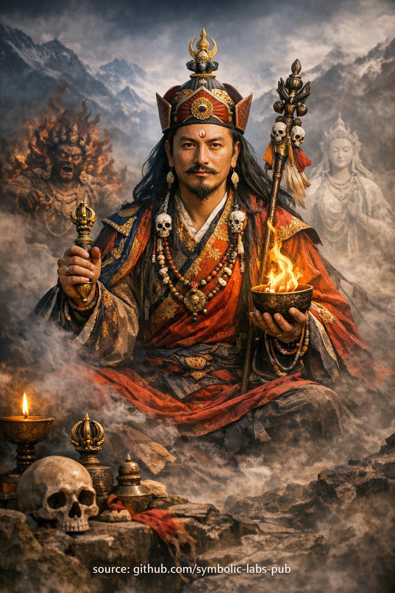

## [Budhistické učenie: **prebudenie ako šikovná adaptácia**](https://github.com/symbolic-labs-pub/a-buddhist-view/blob/master/more/08_lineage/05_padmasambhava/README.md#buddhist-teaching-awakening-as-skillful-adaptation)

Učenie

## Budhistické učenie: **prebudenie ako šikovná adaptácia**

### Založené na princípe **Guru Rinpoche**

---

### 1. Problém, ktorý učenie rieši

Väčšina duchovného zápasu pochádza z **nepochopenia prebudenia**.

Ľudia predpokladajú, že prebudenie znamená:

* Stať sa trvalo pokojným
* Vyhýbať sa konfliktu alebo intenzite
* Udržiavať fixnú "svätú" identitu

To vytvára **krehkú duchovnosť**:

* Pokoj, ktorý sa zrúti pod tlakom
* Etiku, ktorá zlyháva v zložitosti
* Vhľad, ktorý nedokáže konať

Budhizmus neučí útek od podmienok.
Učí **slobodu v podmienkach**.

---

### 2. Základné učenie: prebudenie nie je stav — je to schopnosť

Guru Rinpoche stelesňuje centrálny vhľad Vajrayāny:

> **Prebudenie je schopnosť reagovať primerane na čokoľvek, čo vznikne.**

To znamená:

* Pokojný, keď je potrebný pokoj
* Hnevlivý, keď musí byť prekážka prerezaná
* Ticho, keď by slová skreslili
* Aktívny, keď by odklad spôsobil ujmu

Neexistuje **jediná osvietená osobnosť**.
Existuje len **nerušená responzívnosť**.

---

### 3. Hnevlivé a pokojné nie sú protiklady

V bežnom myslení:

* Pokojný = dobrý
* Hnevlivý = zlý

V porozumení Vajrayāny:

* Obe sú **výrazmi súcitu**
* Rozdiel je **funkcia**, nie moralita

Hnevlivé formy:

* Ničia nevedomosť, nie bytosti
* Prerušujú pripútanie ega, nie ľudí
* Chránia prax, nie pohodlie

Pokojné formy:

* Stabilizujú, liečia a živia
* Vytvárajú podmienky pre vhľad

**Múdrosť volí formu.**

---

### 4. Prečo je toto učenie nebezpečné bez ukotvenia

Toto učenie **nie je povolenie pre ego**.

Bez:

* Etiky (śīla)
* Disciplíny
* Súcitu

"Hnevlivé prostriedky" sa stávajú:

* Hnev ospravedlnený ako duchovnosť
* Moc zamienená za múdrosť

Preto je toto učenie tradične dávané:

* Po útočisku
* Po etickej stabilizácii
* Po určitej meditatívnej jasnosti

Adaptácia bez jasnosti je chaos.
Jasnosť bez adaptácie je bezmocnosť.

---

### 5. Stredná cesta konania Vajrayāny

Toto učenie sa vyhýba dvom extrémom:

**1. Rigidná čistota**

* Strach z konania
* Vyhýbanie sa zložitosti
* Duchovné obchádzanie

**2. Reaktívna impulzívnosť**

* Konanie z emócií
* Ospravedlňovanie ujmy
* Strata vedomia

Guru Rinpoche predstavuje **tretí režim**:

> Konanie bez ego-referencie.

---

### 6. Praktická implikácia pre praktikujúcich

Nepýtaj sa:

> "Čo by mal robiť osvietený človek?"

Pýtaj sa:

> "Čo redukuje zmätok *tu*, *teraz*, s najmenším skreslením?"

To posúva prax z:

* Identita → Funkcia
* Vzhľad → Efekt
* Viera → Presnosť

---

### 7. Záverečné vyhlásenie učenia

> Prebudenie nie je čistota.
> Prebudenie je **presnosť**.
>
> Keď múdrosť stretne podmienky bez strachu,
> čokoľvek vznikne, stáva sa cestou.

---

Vysvetlenie

### Založené na princípe **Guru Rinpoche**

---

### 1. Problém, ktorý učenie rieši

Väčšina duchovného zápasu pochádza z **nepochopenia prebudenia**.

Ľudia predpokladajú, že prebudenie znamená:

* Stať sa trvalo pokojným
* Vyhýbať sa konfliktu alebo intenzite
* Udržiavať fixnú "svätú" identitu

To vytvára **krehkú duchovnosť**:

* Pokoj, ktorý sa zrúti pod tlakom
* Etiku, ktorá zlyháva v zložitosti
* Vhľad, ktorý nedokáže konať

Budhizmus neučí útek od podmienok.
Učí **slobodu v podmienkach**.

---

### 2. Základné učenie: prebudenie nie je stav — je to schopnosť

Guru Rinpoche stelesňuje centrálny vhľad Vajrayāny:

> **Prebudenie je schopnosť reagovať primerane na čokoľvek, čo vznikne.**

To znamená:

* Pokojný, keď je potrebný pokoj
* Hnevlivý, keď musí byť prekážka prerezaná
* Ticho, keď by slová skreslili
* Aktívny, keď by odklad spôsobil ujmu

Neexistuje **jediná osvietená osobnosť**.
Existuje len **nerušená responzívnosť**.

---

### 3. Hnevlivé a pokojné nie sú protiklady

V bežnom myslení:

* Pokojný = dobrý
* Hnevlivý = zlý

V porozumení Vajrayāny:

* Obe sú **výrazmi súcitu**
* Rozdiel je **funkcia**, nie moralita

Hnevlivé formy:

* Ničia nevedomosť, nie bytosti
* Prerušujú pripútanie ega, nie ľudí
* Chránia prax, nie pohodlie

Pokojné formy:

* Stabilizujú, liečia a živia
* Vytvárajú podmienky pre vhľad

**Múdrosť volí formu.**

---

### 4. Prečo je toto učenie nebezpečné bez ukotvenia

Toto učenie **nie je povolenie pre ego**.

Bez:

* Etiky (śīla)
* Disciplíny
* Súcitu

"Hnevlivé prostriedky" sa stávajú:

* Hnev ospravedlnený ako duchovnosť
* Moc zamienená za múdrosť

Preto je toto učenie tradične dávané:

* Po útočisku
* Po etickej stabilizácii
* Po určitej meditatívnej jasnosti

Adaptácia bez jasnosti je chaos.
Jasnosť bez adaptácie je bezmocnosť.

---

### 5. Stredná cesta konania Vajrayāny

Toto učenie sa vyhýba dvom extrémom:

**1. Rigidná čistota**

* Strach z konania
* Vyhýbanie sa zložitosti
* Duchovné obchádzanie

**2. Reaktívna impulzívnosť**

* Konanie z emócií
* Ospravedlňovanie ujmy
* Strata vedomia

Guru Rinpoche predstavuje **tretí režim**:

> Konanie bez ego-referencie.

---

### 6. Praktická implikácia pre praktikujúcich

Nepýtaj sa:

> "Čo by mal robiť osvietený človek?"

Pýtaj sa:

> "Čo redukuje zmätok *tu*, *teraz*, s najmenším skreslením?"

To posúva prax z:

* Identita → Funkcia
* Vzhľad → Efekt
* Viera → Presnosť

---

### 7. Záverečné vyhlásenie učenia

> Prebudenie nie je čistota.
> Prebudenie je **presnosť**.
>
> Keď múdrosť stretne podmienky bez strachu,
> čokoľvek vznikne, stáva sa cestou.

---

### 1. Príprava — ustanovenie základu (2–3 minúty)

Seď pohodlne s priamou chrbtovou kosťou.
Nechaj dych usadiť prirodzene.

Prines do mysle tento zámer:

> *"Praktizujem nie na útek od podmienok,
> ale na prebudenie **v nich**."*

Dovol mysli stať sa jasnou a ostražitou—ani napätou, ani tupou.

> ⚠️ **Poznámka o rozsahu**
> To, čo nasleduje, je **neiniciatická kontemplatívna forma** (*prax významu*).
> **Nenahradz** lineárnu transmisiu (*wang, lung, tri*).
> Jeho funkciou je **stabilizácia, ašpirácia a kauzálne vyrovnanie**, nie tantrická autorizácia.

---

### 2. Vizualizácia — prítomnosť majstra (5–7 minút)

Vizualizuj **Guru Rinpoche** objavujúceho sa pred tebou alebo nad korunou tvojej hlavy.

Kľúčové črty (držané ľahko, nie nútené):

* Žiarivý, ale ukotvený
* Pokojná prítomnosť s **latentnou mocou**
* Hnevlivé a jemné energie integrované, nie v opozícii

Nie je vzdialený ani symbolický—
reprezentuje **prebudenú odpoveď už možnú vo tvojom vlastnom prúde mysle**.

Nechaj obraz stabilizovať sa.

---

### 3. Základná kontemplácia — adaptívne prebudenie (8–10 minút)

Reflektuj ticho:

* Prebudenie **nie je fixované správanie**
* Prebudenie **sa adaptuje bez straty jasnosti**
* Múdrosť volí formu podľa podmienok

Prines do mysle situácie vo tvojom živote:

* Konflikt
* Zložitosť
* Neistota
* Tlak

Pre každú si všimni:

* Kde sa objavuje rigidita
* Kde strach odolá adaptácii

Teraz si predstav Guru Rinpoche **stretnúť tú istú situáciu**:

* Žiadne váhanie
* Žiadny kolaps
* Žiadny prebytok

Nechaj tú **kvalitu odpovede** rozpustiť sa do teba.

Neimituj správanie—
**absorbuj orientáciu**.

---

### 4. Mantrická stabilizácia (voliteľné, 5 minút)

Jemne recituj (nahlas alebo ticho):

> **OM AH HUM VAJRA GURU PADMA SIDDHI HUM**

S každým opakovaním:

* **OM** — prebúdzaj jasnosť
* **AH** — otváraj výraz
* **HUM** — integruj moc

Nechaj zvuk, dych a vedomie synchronizovať sa.

---

### 5. Rozpustenie — integrácia (3–5 minút)

Vizualizuj Guru Rinpoche rozpúšťajúceho sa do svetla,
ktoré sa potom rozpustí **do tvojho srdca**.

Odpočívaj v otvorenom vedomí.

Nič špeciálne na držanie.
Nič na odmietnutie.

---

### 6. Záverečná dedikácia

Zakončí touto reflexiou:

> *"Nech sa prebudená adaptabilita objaví
> všade, kde to podmienky vyžadujú—
> pre mňa a pre všetky bytosti."*

---

## Kľúčový vhľad praxe

Táto meditácia trénuje **nekrehké prebudenie**.

* Nie čistotu, ale **presnosť**
* Nie vyhýbanie, ale **nebojácna responzívnosť**
* Nie identitu, ale **funkciu**

---

Meditácia

### 1. Príprava — ustanovenie základu (2–3 minúty)

Seď pohodlne s priamou chrbtovou kosťou.
Nechaj dych usadiť prirodzene.

Prines do mysle tento zámer:

> *"Praktizujem nie na útek od podmienok,
> ale na prebudenie **v nich**."*

Dovol mysli stať sa jasnou a ostražitou—ani napätou, ani tupou.

> ⚠️ **Poznámka o rozsahu**
> To, čo nasleduje, je **neiniciatická kontemplatívna forma** (*prax významu*).
> **Nenahradz** lineárnu transmisiu (*wang, lung, tri*).
> Jeho funkciou je **stabilizácia, ašpirácia a kauzálne vyrovnanie**, nie tantrická autorizácia.

---

### 2. Vizualizácia — prítomnosť majstra (5–7 minút)

Vizualizuj **Guru Rinpoche** objavujúceho sa pred tebou alebo nad korunou tvojej hlavy.

Kľúčové črty (držané ľahko, nie nútené):

* Žiarivý, ale ukotvený
* Pokojná prítomnosť s **latentnou mocou**
* Hnevlivé a jemné energie integrované, nie v opozícii

Nie je vzdialený ani symbolický—
reprezentuje **prebudenú odpoveď už možnú vo tvojom vlastnom prúde mysle**.

Nechaj obraz stabilizovať sa.

---

### 3. Základná kontemplácia — adaptívne prebudenie (8–10 minút)

Reflektuj ticho:

* Prebudenie **nie je fixované správanie**
* Prebudenie **sa adaptuje bez straty jasnosti**
* Múdrosť volí formu podľa podmienok

Prines do mysle situácie vo tvojom živote:

* Konflikt
* Zložitosť
* Neistota
* Tlak

Pre každú si všimni:

* Kde sa objavuje rigidita
* Kde strach odolá adaptácii

Teraz si predstav Guru Rinpoche **stretnúť tú istú situáciu**:

* Žiadne váhanie
* Žiadny kolaps
* Žiadny prebytok

Nechaj tú **kvalitu odpovede** rozpustiť sa do teba.

Neimituj správanie—
**absorbuj orientáciu**.

---

### 4. Mantrická stabilizácia (voliteľné, 5 minút)

Jemne recituj (nahlas alebo ticho):

> **OM AH HUM VAJRA GURU PADMA SIDDHI HUM**

S každým opakovaním:

* **OM** — prebúdzaj jasnosť
* **AH** — otváraj výraz
* **HUM** — integruj moc

Nechaj zvuk, dych a vedomie synchronizovať sa.

---

### 5. Rozpustenie — integrácia (3–5 minút)

Vizualizuj Guru Rinpoche rozpúšťajúceho sa do svetla,
ktoré sa potom rozpustí **do tvojho srdca**.

Odpočívaj v otvorenom vedomí.

Nič špeciálne na držanie.
Nič na odmietnutie.

---

### 6. Záverečná dedikácia

Zakončí touto reflexiou:

> *"Nech sa prebudená adaptabilita objaví
> všade, kde to podmienky vyžadujú—
> pre mňa a pre všetky bytosti."*

---

## Kľúčový vhľad praxe

Táto meditácia trénuje **nekrehké prebudenie**.

* Nie čistotu, ale **presnosť**
* Nie vyhýbanie, ale **nebojácna responzívnosť**
* Nie identitu, ale **funkciu**

Guru Rinpoche tu nie je uctievaný—
je **aktivovaný**.

---

< [Učenie nekonečnej responzívnosti](../04_avalokitesvara/README.md) | [Medicine Buddha](../06_medicine_buddha/README.md) >

_zdroj: [github.com/symbolic-labs-pub](https://github.com/symbolic-labs-pub)_

---
