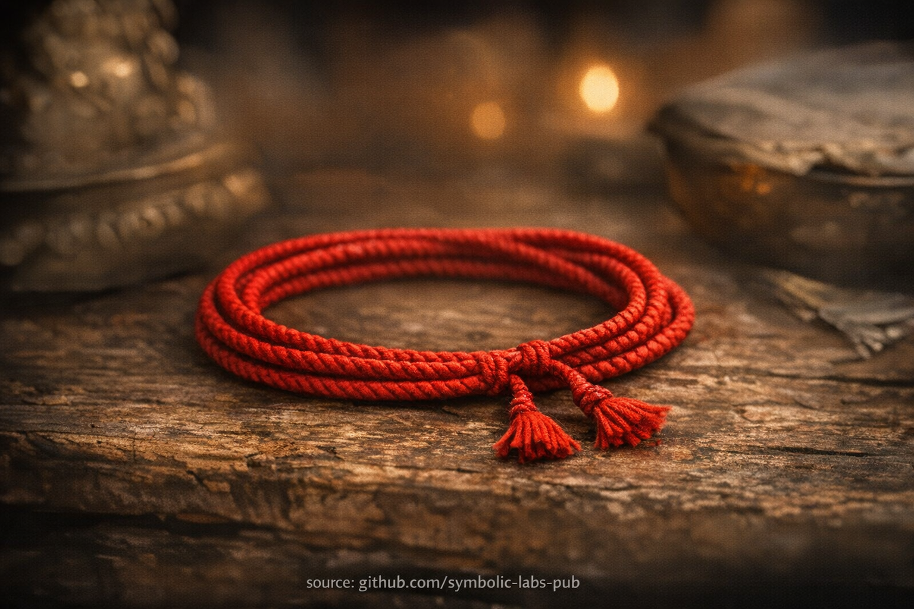

## [Požehnávacia šnúra (Ochranná šnúra) — Buddhistický význam](https://github.com/symbolic-labs-pub/a-buddhist-view/blob/master/more/09_symbols/01_blessing_cord/README.md#blessing-cord-protection-cord--buddhist-meaning)

---

### 1. Čo to *skutočne* je (doktrín

árne)

Požehnávacia šnúra je **fyzická podpora pre úmysel a spomienku**, nie autonómny ochranný objekt.

V buddhistických pojmoch funguje ako **vonkajšia podmienka (*pratyaya*)**, ktorá podporuje **vnútorný mentálny stav**.

> Buddhizmus nikdy neučí ochranu iba cez objekty.
> Ochrana vzniká z **mysle zladených s [Dharmou](../../01_core_teachings/the_three_jewels/README.md#2-dharma--the-path-and-the-law-of-reality)**.

---

### 2. Prečo môže "chrániť" — bez mágie

Z buddhistického kauzálneho pohľadu:

* ***Karma* je formovaná úmyslom**
* **Úmysel je stabilizovaný spomienkou**
* **Spomienka je podporovaná symbolmi**

Šnúra funguje, pretože **podmieňuje myseľ**:

* Pripomína praktikujúcemu:

  * Útočisko v Buddhovi, Dharme, Sanghe
  * Záväzky (sľuby, *samaya*, etická orientácia)
  * Spojenie s líniou (učiteľ → študent → realizácia)

Toto vytvára **karmické momentum smerom k jasnosti a zdrženlivosti**, čo *znižuje vystavenie škodlivým skutkom a stavom*.

Toto zníženie je to, čo ľudia zažívajú ako "ochranu".

---

### 3. Požehnanie línie — čo to skutočne znamená

Vo [Vajrayāna](../../05_yanas/README.md#4-vajrayāna-tantrayāna-mantrayāna---the-diamond-vehicle), **požehnanie (*adhiṣṭhāna*)** nie je prenos energie ako elektriny.

Znamená to:

* Myseľ praktikujúceho je **dočasne zladená** s:

  * Úmyslom realizovaného učiteľa
  * Stabilnou tradíciou praxe
* Toto zladenie robí **zdravé mentálne stavy viac prístupnými**

Šnúra symbolizuje a stabilizuje toto zladenie.

> Požehnanie nie je niečo pridané.
> Je to niečo **odkryté, keď odpor poklesne**.

---

### 4. Prečo sa nosí nenápadne

Toto sleduje základnú buddhistickú [etiku](../../01_core_teachings/the_noble_eightfold_path/README.md#2-ethical-conduct-śīla):

* **Žiadne vystavovanie duchovnej identity**
* **Žiadne posilňovanie ega**
* **Žiadna zámena symbolu s realizáciou**

Ak je vystavovaná, objekt posilňuje **sebaobraz**, čo je *kontraproduktívne*.

Preto:

* Nosená pod oblečením
* Nekasálne diskutovaná
* Nenosená ako šperk

Toto chráni *prax*, nie šnúru.

---

### 5. Prečo by nemala byť ľahkovážne odstránená

Nie preto, že odstránenie je nebezpečné — ale pretože **ľahkovážnosť oslabuje úmysel**.

V buddhizme:

* Opakované zámerné skutky podmieňujú myseľ
* Ľahkovážne zaobchádzanie trénuje ľahkovážny záväzok

Ponechanie šnúry kultivuje:

* Kontinuitu
* Úctu
* Stabilitu orientácie

Toto sú **[meditačné](../../08_lineage/README.md) cnosti**, nie rituálne tabu.

---

### 6. Čo *nerobí*

Podľa buddhistického učenia šnúra **nerobí**:

* Nezruší *karmu*
* Nechráni pred dôsledkami škodlivých skutkov
* Nenahrádza etiku, meditáciu alebo [múdrosť](../../01_core_teachings/the_noble_eightfold_path/README.md#1-wisdom-paññā)
* Nefunguje bez účasti praktikujúceho

Škodlivá myseľ nosící šnúru je stále škodlivá myseľ.

---

### 7. Hlboká štrukturálna rola (často prehliadaná)

Na úrovni systémov požehnávacia šnúra pôsobí ako:

* **Kognitívna kotva**
* **Somatická pripomienka**
* **Hraničný marker medzi návykovým a zámerným životom**

Preto sa podobné podpory objavujú naprieč tradíciami:

* Mníšske rúcha
* [Modlitebné korálky (*mālā*)](../06_mala/README.md#mala-prayer-beads--explained-according-to-buddhist-teachings)
* Šály na poklony (*khaṭa*)

Všetky slúžia tej istej funkcii:
**udržať myseľ orientovanú smerom k [prebudeniu](../../10_concepts/README.md#3-enlightenment-bodhi-awakening) uprostred obyčajného života**.

---

### 8. Konečné buddhistické zhrnutie

> Požehnávacia šnúra nechráni telo.
> Chráni **pozornosť**.
>
> Pozornosť chráni **úmysel**.
>
> Úmysel formuje ***karmu***.
>
> *Karma* určuje **skúsenosť**.

Správne používaná, šnúra nie je povera —
je to **prenosná [všímavosť](../../01_core_teachings/the_noble_eightfold_path/README.md#7-right-mindfulness-sammā-sati) zakódovaná ako forma**.

---

< [Biela Tārā (Sitatārā) — Matka dlhovekosti a súcitu](../../08_lineage/README.md) | [Dorje (Vajra) — vysvetlené podľa buddhistických učení](../02_dorje/README.md) >

_zdroj: [github.com/symbolic-labs-pub](https://github.com/symbolic-labs-pub)_

---
