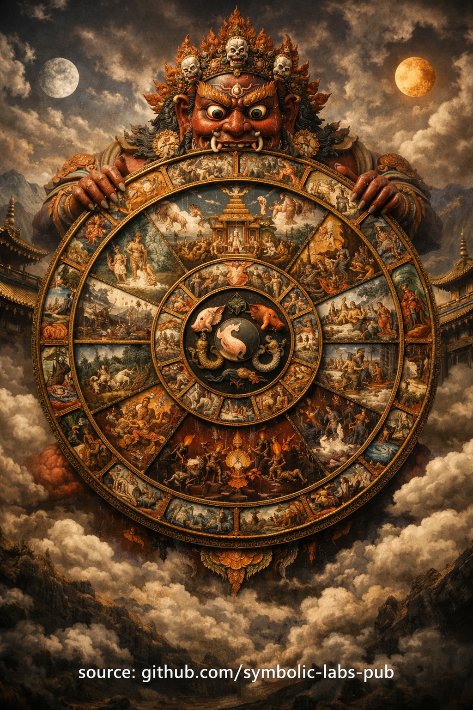

## [Tretia prax Ngöndro](https://github.com/symbolic-labs-pub/a-buddhist-view/blob/master/more/11_ngondro/3_mandala_offering/README.md#the-third-ngöndro-practice)

### **Mandala obetovanie (Obetovanie vesmíru)**

Na ceste [Vajrayāna](../../05_yanas/README.md#4-vajrayāna-tantrayāna-mantrayāna---the-diamond-vehicle) — najmä v rámci **školy Kagyü** — je **tretia prax Ngöndro** **[Mandala](../../09_symbols/07_mandala/README.md#mandala--explained-according-to-buddhist-teachings) obetovanie**.
Jej funkcia je presná a štrukturálna: **rozmontovať pripútanosť v jej koreni a nahradiť identitu založenú na nedostatku osvietenou hojnosťou**.

Táto prax trénuje myseľ **vzdať sa samotného vlastníctva**, nie len majetku.

---

## 1. Čo sa obetuje?

V *Mandala* obetovaní praktikujúci symbolicky obetuje **celý vesmír** — nie ako metaforu, ale ako **kognitívne preprogramovacie cvičenie**.

Klasicky *mandala* reprezentuje:

* **Horu Meru** (os kozmu)
* **Štyri kontinenty**
* **Slnko a mesiac**
* Všetko **bohatstvo, krásu, moc, čas a kapacitu**
* Nakoniec: **vlastné telo, reč, myseľ a karmickú históriu**

Nič nie je vylúčené.

Preto sa *mandala* nazýva **totálne obetovanie** — nenecháva žiadne útočisko pre ego.

---

## 2. Prečo je táto prax nevyhnutná

Z hlbokého budhistického pohľadu **[utrpenie](../../02_from_ignorance_to_awakening/2_the_four_noble_truths/README.md#1-there-is-suffering--dukkha) sa udržiava jemným vlastníctvom**, dokonca duchovným vlastníctvom:

* "Môj" pokrok
* "Moja" prax
* "Moje" utrpenie
* "Moje" [prebudenie](../../10_concepts/README.md#3-enlightenment-bodhi-awakening)

*Mandala* obetovanie priamo útočí na túto štruktúru.

Trénuje:

* **Ne-vlastníctvo bez nihilizmu**
* **Hojnosť bez uchopenia**
* **Oddanosť bez podrobenia sa**
* **Veľkodušnosť bez sebaztraty**

Toto nie je charita.
Je to **de-identifikácia z kontroly**.

---

## 3. Základný psychologický mechanizmus

Prax funguje prostredníctvom **opakovaného symbolického vzdania sa**.

Každý cyklus obetov:

1. Myseľ **konštruuje kompletný svet**
2. Ten svet je **úplne odovzdaný**
3. Myseľ prežíva intaktná
4. Ilúzia straty slabne

Časom:

* Strach z dávania sa rozpúšťa
* Naratívy nedostatku kolabujú
* Dôvera v realitu sa zvyšuje
* Oddanosť sa stáva bez námahy

Toto je **neuro-symbolický pretréning** používajúci posvätný geometriu.

---

## 4. Vzťah ku karme (príčina a účinok)

Tretia Ngöndro nasleduje **Karmu (Príčina a účinok)** zámerne.

Po rozpoznaní:

> "Každý skutok má dôsledok"

Praktikujúci sa učí:

> "Pripútanosť sama je skutok — s dôsledkami."

*Mandala* obetovanie transformuje *karmu* tým, že:

* Ukončuje **hromadiace správanie**
* Zmäkčuje **stratégie kontroly budúcnosti**
* Uvoľňuje **duchovnosť založenú na odmene**

Vytvára karmickú podmienku pre **neobmedzený vhľad**.

---

## 5. Oddanosť bez externalizácie

V chápaní Kagyü sa *mandala* obetuje:

* [**Trom klenotom**](../../01_core_teachings/the_three_jewels/README.md#the-three-jewels-triple-gem--ti-ratana)
* **Koreňovému guru**
* **Línii**
* Nakoniec **samotnej prebudenej mysli**

Toto sa vyhýba bežnej chybe:

> Oddanosť nie je smerovaná *von* — kolabuje ilúziu "vonku".

Obetovanie sa vracia ako **rozpoznanie**, nie odmena.

---

## 6. Prečo pripravuje na Guru jógu

[Guru jóga](../4_guru_yoga/README.md#samsāra's-unsatisfactoriness-→-guru-yoga) (štvrtá Ngöndro) vyžaduje:

* Dôveru bez závislosti
* Otvorenosť bez sebamazania
* Oddanosť bez projekcie

*Mandala* obetovanie to umožňuje tým, že:

* Odstraňuje **transakčnú mentalitu**
* Ukončuje "Dávam, aby som dostal"
* Ustanovuje **čistú receptivitu**

Bez tejto praxe sa Guru jóga ľahko stáva psychologickou závislosťou.

---

## 7. Jednoveté zhrnutie

***Mandala* obetovanie trénuje praktikujúceho zažiť totálnu hojnosť bez vlastníctva — aby realizácia mohla vzniknúť bez prekážok.**

---

## Štrukturálny vhľad (pokročilé)

Predstavte si *Mandala* obetovanie ako:

* **Rekurzívny garbage collector pre ego**
* **Reset distribuovaného systému** pre identitu
* **Symbolický kompresný algoritmus**, ktorý odstraňuje overhead pripútanosti

Nič nie je zničené.
Iba **falošné nároky na vlastníctvo** sú uvoľnené.

---

< [2. Vajrasattva — Očistenie zaclonení](../2_purification/README.md) | [Štvrtá prax Ngöndro](../4_guru_yoga/README.md) >

_zdroj: [github.com/symbolic-labs-pub](https://github.com/symbolic-labs-pub)_

---
