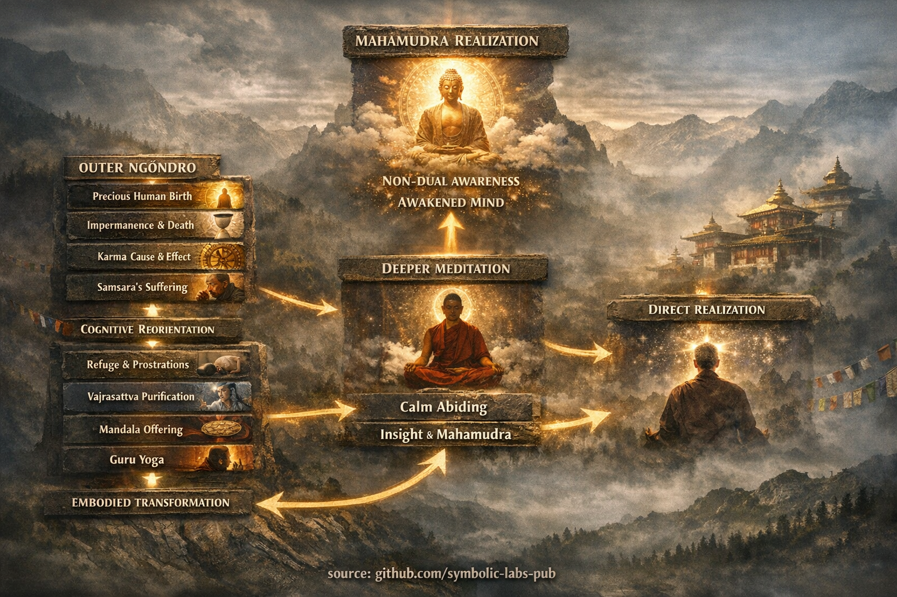

# [Prípravné praktiky (Ngöndro)](https://github.com/symbolic-labs-pub/a-buddhist-view/blob/master/more/11_ngondro/README.md#the-preliminary-practices-ngöndro)

> V tomto bode ste dospeli k vážnemu učeniu, vyžadujúcemu veľa praxe. Ak uvažujete o pokračovaní s prípravnými praktikami a ešte ste nekontaktovali miestne budhistické centrum alebo komunitu, urobte to teraz.
>
> *Sangha* je tu nevyhnutná, učte sa od nich, spolu s nimi, ako praktizovať Ngöndro. Necieľte na čísla ako 100 000+, to je pre mníchov, cieľte na niečo rozumné vo vašom živote.
>
> Pre tých, ktorí začínajú túto prax, je vysoko odporúčané prijať formálny prenos čítania (*lung*) a konkrétne inštrukcie od kvalifikovaného učiteľa.

## Čo je **Ngöndro** v Mahāyāna buddhizme?

**Ngöndro** (tibetsky: *sngon 'gro*, "to, čo ide predtým") je **základná tréningová cesta** používaná primárne v tibetskej Mahāyāne — najmä v rámci línií [Vajrayāna](../05_yanas/README.md#4-vajrayāna-tantrayāna-mantrayāna---the-diamond-vehicle) — na **prípravu prúdu mysle** pre hlbšiu [meditáciu](../08_lineage/README.md), ako je [Mahāmudrā](../04_kayas/mahamudra_and_dzogcsen/README.md#mahāmudrā-nature-of-mind-སེམས་ཀྱི་གནས་ལུགས་) alebo [Dzogchen](../04_kayas/mahamudra_and_dzogcsen/README.md#dzogchen-rigpa-རིག་པ་---direct-introduction).

Nie je prípravná v zmysle "základná" alebo "voliteľná."
Ngöndro je **štrukturálne podmieňovanie**: preprogramuje motiváciu, vnímanie a návykové vzorce tak, aby vyššie učenia mohli skutočne fungovať.

---

## 1. Kde Ngöndro zapadá do Mahāyāny

V klasických pojmoch Mahāyāny Ngöndro integruje:

* **Zrieknutie sa** → sloboda od kompulzívneho uchopenia
* **Bodhičittu** → [prebudenie](../10_concepts/README.md#3-enlightenment-bodhi-awakening) *v prospech všetkých bytostí*
* **Śūnyatā ([prázdnota](../10_concepts/01_emptiness/README.md#emptiness-śūnyatā-in-vajrayāna-buddhism))** → nereifikovaná [múdrosť](../01_core_teachings/the_noble_eightfold_path/README.md#1-wisdom-paññā)
* **Upāya (zručné prostriedky)** → stelesnené, opakovateľné metódy

Tibetské línie toto systematizovali do **presného psycho-duchovného kurikula**, zachovaného najsilnejšie v tradíciách školy Kagyü a Nyingma.

---

## 2. Dve vrstvy Ngöndro

### A. **Vonkajšie Ngöndro** – Kognitívna reorientácia

Tieto kontemplácie prekalibrujú *ako sa realita oceňuje*:

1. **Vzácny ľudský zrod**
   [Vedomie](../10_concepts/README.md#2-awareness-rigpa-vijñāna-knowing) príležitosti, nie nároku.

2. **[Nepermanentnosť](../01_core_teachings/impermanence/README.md#2-impermanence-anicca-is-structural-not-accidental) a smrť**
   Naliehavosť bez paniky; jasnosť bez nihilizmu.

3. **Karma (príčina a účinok)**
   Etická presnosť nahrádza magické myslenie.

4. **[Neuspokojivosť](../02_from_ignorance_to_awakening/2_the_four_noble_truths/README.md#1-there-is-suffering--dukkha) *samsāry***
   Úprimné rozpoznanie, že cyklická existencia nemôže byť optimalizovaná na oslobodenie.

👉 Funkcia: prelomenie popierania, sebauspokojenia a duchovného konzumerizmu.

---

### B. **Vnútorné Ngöndro** – Stelesnená transformácia

Toto sú **kvantifikované praktiky** (často 100 000+ opakovaní), nie symbolické gestá.

1. [**Útočisko a poklony**](1_prostrations/README.md#the-first-ngöndro-practice)

   * Telo podriaďuje ego
   * Reč zlaďuje úmysel
   * Myseľ znovu zakotvuje dôveru
     → Rozkladá pýchu a sebareferencialitu

2. [**Očistenie Vajrasattvy**](2_purification/README.md#2-vajrasattva--purification-of-obscurations)

   * Očisťuje zaclonenia cez vedomie + ľútosť + rozhodnutie
   * Nie morálna vina, ale **kauzálna hygiena**

3. [**Mandala obetovanie**](3_mandala_offering/README.md#the-third-ngöndro-practice)

   * Systematické vzdanie sa pripútanosti
   * Trénuje hojnosť *bez vlastníctva*

4. [**Guru jóga**](4_guru_yoga/README.md#the-fourth-ngöndro-practice)

   * Oddanosť prebudenej mysli ako *rozpoznateľnej v sebe samom*
   * Kolabuje falošné rozdelenie medzi "učiteľom" a "prirodzenosťou mysle"

👉 Funkcia: prepíše hlboké somatické a pozornostné vzorce, ktoré samotný vhľad nemôže dosiahnuť.

---

## 3. Prečo je Ngöndro nevyhnutné (nie voliteľné)

Z perspektívy systémov:

* **Vhľad bez prípravy** → nestabilita
* **[Súcit](../02_from_ignorance_to_awakening/7_compassion/README.md#compassion-as-a-structural-principle-in-buddhist-teaching) bez štruktúry** → vyhorenie
* **Prázdnota bez [etiky](../01_core_teachings/the_noble_eightfold_path/README.md#2-ethical-conduct-śīla)** → nihilizmus

Ngöndro toto rieši tým, že:

* Synchronizuje **telo–reč–myseľ**
* Konvertuje ideály na **trénované reflexy**
* Robí prebudenie **spoľahlivým**, nie epizodickým

Mnoho realizovaných majstrov dokončilo Ngöndro **viackrát** — nie preto, že neboli osvietení, ale pretože Ngöndro *udržiava koherenciu*.

---

## 4. Moderná analógia (inžiniersky pohľad)

Predstavte si Ngöndro ako:

* **Flashovanie firmvéru** pred spustením pokročilých modelov
* **Normalizáciu dát** pred vysokorozmerným učením
* **Predtrénovanie**, ktoré zabraňuje katastrofickému preladeniu na vzorce ega

Preskočiť ho je ako nasadiť výkonný optimalizátor na poškodené dáta.

---

## 5. Čo Ngöndro *nie je*

* ❌ Nie je to povera
* ❌ Nie je to slepý rituál
* ❌ Nie je to kultúrna dekorácia

✔ Je to **kognitívna architektúra + regulácia afektov + etické zladenie**, vycibrené počas storočí.

---

## 6. Kľúčový vhľad

> **Ngöndro je už prebudenie —
> len praktizované, kým sa nestane nezvratným.**

---

< [Štvrtá prax Ngöndro](4_guru_yoga/README.md) | [Často kladené otázky](../80_faq/README.md) >

_zdroj: [github.com/symbolic-labs-pub](https://github.com/symbolic-labs-pub)_

---
