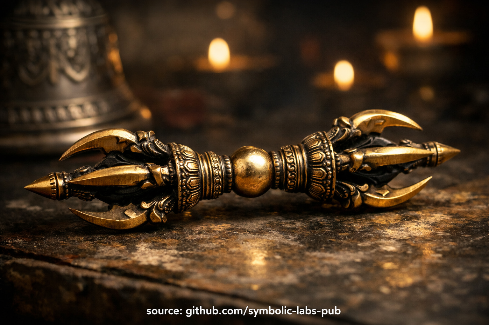

## [*Ḍorje* (*Vajra*) — razloženo po budističnih naukih](https://github.com/symbolic-labs-pub/a-buddhist-view/blob/master/more/09_symbols/02_dorje/README.md#dorje-vajra--explained-according-to-buddhist-teachings)

---

V budizmu [*Vajrayāne*](../../05_yanas/README.md#4-vajrayāna-tantrayāna-mantrayāna---the-diamond-vehicle), ***ḍorje*** (sanskrt: *vajra*) ni simbol v okrasnem smislu—je **natančen nauk kodiran v obliki**. Kaže neposredno na to, kako deluje prebujen um.

---

### 1. Neuničljiva jasnost

*Vajra* pomeni **to, kar ne more biti uničeno**.

V budističnih pojmih se to nanaša na **prebujeno [zavedanje](../../10_concepts/README.md#2-awareness-rigpa-vijñāna-knowing)** (*rigpa* / *prajñā*), ki:

* Ni proizvedeno s prakso
* Ni poškodovano s čustvi, mislimi ali nevednostjo
* Ni izboljšano s kreposto niti ponižano z napako

Kot diamant reže vse, vendar ga nič ne more rezati, **jasnost prereže zmedenost, ne da bi se sama spremenila**.

> Zabloda je odstranljiva.
> Zavedanje ni.

Zato *vajra* predstavlja **ultimativno samozavest** namesto vere.

---

### 2. Združitev metode in modrosti

*Vajra* je skoraj vedno sparjena z **zvonom (*ghanta*)**:

* ***Vajra* (desna roka)** → *metoda, [sočutje](../../02_from_ignorance_to_awakening/7_compassion/README.md#compassion-as-a-structural-principle-in-buddhist-teaching), spretne metode*
* **Zvon (leva roka)** → *[modrost](../../01_core_teachings/the_noble_eightfold_path/README.md#1-wisdom-paññā), [praznina](../../10_concepts/01_emptiness/README.md#emptiness-śūnyatā-in-vajrayāna-buddhism), vpogled*

Ta paritev izraža osrednji princip [*Mahāyāne*](../../05_yanas/README.md#limitation-from-mahāyāna-view) in *Vajrayāne*:

> Sočutje brez modrosti postane navezanost.
> Modrost brez sočutja postane hladna in odmaknjena.

[Prebujanje](../../10_concepts/README.md#3-enlightenment-bodhi-awakening) zahteva **obe hkrati**, ne izmenično.

*Vajra* sama bi bila moč brez odprtosti.
Zvon sam bi bil vpogled brez utelešenja.

---

### 3. Struktura pet-krake *vajre*

V pet-kraki *vajri* (najpogostejša oblika):

* **Osrednja krogla** predstavlja *śūnyatā* (praznino)
* **Pet krakov** predstavlja:

  * **Pet modrosti**
  * Transformacijo **petih strupov** (jeza, želja, nevednost, ponos, ljubosumje)
  * Integracijo vseh vidikov izkušnje na pot

Kraki se ukrivijo navznoter, učijo, da se **fenomeni vračajo v svojo lastno prazno jasnost** namesto da bi bili zavrnjeni.

Nič ni zavrženo. Vse je integrirano.

---

### 4. Zakaj je držan v desni roki

V ritualu in [meditaciji](../../08_lineage/README.md):

* *Vajra* je držan trdno, ampak brez napetosti
* Se ne maha teatralno
* Se ne uporablja za "pošiljanje moči"

To trenira praktikanta utelešiti **neomajen prisotnost**:

* Stabilen v kaosu
* Natančen brez agresije
* Močan brez ega

*Ḍorje* uči **samozavest brez rigidnosti**.

---

### 5. Ni talisman, ni magija

Iz budistične perspective *vajra* **ne stori ničesar sama**.

Njena funkcija je:

* **Spomniti telo** na prebujeno držo
* **Uskladiti namero** s pogledom
* **Zasidrati zavedanje** med ritualom in meditacijo

Zaščita ne prihaja iz predmeta, ampak iz **prepoznanja resničnosti**.

Zmedenost izgine, ker je jasno videna—ne ker je napadena.

---

### 6. Notranji pomen

Končno *ḍorje* kaže navznoter:

> Tvoje zavedanje je že podobno *vajri*.
> Praksa ga ne ustvarja—
> praksa odstrani, kar ga skriva.

Zato *Vajrayāna* poudarja **prepoznanje pred kopičenjem**.

---

### V enem stavku

*Ḍorje* uči, da je **prebujanje neuničljiva jasnost—sočutna, natančna in neomajena s zmedenostjo—že prisotna znotraj lastnega zavedanja**.

---

< [*Mālā*](../10_mala/README.md) | [*Kapāla*](../13_kapala/README.md) >

_vir: [github.com/symbolic-labs-pub](https://github.com/symbolic-labs-pub)_

---
