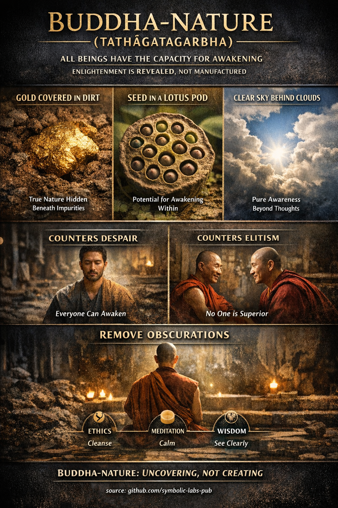

## [**Природа Буде (Tathāgatagarbha)** — објашњено кроз будистичка учења](https://github.com/symbolic-labs-pub/a-buddhist-view/blob/master/more/02_from_ignorance_to_awakening/6_buddha_nature/README.md#buddha-nature-tathāgatagarbha--explained-through-buddhist-teachings)

### Шта учење заиста каже

**Природа Буде** (*Sanskrit: Tathāgatagarbha, "материца/ембрион Буде"*) учи да **сва осетљива бића поседују урођени капацитет да се пробуде**.
Ово **не** значи да је свако већ просветљен у конвенционалном смислу. То значи да су **услови за [просветљење](../../10_concepts/README.md#3-enlightenment-bodhi-awakening) већ присутни**, чак и ако су затамњени.

У класичном [Mahāyāna](../../05_yanas/README.md#limitation-from-mahāyāna-view) језику:

> Буђење се не *ствара* — оно се *открива*.

Ово учење се најјасније појављује у Mahāyāna сутрама као што су **Tathāgatagarbha Sūtra**, **Śrīmālādevī Siṃhanāda Sūtra**, и касније коментарске традиције као **Mahāparinirvāṇa Sūtra**.

---

### Шта Природа Буде **није**

Критично појашњење у ортодоксној будистичкој интерпретацији:

* ❌ **Није душа (ātman)**
* ❌ **Није вечно ја**
* ❌ **Није метафизичка супстанца**

Да је то фиксно ја, противречило би **[не-ја (anattā)](../1_the_three_marks_of_existence/README.md#3-не-ја-anattā)** и **празнини (śūnyatā)**.

Уместо тога, Природу Буде најбоље је разумети као:

> **Празнину ума која омогућава буђење**

Другим речима:
Зато што ум **није фиксан**, **није инхерентно оскрнављен**, и **није у власништву**, он може се пробудити.

---

### Зашто су метафоре важне

Класичне метафоре које сте навели нису поетски додаци — оне су **прецизни алати** да спрече неразумевање.

#### 🟡 *Злато прекривено прљавштином*

* Злато **никада није оштећено**
* Прљавштина је **привремена**, а не суштинска
* Чишћење не *ствара* злато — оно га **открива**

➡ Затамњења (похлепа, мржња, заблуда) су **привремени услови**, а не природа ума.

#### 🌱 *Семе унутар лотос махуне*

* [Лотос](../../09_symbols/08_lotus/README.md#the-lotus-in-buddhist-teaching) расте из муља
* Семе већ садржи *облик* цвета
* Услови (вода, светлост, време) су потребни

➡ Пракса је **неопходна**, али ради тако што **дозвољава сазревање**, а не измишљањем.

#### ☁️ *Чисто небо иза облака*

* Облаци се померају, небо не
* Небо се не "побољшава" када се облаци разилазе
* Видљивост се мења, а не суштина

➡ Мисли и емоције затамњују [свесност](../../10_concepts/README.md#2-awareness-rigpa-vijñāna-knowing), али **је не дефинишу**.

---

### Како ово одговара празнини (Śūnyatā)

На први поглед, Природа Буде може звучати као контрадикција [празнини](../../10_concepts/01_emptiness/README.md#emptiness-śūnyatā-in-vajrayāna-buddhism). Историјски, ово је изазвало реалне дебате.

Решење које користе главне традиције:

* **Празнина** описује **одсуство урођене егзистенције**
* **Природа Буде** описује **одсуство урођене опструкције**

> Зато што је ум празан од фиксне суштине, он је способан за буђење.

Zen и Madhyamaka често ово пажљиво формулишу:

> Природа Буде је **празнина искушена без страха**.

---

### Зашто ово учење постоји (његова функција)

Природа Буде је **педагошки лек**, прописан за специфичне опасности:

#### 1. Супротстављање очају

Без овог учења, практичари могу закључити:

* "Превише сам сломљен"
* "Мој ум је безнадежан"
* "Просветљење је за монахе, свеце или елите"

Природа Буде директно побија ово.

#### 2. Супротстављање духовном елитизму

Истовремено, то спречава:

* Тврдње о урођеној супериорности
* Арогантност линије преношења
* "Изабране" практичаре

Ако **сви имају Природу Буде**, нико не поседује буђење.

#### 3. Подржавање саосећања

Ако сва бића имају капацитет да се пробуде, онда:

* Ниједно биће није непотребно
* Ниједно биће није суштински зло
* [Саосећање](../7_compassion/README.md#саосећање-као-структурни-принцип-у-будистичком-учењу) постаје рационално, а не сентиментално

---

### Како пракса се односи на Природу Буде

Пракса није о *додавању* чистоте — она је о **уклањању затамњења**.

| Пракса             | Функција                          |
| -------------------- | --------------------------------- |
| [Етика (śīla)](../../01_core_teachings/the_noble_eightfold_path/README.md#2-етичко-понашање-śīla)        | Стабилизује услове             |
| [Медитација ([samādhi](../../08_lineage/README.md))](../../03_the_path_to_end_suffering/README.md#right-action) | Смирује затамњујућу турбуленцију        |
| [Мудрост (prajñā)](../../01_core_teachings/the_noble_eightfold_path/README.md#1-мудрост-paññā)      | Види кроз лажну идентификацију |

Зато многе традиције кажу:

> Пут не води *до* Природе Буде —
> он води *од забуне до препознавања*.

---

### Концизан доктринарни резиме

* Природа Буде потврђује **универзалну пробудивост**
* Она **не** поново уводи ја
* Она хармонише са празнином када се правилно разуме
* Спречава нихилизам *и* арогантност
* Преоквирује праксу као **откровење а не конструкцију**

> Не постајете нешто ново.
> Престајете погрешно себе схватати као нешто мање.

---

< [Две истине у будистичком учењу](../5_the_two_truths/README.md) | [1. Мудрост и саосећање су функционално неодвојиви](../7_compassion/README.md) >

_извор: [github.com/symbolic-labs-pub](https://github.com/symbolic-labs-pub)_

---
