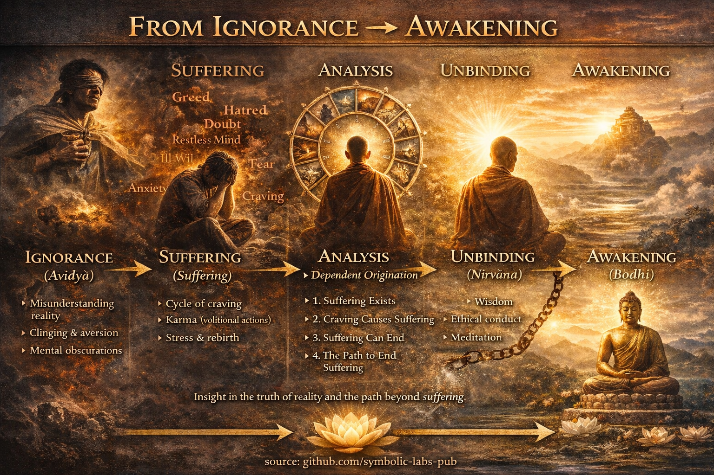

## 1. Три обележја егзистенције

Сви условљени феномени деле три карактеристике:

1. **[Непостојаност (Anicca)](../01_core_teachings/impermanence/README.md#2-непостојаност-anicca-је-структурна-а-не-случајна)**
   Све што настаје пролази.

2. **Незадовољавајућност ([Dukkha](2_the_four_noble_truths/README.md#1-постоји-патња--dukkha))**
   Везивање за непостојане ствари неизбежно разочарава.

3. **[Не-ја (Anattā)](1_the_three_marks_of_existence/README.md#3-не-ја-anattā)**
   Никакво трајно, независно "ја" не може се пронаћи у телу или уму.

> Ово је **онтолошка сржица** будизма.
> Пропустите било које од троје → следи неразумевање.

---

## 2. Четири племените истине

*(Дијагностички оквир)*

1. **Постоји патња** (dukkha постоји)
2. **Патња има узроке** (жудња, незнање)
3. **Патња може престати** (nirvāṇa је могућа)
4. **Постоји пут који води до њеног престанка** ([Осмоструки пут](../01_core_teachings/the_noble_eightfold_path/README.md#шта-је-племенити-осмоструки-пут-у-будизму))

Замислите ово као:

* **Симптом**
* **Узрок**
* **Прогноза**
* **Лечење**

Будизам је радикално *терапеутски*, а не метафизичка спекулација.

---

## 3. Зависно настајање (Paṭicca-samuppāda)

*(Дубоки узрочни мотор стварности)*

Ништа не постоји независно. Све настаје **зато што услови то дозвољавају**.

Класична формулација: **12 повезаних процеса**, почев од незнања а завршавајући патњом.

Кључни увид:

* Уклоните или ослабите услове → ефекат се урушава
* Нема првог узрока
* Нема изолованог ентитета

> Ово учење тихо уништава:
>
> * Етернализам ("ствари постоје заувек")
> * Нихилизам ("ништа није важно")

---

## 4. Празнина (Śūnyatā) — *Често погрешно схваћена као "тајна"*

**[Празнина](../10_concepts/01_emptiness/README.md#emptiness-śūnyatā-in-vajrayāna-buddhism) НЕ значи да ништа не постоји.**

То значи:

* Ствари немају **урођену, независну суштину**
* Све постоји **релационо**

Класична формула:

> "Облик је празнина; празнина је облик."

Ово није филозофија—то је **перцептуална реконфигурација**.

Зашто се учи касније:

* Без [етике](../01_core_teachings/the_noble_eightfold_path/README.md#2-етичко-понашање-śīla) и саосећања, празнина може бити погрешно схваћена као нихилизам.
* Са зрелошћу, она производи **неустрашивост и флексибилност**.

---

## [5. Две истине](5_the_two_truths/README.md)

* [**Конвенционална истина**](5_the_two_truths/README.md#две-истине-у-будистичком-учењу)
  Свакодневни свет: људи, правила, одговорности.

* **Крајња истина**
  Празнина, непостојаност, не-ја.

[Буђење](../10_concepts/README.md#3-enlightenment-bodhi-awakening) **није бекство од конвенције**, већ **деловање унутар ње без заблуде**.

> Просветљени још увек плаћају порезе и перу посуђе.

---

## 6. Природа Буде (Tathāgatagarbha)

Учење:

* Сва бића поседују **капацитет за буђење**
* Просветљење се **открива**, а не производи

Метафоре:

* Злато прекривено прљавштином
* Семе унутар [лотоса](../09_symbols/08_lotus/README.md#the-lotus-in-buddhist-teaching) махуне
* Чисто небо иза облака

Ово се супротставља очају и духовном елитизму.

---

## 7. Саосећање као структурни принцип

*(Није опционо)*

[Мудрост](../01_core_teachings/the_noble_eightfold_path/README.md#1-мудрост-paññā) без [саосећања](7_compassion/README.md#саосећање-као-структурни-принцип-у-будистичком-учењу) = хладна одвојеност
Саосећање без мудрости = сагоревање

Напредни увид **се природно изражава као саосећање**, јер:

* Границе ја/други омекшавају
* Штета се види као вођена незнањем

Зато [Mahāyāna](../05_yanas/README.md#limitation-from-mahāyāna-view) наглашава **идеал [Bodhisattva](../08_lineage/08_bodhisattva/README.md#4-the-bodhisattva-vow-as-structural-alignment)**:

> "Будим се *са* свим бићима."

---

## 8. Постоје ли "тајна учења"?

**Ниједна скривена истина се не крије.**
Али *постоје* учења која су:

* Зависна од контекста
* Зависна од праксе
* Лако погрешно схваћена без припреме

Примери:

* Празнина
* Не-дуалност
* Одређене тантричке визуализације ([Vajrayāna](../05_yanas/README.md#4-vajrayāna-tantrayāna-mantrayāna---the-diamond-vehicle))

Ово нису тајне—то су **високопропусна упутства** која захтевају:

* Етичку стабилност
* [Концентрацију](../01_core_teachings/the_noble_eightfold_path/README.md#8-права-концентрација-sammā-samādhi)
* Вођење

> Као давање приручника за млазни мотор некоме ко још није научио механику.

---

## Синтеза у једној реченици

**Будизам је прецизан систем за елиминисање непотребне патње кроз јасно виђење стварности, етичко деловање и неговање саосећања—без везивања за фиксне идентитете или метафизичке апсолуте.**

---

< [1. Мудрост и саосећање су функционално неодвојиви](7_compassion/README.md) | [Шта "окончање патње" заиста значи](../03_the_path_to_end_suffering/README.md) >

_извор: [github.com/symbolic-labs-pub](https://github.com/symbolic-labs-pub)_

---
