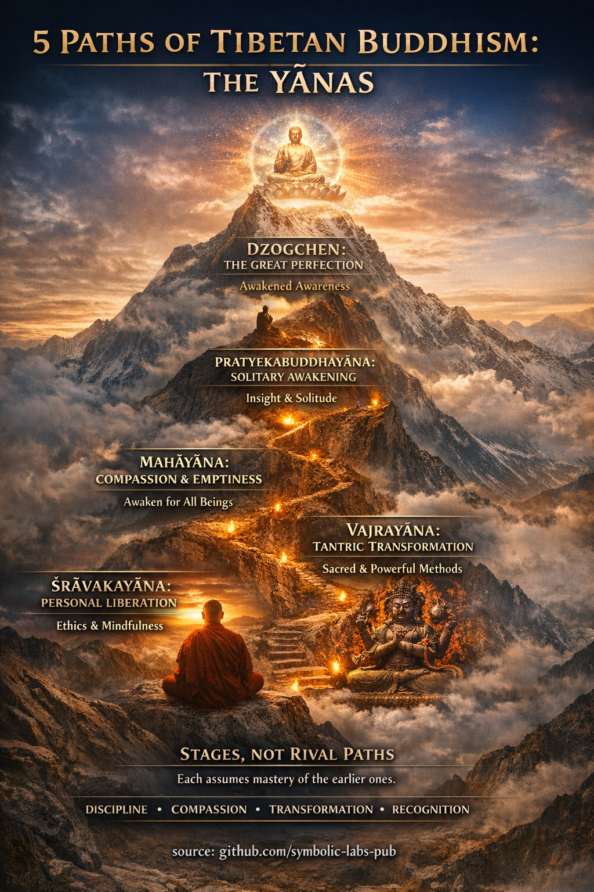

## [Шта је Yāna?](https://github.com/symbolic-labs-pub/a-buddhist-view/blob/master/more/05_yanas/README.md#what-is-a-yāna)

Учење

## Учење о возилима пута

*(Yānas као један живи начин)*

Сва бића траже слободу од [страдања](../02_from_ignorance_to_awakening/2_the_four_noble_truths/README.md#1-there-is-suffering--dukkha).
Ипак, бића се разликују по способности, условљености, страху, храбрости и визији.
Из саосећања, Буда није учио један круто одређен пут, већ **возила**—начине путовања—свако потпуно, свако важеће, свако прилагођено тренутку у развоју.

Ова возила нису ривали.
Она су **фазе сазревања** у једном који се разоткрива путовању.

---

### Први темељ — дисциплина и одрицање

*(Śrāvakayāna)*

Прво, учи се да се престане наносити штета.

Видевши да је живот обележен незадовољством, окреће се унутра и почиње обуздавати тело, говор и ум. [Етика](../01_core_teachings/the_noble_eightfold_path/README.md#2-ethical-conduct-śīla) стабилизује пажњу. [Усмереност](../01_core_teachings/the_noble_eightfold_path/README.md#7-right-mindfulness-sammā-sati) открива [непостојаност](../01_core_teachings/impermanence/README.md#2-impermanence-anicca-is-structural-not-accidental). Увиђање олабављује идентификацију.

Ова фаза учи кључну истину:

> **Слобода почиње тиме што се више не храни страдање.**

Без овог темеља, више тежње се руше у духовну фантазију.

---

### Друго увиђање — усамљено буђење

*(Pratyekabuddhayāna)*

Нека бића се буде тихо.

Посматрањем како све ствари настају из услова и пролазе када се услови растворе, ум ослобађа своје хватање. Ово [буђење](../10_concepts/README.md#3-enlightenment-bodhi-awakening) не захтева доктрину, заједницу—само јасноћу.

Ипак увиђање само по себи се не окреће природно споља.

Стога је ово возило потпуно, али окренуто унутра.

---

### Велики преокрет — саосећајно буђење

*(Mahāyāna)*

Овде се пут шири.

Видевши да ниједно биће није одвојено, практичар генерише **bodhicitta**—завет да се пробуди ради свих. [Празнина](../10_concepts/01_emptiness/README.md#emptiness-śūnyatā-in-vajrayāna-buddhism) више није хладна анализа, већ основа [саосећања](../02_from_ignorance_to_awakening/7_compassion/README.md#compassion-as-a-structural-principle-in-buddhist-teaching). Пошто ништа не постоји независно, све има значај.

Ова реализација трансформише мотивацију:

> **Ослобођење које искључује друге је непотпуно.**

[Мудрост](../01_core_teachings/the_noble_eightfold_path/README.md#1-wisdom-paññā) и саосећање постају неодвојиви.

---

### Дијамантски метод — трансформација

*(Vajrayāna)*

Сада се пут убрзава.

Уместо напуштања емоције, перцепције и идентитета, **трансформишу** се. Гнев постаје јасноћа. Жеља постаје мудрост. Страх постаје енергија.

Практиковањем резултата као пута—виђењем себе и света као већ чистих—практичар скраћује растојање између збуњености и буђења.

Ипак ово возило захтева прецизност, понизност и вођење.
Моћ без заснованости постаје заблуда.

---

### Велико савршенство — препознавање

*(Dzogchen)*

На врху, ништа се не додаје.

Буђење се препознаје као већ присутно.
[Свест](../10_concepts/README.md#2-awareness-rigpa-vijñāna-knowing) одмара у себи—отворена, светла, непретворена.

Нема пута за ходање, ипак ништа није искључено.
Етика, саосећање и вешта средства настају спонтано, као сунчева светлост из сунца.

Ово није постигнуће, већ **сећање**.

---

### Један пут, многа врата

Ова возила нису лестве за бекство из света.
Она су начини **настањивања стварности без збуњености**.

Дисциплина рафинира тело.
Саосећање отвара срце.
Трансформација ослобађа перцепцију.
Препознавање ослобађа сам ум.

Када су интегрисани, формирају јединствену живу [Дхарму](../01_core_teachings/the_three_jewels/README.md#2-dharma--the-path-and-the-law-of-reality).

---

### Завршна упутства

Не питај, *"Које возило је највише?"*
Уместо тога питај:

> *Које квалитет ми недостаје управо сада?*

Негуј то.

Пут се разоткрива природно када се ништа суштинско не прескаче.

---

Објашњење

**Yāna** (санскрит: *возило*, тибетански: *theg pa*) значи:

> *Потпуна метода за кретање од збуњености ка буђењу.*

Свака yāna укључује:

* **поглед** (како се схвата стварност)
* **пракса** (како се дешава трансформација)
* **резултат** (шта значи ослобођење)

Разликују се **не по истини**, већ по **вештим средствима**, дубини и брзини.

---

## 1. Śrāvakayāna — *Возило слушаоца*

*(Често груписано под "Hīnayāna" у тибетанским текстовима)*

### Основни циљ

Лично ослобођење од страдања (*arhatship*).

### Кључна учења

* [Четири племените истине](../02_from_ignorance_to_awakening/2_the_four_noble_truths/README.md#the-four-noble-truths--as-the-buddha-meant-them)
* [Осмочлани пут](../01_core_teachings/the_noble_eightfold_path/README.md#what-the-noble-eightfold-path-is-in-buddhism)
* Непостојаност, страдање, [не-ја](../02_from_ignorance_to_awakening/1_the_three_marks_of_existence/README.md#3-non-self-anattā)

### Нагласак у пракси

* Етичка дисциплина (*śīla*)
* [Концентрација (*samādhi*)](../01_core_teachings/the_noble_eightfold_path/README.md#8-right-concentration-sammā-samādhi)
* [Аналитичко увиђање (*vipassanā*)](shikantaza_and_vipassana/README.md#shared-baseline-3-knobs-of-attention)

### Поглед на ја

Нема сталног ја, али **феномени се третирају као конвенционално стварни**.

### Резултат

Престанак страдања за себе.

> Тибетански текстови третирају ово не као инфериорно, већ као **темељно**.
> Без ове дисциплине, виша возила се руше у фантазију.

---

## 2. Pratyekabuddhayāna — *Возило усамљеног реализатора*

### Основни циљ

Само-буђење без ослањања на наставну заједницу.

### Кључне карактеристике

* Буђење кроз **директно увиђање у [зависно настајање](../02_from_ignorance_to_awakening/3_dependent_origination/README.md#the-twelve-links-the-classic-formulation)**
* Појављује се у ерама када се Дхарма не учи

### Нагласак у пракси

* Дубоко контемплирање узрочности
* Природна усамљеност

### Ограничење (из Mahāyāna погледа)

Мудрост без експлицитног учења о саосећању.

### Резултат

Ослобођење, али без учења других.

> Ова yāna је поштована али ретко намерно практикована данас.

---

## 3. Mahāyāna — *Велико возило*

### Основни циљ

**Потпуна Будовост за добробит свих бића.**

### Дефинишућа карактеристика

**Bodhicitta** — завет да се пробуди за сва бића.

### Основна учења

* Śūnyatā (празнина)
* [Две истине (конвенционална / крајња)](../02_from_ignorance_to_awakening/5_the_two_truths/README.md#the-two-truths-in-buddhist-teaching)
* [Буда-природа (*tathāgatagarbha*)](../02_from_ignorance_to_awakening/6_buddha_nature/README.md#buddha-nature-tathāgatagarbha--explained-through-buddhist-teachings)

### Нагласак у пракси

* Шест [Pāramitās](../01_core_teachings/perfections/README.md#how-the-pāramitās-work-together) (дарежљивост, етика, стрпљење, напор, медитација, мудрост)
* Саосећање као метод, мудрост као поглед

### Поглед на стварност

* Сви феномени су празни инхерентне егзистенције
* Саосећање настаје природно из празнине

### Резултат

Потпуна Будовост — свезнајућа, саосећајна активност.

> У Тибету, **све изнад овога претпоставља Mahāyāna мотивацију**.

---

## 4. Vajrayāna (Tantrayāna / Mantrayāna) — *Дијамантско возило*

### Основни циљ

**Брза Будовост у једном животу** (под правим условима).

### Кључни принцип

> *Узми резултат као пут.*

Практикује се **као да је већ пробуђен**, користећи:

* [Deity yoga](../03_the_path_to_end_suffering/README.md#right-action)
* Мантру
* Mudrā
* [Мандала](../09_symbols/07_mandala/README.md#mandala--explained-according-to-buddhist-teachings) визуализацију

### Карактеристичне одлике

* Гуру-ученик трансмисија
* Свети поглед: све појаве су чисте
* Трансформација уместо одрицања од емоција

### Поглед на стварност

Празнина неодвојива од појаве
Блаженство неодвојиво од мудрости

### Захтеви

* Јака етика
* Стабилно Mahāyāna саосећање
* Квалификован учитељ

> Без Mahāyāna заснованости, Vajrayāna се сматра опасном или неефикасном.

---

## 5. Dzogchen — *Велико савршенство*

*(Често представљено као врх Vajrayāna у Nyingma)*

### Основни циљ

Директно препознавање **rigpa** — првобитна свест.

### Радикални поглед

* Просветљење је **већ присутно**
* Ништа не треба фабриковати, пречистити или коригов��ти

### Стил праксе

* *Trekchö*: пресецање концептуалног ума
* *Tögal*: праксе директне визије (напредно)

### Разлика

Нема постепеног пута — само **препознавање и стабилизација**.

### Ризик

Без припреме, практичари мешају:

* празнину са свешћу
* концепте са реализацијом

> Тибетански мајстори инсистирају да Dzogchen **укључује све остале yānas имплицитно**.

---

## Интегрисани тибетански поглед (врло важно)

Тибетански будизам **не** види yānas као такмичарске путеве:

| Yāna        | Шта тренира                 |
| ----------- | ------------------------------ |
| Śrāvakayāna | Дисциплина, одрицање       |
| [Mahāyāna](#limitation-from-mahāyāna-view)    | [Саосећање](#the-great-turning---compassionate-awakening), [празнина](../10_concepts/01_emptiness/README.md#emptiness-śūnyatā-in-vajrayāna-buddhism)          |
| [Vajrayāna](#4-vajrayāna-tantrayāna-mantrayāna---the-diamond-vehicle)   | Вешта средства, трансформација |
| [Dzogchen](#5-dzogchen---the-great-perfection)    | Препознавање природе ума  |

> **Виша возила не поништавају нижа — она *претпостављају њихово овладавање*.**

---

## Кључна тибетанска аналогија

> *Не пењеш се на планину порицањем нижих падина.*

Покушај да "скочиш" на Dzogchen без етике и саосећања се описује као:

> *"Као птица са сломљеним крилима која покушава да лети."*

---

## Практично вођење (модерна примена)

**Лако доступно / брзе победе**:

* Практикуј **Śīla + усмереност** дневно (Śrāvakayāna база)
* Негуј **Bodhicitta** намерно (Mahāyāna преокрет)
* Проучавај Vajrayāna симболички пре ритуалног практиковања
* Третирај Dzogchen учења као **оријентацију**, не технику

**Увид у структурно побољшање**:
Многи модерни практичари не успевају не због недостатка учења, већ због **прескакања интеграције возила**. Lamrim-стил постепеног приступа остаје један од најробуснијих система икада осмишљених за когнитивно–етичко–перцептивну трансформацију.

---

< [1. Dharmakāya → *Препознавање основе*](../04_kayas/mahamudra_and_dzogcsen/README.md) | [Заједничка основа: 3 дугмета пажње](shikantaza_and_vipassana/README.md) >

_извор: [github.com/symbolic-labs-pub](https://github.com/symbolic-labs-pub)_

---
