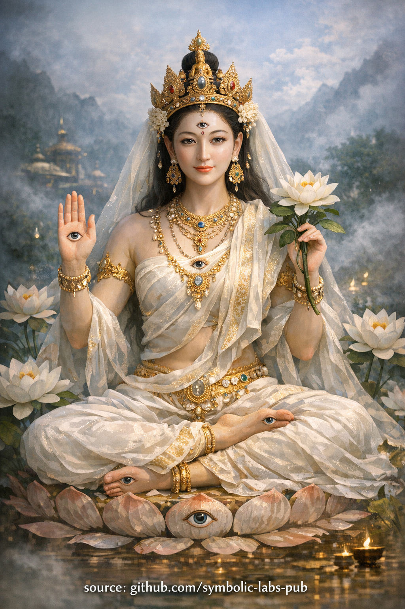

## [**White Tārā — Учење о Одржавању Услова**](https://github.com/symbolic-labs-pub/a-buddhist-view/blob/master/more/08_lineage/01_white_tara/README.md#white-tārā--the-teaching-of-sustaining-conditions)

Учење

## **White Tārā — Учење о Одржавању Услова**

*(Учење о саосећању као континуитету, а не спасавању)*

White Tārā представља димензију саосећања која се често превиђа:
**не саосећање које интервенише након пада, већ саосећање које спречава пад**.

Ово учење се бави суптилним али одлучујућим увидом:

> **[Буђење](../../10_concepts/README.md#3-enlightenment-bodhi-awakening) не пропада зато што је увид редак.
> Оно пропада зато што се услови не одржавају.**

---

### 1. Саосећање Није Емоција — То је Системска Функција

У овом учењу, [саосећање](../../02_from_ignorance_to_awakening/7_compassion/README.md#compassion-as-a-structural-principle-in-buddhist-teaching) није дефинисано као симпатија, љубазност или морална доброта.

Саосећање се разуме као:

* **Одржавање одрживих услова**
* **Стабилизација онога што већ функционише**
* **Спречавање непотребног распада**

White Tārā утеловљује саосећање као **регулаторну интелигенцију**—на начин на који здраво тело одржава равнотежу, или стабилан екосистем одржава разноликост.

Ово исправља уобичајено неразумевање:
да је саосећање примарно одговор на [патњу](../../02_from_ignorance_to_awakening/2_the_four_noble_truths/README.md#1-there-is-suffering--dukkha).

У истини, највише саосећање је **превентивно**.

---

### 2. Седам Очију — Свесност Услова, Не Суђење

**Седам очију** White Tārā симболизује [свесност](../../10_concepts/README.md#2-awareness-rigpa-vijñāna-knowing) која је:

* Распоређена (не централизована у его)
* Континуирана (не епизодни увид)
* Нереактивна (не моралистичка)

Ова свесност не пита:

> "Ко је у праву или погрешан?"

Она пита:

> **"Који услови су присутни и да ли су одрживи?"**

Зато је пракса White Tārā повезана са **дуговечношћу и здрављем**:
не зато што она произвољно даје живот, већ зато што **штити каузални континуитет**.

---

### 3. Исцељење као Поновно Балансирање, Не Корекција

У овом учењу, исцељење није "поправљање оног што је сломљено."

Исцељење значи:

* Уклањање непотребног напрезања
* Обнављање ритма
* Омогућавање системима да се саморегулишу поново

Стога, White Tārā не намеће буђење.
Она **чини буђење преживим**.

Без ове функције:

* Увид постаје крхак
* Пракса постаје херојска али краткотрајна
* [Мудрост](../../01_core_teachings/the_noble_eightfold_path/README.md#1-wisdom-paññā) гори брже него што се стабилизује

---

### 4. Зашто је Ово Учење Битно на Путу Кагyu

Традиција Кагyu наглашава **директну реализацију**—често брзу, дубоку и дестабилизујућу ако није подржана.

White Tārā се овде појављује као **противтежа**:

* [Mahāmudrā](../../04_kayas/mahamudra_and_dzogcsen/README.md#mahāmudrā-nature-of-mind-སེམས་ཀྱི་གནས་ལུགས་) открива природу ума
* White Tārā **одржава тело-ум способним да то држи**

Зато њена пракса наглашава:

* Нежност над интензитетом
* Континуитет над врхунским искуством
* Неговање мудрости над насилним увидом

---

### 5. Централно Упутство

> **Не покушавајте да се пробудите брже него што ваши услови могу подржати.**

White Tārā учи практичаре да питају:

* Да ли је моје тело подржано?
* Да ли је мој нервни систем стабилан?
* Да ли је мој живот уређен да одржи јасноћу?

Ако није, увид ће треперити—и нестати.

---

### 6. Етичка Импликација

Ово учење тихо преоквирава будистичку [етику](../../01_core_teachings/the_noble_eightfold_path/README.md#2-ethical-conduct-śīla):

Етика није морално испуњавање.
Етика је **заштита услова за буђење**—у себи и другима.

Исцрпљивати, журити или дестабилизовати бића у име напретка је **анти-саосећање**, чак и ако је мотивисано идеалима.

---

### Завршни Учитељски Стих

> Буђење се не губи само кроз незнање.
> Оно се губи кроз занемаривање услова.
>
> Где је брига континуирана,
> мудрост остаје.
>
> То је активност White Tārā.

---

Објашњење

*(Учење о саосећању као континуитету, а не спасавању)*

White Tārā представља димензију саосећања која се често превиђа:
**не саосећање које интервенише након пада, већ саосећање које спречава пад**.

Ово учење се бави суптилним али одлучујућим увидом:

> **Буђење не пропада зато што је увид редак.
> Оно пропада зато што се услови не одржавају.**

---

### 1. Саосећање Није Емоција — То је Системска Функција

У овом учењу, саосећање није дефинисано као симпатија, љубазност или морална доброта.

Саосећање се разуме као:

* **Одржавање одрживих услова**
* **Стабилизација онога што већ функционише**
* **Спречавање непотребног распада**

White Tārā утеловљује саосећање као **регулаторну интелигенцију**—на начин на који здраво тело одржава равнотежу, или стабилан екосистем одржава разноликост.

Ово исправља уобичајено неразумевање:
да је саосећање примарно одговор на патњу.

У истини, највише саосећање је **превентивно**.

---

### 2. Седам Очију — Свесност Услова, Не Суђење

**Седам очију** White Tārā симболизује свесност која је:

* Распоређена (не централизована у его)
* Континуирана (не епизодни увид)
* Нереактивна (не моралистичка)

Ова свесност не пита:

> "Ко је у праву или погрешан?"

Она пита:

> **"Који услови су присутни и да ли су одрживи?"**

Зато је пракса White Tārā повезана са **дуговечношћу и здрављем**:
не зато што она произвољно даје живот, већ зато што **штити каузални континуитет**.

---

### 3. Исцељење као Поновно Балансирање, Не Корекција

У овом учењу, исцељење није "поправљање оног што је сломљено."

Исцељење значи:

* Уклањање непотребног напрезања
* Обнављање ритма
* Омогућавање системима да се саморегулишу поново

Стога, White Tārā не намеће буђење.
Она **чини буђење преживим**.

Без ове функције:

* Увид постаје крхак
* Пракса постаје херојска али краткотрајна
* Мудрост гори брже него што се стабилизује

---

### 4. Зашто је Ово Учење Битно на Путу Кагyu

Традиција Кагyu наглашава **директну реализацију**—често брзу, дубоку и дестабилизујућу ако није подржана.

White Tārā се овде појављује као **противтежа**:

* Mahāmudrā открива природу ума
* White Tārā **одржава тело-ум способним да то држи**

Зато њена пракса наглашава:

* Нежност над интензитетом
* Континуитет над врхунским искуством
* Неговање мудрости над насилним увидом

---

### 5. Централно Упутство

> **Не покушавајте да се пробудите брже него што ваши услови могу подржати.**

White Tārā учи практичаре да питају:

* Да ли је моје тело подржано?
* Да ли је мој нервни систем стабилан?
* Да ли је мој живот уређен да одржи јасноћу?

Ако није, увид ће треперити—и нестати.

---

### 6. Етичка Импликација

Ово учење тихо преоквирава будистичку етику:

Етика није морално испуњавање.
Етика је **заштита услова за буђење**—у себи и другима.

Исцрпљивати, журити или дестабилизовати бића у име напретка је **анти-саосећање**, чак и ако је мотивисано идеалима.

---

### Завршни Учитељски Стих

> Буђење се не губи само кроз незнање.
> Оно се губи кроз занемаривање услова.
>
> Где је брига континуирана,
> мудрост остаје.
>
> То је активност White Tārā.

---

Медитација

# Медитација White Tārā

> ⚠️ **Напомена о обиму**
> Оно што следи је **неовлашћујући контемплативни облик** (*пракса значења*).
> Он **не** замењује пренос линије (*wang, lung, tri*).
> Његова функција је **стабилизација, аспирација и каузално усклађивање**, а не тантричка ауторизација.

---

**Саосећање као Услов за Буђење**

Ово није визуализација да би се побегло из живота.
То је начин **стабилизације услова који омогућавају да буђење настави**.

---

## 1. Припрема — Постављање Поља (2–3 минута)

Седите удобно, кичма усправна али мека.
Допустите дисању да падне у свој **природни ритам**.

Усмерите пажњу на тело као **живи систем**:

* Тежина подржана земљом
* Дисање храни без напора
* Ум дозвољен да постепено стигне

Тихо признајте:

> *"Нисам овде да форсирам увид.
> Овде сам да одржавам оно што омогућава да увид настане."*

Ова намера усклађује праксу са функцијом White Tārā.

---

## 2. Генерисање — Присуство White Tārā (5–7 минута)

Визуализујте **White Tārā** како се појављује **испред вас или изнад ваше круне**, формирана од **сјајне беле светлости**—јасне, хладне и живе.

Кључне карактеристике (држане нежно, не круто):

* **Седам очију**

  * Два ока лица
  * Једно око на челу
  * Једно у свакој длану
  * Једно у свакој стопалу

Ове очи **не суде**.
Оне *препознају услове*.

Њен став је опуштен, **једна нога благо испружена**, што указује на спремност за деловање без журбе.

Нека њен поглед почине на вама са **безусловном пажњом**—као што лекар посматра пацијента, или вртлар посматра земљу.

---

## 3. Исцељујућа Светлост — Одржавање Живота и Праксе (8–12 минута)

Из срца White Tārā тече **мека бела нектарна светлост**.

Она улази у:

* Круну ваше главе
* Грло
* Срце
* Абдомен
* Цео нервни систем

Ова светлост ради **три ствари истовремено**:

1. **Лечи** оно што је напрегнуто, повређено или исцрпљено
2. **Стабилизује** дисање, пажњу и емоционални тон
3. **Продужава континуитет**—живота, здравља и праксе

Нисте "поправљени."
Ви сте **подржани**.

Ако ум лута, вратите се не силом, већ са ставом:

> *"Чак и омета је нешто о чему се брине."*

---

## 4. Мантра (Опционо али Традиционално) — Ритмички Континуитет (5–10 минута)

Ако је мантра одговарајућа за вас, рецитујте тихо или гласно:

**OM TĀRE TUTTĀRE TURE MAMĀ AYUR PUṆYE JÑĀNA PUṢṬIṂ KURU YE SVAHĀ**

Значење (осећано, не анализирано):

> *"Нека живот, врлина, мудрост и храњење расту."*

Допустите мантри да јаше дисање природно—
не да произведе транс, већ да **увуче сталност**.

---

## 5. Растварање — Брига Постаје Урођена (3–5 минута)

White Tārā се полако раствара у **светлост**, која се затим раствара у **ваше сопствено срце**.

Одморите се без слике.

Приметите:

* Дисање још увек дише
* Тело још увек живо
* Свесност још увек присутна

Препознајте:

> *Саосећање није ван мене.*
> *То је услов у коме јасноћа преживљава.*

Останите овде накратко.

---

## 6. Посвећивање — Проширивање Поља

Закључите једноставним посвећивањем:

> *"Нека ова стабилност подржи буђење
> где год су услови крхки."*

Не драматизујте.
Посвећивање је **континуитет проширен према споља**.

---

## Како Радити са Овом Праксом

**Када је користити**

* Током болести или исцрпљености
* Када пракса изгледа крхко или форсирано
* Када је увид присутан али нестабилан

**Шта култивише**

* Безбедност нервног система
* Стрпљење дугог погледа
* Саосећање без хитности

**Уобичајена грешка**

* Покушај да *извучете* увид
  White Tārā учи **одржавање**, не извлачење.

---

## Напредна Интеграција (Кагyu стил)

* Упарите ову праксу са **Mahamudra одмором** након
* Користите је пре спавања да стабилизујете суптилан ветар (lung)
* Пр актикујте је **чак и када се осећате добро**—то је њена најдубља функција

---

### Основни Увид

White Tārā није милост као одговор на неуспех.
Она је **брига која спречава пад**.

---

< [Основна Оријентација Школе Кагyu](../../07_history/README.md) | [**Учење Кагyu о Green Tārā: Саосећање Које Не Оклева**](../02_green_tara/README.md) >

_извор: [github.com/symbolic-labs-pub](https://github.com/symbolic-labs-pub)_

---
