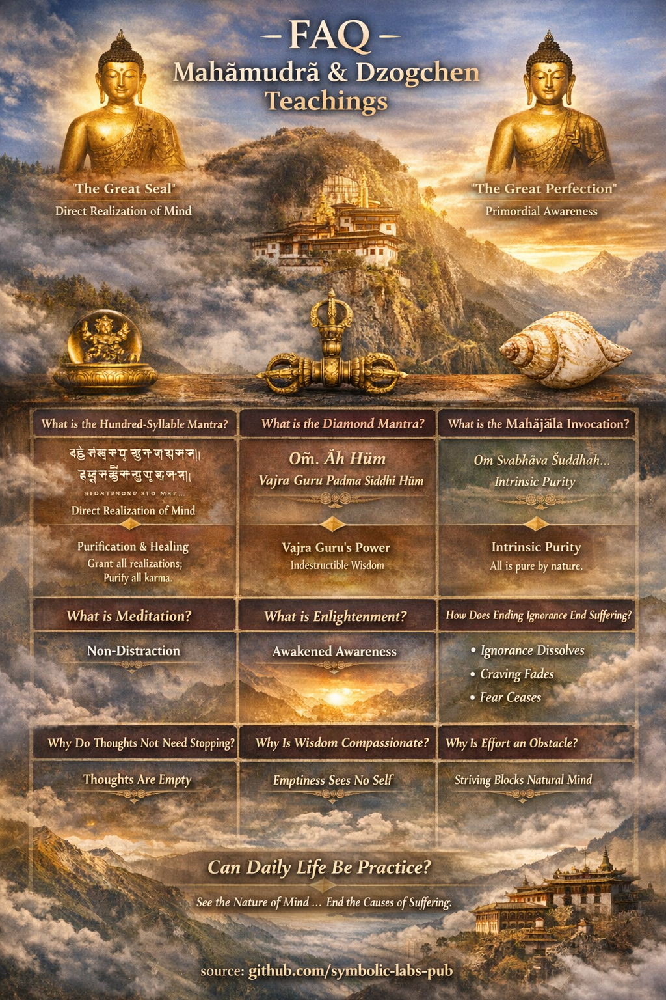

## Sıkça Sorulan Sorular

Budizmle ilgili sık sorulan soruların yanıtları.

Budizmde acı, aydınlanma, meditasyon ve daha fazlası hakkında öğrenin.

_kaynak: [github.com/symbolic-labs-pub](https://github.com/symbolic-labs-pub)_

---