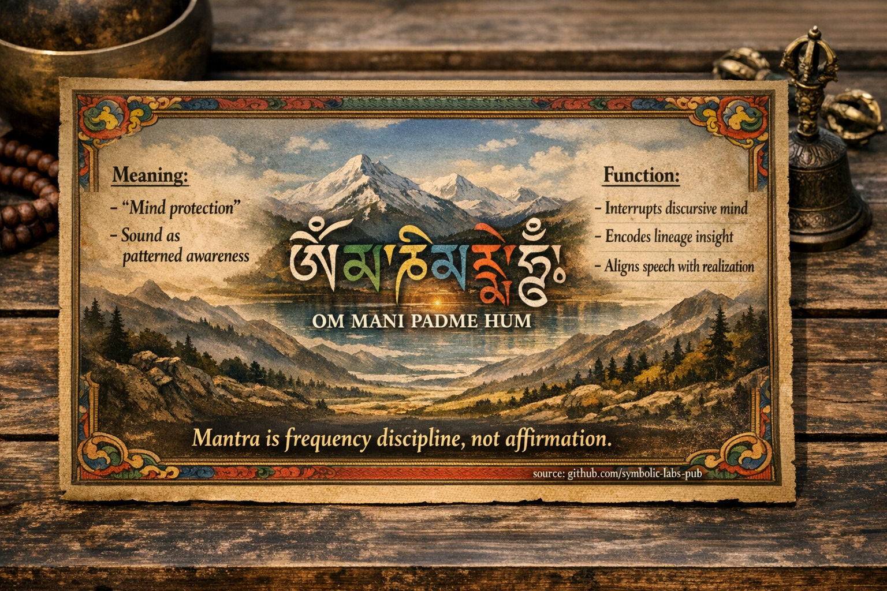

## [Що таке мантра *насправді* (буддійський погляд)](https://github.com/symbolic-labs-pub/a-buddhist-view/blob/master/more/09_symbols/10_mantra/README.md#what-a-mantra-is-buddhist-view)

---

**Мантра** — це **не**:

* позитивна афірмація
* молитва з проханням про послуги
* магічне закляття

**Мантра** — це:

> **Звукова технологія, яка налаштовує розум, мову та тіло на пробуджене патернування.**

У класичній буддійській мові мантра належить до **практики мови (vāg)**, узгодженої з:

* **Правильним зусиллям**
* **Правильною [усвідомленістю](../../01_core_teachings/the_noble_eightfold_path/README.md#7-right-mindfulness-sammā-sati)**
* **Правильною [концентрацією](../../01_core_teachings/the_noble_eightfold_path/README.md#8-right-concentration-sammā-samādhi)**

Вона функціонує через **реструктурування пізнання**, а не через переконання чи віру.

---

## Чому звук важливий в буддизмі

Буддизм трактує **розум і сприйняття як патерновані процеси**.

Звук:

* обходить концептуальну думку швидше, ніж ідеї
* безпосередньо впливає на увагу, дихання та тонкий ментальний рух
* стабілізує [свідомість](../../10_concepts/README.md#2-awareness-rigpa-vijñāna-knowing) через **повторення + ритм**

Ось чому мантра вважається **прямим методом**, особливо в [Ваджраяні](../../05_yanas/README.md#4-vajrayāna-tantrayāna-mantrayāna---the-diamond-vehicle).

> Мантра працює *до* значення.
> Значення дозріває *після* стабільності.

---

## Три рівні функції мантри

### 1. **Грубий рівень — тренування уваги**

* Повторення перериває дискурсивне мислення
* Розуму дається **один стабільний об'єкт**
* Подібно до [медитації](../../08_lineage/README.md) на диханні, але більш *активно*

Результат:

* Зменшена ментальна проліферація
* Збільшена безперервність свідомості

---

### 2. **Тонкий рівень — кодування патерну**

На глибших рівнях мантра:

* налаштовує дихання + нервову систему
* гармонізує емоційний тон
* стабілізує візуалізацію та намір

У Ваджраяні:

* мантра відповідає **розуму божества**
* склади вважаються **стисненими інструкціями**
* звук = структура, а не мова

Ось чому багато мантр **не перекладаються**.

---

### 3. **Дуже тонкий рівень — розпізнавання**

На продвинутих стадіях:

* мантра розчиняється в тиші
* повторення руйнується в присутність
* звук розкриває **недвоїсту свідомість**

На цьому етапі:

* мантра більше не "промовляється"
* свідомість розпізнає себе *через* звук

> Мантра закінчується там, де починається реалізація.

---

## Приклад: *Om Mani Padme Hum*

Традиційно розуміється як:

* **[Співчуття](../../02_from_ignorance_to_awakening/7_compassion/README.md#compassion-as-a-structural-principle-in-buddhist-teaching) [Авалокітешвари](../../08_lineage/04_avalokitesvara/README.md#practical-integration-off-cushion) в звуковій формі**
* Не речення, а **поле резонансу**

Кожен склад узгоджується з:

* ментальною отрутою
* царством [страждання](../../02_from_ignorance_to_awakening/2_the_four_noble_truths/README.md#1-there-is-suffering--dukkha)
* гранню пробудженого співчуття

Але важливо:

> Мантра працює навіть **до** того, як ви це зрозумієте.

Розуміння вдосконалює практику —
воно **не** активує її.

---

## Чому мантра називається "захистом розуму"

У тибетській мові мантра часто описується як:

> **охорона розуму** або **зв'язування розуму**

Тому що:

* вона запобігає захопленню свідомості звичними наративами
* вона захищає безперервність уваги
* вона замінює несвідому внутрішню мову на **навмисну мову**

Це *когнітивна гігієна*, а не забобон.

---

## Поширені непорозуміння (виправлені)

| Непорозуміння            | Буддійське уточнення               |
| ------------------------ | ---------------------------------- |
| "[Мантра](#what-a-mantra-is-buddhist-view) працює через віру" | Вона працює через **повторення + точність** |
| "Більше емоцій = краще" | Стабільність > інтенсивність       |
| "Швидше є сильніше"     | Безперервність > швидкість          |
| "Це містична мова"      | Це **функціональний звук**          |

---

## Мантра у відношенні до інших практик

Мантра інтегрується з:

* [**Малою**](../06_mala/README.md#mala-prayer-beads--explained-according-to-buddhist-teachings) → тренує ритм і безперервність
* [**Молитовним колесом**](../03_prayer_wheel/README.md#prayer-wheel-mani-wheel--explained-through-buddhist-teachings) → втілення повторення
* **Візуалізацією** → синхронізує розум і символ
* **Мудрою** → узгоджує тіло зі звуком
* **Тишею** → замикає коло

У Ваджраяні мантра ніколи не ізольована — вона **частина системи**.

---

## Основне прозріння

> **Мантра — це частотна дисципліна, а не афірмація.**
> **Звук використовується для реорганізації сприйняття, а не для переконання розуму.**

При правильній практиці:

* мантра стає прозорою
* практикуючий стає тихішим
* свідомість стає самопідтримуючою

На цьому етапі мантра виконала свою роботу.

---

< [1. Чистота *без* відкидання](../08_lotus/README.md) | [Мудри в буддійських ученнях](../11_mudra/README.md) >

_джерело: [github.com/symbolic-labs-pub](https://github.com/symbolic-labs-pub)_

---
