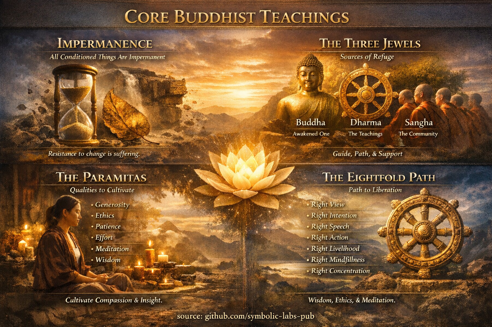

# [Core Teachings](https://github.com/symbolic-labs-pub/a-buddhist-view/blob/master/more/01_core_teachings/README.md#core-teachings)

## 1. ["All Conditioned Things Are Impermanent"](impermanence/README.md)

*(Pāli: **sabbe saṅkhārā aniccā**)*

This principle states that **everything that arises due to causes and conditions will eventually change and pass away**.

* “Conditioned” means **dependent on causes** (physical, mental, social, karmic).
* Nothing composite—objects, emotions, identities, institutions—has permanent existence.
* [Impermanence](impermanence/README.md#2-impermanence-anicca-is-structural-not-accidental) applies at **all scales**:

  * Physical: bodies, mountains, civilizations
  * Mental: thoughts, emotions, intentions
  * Existential: roles, self-concepts, beliefs

**Why this matters**

* Clinging to impermanent things produces **[suffering (dukkha)](../02_from_ignorance_to_awakening/2_the_four_noble_truths/README.md#1-there-is-suffering--dukkha)**.
* Insight into impermanence dissolves attachment, fear, and illusion of control.
* Impermanence is not pessimistic—it enables **change, freedom, and [awakening](../10_concepts/README.md#3-enlightenment-bodhi-awakening)**.

> Impermanence is not the problem. **Resistance to impermanence is.**

---

## [2. The Three Jewels (The Triple Gem)](the_three_jewels/README.md)

The [**Three Jewels**](the_three_jewels/README.md#the-three-jewels-triple-gem--ti-ratana) are the foundational orientation of Buddhist life—what one *takes refuge in*.

### 1. **Buddha**

* The **awakened one** (historically: Siddhārtha Gautama).
* Also means **awakening itself**—the potential for enlightenment present in all beings.

### 2. **Dharma**

* The **teachings** of the Buddha.
* Also the **law of reality**: how things actually function (impermanence, causality, [non-self](../02_from_ignorance_to_awakening/1_the_three_marks_of_existence/README.md#3-non-self-anattā)).
* Ultimately, [Dharma](the_three_jewels/README.md#2-dharma--the-path-and-the-law-of-reality) is not belief but **direct insight**.

### 3. **Sangha**

* Originally: the **community of ordained practitioners**.
* More broadly: all sincere practitioners who preserve and embody the Dharma.
* At the deepest level: the **field of awakened relationship** that sustains practice.

**Functionally**

* Buddha = the **example**
* Dharma = the **path**
* Sangha = the **support system**

---

## 3. The Pāramitās (Perfections)

The **pāramitās** are **qualities cultivated to cross from ignorance to awakening**.
The number depends on tradition.

---

### The Six Pāramitās (Mahāyāna standard)

1. **Generosity (Dāna)**
   Giving without attachment—to outcomes, identity, or reward.

2. **Ethical Conduct (Śīla)**
   Acting in ways that reduce harm and stabilize the mind.

3. **Patience (Kṣānti)**
   Non-reactivity toward pain, insult, delay, and uncertainty.

4. **Diligent Effort (Vīrya)**
   Sustained, joyful energy applied in the right direction.

5. **[Meditative](../08_lineage/README.md) [Concentration (Dhyāna)](the_noble_eightfold_path/README.md#8-right-concentration-sammā-samādhi)**
   Deep mental stability, clarity, and presence.

6. **Wisdom (Prajñā)**
   Direct insight into impermanence, non-self, and [emptiness](../10_concepts/01_emptiness/README.md#emptiness-śūnyatā-in-vajrayāna-buddhism).

---

### Expanded Lists (Context)

* **Theravāda** tradition often speaks of **10 pāramīs**.
* Some Mahāyāna sources add:

  * **Skillful Means (Upāya)**
  * **Aspiration (Praṇidhāna)**
  * **Power (Bala)**
  * **Knowledge (Jñāna)**

> Wisdom without [compassion](../02_from_ignorance_to_awakening/7_compassion/README.md#compassion-as-a-structural-principle-in-buddhist-teaching) is incomplete.
> Compassion without wisdom is blind.

### Expanded Lists (Context)

* **Theravāda** tradition often speaks of **10 pāramīs**.
* Some Mahāyāna sources add:

  * **Skillful Means (Upāya)**
  * **Aspiration (Praṇidhāna)**
  * **Power (Bala)**
  * **Knowledge (Jñāna)**

> Wisdom without compassion is incomplete.
> Compassion without wisdom is blind.

---

## [4. The Noble Eightfold Path](the_noble_eightfold_path/README.md)

The [**Noble Eightfold Path**](the_noble_eightfold_path/README.md#what-the-noble-eightfold-path-is-in-buddhism) is the **practical structure of liberation**.
It is not linear—it is a **mutually reinforcing system**.

---

### 1. Wisdom (Paññā)

1. **Right View** – Understanding reality as impermanent, unsatisfactory, and non-self.
2. **Right Intention** – Commitment to renunciation, goodwill, and non-harm.

### 2. Ethical Conduct (Śīla)

3. **Right Speech** – Truthful, timely, and non-harmful communication.
4. **Right Action** – Ethical bodily conduct.
5. **Right Livelihood** – Work that does not cause suffering.

### 3. Mental Discipline (Samādhi)

6. **Right Effort** – Cultivating wholesome states, abandoning unwholesome ones.
7. **Right [Mindfulness](the_noble_eightfold_path/README.md#7-right-mindfulness-sammā-sati)** – Clear [awareness](../10_concepts/README.md#2-awareness-rigpa-vijñāna-knowing) of body, feelings, mind, and phenomena.
8. **Right Concentration** – Deep meditative absorption.

---

### Structural Insight

* Ethics stabilizes the mind.
* Meditation clarifies perception.
* Wisdom dissolves ignorance.
* All three **co-evolve**.

---

## Big Picture Synthesis

| Concept        | Core Role                         |
| -------------- | --------------------------------- |
| [Impermanence](#1-all-conditioned-things-are-impermanent)   | Diagnoses the root illusion       |
| [Three Jewels](#2-the-three-jewels-the-triple-gem)   | Orientation and refuge            |
| [Pāramitās](#3-the-pāramitās-perfections)      | Inner qualities to be cultivated  |
| [Eightfold Path](#4-the-noble-eightfold-path) | Operational system for liberation |

**Buddhism is less a belief system and more a precision framework for reducing [suffering](../02_from_ignorance_to_awakening/2_the_four_noble_truths/README.md#1-there-is-suffering--dukkha) through understanding reality as it is.**

---

< [A Buddhist View](../../README.md) | [“All Conditioned Things Are Impermanent”](impermanence/README.md) >

_source: [github.com/symbolic-labs-pub](https://github.com/symbolic-labs-pub)_

---
