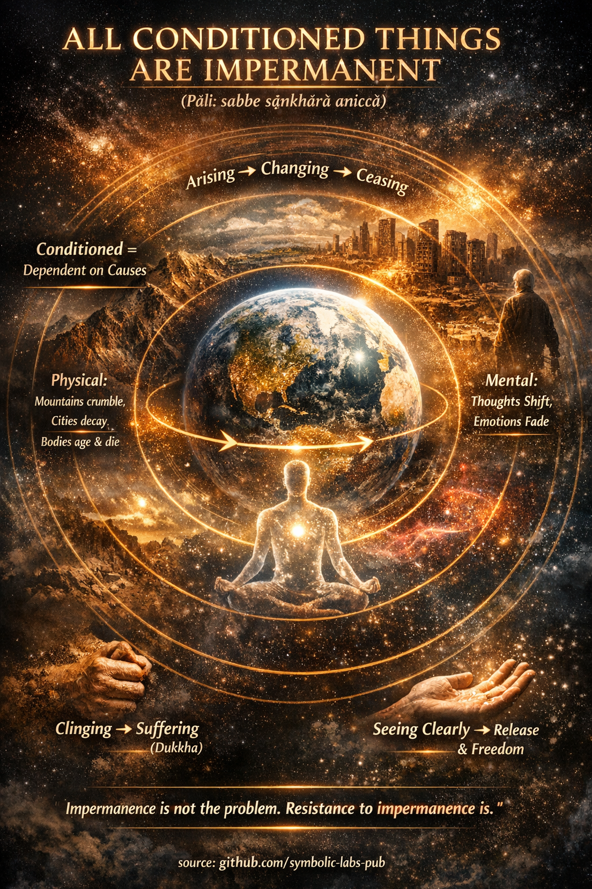

## [“All Conditioned Things Are Impermanent”](https://github.com/symbolic-labs-pub/a-buddhist-view/blob/master/more/01_core_teachings/impermanence/README.md#all-conditioned-things-are-impermanent)

**(Pāli: *sabbe saṅkhārā aniccā*)**

### 1. What *saṅkhārā* really means

In Buddhist teaching, *saṅkhārā* refers to **all conditioned phenomena**—anything that:

* arises due to **causes and conditions**
* depends on other factors to exist
* is **fabricated, compounded, or constructed**

This includes:

* physical matter (bodies, objects, environments)
* mental formations (thoughts, emotions, intentions)
* social and existential constructs (roles, identities, institutions, beliefs)

Unconditioned reality (*asaṅkhata*), by contrast, refers only to **Nibbāna**—that which does not arise or cease.

---

### 2. Impermanence (*anicca*) is structural, not accidental

According to the Buddha’s analysis of reality:

> Whatever is conditioned **must change**, because the conditions that sustain it are themselves unstable.

This is not a poetic observation—it is a **law-like insight** into causality (*paṭicca-samuppāda*, [dependent origination](../../02_from_ignorance_to_awakening/3_dependent_origination/README.md#the-twelve-links-the-classic-formulation)).

* When causes change → effects change
* When supporting conditions dissolve → the phenomenon ceases

Thus impermanence is **not something that happens to things**
→ it is **what things are**.

---

### 3. Impermanence at all scales (Buddhist view)

**Physical**

* Bodies age, decay, and die
* Mountains erode, stars burn out
* Civilizations rise and collapse

**Mental**

* Thoughts flicker moment by moment
* Emotions arise, peak, and dissolve
* Intentions shift with conditions

**Existential**

* Identity is a process, not a core
* Roles exist only relationally
* Beliefs depend on context, culture, and mind-state

In early Buddhist analysis, even a single moment of experience is already **in flux**.

---

### 4. Why impermanence leads to suffering (*dukkha*)

The Buddha did **not** say impermanence itself is [suffering](../../02_from_ignorance_to_awakening/2_the_four_noble_truths/README.md#1-there-is-suffering--dukkha).

Suffering arises because:

* we **cling** to what changes
* we demand stability from what cannot provide it
* we seek control over what is not ownable

> “What is impermanent is unreliable.
> What is unreliable is unsatisfactory.”

This is why *anicca → dukkha → anattā* (impermanence → unsatisfactoriness → [non-self](../../02_from_ignorance_to_awakening/1_the_three_marks_of_existence/README.md#3-non-self-anattā)) form a single insight chain.

---

### 5. Insight, not belief, is the cure

Buddhism does not ask for intellectual agreement.
It asks for **direct seeing** (*[vipassanā](../../05_yanas/shikantaza_and_vipassana/README.md#1-vipassanā-theravāda-insight---“feature-extraction-de-reification”)*).

When impermanence is clearly seen:

* attachment loosens naturally
* fear of loss diminishes
* craving loses its grip
* identity softens

Freedom arises **not by stopping change**,
but by **no longer resisting it**.

---

### 6. Impermanence is liberating, not pessimistic

From a Buddhist perspective:

* If things were permanent → liberation would be impossible
* Because things change → transformation is possible
* [Awakening](../../10_concepts/README.md#3-enlightenment-bodhi-awakening) itself depends on impermanence

> Impermanence is the **opening** through which freedom enters.

---

In the words attributed to **Gautama Buddha**:

> “All conditioned things are impermanent.
> When one sees this with [wisdom](../the_noble_eightfold_path/README.md#1-wisdom-paññā),
> one turns away from suffering.”

---

< [Core Teachings](../README.md) | [What “Pāramitā” Means in Buddhism](../perfections/README.md) >

_source: [github.com/symbolic-labs-pub](https://github.com/symbolic-labs-pub)_

---
