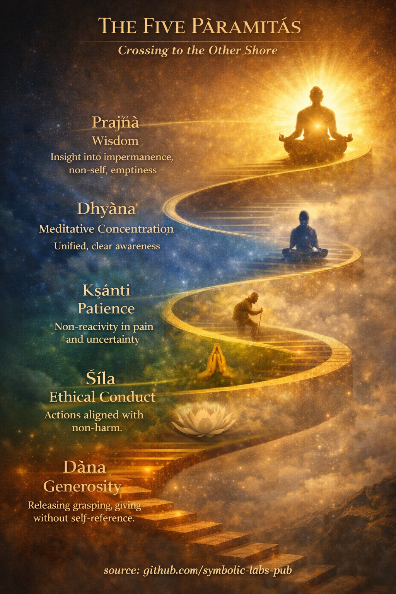

## [What “Pāramitā” Means in Buddhism](https://github.com/symbolic-labs-pub/a-buddhist-view/blob/master/more/01_core_teachings/perfections/README.md#what-pāramitā-means-in-buddhism)

**Pāramitā** literally means *“that which has gone to the other shore.”*
In Buddhist terms, this is not a metaphysical place—it is **freedom from ignorance (avidyā)** and the habits of clinging that generate [suffering (dukkha)](../../02_from_ignorance_to_awakening/2_the_four_noble_truths/README.md#1-there-is-suffering--dukkha).

They are called *perfections* **not because one becomes morally flawless**, but because each quality is practiced **without self-reference, attachment, or expectation of reward**.

In [Mahāyāna](../../05_yanas/README.md#limitation-from-mahāyāna-view), the pāramitās are cultivated by a [**bodhisattva**](../../08_lineage/08_bodhisattva/README.md#4-the-bodhisattva-vow-as-structural-alignment)—one who seeks [awakening](../../10_concepts/README.md#3-enlightenment-bodhi-awakening) **for the benefit of all beings**, not only oneself.

---

## [1. **Dāna (Generosity)** — Undoing Grasping](https://github.com/symbolic-labs-pub/a-buddhist-view/blob/master/more/01_core_teachings/perfections/README.md#1-dāna-generosity--undoing-grasping)

**Core problem addressed:** attachment and scarcity-mind

Buddhist teaching emphasizes that suffering arises from **clinging**—to possessions, identity, views, outcomes.

Dāna is not merely giving objects; it is **releasing ownership**:

* Giving without expecting gratitude
* Giving without reinforcing “I am the giver”
* Giving without calculating merit

At deeper levels, one gives:

* **Fearlessness** (not causing harm)
* [**Dharma**](../the_three_jewels/README.md#2-dharma--the-path-and-the-law-of-reality) (clarity, truth, guidance)

👉 *Transformative function:* loosens the illusion of “mine” and “me.”

---

## [2. **Śīla (Ethical Conduct)** — Stabilizing Karma and Mind](https://github.com/symbolic-labs-pub/a-buddhist-view/blob/master/more/01_core_teachings/perfections/README.md#2-śīla-ethical-conduct--stabilizing-karma-and-mind)

**Core problem addressed:** harmful action driven by confusion

[Śīla](../the_noble_eightfold_path/README.md#2-ethical-conduct-śīla) is not obedience to rules; it is **intelligent restraint** based on understanding cause and effect (karma).

In Buddhist psychology:

* Unethical action → agitation → unstable [meditation](../../08_lineage/README.md)
* Ethical action → calm → clarity

Śīla includes:

* Non-harming (body, speech, mind)
* Honesty and responsibility
* Alignment of intention with [awareness](../../10_concepts/README.md#2-awareness-rigpa-vijñāna-knowing)

👉 *Transformative function:* creates the **conditions** for meditation and insight.

---

## [3. **Kṣānti (Patience)** — Freedom from Reactivity](https://github.com/symbolic-labs-pub/a-buddhist-view/blob/master/more/01_core_teachings/perfections/README.md#3-kṣānti-patience--freedom-from-reactivity)

**Core problem addressed:** aversion and anger

Kṣānti is often misunderstood as passive tolerance. In Buddhism it means:

* **Seeing suffering without adding resistance**
* Remaining open in the presence of pain, insult, delay, or uncertainty

This includes:

* Patience with others
* Patience with circumstances
* Patience with truth itself (especially difficult insights)

Anger is seen as a **moment of ignorance**—a contraction around a false self.

👉 *Transformative function:* dissolves the reflex to defend an imagined ego.

---

## [4. **Vīrya (Diligent Effort)** — Right Energy, Not Strain](https://github.com/symbolic-labs-pub/a-buddhist-view/blob/master/more/01_core_teachings/perfections/README.md#4-vīrya-diligent-effort--right-energy-not-strain)

**Core problem addressed:** lethargy, avoidance, misdirected effort

Vīrya means **joyful perseverance**, not grim discipline.

Buddhist teaching distinguishes:

* **Unwholesome effort** (driven by craving or guilt)
* **Wholesome effort** (aligned with clarity and [compassion](../../02_from_ignorance_to_awakening/7_compassion/README.md#compassion-as-a-structural-principle-in-buddhist-teaching))

Right effort:

* Prevents unwholesome states
* Cultivates wholesome states
* Sustains practice without burnout

👉 *Transformative function:* keeps the path **alive and embodied**.

---

## [5. **Dhyāna (Meditative Concentration)** — Unification of Mind](https://github.com/symbolic-labs-pub/a-buddhist-view/blob/master/more/01_core_teachings/perfections/README.md#5-dhyāna-meditative-concentration--unification-of-mind)

**Core problem addressed:** distraction and fragmentation

Dhyāna refers to **deep collectedness** where the mind becomes:

* Stable
* Clear
* Non-reactive

This is not trance or escape, but **lucid presence**.

Through meditation:

* Mental noise settles
* Insight becomes possible
* The sense of a solid self begins to soften

In Mahāyāna, [concentration](../the_noble_eightfold_path/README.md#8-right-concentration-sammā-samādhi) is always paired with **compassion and wisdom**, not isolation.

👉 *Transformative function:* creates the **direct experiential ground** for insight.

---

## [6. **Prajñā (Wisdom)** — Seeing Reality as It Is](https://github.com/symbolic-labs-pub/a-buddhist-view/blob/master/more/01_core_teachings/perfections/README.md#6-prajñā-wisdom--seeing-reality-as-it-is)

**Core problem addressed:** ignorance (avidyā)

[Prajñā](../the_noble_eightfold_path/README.md#1-wisdom-paññā) is not intellectual knowledge. It is **direct insight** into:

* [**Impermanence**](../impermanence/README.md#2-impermanence-anicca-is-structural-not-accidental) (anicca)
* [**Non-self**](../../02_from_ignorance_to_awakening/1_the_three_marks_of_existence/README.md#3-non-self-anattā) (anattā)
* [**Emptiness**](../../10_concepts/01_emptiness/README.md#emptiness-śūnyatā-in-vajrayāna-buddhism) (śūnyatā)

This wisdom sees that:

* All phenomena arise dependently
* Nothing exists independently or permanently
* The “self” is a process, not an entity

In Mahāyāna, prajñā is inseparable from **compassion**—because when self-clinging dissolves, separation dissolves.

👉 *Transformative function:* ends the root of suffering.

---

## [How the Pāramitās Work Together](https://github.com/symbolic-labs-pub/a-buddhist-view/blob/master/more/01_core_teachings/perfections/README.md#how-the-pāramitās-work-together)

They are **not sequential steps**, but a **mutually reinforcing system**:

* Generosity weakens clinging → ethics become natural
* Ethics stabilize the mind → patience becomes possible
* Patience enables sustained effort
* Effort deepens meditation
* Meditation gives rise to wisdom
* Wisdom perfects all the others

Without wisdom, the pāramitās become **ego projects**.
With wisdom, they become **spontaneous expressions of awakening**.

---

## [In One Sentence (Buddhist View)](https://github.com/symbolic-labs-pub/a-buddhist-view/blob/master/more/01_core_teachings/perfections/README.md#in-one-sentence-buddhist-view)

> The pāramitās are not virtues to acquire, but **patterns of being that emerge as ignorance fades**.

---

< [“All Conditioned Things Are Impermanent”](../impermanence/README.md) | [What the Noble Eightfold Path *is* (in Buddhism)](../the_noble_eightfold_path/README.md) >

_source: [github.com/symbolic-labs-pub](https://github.com/symbolic-labs-pub)_

---
