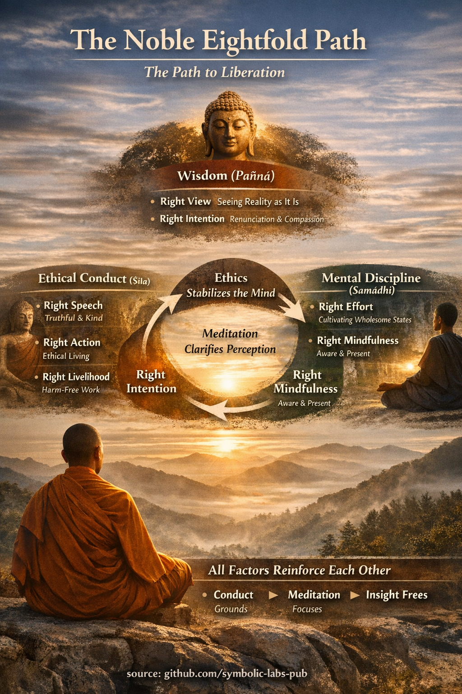

## [What the Noble Eightfold Path *is* (in Buddhism)](https://github.com/symbolic-labs-pub/a-buddhist-view/blob/master/more/01_core_teachings/the_noble_eightfold_path/README.md#what-the-noble-eightfold-path-is-in-buddhism)

In the Buddha’s own framing, the **Noble Eightfold Path (ariya aṭṭhaṅgika magga)** is:

* the **fourth Noble Truth**
* the **means by which [suffering (dukkha)](../../02_from_ignorance_to_awakening/2_the_four_noble_truths/README.md#1-there-is-suffering--dukkha) actually ceases**
* not a belief system, but a **training in perception, action, and cognition**

It is called a *path* only metaphorically. In practice, it is a **simultaneous cultivation** of conditions that weaken ignorance (*avijjā*) and craving (*taṇhā*).

The Buddha explicitly rejected the idea that liberation comes from:

* ritual
* asceticism
* intellectual knowledge alone
* moral purity alone

Instead, liberation arises when **view, conduct, and mind are aligned with reality**.

---

## [The Threefold Structure (as taught in the suttas)](https://github.com/symbolic-labs-pub/a-buddhist-view/blob/master/more/01_core_teachings/the_noble_eightfold_path/README.md#the-threefold-structure-as-taught-in-the-suttas)

The Eightfold Path is traditionally grouped into **three trainings (tisikkhā)**:

1. **Wisdom (Paññā)** – seeing reality correctly
2. **Ethical conduct (Śīla)** – not creating new suffering
3. **Mental discipline (Samādhi)** – stabilizing and clarifying the mind

This structure is not theoretical — it mirrors *causal dependency*:

> **Unstable conduct → unstable mind → distorted perception**
> **Ethical stability → mental stability → liberating insight**

---

## [1. Wisdom (Paññā)](https://github.com/symbolic-labs-pub/a-buddhist-view/blob/master/more/01_core_teachings/the_noble_eightfold_path/README.md#1-wisdom-paññā)

### 1. Right View (Sammā-diṭṭhi)

**Core meaning in Buddhism:**
Right View is not philosophy — it is *accurate perception* of how things actually function.

It includes:

* [impermanence (*anicca*)](../impermanence/README.md#2-impermanence-anicca-is-structural-not-accidental)
* unsatisfactoriness (*dukkha*)
* [non-self (*anattā*)](../../02_from_ignorance_to_awakening/1_the_three_marks_of_existence/README.md#3-non-self-anattā)
* [dependent origination (*paṭicca-samuppāda*)](../../02_from_ignorance_to_awakening/3_dependent_origination/README.md#the-twelve-links-the-classic-formulation)
* karma as cause-and-effect, not fate

Importantly:

> Right View begins conceptually, but **matures only through direct insight**.

The Buddha distinguishes:

* **mundane Right View** (ethical causality, reincarnation, responsibility)
* **supramundane Right View** (direct realization of non-self and cessation)

Without Right View:

* effort goes in the wrong direction
* [meditation](../../08_lineage/README.md) becomes escapism
* ethics becomes rigid morality

---

### 2. Right Intention (Sammā-saṅkappa)

Right Intention is the **affective alignment** of the mind.

The Buddha names three qualities:

1. **Renunciation** (letting go, not suppression)
2. **Goodwill** (non-ill-will)
3. **Harmlessness** (non-cruelty)

This matters because:

> Liberation is blocked not by ignorance alone, but by **emotional momentum**.

Right Intention weakens craving (*taṇhā*) at its emotional root.

---

## [2. Ethical Conduct (Śīla)](https://github.com/symbolic-labs-pub/a-buddhist-view/blob/master/more/01_core_teachings/the_noble_eightfold_path/README.md#2-ethical-conduct-śīla)

Ethics in Buddhism is **functional**, not moralistic.

The Buddha does **not** say:

> “Be ethical to be good.”

He says:

> “Unethical action agitates the mind and obstructs concentration.”

---

### 3. Right Speech (Sammā-vācā)

Defined negatively and positively:

Avoid:

* false speech
* divisive speech
* harsh speech
* idle, compulsive chatter

Cultivate:

* truthfulness
* timeliness
* kindness
* usefulness

Speech is emphasized because:

> Speech is where **intention becomes social karma**.

---

### 4. Right Action (Sammā-kammanta)

Covers bodily behavior:

* non-harming
* non-stealing
* non-sexual exploitation

The Buddha links bodily restraint directly to **freedom from remorse**, which is a prerequisite for deep meditation.

---

### 5. Right Livelihood (Sammā-ājīva)

Livelihood must not systematically cause harm.

Classic prohibitions include:

* weapons trade
* human trafficking
* slaughter
* intoxicants
* poisons

The deeper principle:

> One cannot cultivate liberation while **profiting from suffering**.

---

## [3. Mental Discipline (Samādhi)](https://github.com/symbolic-labs-pub/a-buddhist-view/blob/master/more/01_core_teachings/the_noble_eightfold_path/README.md#3-mental-discipline-samādhi)

This section is often misunderstood as “just meditation.”
In Buddhism, it is a **dynamic training of mental energy**.

---

### 6. Right Effort (Sammā-vāyāma)

Fourfold effort:

1. Prevent unwholesome states
2. Abandon arisen unwholesome states
3. Cultivate wholesome states
4. Maintain and deepen wholesome states

This is not willpower — it is **skillful regulation of attention and habit**.

The Buddha repeatedly warned against:

* forcing
* suppression
* spiritual ambition

---

### 7. Right Mindfulness (Sammā-sati)

Defined *precisely* in the Satipaṭṭhāna Sutta as [awareness](../../10_concepts/README.md#2-awareness-rigpa-vijñāna-knowing) of:

* body
* feelings
* mind-states
* phenomena (dhammas)

Mindfulness is not bare attention alone.
It includes:

* remembering the teaching
* recognizing impermanence
* seeing craving as it arises

Thus:

> Mindfulness is **wisdom applied in real time**.

---

### 8. Right Concentration (Sammā-samādhi)

Refers specifically to **jhāna** (meditative absorption).

Key points:

* concentration is unified, stable, joyful
* it suppresses the hindrances
* it provides the *clarity* needed for insight

In Buddhism:

> Concentration is not the goal — **it is the lens** through which insight becomes penetrating.

---

## [Structural Insight (Buddhist causality)](https://github.com/symbolic-labs-pub/a-buddhist-view/blob/master/more/01_core_teachings/the_noble_eightfold_path/README.md#structural-insight-buddhist-causality)

Your summary is accurate and deeply Buddhist:

* **Ethics stabilizes the mind** → removes agitation and remorse
* **Meditation clarifies perception** → reveals impermanence and craving
* **Wisdom dissolves ignorance** → ends the cycle of suffering

Crucially:

> No factor is practiced in isolation.
> Practicing one **strengthens the others**.

This is why the Buddha called it a **path**, not a ladder.

---

## [Final Buddhist Framing](https://github.com/symbolic-labs-pub/a-buddhist-view/blob/master/more/01_core_teachings/the_noble_eightfold_path/README.md#final-buddhist-framing)

In the Buddha’s own words (paraphrased):

> “Just as the ocean has one taste — the taste of salt —
> so my teaching has one taste — the taste of liberation.”

The **Noble Eightfold Path** is the **engineering of that liberation**:

* ethically
* cognitively
* experientially

---

< [What “Pāramitā” Means in Buddhism](../perfections/README.md) | [The Three Jewels (Triple Gem) — *Ti-ratana*](../the_three_jewels/README.md) >

_source: [github.com/symbolic-labs-pub](https://github.com/symbolic-labs-pub)_

---
