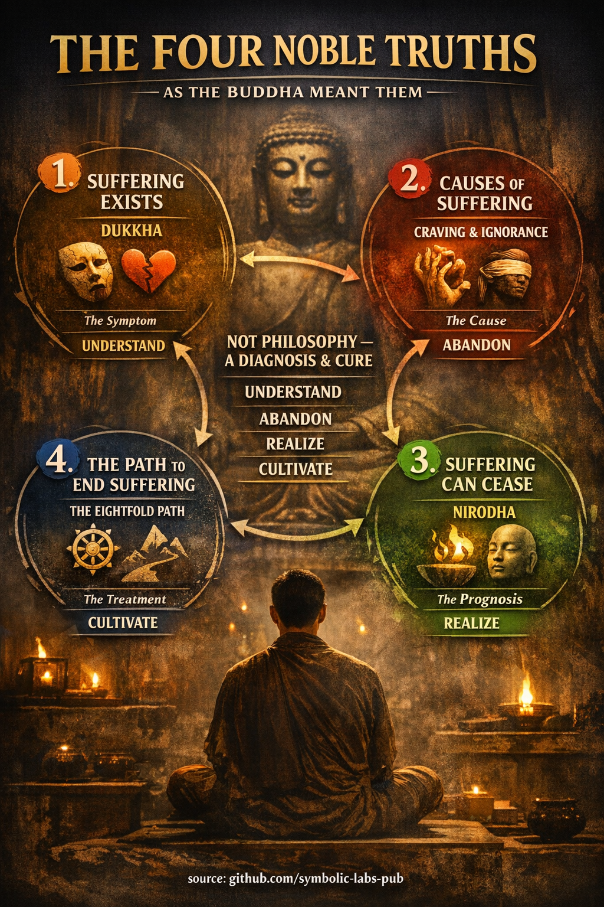

## [The Four Noble Truths — as the Buddha meant them](https://github.com/symbolic-labs-pub/a-buddhist-view/blob/master/more/02_from_ignorance_to_awakening/2_the_four_noble_truths/README.md#the-four-noble-truths--as-the-buddha-meant-them)

The **Four Noble Truths** are not beliefs about reality.
They are **tasks to be understood, performed, and realized**.

In the early texts (e.g. *Dhammacakkappavattana Sutta*), each Truth has:

* a **fact**
* and a **practice-response**

This makes the framework *experiential*, not philosophical.

---

## [1. There is suffering — **Dukkha**](https://github.com/symbolic-labs-pub/a-buddhist-view/blob/master/more/02_from_ignorance_to_awakening/2_the_four_noble_truths/README.md#1-there-is-suffering--dukkha)

### What this means in Buddhism

**Dukkha** does *not* mean only pain.

It refers to the **structural instability of conditioned existence**.

There are three layers:

1. **Obvious suffering**

   * Pain, illness, aging, death
   * Loss, grief, frustration

2. **Suffering due to change**

   * Pleasure fades
   * Relationships, health, success cannot be held

3. **Pervasive unsatisfactoriness**

   * Even when life is “fine,” something feels incomplete
   * The subtle tension of maintaining a self

> Dukkha is not pessimism.
> It is **honest perception**.

### The task

➡️ **Dukkha is to be fully understood**, not avoided.

---

## [2. Suffering has causes — **Samudaya**](https://github.com/symbolic-labs-pub/a-buddhist-view/blob/master/more/02_from_ignorance_to_awakening/2_the_four_noble_truths/README.md#2-suffering-has-causes--samudaya)

### What causes suffering?

The Buddha was precise:

* **Craving (taṇhā)**
  Wanting things to be different than they are
* **Ignorance (avijjā)**
  Misunderstanding [impermanence](../../01_core_teachings/impermanence/README.md#2-impermanence-anicca-is-structural-not-accidental), [non-self](../1_the_three_marks_of_existence/README.md#3-non-self-anattā), and causality

Craving takes three forms:

* Craving for pleasure
* Craving for becoming (identity, status, control)
* Craving for non-becoming (escape, annihilation)

Crucially:

> We do not suffer *because things change*
> We suffer because we **cling** as if they shouldn’t.

### The task

➡️ **The cause of suffering is to be abandoned**

Not suppressed, not judged—**seen clearly and released**.

---

## [3. Suffering can cease — **Nirodha**](https://github.com/symbolic-labs-pub/a-buddhist-view/blob/master/more/02_from_ignorance_to_awakening/2_the_four_noble_truths/README.md#3-suffering-can-cease--nirodha)

### What cessation really means

This is often misunderstood.

**Nirvāṇa is not a place, state, or annihilation.**

It is:

* The **ending of craving**
* The **cooling of compulsive grasping**
* The **cessation of the mechanism that produces dukkha**

Life continues:

* The body still ages
* Sensations still arise
* Emotions still occur

But:

* They are no longer owned
* No longer resisted
* No longer clung to

> Nirodha is not the end of experience
> It is the end of *misrelationship* to experience

### The task

➡️ **Cessation is to be realized**

Not believed—**directly known**.

---

## [4. There is a path — **Magga**](https://github.com/symbolic-labs-pub/a-buddhist-view/blob/master/more/02_from_ignorance_to_awakening/2_the_four_noble_truths/README.md#4-there-is-a-path--magga)

### Why a path is necessary

If suffering were removed by belief, philosophy, or willpower,
the Buddha would not have taught a path.

The [**Eightfold Path**](../../01_core_teachings/the_noble_eightfold_path/README.md#what-the-noble-eightfold-path-is-in-buddhism) is a **training of perception, conduct, and mind**.

It works because:

* Suffering is conditioned
* Conditions can be reconditioned

The path integrates:

* [**Wisdom**](../../01_core_teachings/the_noble_eightfold_path/README.md#1-wisdom-paññā) → seeing clearly
* [**Ethical conduct**](../../01_core_teachings/the_noble_eightfold_path/README.md#2-ethical-conduct-śīla) → stabilizing life
* **Mental discipline** → cultivating insight

Not sequential.
Not optional.
**Mutually reinforcing.**

### The task

➡️ **The path is to be cultivated**

---

## [Why Buddhism is “therapeutic”](https://github.com/symbolic-labs-pub/a-buddhist-view/blob/master/more/02_from_ignorance_to_awakening/2_the_four_noble_truths/README.md#why-buddhism-is-therapeutic)

The Buddha avoided metaphysical speculation because it:

* Does not end suffering
* Strengthens identity and debate
* Distracts from practice

He taught only:

> “Suffering, its origin, its cessation, and the path.”

This is why Buddhism resembles:

* Medicine
* Psychology
* Systems theory

More than theology.

---

## [The deeper diagnostic loop (often missed)](https://github.com/symbolic-labs-pub/a-buddhist-view/blob/master/more/02_from_ignorance_to_awakening/2_the_four_noble_truths/README.md#the-deeper-diagnostic-loop-often-missed)

Each Noble Truth corresponds to a **mode of practice**:

| Truth | Reality          | Practice Task |
| ----- | ---------------- | ------------- |
| 1     | [Suffering](#1-there-is-suffering---dukkha) exists | Understand    |
| 2     | It has causes    | Abandon       |
| 3     | It can cease     | Realize       |
| 4     | There is a path  | Cultivate     |

Liberation happens **only when all four tasks are fulfilled**.

---

## [Final synthesis](https://github.com/symbolic-labs-pub/a-buddhist-view/blob/master/more/02_from_ignorance_to_awakening/2_the_four_noble_truths/README.md#final-synthesis)

The Four Noble Truths are not doctrines to accept.

They are **instructions for [awakening](../../10_concepts/README.md#3-enlightenment-bodhi-awakening)**.

They say:

* Life hurts when misunderstood
* The cause is grasping, not fate
* Freedom is possible here and now
* But only through disciplined training

> Buddhism does not ask: *“What is the universe?”*
> It asks: *“Why do you suffer — and how can that stop?”*

---

< [The Three Marks of Existence — Buddhist Explanation](../1_the_three_marks_of_existence/README.md) | [Dependent Origination (Paṭicca-samuppāda)](../3_dependent_origination/README.md) >

_source: [github.com/symbolic-labs-pub](https://github.com/symbolic-labs-pub)_

---
