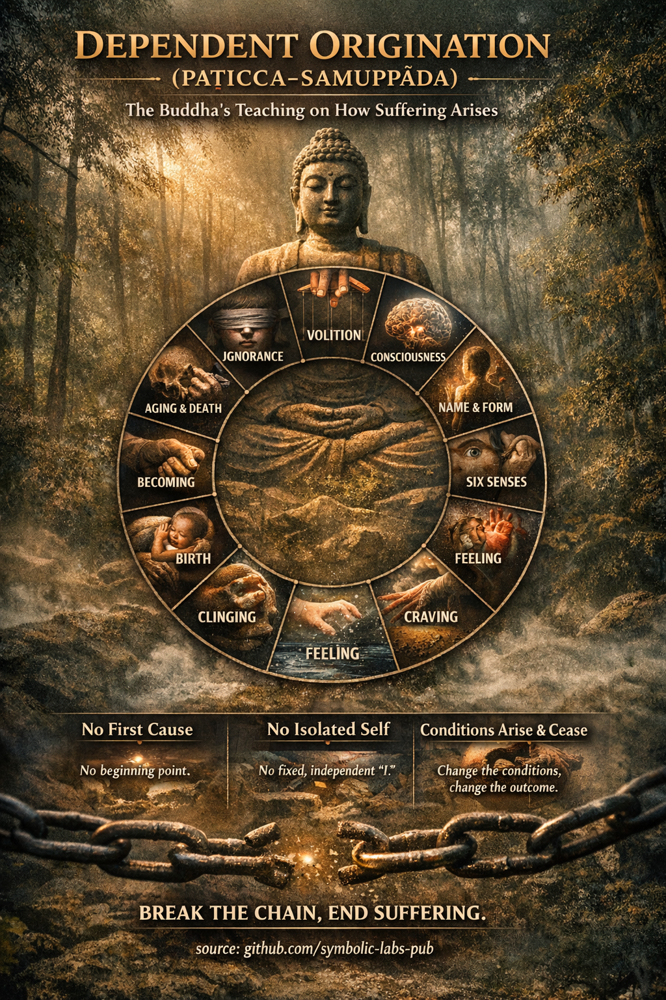

# [Dependent Origination (Paṭicca-samuppāda)](https://github.com/symbolic-labs-pub/a-buddhist-view/blob/master/more/02_from_ignorance_to_awakening/3_dependent_origination/README.md#dependent-origination-paṭicca-samuppāda)

**— the Buddha’s analysis of how suffering arises and ceases**

In the Buddhist teachings, **Dependent Origination** is not a metaphysical theory about the universe. It is a **diagnostic model of experience**—a precise explanation of **how suffering comes into being moment by moment**, and therefore **how it can end**.

As taught by **Siddhārtha Gautama**, the principle is simple yet radical:

> **When this exists, that arises.
> When this ceases, that ceases.**

Nothing appears on its own. Nothing stands alone. Everything depends on conditions.

---

## The Core Meaning

Dependent Origination asserts three inseparable truths:

1. **Conditionality**
   All phenomena arise **only when supporting conditions are present**.

2. **[Non-self (anattā)](../1_the_three_marks_of_existence/README.md#3-non-self-anattā)**
   Because things depend on conditions, **nothing has an independent, permanent essence**.

3. **Process over substance**
   Reality is not made of “things,” but of **dynamic processes unfolding in relation**.

This directly avoids the two extremes the Buddha warned against:

* **Eternalism** — believing something exists permanently, independently
* **Nihilism** — believing nothing has meaning or causal consequence

Dependent Origination shows a **middle way**:
things are **real as processes**, but **[empty](../../10_concepts/01_emptiness/README.md#emptiness-śūnyatā-in-vajrayāna-buddhism) of fixed essence**.

---

## The Twelve Links (The Classic Formulation)

The Buddha often expressed Dependent Origination as **12 interdependent links** (*nidānas*). These are not a linear timeline but a **self-reinforcing loop**.

### The Chain

1. **Ignorance (avijjā)**
   Not seeing [impermanence](../../01_core_teachings/impermanence/README.md#2-impermanence-anicca-is-structural-not-accidental), [suffering](../2_the_four_noble_truths/README.md#1-there-is-suffering--dukkha), and non-self.

2. **Volitional formations (saṅkhārā)**
   Habitual intentions and karmic patterns shaped by ignorance.

3. **Consciousness (viññāṇa)**
   Conditioned [awareness](../../10_concepts/README.md#2-awareness-rigpa-vijñāna-knowing) shaped by past patterns.

4. **Name-and-form (nāma-rūpa)**
   Mind and body as an experiential system.

5. **Six sense bases (saḷāyatana)**
   Eye, ear, nose, tongue, body, mind.

6. **Contact (phassa)**
   Sense + object + consciousness.

7. **Feeling (vedanā)**
   Pleasant, unpleasant, or neutral tone.

8. **Craving (taṇhā)**
   Wanting pleasure, resisting pain, clinging to neutrality.

9. **Clinging (upādāna)**
   Identification, attachment, “this is mine / me.”

10. **Becoming (bhava)**
    Momentum of identity and existence.

11. **Birth (jāti)**
    The arising of a self-story, role, or life situation.

12. **Aging and death (jarā-maraṇa)**
    Decay, loss, grief, despair—**dukkha**.

---

## The Crucial Insight: This Is Reversible

This teaching is **not fatalistic**.

The Buddha emphasized **conditional collapse**:

* If **ignorance weakens**, formations weaken
* If **craving ceases**, clinging ceases
* If **clinging ceases**, suffering does not arise

There is **no first cause** to hunt down.
There is **no solid entity** to destroy.

Only conditions—arising and ceasing.

---

## Why This Is So Radical

### 1. No First Cause

The Buddha explicitly rejected metaphysical origin stories. Searching for a “beginning” is **not useful for liberation**.

### 2. No Isolated Self

What we call “I” is a **temporary knot in a web of conditions**—habits, sensations, perceptions, intentions.

### 3. Ethics Still Matter

Because actions condition future experience, **responsibility remains**, without requiring a permanent soul.

---

## Practical Meaning in Practice

In [meditation](../../08_lineage/README.md) and daily life, Dependent Origination becomes **directly observable**:

* A sensation arises
* Feeling appears
* Craving follows
* Identification tightens
* Suffering forms

With [mindfulness](../../01_core_teachings/the_noble_eightfold_path/README.md#7-right-mindfulness-sammā-sati), the chain is **seen in real time**—and interrupted.

This is why the Buddha said:

> “One who sees dependent origination sees the [Dharma](../../01_core_teachings/the_three_jewels/README.md#2-dharma--the-path-and-the-law-of-reality).
> One who sees the Dharma sees dependent origination.”

---

## In One Sentence

**Dependent Origination is the Buddha’s precise explanation of how suffering arises without a self—and how freedom is possible without annihilation.**

---

< [The Four Noble Truths — as the Buddha meant them](../2_the_four_noble_truths/README.md) | [Emptiness (Śūnyatā) in Mahāyāna Buddhism](../4_emptiness/README.md) >

_source: [github.com/symbolic-labs-pub](https://github.com/symbolic-labs-pub)_

---
