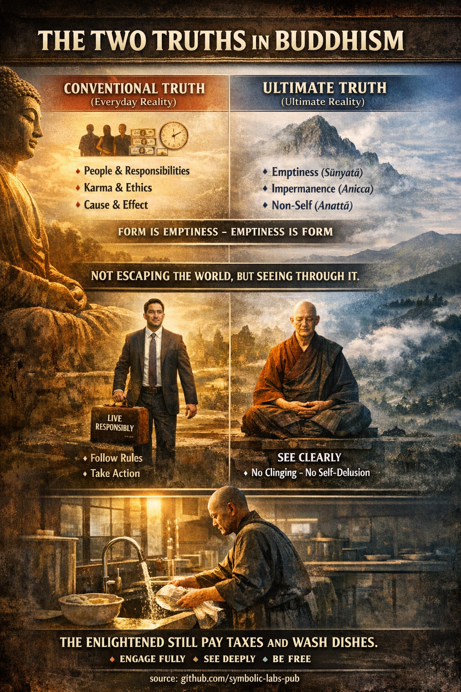

## [The Two Truths in Buddhist Teaching](https://github.com/symbolic-labs-pub/a-buddhist-view/blob/master/more/02_from_ignorance_to_awakening/5_the_two_truths/README.md#the-two-truths-in-buddhist-teaching)

*(Saṃvṛti-satya & Paramārtha-satya)*

The teaching of the **Two Truths** is a **precision tool** in Buddhism. It prevents two common errors:

* **Reifying the world** (taking appearances as ultimately real)
* **Negating the world** (falling into nihilism)

Instead, it shows **how reality functions on two inseparable levels at once**.

---

## [1. Conventional Truth (Saṃvṛti-satya)](https://github.com/symbolic-labs-pub/a-buddhist-view/blob/master/more/02_from_ignorance_to_awakening/5_the_two_truths/README.md#1-conventional-truth-saṃvṛti-satya)

This is the **functional, everyday level of reality**.

At this level:

* There are **persons, names, roles**
* Actions have **consequences** (karma)
* [Ethics](../../01_core_teachings/the_noble_eightfold_path/README.md#2-ethical-conduct-śīla), language, laws, time, and causality **operate reliably**

Examples:

* “This is a cup.”
* “You are responsible for your actions.”
* “If I speak harshly, [suffering](../2_the_four_noble_truths/README.md#1-there-is-suffering--dukkha) follows.”

Buddhism **never denies this level**.
Without conventional truth:

* No teaching is possible
* No path can be practiced
* No [compassion](../7_compassion/README.md#compassion-as-a-structural-principle-in-buddhist-teaching) can be expressed

The Buddha taught **in conventional language**, lived in society, followed rules, accepted food, taught disciples.

➡️ **Convention is not false** — it is *contextual*.

---

## [2. Ultimate Truth (Paramārtha-satya)](https://github.com/symbolic-labs-pub/a-buddhist-view/blob/master/more/02_from_ignorance_to_awakening/5_the_two_truths/README.md#2-ultimate-truth-paramārtha-satya)

Ultimate truth points to **how things actually exist when examined deeply**.

At this level:

* All phenomena are **empty of inherent essence** (śūnyatā)
* Everything is **impermanent** ([anicca](../../01_core_teachings/impermanence/README.md#2-impermanence-anicca-is-structural-not-accidental))
* There is **no independent self** ([anattā](../1_the_three_marks_of_existence/README.md#3-non-self-anattā))

The “cup”:

* Is not one thing, but clay + heat + time + perception + naming
* Cannot be found as a solid, independent entity

The “self”:

* Is a dynamic process (body, feeling, perception, formations, consciousness)
* Not a fixed core or owner

➡️ Ultimate truth **does not replace** conventional truth
➡️ It **reveals its lack of solidity**

---

## [3. Why Two Truths Are Necessary (Not Optional)](https://github.com/symbolic-labs-pub/a-buddhist-view/blob/master/more/02_from_ignorance_to_awakening/5_the_two_truths/README.md#3-why-two-truths-are-necessary-not-optional)

If you hold **only conventional truth**:

* You cling
* You solidify identities
* You suffer when things change

If you hold **only ultimate truth**:

* You risk nihilism
* You may dismiss ethics, care, responsibility

The Buddha’s insight is **non-dual**:

> Conventional truth is how things **work**
> Ultimate truth is how things **are**

They are **not two realities**, but **two ways of seeing the same reality**.

---

## [4. “Form Is Emptiness; Emptiness Is Form”](https://github.com/symbolic-labs-pub/a-buddhist-view/blob/master/more/02_from_ignorance_to_awakening/5_the_two_truths/README.md#4-form-is-emptiness-emptiness-is-form)

This famous line from the Heart Sūtra **is the Two Truths in one sentence**.

* **Form is [emptiness](../../10_concepts/01_emptiness/README.md#emptiness-śūnyatā-in-vajrayāna-buddhism)** → everything lacks inherent essence
* **Emptiness is form** → emptiness appears *as* everyday phenomena

Nothing disappears.
Nothing becomes meaningless.
Illusion dissolves, **function remains**.

---

## [5. Awakening According to Buddhism](https://github.com/symbolic-labs-pub/a-buddhist-view/blob/master/more/02_from_ignorance_to_awakening/5_the_two_truths/README.md#5-awakening-according-to-buddhism)

[Awakening](../../10_concepts/README.md#3-enlightenment-bodhi-awakening) is **not escaping the world**.

An awakened person:

* Still uses names and concepts
* Still follows ethical conduct
* Still experiences sensations and emotions

But:

* Without clinging
* Without self-deception
* Without mistaking convention for ultimate reality

Hence the traditional phrasing:

> “Before awakening: chop wood, carry water.
> After awakening: chop wood, carry water.”

Or in modern terms:

> **The enlightened still pay taxes and wash dishes.**

The difference is **internal**:

* No illusion of permanence
* No belief in a solid self
* No grasping at appearances

---

## [6. Practical Implication](https://github.com/symbolic-labs-pub/a-buddhist-view/blob/master/more/02_from_ignorance_to_awakening/5_the_two_truths/README.md#6-practical-implication)

The Two Truths teach you to:

* **Act fully** in the world
* **See clearly** through it at the same time

This produces:

* Responsibility without burden
* Compassion without attachment
* Freedom **within** form, not outside it

---

### In short

* Conventional truth keeps the world **working**
* Ultimate truth keeps the mind **free**
* Awakening is the **integration of both**

Not transcendence of life —
but **clarity inside life as it is**.

---

< [Emptiness (Śūnyatā) in Mahāyāna Buddhism](../4_emptiness/README.md) | [**Buddha-Nature (Tathāgatagarbha)** — explained through Buddhist teachings](../6_buddha_nature/README.md) >

_source: [github.com/sybolic-labs-pub](https://github.com/sybolic-labs-pub)_

---
