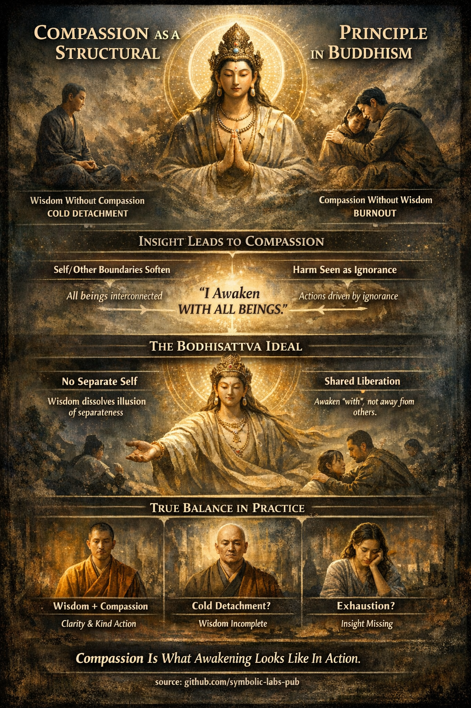

### Compassion as a Structural Principle in Buddhist Teaching

*(Why it is not optional, but inevitable)*

In Buddhism, **compassion (karuṇā)-and-compassion-are-functionally-inseparable)** is not a moral add-on or personality trait. It is a **structural consequence of insight into reality**. When wisdom deepens, compassion **must** arise—just as heat arises from fire.

Let’s unpack this through core Buddhist doctrines.

---

## [1. Wisdom and Compassion Are Functionally Inseparable](https://github.com/symbolic-labs-pub/a-buddhist-view/blob/master/more/02_from_ignorance_to_awakening/7_compassion/README.md#1-wisdom-and-compassion-are-functionally-inseparable)

Buddhist [wisdom (**prajñā**)](../../01_core_teachings/the_noble_eightfold_path/README.md#1-wisdom-paññā) is not abstract knowledge. It is *direct insight* into:

* [impermanence (anicca)](../../01_core_teachings/impermanence/README.md#2-impermanence-anicca-is-structural-not-accidental)
* [non-self (anattā)](../1_the_three_marks_of_existence/README.md#3-non-self-anattā)
* [dependent origination (paṭicca-samuppāda)](../3_dependent_origination/README.md#the-twelve-links-the-classic-formulation)
* emptiness (śūnyatā, in [Mahāyāna articulation)](../../10_concepts/01_emptiness/README.md#emptiness-śūnyatā-in-mahāyāna-buddhism)

When these are seen clearly:

* The idea of a **solid, separate self weakens**
* “Others” are no longer perceived as fundamentally different
* [Suffering](../2_the_four_noble_truths/README.md#1-there-is-suffering--dukkha) is recognized as a **systemic process**, not a personal failure

Thus:

* **Wisdom without compassion** becomes *misunderstanding*—a frozen, dissociated stance
* **Compassion without wisdom** becomes *unsustainable*—burnout driven by clinging and over-identification

Classical texts repeatedly stress this balance. The Buddha did not praise insight alone, but insight **conjoined with liberation from ill-will**.

---

## [2. Why Insight Naturally Expresses Itself as Compassion](https://github.com/symbolic-labs-pub/a-buddhist-view/blob/master/more/02_from_ignorance_to_awakening/7_compassion/README.md#2-why-insight-naturally-expresses-itself-as-compassion)

### a) Softening of Self / Other Boundaries

Through dependent origination, one sees that:

* “My” suffering and “your” suffering arise from **the same conditions**
* Identity is a **temporary configuration**, not a fixed essence

From this perspective:

* Helping another is not self-sacrifice
* It is **system-level coherence restoring itself**

This is why awakened beings are described as acting **spontaneously**, not heroically.

---

### b) Harm Is Seen as Ignorance-Driven

A key Buddhist shift is this reframing:

> Harmful action is not evil essence—it is **ignorance expressing itself**.

This does **not** mean excusing harm.
It means responding **without hatred**, because hatred presupposes a solid, blameworthy self.

The Buddha compares unwholesome action to:

* blindness
* illness
* entanglement in causes

From this view, compassion is not sentimental—it is **accurate diagnosis**.

---

## [3. The Mahāyāna Resolution: The Bodhisattva Ideal](https://github.com/symbolic-labs-pub/a-buddhist-view/blob/master/more/02_from_ignorance_to_awakening/7_compassion/README.md#3-the-mahāyāna-resolution-the-bodhisattva-ideal)

[Mahāyāna](../../05_yanas/README.md#limitation-from-mahāyāna-view) Buddhism radicalizes this logic.

If:

* there is no independent self
* [awakening](../../10_concepts/README.md#3-enlightenment-bodhi-awakening) dissolves the illusion of separateness
* suffering is shared across conditions

Then awakening **cannot be private**.

Hence the [Bodhisattva](../../08_lineage/08_bodhisattva/README.md#4-the-bodhisattva-vow-as-structural-alignment) vow:

> “Beings are numberless; I vow to free them.”

This is not altruism in the conventional sense.
It is **non-dual realization expressed in action**.

The Bodhisattva does not delay enlightenment out of pity.
Rather:

* enlightenment *includes* others
* liberation is **co-arising**, not individual escape

---

## [4. Compassion as a Structural Property of Reality-Seen-Clearly](https://github.com/symbolic-labs-pub/a-buddhist-view/blob/master/more/02_from_ignorance_to_awakening/7_compassion/README.md#4-compassion-as-a-structural-property-of-reality-seen-clearly)

In advanced Buddhist understanding:

* [Ethics](../../01_core_teachings/the_noble_eightfold_path/README.md#2-ethical-conduct-śīla) arise from ontology
* Compassion arises from insight
* Liberation is relational, not solipsistic

Just as gravity bends space,
**wisdom bends action toward compassion**.

Not because one *should*,
but because there is no longer a conceptual boundary preventing it.

---

## [5. Practical Implication for Practice](https://github.com/symbolic-labs-pub/a-buddhist-view/blob/master/more/02_from_ignorance_to_awakening/7_compassion/README.md#5-practical-implication-for-practice)

This teaching functions as a **diagnostic tool**:

* If insight leads to coldness → wisdom is incomplete
* If compassion leads to exhaustion → insight is missing
* When both mature → action becomes steady, clear, and non-burning

This is why Buddhist paths always integrate:

* wisdom (prajñā)
* ethical conduct (śīla)
* cultivation of heart qualities (brahmavihāras)

They are **one system**, not three choices.

---

### In short

Compassion is not a virtue layered on awakening.
It is **what awakening looks like when it moves**.

---

< [**Buddha-Nature (Tathāgatagarbha)** — explained through Buddhist teachings](../6_buddha_nature/README.md) | [1. The Three Marks of Existence](../README.md) >

_source: [github.com/symbolic-labs-pub](https://github.com/symbolic-labs-pub)_

---
