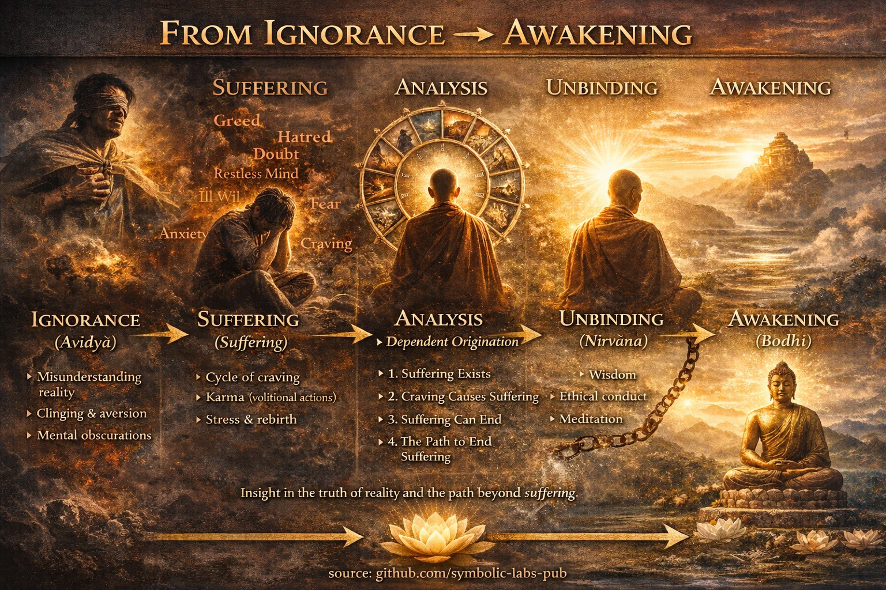

## 1. The Three Marks of Existence

All conditioned phenomena share three characteristics:

1. **[Impermanence (Anicca)](../01_core_teachings/impermanence/README.md#2-impermanence-anicca-is-structural-not-accidental)**
   Everything that arises passes.

2. **Unsatisfactoriness ([Dukkha](2_the_four_noble_truths/README.md#1-there-is-suffering--dukkha))**
   Clinging to impermanent things inevitably disappoints.

3. **[Non-self (Anattā)](1_the_three_marks_of_existence/README.md#3-non-self-anattā)**
   No permanent, independent “self” can be found in body or mind.

> This is the **ontological core** of Buddhism.
> Miss any one of the three → misunderstanding follows.

---

## 2. The Four Noble Truths

*(The diagnostic framework)*

1. **There is suffering** (dukkha exists)
2. **Suffering has causes** (craving, ignorance)
3. **Suffering can cease** (nirvāṇa is possible)
4. **There is a path leading to its cessation** (the [Eightfold Path](../01_core_teachings/the_noble_eightfold_path/README.md#what-the-noble-eightfold-path-is-in-buddhism))

Think of this as:

* **Symptom**
* **Cause**
* **Prognosis**
* **Treatment**

Buddhism is radically *therapeutic*, not metaphysical speculation.

---

## 3. Dependent Origination (Paṭicca-samuppāda)

*(The deep causal engine of reality)*

Nothing exists independently. Everything arises **because conditions allow it**.

Classic formulation: **12 linked processes**, starting with ignorance and ending in suffering.

Key insight:

* Remove or weaken conditions → the effect collapses
* No first cause
* No isolated entity

> This teaching quietly destroys:
>
> * Eternalism (“things exist forever”)
> * Nihilism (“nothing matters”)

---

## 4. Emptiness (Śūnyatā) — *Often mistaken for "secret"*

**[Emptiness](../10_concepts/01_emptiness/README.md#emptiness-śūnyatā-in-vajrayāna-buddhism) does NOT mean nothing exists.**

It means:

* Things lack **inherent, independent essence**
* Everything exists **relationally**

A classic formula:

> “Form is emptiness; emptiness is form.”

This is not philosophy—it’s **perceptual reconfiguration**.

Why it’s taught later:

* Without [ethics](../01_core_teachings/the_noble_eightfold_path/README.md#2-ethical-conduct-śīla) and compassion, emptiness can be misunderstood as nihilism.
* With maturity, it produces **fearlessness and flexibility**.

---

## [5. The Two Truths](5_the_two_truths/README.md)

* [**Conventional Truth**](5_the_two_truths/README.md#the-two-truths-in-buddhist-teaching)
  The everyday world: people, rules, responsibilities.

* **Ultimate Truth**
  Emptiness, impermanence, non-self.

[Awakening](../10_concepts/README.md#3-enlightenment-bodhi-awakening) is **not escaping convention**, but **operating within it without delusion**.

> The enlightened still pay taxes and wash dishes.

---

## 6. Buddha-Nature (Tathāgatagarbha)

Teaching:

* All beings possess the **capacity for awakening**
* Enlightenment is **revealed**, not manufactured

Metaphors:

* Gold covered in dirt
* Seed inside a [lotus](../09_symbols/08_lotus/README.md#the-lotus-in-buddhist-teaching) pod
* Clear sky behind clouds

This counters despair and spiritual elitism.

---

## 7. Compassion as a Structural Principle

*(Not optional)*

[Wisdom](../01_core_teachings/the_noble_eightfold_path/README.md#1-wisdom-paññā) without [compassion](7_compassion/README.md#compassion-as-a-structural-principle-in-buddhist-teaching) = cold detachment
Compassion without wisdom = burnout

Advanced insight **naturally expresses itself as compassion**, because:

* Self/other boundaries soften
* Harm is seen as ignorance-driven

This is why [Mahāyāna](../05_yanas/README.md#limitation-from-mahāyāna-view) emphasizes the **[Bodhisattva](../08_lineage/08_bodhisattva/README.md#4-the-bodhisattva-vow-as-structural-alignment) ideal**:

> “I awaken *with* all beings.”

---

## 8. Are There “Secret Teachings”?

**No hidden truths are withheld.**
But there *are* teachings that are:

* Context-dependent
* Practice-dependent
* Easily misunderstood without preparation

Examples:

* Emptiness
* Non-duality
* Certain tantric visualizations ([Vajrayāna](../05_yanas/README.md#4-vajrayāna-tantrayāna-mantrayāna---the-diamond-vehicle))

These are not secrets—they are **high-bandwidth instructions** that require:

* Ethical stability
* [Concentration](../01_core_teachings/the_noble_eightfold_path/README.md#8-right-concentration-sammā-samādhi)
* Guidance

> Like handing a jet engine manual to someone who hasn’t learned mechanics yet.

---

## One-Sentence Synthesis

**Buddhism is a precision system for eliminating unnecessary suffering by seeing reality clearly, acting ethically, and cultivating compassion—without clinging to fixed identities or metaphysical absolutes.**

---

< [1. Wisdom and Compassion Are Functionally Inseparable](7_compassion/README.md) | [What “Ending Suffering” Actually Means](../03_the_path_to_end_suffering/README.md) >

_source: [github.com/symbolic-labs-pub](https://github.com/symbolic-labs-pub)_

---
