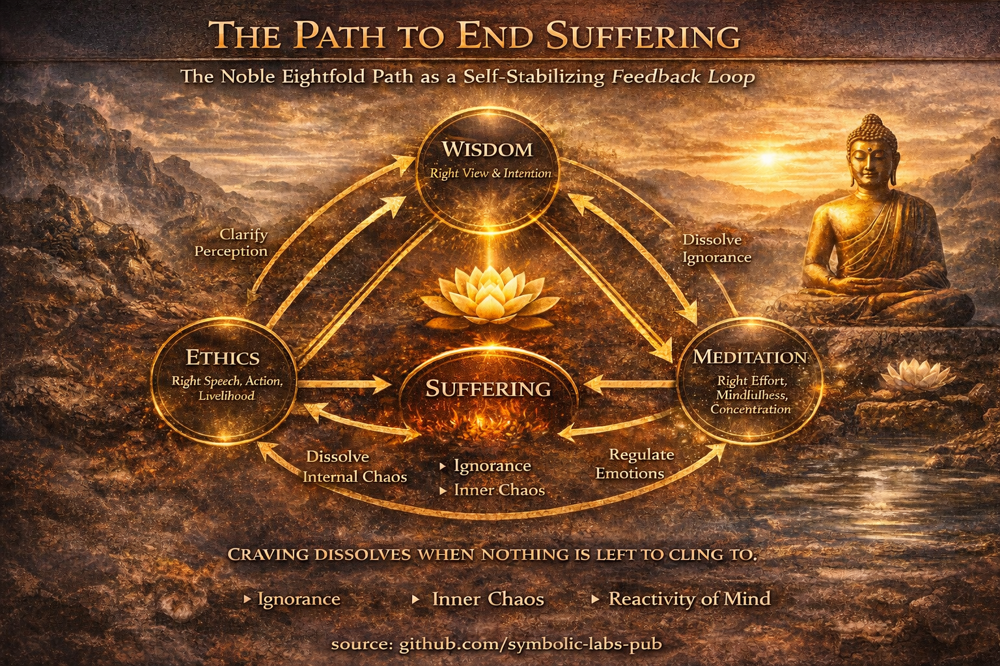
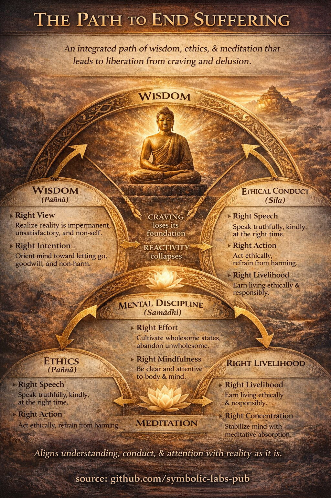

## [What “Ending Suffering” Actually Means](https://github.com/symbolic-labs-pub/a-buddhist-view/blob/master/more/03_the_path_to_end_suffering/README.md#what-ending-suffering-actually-means)

In Buddhist teaching, *ending suffering* does **not** mean:

* eliminating pain,
* controlling the world,
* or achieving permanent pleasure.

It means **ending unnecessary suffering**—the suffering that arises from:

* misunderstanding reality,
* clinging to what changes,
* and identifying with what is not a stable self.

This cessation is called **nirvāṇa**: the *unbinding* of the mechanisms that generate suffering.

---

## [The Core Diagnosis (Why Suffering Arises)](https://github.com/symbolic-labs-pub/a-buddhist-view/blob/master/more/03_the_path_to_end_suffering/README.md#the-core-diagnosis-why-suffering-arises)

Suffering arises because of **ignorance (avidyā)**—specifically:

* ignorance of [impermanence](../01_core_teachings/impermanence/README.md#2-impermanence-anicca-is-structural-not-accidental),
* ignorance of [non-self](../02_from_ignorance_to_awakening/1_the_three_marks_of_existence/README.md#3-non-self-anattā),
* ignorance of causal dependence.

From ignorance follow:

* craving,
* aversion,
* habitual reactions,
* and the sense of a threatened or incomplete “me”.

The path is therefore **not moral punishment or reward**, but **causal correction**.

---

## [The Path to End Suffering: The Noble Eightfold Path](https://github.com/symbolic-labs-pub/a-buddhist-view/blob/master/more/03_the_path_to_end_suffering/README.md#the-path-to-end-suffering-the-noble-eightfold-path)

The Buddha taught **one integrated path**, traditionally grouped into **three mutually reinforcing domains**.

---

## [1. Wisdom (Paññā) — *Correcting Misunderstanding*](https://github.com/symbolic-labs-pub/a-buddhist-view/blob/master/more/03_the_path_to_end_suffering/README.md#1-wisdom-paññā--correcting-misunderstanding)

### Right View

Seeing reality accurately:

* things are impermanent,
* clinging produces suffering,
* actions have consequences.

This is not belief—it is *gradually verified insight*.

### Right Intention

Orienting the mind toward:

* renunciation (letting go),
* goodwill (non-hatred),
* non-harm.

**Wisdom begins the path** because without it, effort goes in the wrong direction.

---

## [2. Ethical Conduct (Śīla) — *Stabilizing Life Conditions*](https://github.com/symbolic-labs-pub/a-buddhist-view/blob/master/more/03_the_path_to_end_suffering/README.md#2-ethical-conduct-śīla--stabilizing-life-conditions)

### Right Speech

Speaking truthfully, kindly, and at the right time.

### Right Action

Avoiding actions that cause harm to oneself or others.

### Right Livelihood

Earning a living without exploiting, deceiving, or injuring others.

**Why ethics matters**
Unethical behavior creates agitation, guilt, fear, and defensiveness—making insight impossible.

Ethics is not moralism; it is **system stabilization**.

---

## [3. Mental Discipline (Samādhi) — *Rewiring the Mind*](https://github.com/symbolic-labs-pub/a-buddhist-view/blob/master/more/03_the_path_to_end_suffering/README.md#3-mental-discipline-samādhi--rewiring-the-mind)

### Right Effort

* Prevent unwholesome states from arising
* Abandon those that have arisen
* Cultivate wholesome states
* Sustain them

### Right Mindfulness

Clear [awareness](../10_concepts/README.md#2-awareness-rigpa-vijñāna-knowing) of:

* body,
* feelings,
* mental states,
* patterns of experience.

[Mindfulness](../01_core_teachings/the_noble_eightfold_path/README.md#7-right-mindfulness-sammā-sati) exposes craving *as it forms*, before it hardens into suffering.

### Right Concentration

Deep mental unification ([meditative](../08_lineage/README.md) absorption), enabling:

* clarity,
* emotional regulation,
* and insight beyond conceptual thought.

---

## [How the Path Ends Suffering (Causal Logic)](https://github.com/symbolic-labs-pub/a-buddhist-view/blob/master/more/03_the_path_to_end_suffering/README.md#how-the-path-ends-suffering-causal-logic)

1. **Ethics reduces external and internal chaos**
2. **Meditation stabilizes attention and emotion**
3. **Wisdom sees through the illusion of a fixed self**
4. **Craving loses its foundation**
5. **Reactivity collapses**
6. **Suffering ceases—not by force, but by lack of fuel**

> Suffering ends the same way a fire ends:
> **when nothing is left to burn.**

---

## [What This Is *Not*](https://github.com/symbolic-labs-pub/a-buddhist-view/blob/master/more/03_the_path_to_end_suffering/README.md#what-this-is-not)

* Not blind faith
* Not self-denial for its own sake
* Not withdrawal from life
* Not emotional numbness

[Awakening](../10_concepts/README.md#3-enlightenment-bodhi-awakening) is described as:

* clarity without rigidity,
* [compassion](../02_from_ignorance_to_awakening/7_compassion/README.md#compassion-as-a-structural-principle-in-buddhist-teaching) without obligation,
* engagement without attachment.

---

## [One-Sentence Summary](https://github.com/symbolic-labs-pub/a-buddhist-view/blob/master/more/03_the_path_to_end_suffering/README.md#one-sentence-summary)

**The path to end suffering works by aligning understanding, conduct, and attention with how reality actually functions—so that craving, fear, and false identity no longer arise.**

---

---

< [1. The Three Marks of Existence](../02_from_ignorance_to_awakening/README.md) | [A Teaching on the Three Bodies of Awakening](../04_kayas/README.md) >

_source: [github.com/symbolic-labs-pub](https://github.com/symbolic-labs-pub)_

---
