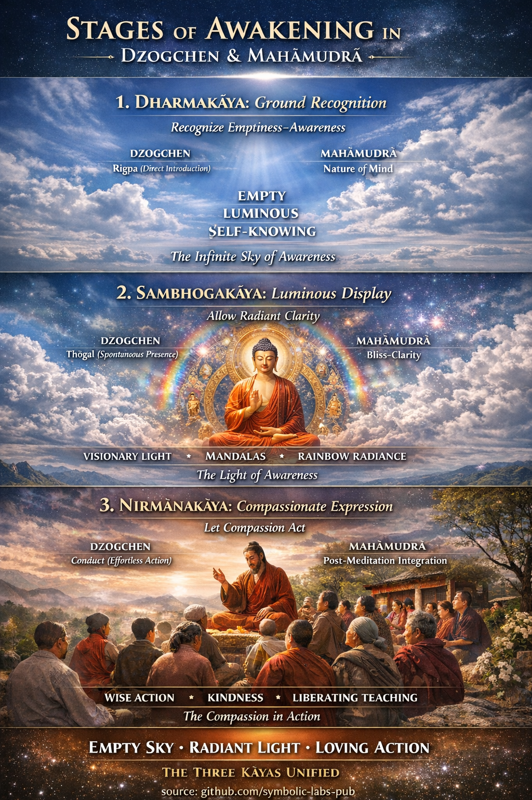

## [1. Dharmakāya → *Ground Recognition*](https://github.com/symbolic-labs-pub/a-buddhist-view/blob/master/more/04_kayas/mahamudra_and_dzogcsen/README.md#1-dharmakāya--ground-recognition)

### Dzogchen: **Rigpa (རིག་པ་) — Direct Introduction**

**What happens**

* The teacher introduces the **nature of mind** (*sems nyid*)
* [Awareness](../../10_concepts/README.md#2-awareness-rigpa-vijñāna-knowing) recognizes itself as:

  * [Empty](../../10_concepts/01_emptiness/README.md#emptiness-śūnyatā-in-vajrayāna-buddhism)
  * Luminous
  * Self-knowing

**Key Dzogchen stages**

* **Direct Introduction** (*ngo sprod*)
* **Cutting through** (*trekchö*) — stabilizing emptiness

**Experiential signature**

* No center
* No meditator
* Awareness without effort

> Dharmakāya here is not achieved — it is **recognized**.

---

### Mahāmudrā: **Nature of Mind (སེམས་ཀྱི་གནས་ལུགས་)**

**What happens**

* Progressive settling of mind
* Insight (*vipashyanā*) reveals:

  * Thoughts arise and dissolve in emptiness
  * Awareness is unfindable yet present

**Key Mahāmudrā stages**

1. One-pointedness
2. Simplicity
3. One taste
4. Non-meditation

Dharmakāya is fully evident at **Simplicity → One Taste**.

---

## 2. Sambhogakāya → *Clarity & Luminous Display*

### Dzogchen: **Spontaneous Presence (ལྷུན་གྲུབ་)**

**What happens**

* After stability in emptiness
* The **natural radiance** of awareness unfolds

**Practices**

* **Thögal** (ཐོད་རྒལ་) — direct leap
* Visionary displays:

  * Lights
  * [Mandalas](../../09_symbols/07_mandala/README.md#mandala--explained-according-to-buddhist-teachings)
  * Deities
  * Rainbow phenomena

**Crucial point**

* These are **not hallucinations**
* They are the **symbolic language of awareness itself**

> Sambhogakāya = awareness recognizing its own display.

---

### Mahāmudrā: **Bliss–Clarity–Nonthought**

**What happens**

* Meditative absorption deepens
* Mind becomes:

  * Blissful
  * Vivid
  * Unobstructed

**Correspondence**

* Mahāmudrā accesses Sambhogakāya **less visually**
* More **felt as clarity and non-duality**
* Tantra accelerates this phase

---

## 3. Nirmāṇakāya → *Embodied Compassion*

### Dzogchen: **Conduct (སྤྱོད་པ་)**

**What happens**

* [Rigpa](../../10_concepts/README.md#2-awareness-rigpa-vijñāna-knowing) remains unbroken in activity
* Action arises **without deliberation**

**Signs**

* Effortless [ethics](../../01_core_teachings/the_noble_eightfold_path/README.md#2-ethical-conduct-śīla)
* Skillful speech
* Teaching without strategy

> Compassion is no longer cultivated — it **emanates**.

---

### Mahāmudrā: **Post-Meditation Integration**

**What happens**

* No split between session and life
* Thoughts and emotions self-liberate
* Conduct is natural, not imposed

**Classic phrase**

> “[Meditation](../../08_lineage/README.md) is the session.
> Conduct is the proof.”

---

## Unified View: How the Kāyas Unfold

| Stage      | Kāya             | What is realized       |
| ---------- | ---------------- | ---------------------- |
| Ground     | [**Dharmakāya**](#1-dharmakāya-→-ground-recognition)   | [Emptiness](../../10_concepts/01_emptiness/README.md#emptiness-śūnyatā-in-vajrayāna-buddhism)-[awareness](../../10_concepts/README.md#2-awareness-rigpa-vijñāna-knowing)    |
| Display    | [**Sambhogakāya**](#2-sambhogakāya-→-clarity-luminous-display) | Luminous clarity       |
| Expression | [**Nirmāṇakāya**](#3-nirmāṇakāya-→-embodied-compassion)  | [Compassionate](#3-nirmāṇakāya-→-embodied-compassion) activity |

They are **simultaneous**, but **recognized progressively**.

---

## Subtle but Essential Insight

* **Dzogchen** emphasizes:

  * Instant recognition
  * Non-fabrication
  * Spontaneous presence

* **Mahāmudrā** emphasizes:

  * Gradual refinement
  * Meditative stabilization
  * Seamless integration

Yet the **realization is identical**.

> Different doors. Same room.

---

## Diagnostic Question (Used by Tibetan Masters)

Ask a practitioner:

* *Is your awareness empty?* → Dharmakāya
* *Is it clear and vivid?* → Sambhogakāya
* *Does it naturally benefit others?* → Nirmāṇakāya

If any is missing, realization is incomplete.

---

## One-Line Integration Formula

> **Recognize emptiness ([Dharmakāya)](../../10_concepts/01_emptiness/README.md#emptiness-śūnyatā-in-mahāyāna-buddhism),
> allow clarity to shine (Sambhogakāya),
> let compassion act (Nirmāṇakāya).**

---

< [A Teaching on the Three Bodies of Awakening](../README.md) | [What is a Yāna?](../../05_yanas/README.md) >

_source: [github.com/symbolic-labs-pub](https://github.com/symbolic-labs-pub)_

---
