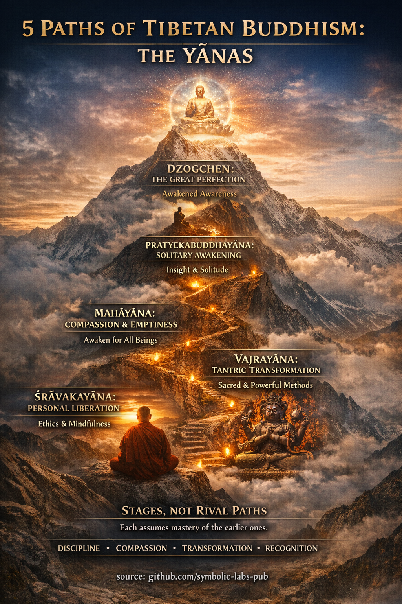

## [What is a Yāna?](https://github.com/symbolic-labs-pub/a-buddhist-view/blob/master/more/05_yanas/README.md#what-is-a-yāna)

Teaching

## [A Teaching on the Vehicles of the Path](https://github.com/symbolic-labs-pub/a-buddhist-view/blob/master/more/05_yanas/README.md#a-teaching-on-the-vehicles-of-the-path)

*(The Yānas as a Single Living Way)*

All beings seek freedom from [suffering](../02_from_ignorance_to_awakening/2_the_four_noble_truths/README.md#1-there-is-suffering--dukkha).
Yet beings differ in capacity, conditioning, fear, courage, and vision.
Out of compassion, the Buddha did not teach a single rigid path, but **vehicles**—ways of traveling—each complete, each valid, each suited to a moment in development.

These vehicles are not rivals.
They are **stages of maturation** within one unfolding journey.

---

### The First Foundation — Discipline and Renunciation

*(Śrāvakayāna)*

First, one learns to stop causing harm.

Seeing that life is marked by dissatisfaction, one turns inward and begins to restrain body, speech, and mind. [Ethics](../01_core_teachings/the_noble_eightfold_path/README.md#2-ethical-conduct-śīla) stabilize attention. [Mindfulness](../01_core_teachings/the_noble_eightfold_path/README.md#7-right-mindfulness-sammā-sati) reveals [impermanence](../01_core_teachings/impermanence/README.md#2-impermanence-anicca-is-structural-not-accidental). Insight loosens identification.

This stage teaches a crucial truth:

> **Freedom begins by no longer feeding suffering.**

Without this foundation, higher aspirations collapse into spiritual fantasy.

---

### The Second Insight — Solitary Awakening

*(Pratyekabuddhayāna)*

Some beings awaken quietly.

By observing how all things arise from conditions and pass away when conditions dissolve, the mind releases its grasping. This [awakening](../10_concepts/README.md#3-enlightenment-bodhi-awakening) requires no doctrine, no community—only clarity.

Yet insight alone does not naturally turn outward.

Thus this vehicle is complete, but inward-facing.

---

### The Great Turning — Compassionate Awakening

*(Mahāyāna)*

Here the path widens.

Seeing that no being is separate, the practitioner generates **bodhicitta**—the vow to awaken for the sake of all. [Emptiness](../10_concepts/01_emptiness/README.md#emptiness-śūnyatā-in-vajrayāna-buddhism) is no longer cold analysis, but the ground of [compassion](../02_from_ignorance_to_awakening/7_compassion/README.md#compassion-as-a-structural-principle-in-buddhist-teaching). Because nothing exists independently, everything matters.

This realization transforms motivation:

> **Liberation that excludes others is incomplete.**

[Wisdom](../01_core_teachings/the_noble_eightfold_path/README.md#1-wisdom-paññā) and compassion become inseparable.

---

### The Diamond Method — Transformation

*(Vajrayāna)*

Now the path accelerates.

Rather than abandoning emotion, perception, and identity, one **transforms** them. Anger becomes clarity. Desire becomes wisdom. Fear becomes energy.

By practicing the result as the path—seeing oneself and the world as already pure—the practitioner shortens the distance between confusion and awakening.

Yet this vehicle demands precision, humility, and guidance.
Power without grounding becomes delusion.

---

### The Great Perfection — Recognition

*(Dzogchen)*

At the summit, nothing is added.

Awakening is recognized as already present.
[Awareness](../10_concepts/README.md#2-awareness-rigpa-vijñāna-knowing) rests in itself—open, luminous, uncontrived.

There is no path to walk, yet nothing is excluded.
Ethics, compassion, and skillful means arise spontaneously, like sunlight from the sun.

This is not attainment, but **remembering**.

---

### One Path, Many Doors

These vehicles are not ladders to escape the world.
They are ways of **inhabiting reality without confusion**.

Discipline refines the body.
Compassion opens the heart.
Transformation frees perception.
Recognition liberates mind itself.

When integrated, they form a single living [Dharma](../01_core_teachings/the_three_jewels/README.md#2-dharma--the-path-and-the-law-of-reality).

---

### Final Instruction

Do not ask, *“Which vehicle is highest?”*
Ask instead:

> *Which quality is missing in me right now?*

Cultivate that.

The path unfolds naturally when nothing essential is skipped.

<<<<<<< HEAD
=======

>>>>>>> 0ffb90f63988166d749a83ba88e2bfad5781a9a7

---

Explanation

**Yāna** (Sanskrit: *vehicle*, Tibetan: *theg pa*) means:

> *A complete method for moving from confusion to awakening.*

Each yāna includes:

* a **view** (how reality is understood)
* a **practice** (how transformation happens)
* a **result** (what liberation means)

They differ **not by truth**, but by **skillful means**, depth, and speed.

---

## [1. Śrāvakayāna — *The Listener’s Vehicle*](https://github.com/symbolic-labs-pub/a-buddhist-view/blob/master/more/05_yanas/README.md#1-śrāvakayāna--the-listeners-vehicle)

*(Often grouped under “Hīnayāna” in Tibetan texts)*

### Core Aim

Personal liberation from suffering (*arhatship*).

### Key Teachings

* [Four Noble Truths](../02_from_ignorance_to_awakening/2_the_four_noble_truths/README.md#the-four-noble-truths--as-the-buddha-meant-them)
* [Eightfold Path](../01_core_teachings/the_noble_eightfold_path/README.md#what-the-noble-eightfold-path-is-in-buddhism)
* Impermanence, suffering, [non-self](../02_from_ignorance_to_awakening/1_the_three_marks_of_existence/README.md#3-non-self-anattā)

### Practice Emphasis

* Ethical discipline (*śīla*)
* [Concentration (*samādhi*)](../01_core_teachings/the_noble_eightfold_path/README.md#8-right-concentration-sammā-samādhi)
* [Analytical insight (*vipassanā*)](shikantaza_and_vipassana/README.md#shared-baseline-3-knobs-of-attention)

### View of Self

No permanent self, but **phenomena are treated as conventionally real**.

### Result

Cessation of suffering for oneself.

> Tibetan texts treat this not as inferior, but as **foundational**.
> Without this discipline, higher vehicles collapse into fantasy.

---

## [2. Pratyekabuddhayāna — *The Solitary Realizer’s Vehicle*](https://github.com/symbolic-labs-pub/a-buddhist-view/blob/master/more/05_yanas/README.md#2-pratyekabuddhayāna--the-solitary-realizers-vehicle)

### Core Aim

Self-awakening without reliance on a teaching community.

### Key Characteristics

* Awakening through **direct insight into [dependent origination](../02_from_ignorance_to_awakening/3_dependent_origination/README.md#the-twelve-links-the-classic-formulation)**
* Appears in eras when Dharma is not taught

### Practice Emphasis

* Deep contemplation of causality
* Natural solitude

### Limitation (from Mahāyāna view)

Wisdom without explicit compassion teaching.

### Result

Liberation, but without teaching others.

> This yāna is respected but rarely practiced intentionally today.

---

## [3. Mahāyāna — *The Great Vehicle*](https://github.com/symbolic-labs-pub/a-buddhist-view/blob/master/more/05_yanas/README.md#3-mahāyāna--the-great-vehicle)

### Core Aim

**Full Buddhahood for the benefit of all beings.**

### Defining Feature

**Bodhicitta** — the vow to awaken for all beings.

### Core Teachings

* Śūnyatā (emptiness)
* [Two Truths (conventional / ultimate)](../02_from_ignorance_to_awakening/5_the_two_truths/README.md#the-two-truths-in-buddhist-teaching)
* [Buddha-nature (*tathāgatagarbha*)](../02_from_ignorance_to_awakening/6_buddha_nature/README.md#buddha-nature-tathāgatagarbha--explained-through-buddhist-teachings)

### Practice Emphasis

* Six [Pāramitās](../01_core_teachings/perfections/README.md#how-the-pāramitās-work-together) (generosity, ethics, patience, effort, meditation, wisdom), patience, effort, meditation, wisdom)
* Compassion as method, wisdom as view

### View of Reality

* All phenomena are empty of inherent existence
* Compassion arises naturally from emptiness

### Result

Complete Buddhahood — omniscient, compassionate activity.

> In Tibet, **everything above this assumes Mahāyāna motivation**.

---

## [4. Vajrayāna (Tantrayāna / Mantrayāna) — *The Diamond Vehicle*](https://github.com/symbolic-labs-pub/a-buddhist-view/blob/master/more/05_yanas/README.md#4-vajrayāna-tantrayāna--mantrayāna--the-diamond-vehicle)

### Core Aim

**Rapid Buddhahood in a single lifetime** (under proper conditions).

### Key Principle

> *Take the result as the path.*

One practices **as if already awakened**, using:

* [Deity yoga](../03_the_path_to_end_suffering/README.md#right-action)
* Mantra
* Mudrā
* [Mandala](../09_symbols/07_mandala/README.md#mandala--explained-according-to-buddhist-teachings) visualization

### Distinctive Features

* Guru-disciple transmission
* Sacred view: all appearances are pure
* Transformation rather than renunciation of emotions

### View of Reality

Emptiness inseparable from appearance
Bliss inseparable from wisdom

### Requirements

* Strong ethics
* Stable Mahāyāna compassion
* Qualified teacher

> Without Mahāyāna grounding, Vajrayāna is considered dangerous or ineffective.

---

## [5. Dzogchen — *The Great Perfection*](https://github.com/symbolic-labs-pub/a-buddhist-view/blob/master/more/05_yanas/README.md#5-dzogchen--the-great-perfection)

*(Often presented as the pinnacle of Vajrayāna in Nyingma)*

### Core Aim

Direct recognition of **rigpa** — primordial awareness.

### Radical View

* Enlightenment is **already present**
* Nothing needs to be fabricated, purified, or corrected

### Practice Style

* *Trekchö*: cutting through conceptual mind
* *Tögal*: direct vision practices (advanced)

### Distinction

No gradual path — only **recognition and stabilization**.

### Risk

Without preparation, practitioners mistake:

* blankness for awareness
* concepts for realization

> Tibetan masters insist Dzogchen **includes all other yānas implicitly**.

---

## [Integrated Tibetan View (Very Important)](https://github.com/symbolic-labs-pub/a-buddhist-view/blob/master/more/05_yanas/README.md#integrated-tibetan-view-very-important)

Tibetan Buddhism does **not** see yānas as competing paths:

| Yāna        | What it Trains                 |
| ----------- | ------------------------------ |
| Śrāvakayāna | Discipline, renunciation       |
| [Mahāyāna](#limitation-from-mahāyāna-view)    | [Compassion](#the-great-turning---compassionate-awakening), [emptiness](../10_concepts/01_emptiness/README.md#emptiness-śūnyatā-in-vajrayāna-buddhism)          |
| [Vajrayāna](#4-vajrayāna-tantrayāna-mantrayāna---the-diamond-vehicle)   | Skillful means, transformation |
| [Dzogchen](#5-dzogchen---the-great-perfection)    | Recognition of nature of mind  |

> **Higher vehicles do not cancel lower ones — they *assume mastery of them*.**

---

## [A Crucial Tibetan Analogy](https://github.com/symbolic-labs-pub/a-buddhist-view/blob/master/more/05_yanas/README.md#a-crucial-tibetan-analogy)

> *You don’t climb a mountain by denying the lower slopes.*

Trying to “jump” to Dzogchen without ethics and compassion is described as:

> *“Like a bird with broken wings trying to fly.”*

---

## [Practical Guidance (Modern Application)](https://github.com/symbolic-labs-pub/a-buddhist-view/blob/master/more/05_yanas/README.md#practical-guidance-modern-application)

**Low-hanging fruit / quick wins**:

* Practice **Śīla + Mindfulness** daily (Śrāvakayāna base)
* Cultivate **Bodhicitta** intentionally (Mahāyāna pivot)
* Study Vajrayāna symbolically before practicing ritually
* Treat Dzogchen teachings as **orientation**, not technique

**Structural improvement insight**:
Many modern practitioners fail not due to lack of teachings, but due to **skipping vehicle integration**. The Lamrim-style graduated approach remains one of the most robust systems ever devised for cognitive–ethical–perceptual transformation.

---

< [1. Dharmakāya → *Ground Recognition*](../04_kayas/mahamudra_and_dzogcsen/README.md) | [Shared baseline: 3 knobs of attention](shikantaza_and_vipassana/README.md) >

_source: [github.com/symbolic-labs-pub](https://github.com/symbolic-labs-pub)_

---
