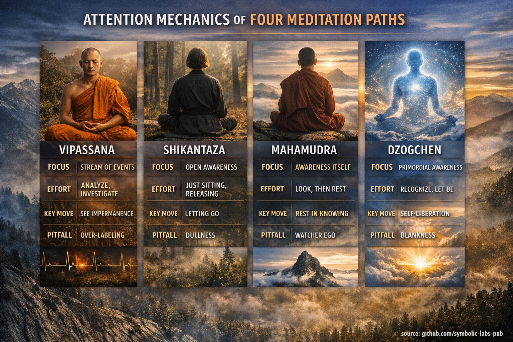

## [Shared baseline: 3 knobs of attention](https://github.com/symbolic-labs-pub/a-buddhist-view/blob/master/more/05_yanas/shikantaza_and_vipassana/README.md#shared-baseline-3-knobs-of-attention)

All four methods manipulate some combination of:

1. **Selectivity** — narrow vs open field (spotlight vs floodlight)
2. **Effort** — active control vs effortless presence
3. **Reification** — whether you treat experience as “things” (objects) or as “display/knowing”

A useful mental model:

* **Samatha-style**: reduce noise (stabilize)
* **Insight-style**: increase resolution (see structure)
* **Nondual-style**: change the *reference frame* (knowing recognizes itself)

---

## [1) Vipassanā (Theravāda insight) — “feature extraction + de-reification”](https://github.com/symbolic-labs-pub/a-buddhist-view/blob/master/more/05_yanas/shikantaza_and_vipassana/README.md#1-vipassanā-theravāda-insight--feature-extraction--de-reification)

### Object model

Experience is parsed into **events**: sensations, feelings, intentions, thoughts.
Attention learns to see **arising/vanishing** and causal links.

### Control loop (mechanics)

* Often starts with **anchoring** (breath/body) to build stability
* Then **systematic noting** or clear observation:

  * label/track phenomena
  * detect [impermanence](../../01_core_teachings/impermanence/README.md#2-impermanence-anicca-is-structural-not-accidental), [unsatisfactoriness](../../02_from_ignorance_to_awakening/2_the_four_noble_truths/README.md#1-there-is-suffering--dukkha), not-self
* Attention is **active**: “keep it on-process, don’t drift.”

### Recognition event

Not a single “aha” necessarily, but shifts like:

* rapid clarity of momentariness
* decoupling of “observer” from phenomena
* insight into non-ownership ([anattā](../../02_from_ignorance_to_awakening/1_the_three_marks_of_existence/README.md#3-non-self-anattā))

### Stabilization

Stability comes from repeated cycles:

* **contact → observation → non-clinging**
  Over time, attention becomes less sticky; phenomena self-liberate via understanding.

### Pitfalls (attention failure modes)

* **Over-labeling**: turning practice into narration (concepts replace perception)
* **Micro-controlling**: tension, “tight” attention
* **Insight chasing**: destabilization without enough samatha
* **Subtle duality**: a watcher watching objects forever

**Signature:** high-resolution phenomenology; “debugging the stream.”

---

## [2) Shikantaza (Zen “just sitting”) — “global awareness with minimal intervention”](https://github.com/symbolic-labs-pub/a-buddhist-view/blob/master/more/05_yanas/shikantaza_and_vipassana/README.md#2-shikantaza-zen-just-sitting--global-awareness-with-minimal-intervention)

### Object model

No privileged object. Everything appears in a **single field**.
You do not analyze; you *do not manipulate contents*.

### Control loop (mechanics)

* Posture + breath establish a **non-dramatic baseline**
* Attention is **open** and **non-grasping**:

  * thoughts arise
  * you don’t follow
  * you don’t suppress
* The “loop” is basically: **notice engagement → release**.

Effort is subtle: not forcing focus, but not spacing out.

### Recognition event

Often described as:

* the field being self-sufficient
* less center/periphery hierarchy
* “ordinary mind” clarity (no special-state dependence)

### Stabilization

Repeatedly returning to **non-interference** rewires attention:

* less compulsive selection
* more evenness (equanimity)
* fewer “hooks”

### Pitfalls

* **Dullness / spacing out**: open attention collapses into fog
* **Passive drift**: “nothing to do” becomes “nothing happening”
* **Stealth striving**: trying to be effortless (a contradiction)
* **Unintegrated insight**: non-analysis can hide blind spots

**Signature:** very low algorithmic complexity; powerful if awake, useless if vague.

---

## [3) Mahāmudrā (Kagyu/Sakya, etc.) — “object-to-awareness pivot (nondual shamatha/insight)”](https://github.com/symbolic-labs-pub/a-buddhist-view/blob/master/more/05_yanas/shikantaza_and_vipassana/README.md#3-mahāmudrā-kagyusakya-etc--object-to-awareness-pivot-nondual-shamathainsight)

[Mahāmudrā](../../04_kayas/mahamudra_and_dzogcsen/README.md#mahāmudrā-nature-of-mind-སེམས་ཀྱི་གནས་ལུགས་) usually has two phases (or two “modes”):

* **with support** (object-based stabilization)
* **without support** (resting in mind’s nature)

### Object model

Key shift: from *contents* to **mind/knowing itself** (and the inseparability of appearance and [emptiness](../../10_concepts/01_emptiness/README.md#emptiness-śūnyatā-in-vajrayāna-buddhism)).

### Control loop (mechanics)

**Phase A: stabilize**

* Use breath/object to get pliancy
* Reduce scattering and sinking

**Phase B: investigate then release**

* “Look” for the mind:

  * Where is thought?
  * What is its color/shape/location?
  * Who is aware?
* This is **analytic attention** used briefly as a lever,
  then you **drop the analysis** and rest.

So mechanics alternate:

* **probe → recognize → rest**
* **appearance arises → seen as empty/display → self-release**

### Recognition event

* clear, awake **knowing** that is not a thing
* thoughts are seen as **movements within awareness**
* center-point observer softens

### Stabilization

You train “nondual stability”:

* not spacing out (clarity maintained)
* not fixating (openness maintained)

### Pitfalls

* **Reifying awareness**: making “the watcher” into a subtle object
* **Conceptual nonduality**: understanding the words, not the pivot
* **Oscillation**: brief clarity then long distraction
* **Bliss fixation**: mistaking pleasant [samadhi](../../01_core_teachings/the_noble_eightfold_path/README.md#8-right-concentration-sammā-samādhi) for realization

**Signature:** uses *precision inquiry* to flip attention into awareness-mode, then stabilizes that.

---

## [4) Dzogchen (Nyingma, etc.) — “recognition of rigpa + self-liberation (no fabrication)”](https://github.com/symbolic-labs-pub/a-buddhist-view/blob/master/more/05_yanas/shikantaza_and_vipassana/README.md#4-dzogchen-nyingma-etc--recognition-of-rigpa--self-liberation-no-fabrication)

[Dzogchen](../../04_kayas/mahamudra_and_dzogcsen/README.md#dzogchen-rigpa-རིག་པ་---direct-introduction) is more “recognition-first” (ideally via *direct introduction*), then stabilization.

### Object model

The target is [**rigpa**](#2-shikantaza-zen-"just-sitting"---"global-awareness-with-minimal-intervention"): primordial, reflexive knowing (nondual, vivid, empty).
Phenomena are the **display** of that knowing.

### Control loop (mechanics)

Once recognition is present, the loop is:

* **recognize → remain → allow self-liberation**
  No analyzing the contents, no manipulating attention into shape.

Two classic mechanics:

* **Trekchö**: relax fixation completely; cut through effort and grasping
* (Advanced) **Tögal**: works with visionary display; not needed for this comparison

A key nuance: attention is not “open monitoring” in the usual sense;
it’s **presence that is already self-knowing**.

### Recognition event

* a crisp, non-constructed **presence**
* thoughts arise and dissolve without leaving traces
* “observer vs observed” collapses more radically

### Stabilization

Stability means:

* recognition is **continuous through changing states**
* distractions are not fought; they **self-release** upon recognition

### Pitfalls

* **Mistaking blankness for [rigpa](#2-shikantaza-zen-"just-sitting"---"global-awareness-with-minimal-intervention")** (the #1)
* **Premature “nothing to do”** without stable recognition
* **Bypassing**: skipping [ethics](../../01_core_teachings/the_noble_eightfold_path/README.md#2-ethical-conduct-śīla)/psychological integration
* **Spiritualized dissociation**: calm emptiness without vivid clarity

**Signature:** minimal method after recognition—most “work” is maintaining *vividness* without grasping.

---

## [The attention-mechanics map (at a glance)](https://github.com/symbolic-labs-pub/a-buddhist-view/blob/master/more/05_yanas/shikantaza_and_vipassana/README.md#the-attention-mechanics-map-at-a-glance)

| Practice   |            Selectivity | Effort style           | Primary move                       | “Unit” of progress                  |
| ---------- | ---------------------: | ---------------------- | ---------------------------------- | ----------------------------------- |
| [Vipassanā](#1-vipassanā-theravāda-insight---“feature-extraction-de-reification”)  |         medium → broad | active, investigative  | decompose experience; see marks    | clearer causality + non-clinging    |
| Shikantaza |                  broad | minimal, release-based | don’t interfere; return to sitting | less hooking, more wakeful openness |
| [Mahāmudrā](#3-mahāmudrā-kagyusakya-etc---“object-to-awareness-pivot-nondual-shamathainsight”)  |               variable | probe-then-rest        | pivot from objects → [awareness](#2-shikantaza-zen-“just-sitting”---“global-awareness-with-minimal-intervention”)     | stable nondual clarity              |
| [Dzogchen](#4-dzogchen-nyingma-etc---"recognition-of-rigpa-self-liberation-no-fabrication")   | very broad (but vivid) | "unfabricated"         | recognize rigpa; self-liberate     | continuity of recognition           |

---

## [The four “gotchas” (most common mis-implementations)](https://github.com/symbolic-labs-pub/a-buddhist-view/blob/master/more/05_yanas/shikantaza_and_vipassana/README.md#the-four-gotchas-most-common-mis-implementations)

1. **Vipassanā → narration**

   * You think about phenomena instead of sensing them.

2. **Shikantaza → dullness**

   * Openness without brightness becomes fog.

3. **Mahāmudrā → watcher**

   * Awareness becomes a subtle “thing” you hold.

4. **Dzogchen → blank**

   * You confuse absence of thought with presence of rigpa.

---

## [A practical way to self-diagnose (attention signals)](https://github.com/symbolic-labs-pub/a-buddhist-view/blob/master/more/05_yanas/shikantaza_and_vipassana/README.md#a-practical-way-to-self-diagnose-attention-signals)

When you’re “doing it right,” you typically see:

* **Vipassanā**: increased temporal resolution; less ownership; sensations feel granular
* **Shikantaza**: stable wakefulness with ordinary simplicity; thoughts lose authority
* **Mahāmudrā**: effortless clarity where thoughts are transparent movements
* **Dzogchen**: vivid presence where arising thoughts self-release immediately

And when you’re off:

* too tight → headache/effort/tension (often Vipassanā misuse)
* too loose → fog/dreamy drift (Shikantaza/Dzogchen misuse)
* too “high” → bliss chasing (Mahāmudrā/[Vajrayāna](../README.md#4-vajrayāna-tantrayāna-mantrayāna---the-diamond-vehicle) drift)
* too conceptual → “I get it” without perceptual change (all four)

---

< [What is a Yāna?](../README.md) | [1) How they *structure* the path](../zen_and_theravada/README.md) >

_source: [github.com/sybolic-labs-pub](https://github.com/sybolic-labs-pub)_

---
