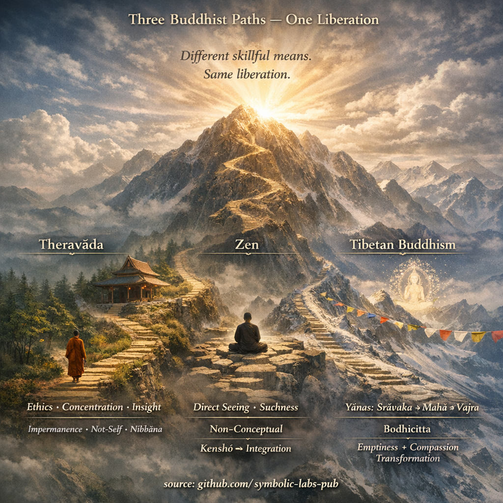

## [1) How they *structure* the path](https://github.com/symbolic-labs-pub/a-buddhist-view/blob/master/more/05_yanas/zen_and_theravada/README.md#1-how-they-structure-the-path)

### Tibetan Buddhism (broadly: Gelug/Kagyu/Sakya/Nyingma)

**Explicit multi-vehicle architecture**:

* **Śrāvakayāna** foundations ([ethics](../../01_core_teachings/the_noble_eightfold_path/README.md#2-ethical-conduct-śīla), renunciation, [concentration](../../01_core_teachings/the_noble_eightfold_path/README.md#8-right-concentration-sammā-samādhi), insight)
* [**Mahāyāna**](../README.md#limitation-from-mahāyāna-view) (bodhicitta + emptiness)
* [**Vajrayāna**](../README.md#4-vajrayāna-tantrayāna-mantrayāna---the-diamond-vehicle) (tantra: [deity yoga](../../03_the_path_to_end_suffering/README.md#right-action), mantra, subtle body)
* (In Nyingma) [**Dzogchen**](../../04_kayas/mahamudra_and_dzogcsen/README.md#dzogchen-rigpa-རིག་པ་---direct-introduction) as a pinnacle presentation (direct recognition of mind’s nature)

This is usually taught as **a layered stack** (often via *Lamrim* / graduated path).

### Zen (Chan/Seon/Zen)

**Not a “vehicle ladder” in the same explicit way.**
Zen is **Mahāyāna** at its base, but it typically emphasizes:

* **Direct realization** (often described as “pointing directly to mind”)
* A **practice container** (zazen, koan introspection, or shikantaza) rather than a multi-yāna taxonomy

Zen has its own “staging” (kenshō, post-kenshō cultivation), but it’s **less scholastic and less enumerative** by design.

Good entry points:

* [Zen (Stanford Encyclopedia of Philosophy)](https://plato.stanford.edu/entries/japanese-zen/)
* [Chan Buddhism (Britannica overview)](https://www.britannica.com/topic/Chan-Buddhism)

### Theravāda

**Single primary vehicle framing** (in its self-understanding): the path to **Nibbāna** via:

* **Sīla / Samādhi / [Paññā](../../01_core_teachings/the_noble_eightfold_path/README.md#1-wisdom-paññā)**
* [Four Noble Truths](../../02_from_ignorance_to_awakening/2_the_four_noble_truths/README.md#the-four-noble-truths--as-the-buddha-meant-them), [Noble Eightfold Path](../../01_core_teachings/the_noble_eightfold_path/README.md#what-the-noble-eightfold-path-is-in-buddhism), [Dependent Origination](../../02_from_ignorance_to_awakening/3_dependent_origination/README.md#the-twelve-links-the-classic-formulation)

Theravāda preserves an early canonical emphasis on **arhatship** as the normative “completion” of the path (while still respecting bodhisatta ideals in various ways).

Great canonical hubs:

* [SuttaCentral](https://suttacentral.net/)
* [Access to Insight](https://www.accesstoinsight.org/)

---

## 2) What “awakening” means (and where it “lands”)

### Tibetan

* **Śrāvakayāna result**: arhat-style liberation (cessation of gross afflictions)
* **Mahāyāna result**: full **Buddhahood** (omniscient [compassion](../../02_from_ignorance_to_awakening/7_compassion/README.md#compassion-as-a-structural-principle-in-buddhist-teaching) activity)
* **Vajrayāna claim**: same Buddhahood, but **faster** via “taking the result as the path”
* **Dzogchen idiom**: recognition of **rigpa** (primordial [awareness](../../10_concepts/README.md#2-awareness-rigpa-vijñāna-knowing)) and its stabilization

Key Mahāyāna philosophical backbone:

* [Madhyamaka (SEP)](https://plato.stanford.edu/entries/madhyamaka/)
* [Buddha-nature / Tathāgatagarbha (SEP)](https://plato.stanford.edu/entries/buddha-nature/)

### Zen

Zen “[awakening](../../10_concepts/README.md#3-enlightenment-bodhi-awakening) talk” often centers on:

* **kenshō / satori** (seeing one’s nature)
* Then **integration**: embodiment through daily life and ongoing practice

Zen tends to distrust turning awakening into a “thing” you can own conceptually, so it emphasizes *directness* and *anti-reification*.

### Theravāda

Awakening is typically articulated through:

* stages like **stream-entry → once-return → non-return → arahant**
* “ending of greed, hatred, delusion” and realization of **nibbāna**

Theravāda is often more explicit about **cognitive markers** (fetters) and **[meditative](../../08_lineage/README.md) factors**, and less likely to use Buddha-nature language.

---

## 3) View: emptiness, non-self, and “suchness” (same direction, different dialects)

### Shared core

All three are pointing to:

* **non-self / non-ownership** of experience
* **dependence / conditionality**
* liberation as **de-clinging**

### Where they differ in emphasis

**Theravāda dialect**

* Strong focus on **anattā** (not-self) + dependent origination + [impermanence](../../01_core_teachings/impermanence/README.md#2-impermanence-anicca-is-structural-not-accidental)
* Often more “phenomenological”: analyze experience into processes, see their arising/ceasing

**Tibetan Mahāyāna dialect**

* Strong focus on **śūnyatā** (emptiness of inherent existence) and [**two truths**](../../02_from_ignorance_to_awakening/5_the_two_truths/README.md#the-two-truths-in-buddhist-teaching)
* Often more “ontological-epistemic”: dismantle inherent existence assumptions, unite wisdom + compassion

**Zen dialect**

* Strong focus on **non-conceptual immediacy** (suchness), with teachings designed to short-circuit reification
* Uses paradox/koan to break “the mind that wants to stand outside experience and explain it”

A useful bridge conceptually:

* Theravāda “not-self” and Mahāyāna “emptiness” are often **functionally convergent** in practice, even when the philosophical packaging differs.

---

## 4) Practice mapping (what corresponds to what)

| Training domain      | Theravāda                                    | Zen                            | Tibetan                                            |
| -------------------- | -------------------------------------------- | ------------------------------ | -------------------------------------------------- |
| [Ethics](../../01_core_teachings/the_noble_eightfold_path/README.md#2-ethical-conduct-śīla)               | precepts, monastic vinaya                    | precepts + communal practice   | vows (pratimoksha / [bodhisattva](../../08_lineage/08_bodhisattva/README.md#4-the-bodhisattva-vow-as-structural-alignment) / samaya)          |
| [Concentration](../../01_core_teachings/the_noble_eightfold_path/README.md#8-right-concentration-sammā-samādhi)        | jhāna / samatha                              | zazen stability                | shamatha + [deity yoga](../../03_the_path_to_end_suffering/README.md#right-action) stabilization                |
| Insight              | [vipassanā](../shikantaza_and_vipassana/README.md#1-vipassanā-theravāda-insight---“feature-extraction-de-reification”) (anicca/dukkha/anattā)/[dukkha](../../02_from_ignorance_to_awakening/2_the_four_noble_truths/README.md#1-there-is-suffering--dukkha)/[anattā](#3-view-emptiness-non-self-and-“suchness”-same-direction-different-dialects))             | direct seeing (kenshō), koan   | analytical insight + [emptiness](#3-view-emptiness-non-self-and-“suchness”-same-direction-different-dialects) reasoning           |
| [Compassion](../../02_from_ignorance_to_awakening/7_compassion/README.md#compassion-as-a-structural-principle-in-buddhist-teaching) as method | present, but less central in “path identity” | present (bodhisattva ethos)    | central: **bodhicitta** is non-negotiable          |
| Esoteric methods     | generally no                                 | generally no (rare exceptions) | yes: [mantra](../../09_symbols/10_mantra/README.md#what-a-mantra-is-buddhist-view), deity yoga, subtle body, empowerments |

---

## 5) The biggest “false friends” (terms that mislead across traditions)

### “Sudden awakening”

* **Zen**: sudden “seeing,” then long cultivation (often implicit)
* **Tibetan Dzogchen/[Mahamudra](../../04_kayas/mahamudra_and_dzogcsen/README.md#mahāmudrā-nature-of-mind-སེམས་ཀྱི་གནས་ལུགས་)**: direct introduction/recognition, then stabilization (explicitly warned not to confuse with spacing out)
* **Theravāda**: can have sudden insight events, but the **training arc** is usually described more gradually and systematically

### “Emptiness = nothing exists”

All three reject nihilism.
Zen avoids over-explaining; Tibetan explains it carefully; Theravāda emphasizes conditionality and not-self. Different pedagogy, same safety constraint.

### “Buddha-nature”

* Core language in much of Mahāyāna (including Tibetan; also present in some Zen)
* Not a standard Theravāda doctrinal centerpiece (though there are interpretive bridges people try to build—often controversially)

---

## 6) A practical “translation guide” (if you’re moving between them)

If you’re fluent in one tradition, here’s how to “port” skills:

* **Theravāda → Tibetan**

  * Your strengths: discipline, clarity of impermanence/not-self, meditative precision
  * Add-on: **bodhicitta training** + emptiness reasoning + (if desired) tantric method

* **Zen → Tibetan**

  * Your strengths: non-conceptual directness, letting-go of grasping at views
  * Add-on: structured vows/stages + analytic emptiness + explicit compassion frameworks

* **Tibetan → Zen**

  * Your strengths: rich method stack, explicit integration of compassion/wisdom
  * Add-on: simplifying to “just this” practice, allowing realization to be ordinary and unadorned

---

## My “architect’s summary”

Think of them as three optimization strategies for the same objective function (liberation):

* **Theravāda** optimizes for **clean invariants and measurable training factors** (very engineer-friendly).
* **Zen** optimizes for **minimal interface / maximal directness** (reduces conceptual overfitting).
* **Tibetan** optimizes for **a full-stack curriculum with multiple accelerators** (powerful, but requires good governance: vows/teacher/context).

---

< [Shared baseline: 3 knobs of attention](../shikantaza_and_vipassana/README.md) | [Intermediate States (*Bardo*) and Reincarnation](../../06_intermediate_states_and_reincarnation/README.md) >

_source: [github.com/symbolic-labs-pub](https://github.com/symbolic-labs-pub)_

---
