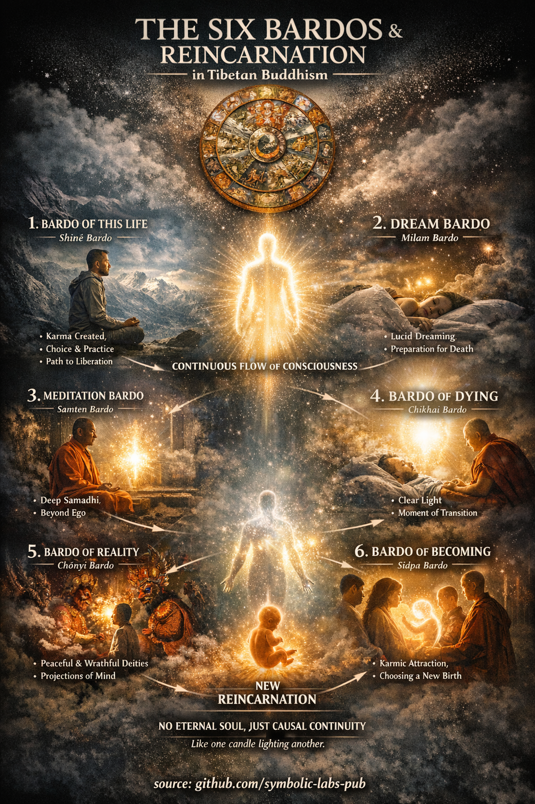
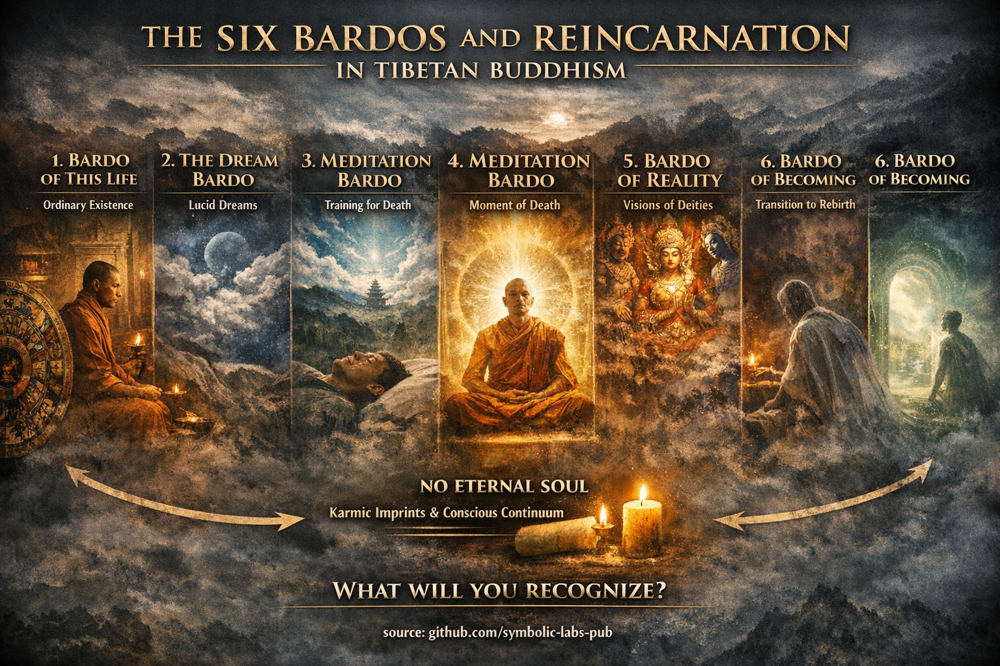

## [Intermediate States (*Bardo*) and Reincarnation](https://github.com/symbolic-labs-pub/a-buddhist-view/blob/master/more/06_intermediate_states_and_reincarnation/README.md#intermediate-states-bardo-and-reincarnation)

Teaching

## [A Buddhist Teaching on the Six Bardos](https://github.com/symbolic-labs-pub/a-buddhist-view/blob/master/more/06_intermediate_states_and_reincarnation/README.md#a-buddhist-teaching-on-the-six-bardos)

*(A practical teaching distilled from the bardo map)*

### The Teaching

All experience unfolds in **intervals**.
Whenever a form dissolves and a new one has not yet solidified, **freedom is possible**.

These intervals are called **bardos**.

The Tibetan teaching of the six bardos is not a theory about death—it is a **manual for recognizing [awareness](../10_concepts/README.md#2-awareness-rigpa-vijñāna-knowing) at moments of change**.

---

### The Core Insight

> **[Suffering](../02_from_ignorance_to_awakening/2_the_four_noble_truths/README.md#1-there-is-suffering--dukkha) continues not because change happens,
> but because awareness fails to recognize change as it occurs.**

Every bardo is a moment when habitual identity loosens.
In that loosening, two possibilities appear:

* **Recognition → liberation**
* **Confusion → continuation**

---

### The Six Bardos as One Teaching

#### 1. The Bardo of This Life

This is where training happens.

* Every reaction plants a karmic seed
* Every moment of [mindfulness](../01_core_teachings/the_noble_eightfold_path/README.md#7-right-mindfulness-sammā-sati) weakens future confusion

**Teaching:**
*Do not wait for death to practice recognition. Practice now, where support exists.*

---

#### 2. The Dream Bardo

Here the mind creates worlds effortlessly.

**Teaching:**
*If you cannot recognize illusion while dreaming, you will struggle to recognize illusion after death.*

Train lightly. Notice [impermanence](../01_core_teachings/impermanence/README.md#2-impermanence-anicca-is-structural-not-accidental). Notice construction.

---

#### 3. The Meditation Bardo

Here the sense of a solid self thins.

**Teaching:**
*Meditation is rehearsal for dying—without trauma.*

Familiarity with openness now becomes confidence later.

---

#### 4. The Bardo of the Moment of Death

The elements dissolve. Concepts fall away.
The **Clear Light** appears.

**Teaching:**
*Liberation is always immediate—but recognition is rare.*

Nothing new is created here. Only seeing matters.

---

#### 5. The Bardo of Reality

Visions arise—peaceful, wrathful, overwhelming.

**Teaching:**
*Fear is misrecognition.*

Whatever appears is **mind appearing to itself**.

If known → freedom
If feared → flight

---

#### 6. The Bardo of Becoming

Momentum returns. Habit seeks form.

**Teaching:**
*Unexamined desire chooses the next life.*

Clarity weakens momentum. Confusion empowers it.

---

### Reincarnation: The Silent Lesson

Reincarnation is **not punishment**.
It is **unfinished recognition repeating itself**.

What continues is not a self—but **a pattern**.

Change the pattern → the future changes
See through the pattern → the cycle ends

---

### The One-Line Instruction

> **Recognize whatever arises as awareness itself.**

If this is done:

* in life → life is liberated
* in dreams → dreams dissolve
* in death → death opens
* in reincarnation → reincarnation is unnecessary

---

### Closing Teaching

The bardos are not waiting for you after death.
They are happening **right now**:

* between thoughts
* between breaths
* between emotions

Train there.

> Whoever recognizes the small bardos
> will not be lost in the great one.

---

Explanation

*(According to Tibetan Buddhist teachings)*

In Tibetan Buddhism, **life, death, and reincarnation** are understood as a **continuous flow of consciousness** (*santāna*), not as isolated events. The key concept that explains this continuity is **bardo** (*bar do*), literally meaning **“in-between state.”**

A *bardo* is any **transitional phase** in which consciousness is not fixed in a stable form. Importantly, bardos are **not limited to the time after death**—our entire lived experience unfolds through bardos.

---

## [What is a *Bardo*?](https://github.com/symbolic-labs-pub/a-buddhist-view/blob/master/more/06_intermediate_states_and_reincarnation/README.md#what-is-a-bardo)

A *bardo* is a **gap, interval, or threshold**—a moment when habitual identity loosens and **transformation is possible**. Tibetan tradition systematizes this insight into **six bardos**, offering a precise **map for [awakening](../10_concepts/README.md#3-enlightenment-bodhi-awakening)**.

---

## [The Six Bardos](https://github.com/symbolic-labs-pub/a-buddhist-view/blob/master/more/06_intermediate_states_and_reincarnation/README.md#the-six-bardos)

### 1. **The Bardo of This Life** (*Shiné Bardo*)

This is ordinary waking life.

* Karma is actively created here
* Ethical choice and practice are possible
* Liberation can occur **now**

👉 This is considered **the most precious bardo**, because teachings, teachers, and conscious effort are available.

---

### 2. **The Dream Bardo** (*Milam Bardo*)

* Consciousness is more fluid
* Dream yoga and lucid awareness can arise
* Serves as training for post-death states

👉 Dreams are often called *“the little death.”*

---

### 3. **The Meditation Bardo** (*Samten Bardo*)

* Deep meditative absorption (*[samādhi](../01_core_teachings/the_noble_eightfold_path/README.md#8-right-concentration-sammā-samādhi)*)
* The sense of a solid self dissolves
* Direct recognition of mind’s nature is possible

👉 Familiarity here enables recognition at death.

---

### 4. **The Bardo of the Moment of Death** (*Chikhai Bardo*)

* The physical elements dissolve
* The **Clear Light of mind** appears
* A direct opportunity for liberation

👉 If the Clear Light is recognized as one’s own awareness → **immediate awakening**.

---

### 5. **The Bardo of Reality** (*Chönyi Bardo*)

* Peaceful and wrathful deities appear
* These are **projections of one’s own mind**
* Fear leads to confusion; recognition leads to liberation

👉 The core instruction: **“Do not fear—this is your own mind.”**

---

### 6. **The Bardo of Becoming** (*Sidpa Bardo*)

* Karmic momentum reasserts itself
* Attraction and aversion arise
* Consciousness is drawn toward a new reincarnation

👉 This is where **reincarnation is determined**.

---

## [What Is Reincarnation in Tibetan Buddhism?](https://github.com/symbolic-labs-pub/a-buddhist-view/blob/master/more/06_intermediate_states_and_reincarnation/README.md#what-is-reincarnation-in-tibetan-buddhism)

There is **no eternal soul** that transmigrates.

What continues is:

* karmic imprints
* tendencies and habits
* causal continuity of consciousness

A classic analogy:

* One candle lighting another
* Not the same flame, not a different one

This is **continuity without identity**.

---

## [What Determines Reincarnation?](https://github.com/symbolic-labs-pub/a-buddhist-view/blob/master/more/06_intermediate_states_and_reincarnation/README.md#what-determines-reincarnation)

1. **Karma** (intentional actions)
2. **Mental state at death**
3. **Habitual tendencies**
4. **Recognition or non-recognition of mind’s nature**

📌 A single moment of clear recognition can **override vast karmic accumulation**.

---

## [Why Is the Tibetan System So Detailed?](https://github.com/symbolic-labs-pub/a-buddhist-view/blob/master/more/06_intermediate_states_and_reincarnation/README.md#why-is-the-tibetan-system-so-detailed)

Tibetan Buddhism offers a **practical technology of dying and reincarnation**:

* How to prepare for death
* How to assist the dying
* How to recognize mind at every transition

This is why texts such as the **Bardo Thödol** exist—designed to be **heard**, guiding consciousness through the bardos toward liberation.

---

## [Core Teaching in One Line](https://github.com/symbolic-labs-pub/a-buddhist-view/blob/master/more/06_intermediate_states_and_reincarnation/README.md#core-teaching-in-one-line)

> The question is not whether reincarnation occurs,
> but whether **you recognize what is happening**.

The bardo is not a punishment or reward—it is a **window of possibility**.
For one trained in awareness during life, death becomes **not a threat, but a gateway**.

---

Meditation

## [A Six Bardos Meditation](https://github.com/symbolic-labs-pub/a-buddhist-view/blob/master/more/06_intermediate_states_and_reincarnation/README.md#a-six-bardos-meditation)

*A complete contemplative practice based on Tibetan Buddhist insight*

This is a **progressive yet simple meditation** that trains recognition across all bardos by working with **micro-bardos** occurring right now.

You are not visualizing death.
You are training **recognition in transitions**.

---

## [Core Principle (hold this lightly)](https://github.com/symbolic-labs-pub/a-buddhist-view/blob/master/more/06_intermediate_states_and_reincarnation/README.md#core-principle-hold-this-lightly)

> **Whatever arises is not a problem.
> Not recognizing it is.**

The practice is about **seeing**, not controlling.

---

## [Structure of the Practice](https://github.com/symbolic-labs-pub/a-buddhist-view/blob/master/more/06_intermediate_states_and_reincarnation/README.md#structure-of-the-practice)

* **Duration**: 20–40 minutes
* **Posture**: Seated, stable, relaxed
* **Attitude**: Curious, gentle, fearless

This practice has **six phases**, mirroring the six bardos.

---

## [1. Life Bardo Meditation](https://github.com/symbolic-labs-pub/a-buddhist-view/blob/master/more/06_intermediate_states_and_reincarnation/README.md#1-life-bardo-meditation)

*Stabilizing awareness in ordinary experience*

**Practice**

1. Sit and feel the body breathing
2. Do not adjust the breath
3. Notice sensations, sounds, thoughts as they arise

**Instruction**

* Label nothing
* Let experience be ordinary

**Recognition to cultivate**

> “This moment does not need improvement.”

This establishes **confidence in awareness during life**.

---

## [2. Dream Bardo Meditation](https://github.com/symbolic-labs-pub/a-buddhist-view/blob/master/more/06_intermediate_states_and_reincarnation/README.md#2-dream-bardo-meditation)

*Seeing experience as constructed*

**Practice**

1. Notice how thoughts appear suddenly
2. Observe how images, memories, plans arise and dissolve
3. Watch without following

**Instruction**

* Treat thoughts like dreams happening while awake

**Recognition to cultivate**

> “This is appearing, not solid.”

This weakens fixation and prepares the mind for non-physical states.

---

## [3. Meditation Bardo Meditation](https://github.com/symbolic-labs-pub/a-buddhist-view/blob/master/more/06_intermediate_states_and_reincarnation/README.md#3-meditation-bardo-meditation)

*Resting in openness*

**Practice**

1. Let attention widen
2. Stop focusing on objects
3. Allow awareness to rest on itself

**Instruction**

* Do not search for awareness
* Do not comment on it

**Recognition to cultivate**

> “Awareness is already present.”

This builds **familiarity with groundless clarity**.

---

## [4. Death Moment Meditation](https://github.com/symbolic-labs-pub/a-buddhist-view/blob/master/more/06_intermediate_states_and_reincarnation/README.md#4-death-moment-meditation)

*Practicing dissolution*

**Practice**

1. Imagine letting go of the body
2. Let sensations fade into space
3. Let thoughts stop being important

**Instruction**

* Do not imagine dying
* Imagine **releasing ownership**

**Recognition to cultivate**

> “Nothing essential is being lost.”

This trains fearlessness toward dissolution.

---

## [5. Reality Bardo Meditation](https://github.com/symbolic-labs-pub/a-buddhist-view/blob/master/more/06_intermediate_states_and_reincarnation/README.md#5-reality-bardo-meditation)

*Meeting intense appearances*

**Practice**

1. Allow emotions, memories, or inner imagery to arise
2. Do not suppress or analyze
3. Look directly at their texture

**Instruction**

* Especially notice fear or intensity
* Do not retreat

**Recognition to cultivate**

> “This, too, is mind appearing.”

This dissolves fear of strong inner experience.

---

## [6. Becoming Bardo Meditation](https://github.com/symbolic-labs-pub/a-buddhist-view/blob/master/more/06_intermediate_states_and_reincarnation/README.md#6-becoming-bardo-meditation)

*Interrupting momentum*

**Practice**

1. Notice desire, aversion, or impulse
2. Pause before following it
3. Let it self-release

**Instruction**

* Do not judge the impulse
* Just don’t obey it

**Recognition to cultivate**

> “I do not have to move.”

This weakens karmic momentum at its root.

---

## [Closing Integration (5 minutes)](https://github.com/symbolic-labs-pub/a-buddhist-view/blob/master/more/06_intermediate_states_and_reincarnation/README.md#closing-integration-5-minutes)

Rest naturally.

Then silently reflect:

> “All experience arises, stays briefly, and dissolves.
> What notices this does not come or go.”

Dedicate the practice to clarity—for yourself and others.

---

## [How This Practice Works (Quietly, Precisely)](https://github.com/symbolic-labs-pub/a-buddhist-view/blob/master/more/06_intermediate_states_and_reincarnation/README.md#how-this-practice-works-quietly-precisely)

* **Life bardo** → stabilizes mindfulness
* **Dream bardo** → loosens fixation
* **Meditation bardo** → reveals awareness
* **Death bardo** → dissolves fear
* **Reality bardo** → ends projection
* **Becoming bardo** → breaks compulsion

Practiced daily, this meditation **pre-trains the mind** so that death becomes **recognition, not shock**.

---

## [Minimal Daily Version (10 minutes)](https://github.com/symbolic-labs-pub/a-buddhist-view/blob/master/more/06_intermediate_states_and_reincarnation/README.md#minimal-daily-version-10-minutes)

1. Sit (2 min)
2. Watch thoughts arise and dissolve (3 min)
3. Rest as awareness (3 min)
4. Notice an impulse and don’t follow it (2 min)

That alone is sufficient.

---

## [Final Instruction](https://github.com/symbolic-labs-pub/a-buddhist-view/blob/master/more/06_intermediate_states_and_reincarnation/README.md#final-instruction)

> You do not prepare for death by thinking about death.
> You prepare by **recognizing awareness whenever things change**.

Every pause between breaths is a bardo.
Train there.

---

---

< [1) How they *structure* the path](../05_yanas/zen_and_theravada/README.md) | [Core Orientation of the Kagyu School](../07_history/README.md) >

_source: [github.com/sybolic-labs-pub](https://github.com/sybolic-labs-pub)_

---
