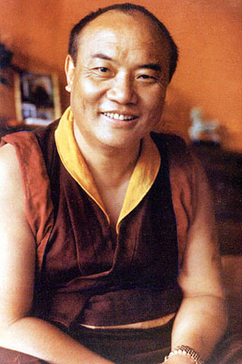
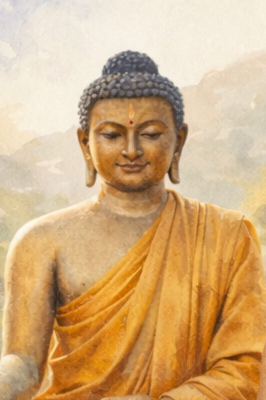

|                       [Nowadays](present.md)                        |                     [Yesterdays](past.md)                      |
|:-------------------------------------------------------------------:|:--------------------------------------------------------------:|
|          |           |
|  [The 16th Karmapa](https://www.youtube.com/watch?v=XokE6yKhH8g)    | [Siddhartha Gautama](https://en.wikipedia.org/wiki/The_Buddha) | 

The **Kagyu (Bka’ brgyud)** school is often called the **“practice lineage”** of Tibetan Buddhism because it emphasizes *direct experiential realization* over scholastic elaboration. Its meditation system is coherent and hierarchical: **everything ultimately points to recognizing the nature of mind**.

---

## [Core Orientation of the Kagyu School](https://github.com/symbolic-labs-pub/a-buddhist-view/blob/master/more/07_history/README.md#core-orientation-of-the-kagyu-school)

The Kagyu path answers one question:

> **What is the mind, directly, right now?**

All practices—preliminary, tantric, yogic, and formless—are **skillful means** to arrive at this recognition and stabilize it.

---

## [1. **Mahamudra**](https://github.com/symbolic-labs-pub/a-buddhist-view/blob/master/more/07_history/README.md#1-mahamudra)

### *(The Central Kagyu Meditation Target)*

**[Mahamudra (“Great Seal”)](../04_kayas/mahamudra_and_dzogcsen/README.md#mahāmudrā-nature-of-mind-སེམས་ཀྱི་གནས་ལུགས་)** is the *heart* of Kagyu practice.

**[Meditation](../08_lineage/README.md) subject**

* The **nature of mind itself** ([empty](../10_concepts/01_emptiness/README.md#emptiness-śūnyatā-in-vajrayāna-buddhism), luminous, aware)
* [Awareness](../10_concepts/README.md#2-awareness-rigpa-vijñāna-knowing) recognizing itself **without fabrication**

**Key characteristics**

* Not visualization-based at its highest level
* Direct, non-conceptual, experiential
* Emphasizes **ordinary mind** as the path

**Stages**

1. **Śamatha** – stabilizing attention
2. **Vipaśyanā** – investigating mind’s nature
3. **Non-meditation** – effortless awareness

> “Thoughts are not obstacles; they are ornaments of awareness.”

Mahamudra is often taught **gradually or suddenly**, depending on the student.

---

## [2. **Ngöndro (Preliminary Practices)**](https://github.com/symbolic-labs-pub/a-buddhist-view/blob/master/more/07_history/README.md#2-ngöndro-preliminary-practices)

### *(Preparing the Mind for Mahamudra)*

Before advanced realization, Kagyu emphasizes **psychological and karmic purification**.

**Meditation subjects**

* Ego fixation
* Karmic obscurations
* Emotional rigidity

**Main elements**

* Refuge & bodhicitta
* [Vajrasattva](../08_lineage/13_vajrasattva/README.md#vajrasattva-dorje-sempa) purification
* [Mandala](../09_symbols/07_mandala/README.md#mandala--explained-according-to-buddhist-teachings) offering (renunciation of grasping)
* **Guru Yoga** (devotion as mind-opening technology)

Ngöndro is not “beginner stuff”—it is **neuro-ethical rewiring**.

---

## [3. **Guru Yoga**](https://github.com/symbolic-labs-pub/a-buddhist-view/blob/master/more/07_history/README.md#3-guru-yoga)

### *(The Fastest Path in Kagyu)*

Guru Yoga is *exceptionally central* in Kagyu.

**Meditation subject**

* **Collapse of subject–object duality through devotion**
* Opening the mind to **direct transmission (blessing)**

Common lineage supports:

* [**Milarepa**](../08_lineage/09_milarepa/README.md#a-buddhist-teaching-milarepa-and-the-law-of-irreversible-transformation)
* **[Marpa](../08_lineage/10_marpa/README.md#a-buddhist-teaching-marpa-the-translator--the-dharma-that-refuses-to-be-softened) the Translator**
* **Gampopa**

Devotion here is not belief—it is a **precision instrument for ego dissolution**.

---

## [4. **Deity Yoga (Yidam Practice)**](https://github.com/symbolic-labs-pub/a-buddhist-view/blob/master/more/07_history/README.md#4-deity-yoga-yidam-practice)

### *(Re-patterning Perception)*

Common Kagyu yidams:

* **Chakrasamvara**
* **Vajrayogini**

**Meditation subjects**

* Identity fixation
* Ordinary perception
* Emotional energies (desire, fear, aggression)

This works by **embodied visualization** and [mantra](../09_symbols/10_mantra/README.md#what-a-mantra-is-buddhist-view) to realize:

> *Form is emptiness appearing.*

Deity yoga supports Mahamudra—it does **not replace it**.

---

## [5. **Six Yogas of Naropa**](https://github.com/symbolic-labs-pub/a-buddhist-view/blob/master/more/07_history/README.md#5-six-yogas-of-naropa)

### *(Advanced Completion-Stage Yogas)*

These yogas work directly with **subtle body and consciousness**.

**The six**

1. Tummo (inner heat)
2. Illusory body
3. Dream yoga
4. Clear light
5. Bardo yoga
6. Phowa (conscious death)

**Meditation subject**

* The **subtlest levels of awareness**
* Continuity of realization across waking, dreaming, and dying

These practices **require strong Mahamudra grounding**.

---

## [6. **Dzogchen (Occasionally Practiced)**](https://github.com/symbolic-labs-pub/a-buddhist-view/blob/master/more/07_history/README.md#6-dzogchen-occasionally-practiced)

Some Kagyu masters also teach [**Dzogchen**](../04_kayas/mahamudra_and_dzogcsen/README.md#dzogchen-rigpa-རིག་པ་---direct-introduction), especially in the **Shangpa Kagyu** and Rimé (non-sectarian) context.

Target:

* Primordial awareness (*[rigpa*)](../10_concepts/README.md#2-awareness-rigpa-vijñāna-knowing)
* Even more immediate than Mahamudra, but philosophically parallel

---

## [🧭 One-Line Summary](https://github.com/symbolic-labs-pub/a-buddhist-view/blob/master/more/07_history/README.md#-one-line-summary)

> **Kagyu meditation targets the recognition of mind’s nature, using devotion, embodiment, and yogic precision as accelerators.**

Everything converges on **Mahamudra**.

---

## [🔍 Practical Insight](https://github.com/symbolic-labs-pub/a-buddhist-view/blob/master/more/07_history/README.md#-practical-insight)

If translated into modern systems language:

* **Ngöndro** → ethical & emotional cleanup
* **Guru Yoga** → trust-based ego collapse
* **Deity Yoga** → identity reprogramming
* **Six Yogas** → nervous system & consciousness engineering
* **Mahamudra** → non-dual awareness stabilization

Low-cost, high-impact starting point today:

* Daily **shamatha → Mahamudra-style open awareness**
* Simple **Milarepa Guru Yoga**
* Light Ngöndro elements (refuge + bodhicitta)

---

< [Intermediate States (*Bardo*) and Reincarnation](../06_intermediate_states_and_reincarnation/README.md) | [White Tārā Meditation](../08_lineage/01_white_tara/README.md) >

_source: [github.com/sybolic-labs-pub](https://github.com/sybolic-labs-pub)_

---
