```mermaid
flowchart TB

  %% ============================================================
  %% 🌈 Tibetan Buddhism history graph
  %% - Colored node groups by school
  %% - Colored line types
  %% - Parse-safe labels (no parentheses, no bullet separators)
  %% ============================================================

  TB["🏔️ Tibetan Buddhism\n7th century to present"]

  %% ================= Nyingma =================
  subgraph NY["🔴 Nyingma Ancient School 8th century"]
    Trisong["👑 King Trisong Detsen\n8th century"]
    Shantarak["🧑‍🏫 Shantarakshita\n8th century"]
    GuruR["🪷 Guru Rinpoche Padmasambhava\n8th century"]
    Samye["🏯 Samye Monastery\ncirca 779 CE"]
    Dzogchen["✨ Dzogchen Great Perfection"]
    KamaTerma["📦 Kama and Terma transmissions"]
  end

  %% ================= Kagyu =================
  subgraph KA["🔵 Kagyu Oral Lineage 11th century"]
    Tilopa["🧘 Tilopa\n989 to 1069"]
    Naropa["🧘 Naropa\n1016 to 1100"]
    Marpa["🧑‍🌾 Marpa the Translator\n1012 to 1097"]
    Mila["🏔️ Milarepa\n1040 to 1123"]
    Gampopa["📜 Gampopa\n1079 to 1153"]
    K1["👑 First Karmapa Dusum Khyenpa\n1110 to 1193"]
    KK["👑 Karma Kagyu lineage"]
  end

  %% ================= Karma Kagyu modern =================
  subgraph KKMOD["🟦 Karma Kagyu Modern Era 20th to 21st century"]
    K16["👑 16th Karmapa\n1924 to 1981"]
    Rumtek["🏯 Rumtek Monastery\n1966 exile seat"]
    KIBI["🎓 KIBI New Delhi\n1979"]
    HeartSons["🧭 Regency period\n1981 to 1990s"]
    SH14["🟥 14th Shamarpa\n1952 to 2014"]
    TS12["🟦 12th Tai Situ Rinpoche"]
    GY12["🟩 12th Goshir Gyaltsab Rinpoche"]
    JKX["🟪 Jamgon Kongtrul Rinpoche"]
    Pred["📜 Prediction Letter\n1990s disputed"]
    K17A["👑 17th Karmapa Ogyen Trinley Dorje\nrecognized 1992"]
    K17B["👑 17th Karmapa Trinley Thaye Dorje\nrecognized 1994"]
    Escape["🧳 Escape from Tibet\n1999 to 2000"]
    Joint2018["🤝 Joint statement\n2018"]
    Joint2023["🤝 Joint statement\n2023"]
  end

  %% ================= Sakya =================
  subgraph SA["🟡 Sakya School 1073"]
    Khon["👑 Khon Konchok Gyalpo\n1034 to 1102"]
    SakyaMon["🏯 Sakya Monastery\n1073 CE"]
    Lamdre["🧠 Lamdre Path and Fruit"]
  end

  %% ================= Gelug =================
  subgraph GE["🟠 Gelug School 15th century"]
    Tsong["🧑‍🏫 Je Tsongkhapa\n1357 to 1419"]
    Ganden["🏯 Ganden Monastery\n1409 CE"]
    DalaiTitle["🏷️ Dalai Lama title\n1578 CE"]
    DL14["☸️ 14th Dalai Lama\nborn 1935\nenthroned 1940\nexile since 1959"]
  end

  %% ================= Rimé =================
  subgraph RI["🟣 Rime Non Sectarian Movement 19th century"]
    Rime["🧩 Rimé movement"]
    Kongtrul["📚 Jamgon Kongtrul\n1813 to 1899"]
    Khyentse["🕯️ Jamyang Khyentse Wangpo\n1820 to 1892"]
  end

  %% ================= Links =================
  TB --> Trisong
  TB --> Tilopa
  TB --> Khon
  TB --> Tsong

  Trisong --> Samye
  Shantarak --> Samye
  GuruR --> Samye
  GuruR --> Dzogchen
  GuruR --> KamaTerma

  Tilopa --> Naropa
  Naropa --> Marpa
  Marpa --> Mila
  Mila --> Gampopa
  Gampopa --> K1
  K1 --> KK
  KK --> K16
  K16 --> Rumtek
  K16 --> KIBI
  K16 --> HeartSons

  HeartSons --> SH14
  HeartSons --> TS12
  HeartSons --> GY12
  HeartSons --> JKX

  TS12 --> Pred
  SH14 --> Pred
  Pred --> K17A

  K17A --> Escape
  K17A --> Joint2018
  K17B --> Joint2018
  K17A --> Joint2023
  K17B --> Joint2023

  Khon --> SakyaMon
  SakyaMon --> Lamdre

  Tsong --> Ganden
  DalaiTitle --> DL14

  %% Cross school pollination
  GuruR --> KA
  Tsong --> KA
  Tsong --> SA
  Tsong --> NY

  Rime --> Kongtrul
  Rime --> Khyentse
  Kongtrul --> KA
  Kongtrul --> NY
  Khyentse --> SA
  Khyentse --> KA
  Khyentse --> NY

  DL14 --> TB
  DL14 --> K17A

  %% ================= Styles =================
  classDef meta fill:#F1F5F9,stroke:#0F172A,stroke-width:2px,color:#0F172A,font-weight:700;

  classDef nyingma fill:#FFE4E6,stroke:#FB7185,stroke-width:2px,color:#7F1D1D,font-weight:700;
  classDef kagyu fill:#DBEAFE,stroke:#60A5FA,stroke-width:2px,color:#1E3A8A,font-weight:700;
  classDef karmakagyu fill:#E0F2FE,stroke:#38BDF8,stroke-width:2px,color:#0C4A6E,font-weight:700;
  classDef sakya fill:#FEF9C3,stroke:#FACC15,stroke-width:2px,color:#713F12,font-weight:700;
  classDef gelug fill:#FFEDD5,stroke:#FB923C,stroke-width:2px,color:#7C2D12,font-weight:700;
  classDef rime fill:#F3E8FF,stroke:#A78BFA,stroke-width:2px,color:#4C1D95,font-weight:700;

  class TB meta;

  class Trisong,Shantarak,GuruR,Samye,Dzogchen,KamaTerma nyingma;
  class Tilopa,Naropa,Marpa,Mila,Gampopa,K1,KK kagyu;
  class K16,Rumtek,KIBI,HeartSons,SH14,TS12,GY12,JKX,Pred,K17A,K17B,Escape,Joint2018,Joint2023 karmakagyu;
  class Khon,SakyaMon,Lamdre sakya;
  class Tsong,Ganden,DalaiTitle,DL14 gelug;
  class Rime,Kongtrul,Khyentse rime;

  %% ================= Line colors =================
  %% Backbone history lines

  %% Nyingma internal

  %% Kagyu spine

  %% Karma Kagyu modern




  %% Sakya

  %% Gelug

  %% Cross pollination


```

# Yesterdays

```mermaid
flowchart TB
  %% ==========================================
  %% 🌈 LEGEND — Karma Kagyu Lineage Graph
  %% Explains node colors, emojis, and edge colors
  %% ==========================================

  %% ---------- Node examples ----------
  CoreNode["👑 Core Lineage Holder<br/>(Karmapa)"]
  BranchANode["👑 Branch A<br/>(Blue lineage)"]
  BranchBNode["👑 Branch B<br/>(Pink lineage)"]
  RegentNode["🧘 Senior Disciple / Regent"]
  DalaiNode["☸️ External Authority<br/>(Dalai Lama)"]

  SeatNode["🏯 Monastery / Seat"]
  InstituteNode["🎓 Institute / University"]
  WebNode["🌐 Admin / Website"]
  LegalNode["⚖️ Legal / Court Process"]
  DocNode["📜 Document / Prediction"]
  UnityNode["🤝 Reconciliation / Unity Event"]

  %% ---------- Edge examples ----------
  CoreNode -->|🏗️ Establishes / Founds| SeatNode
  CoreNode -->|🧘 Transmission| RegentNode
  RegentNode -->|🧭 Regency / Governance| SeatNode
  DocNode -->|🧩 Recognition Influence| BranchANode
  DalaiNode -->|✅ Recognition| BranchANode
  BranchANode -->|👑 Enthronement| SeatNode
  BranchANode -->|📣 Communication| WebNode
  SeatNode -->|⚖️ Legal Axis| LegalNode
  BranchANode -->|🤝 Joint Statement| UnityNode

  %% ---------- Styles (same palette as main graph) ----------
  classDef core fill:#FFF1CC,stroke:#FFB020,stroke-width:2px,color:#2B2B2B,font-weight:700;
  classDef branchA fill:#E6F2FF,stroke:#2B7CFF,stroke-width:2px,color:#0F1A2B,font-weight:700;
  classDef branchB fill:#FFE6F2,stroke:#D81B60,stroke-width:2px,color:#2B0F1A,font-weight:700;

  classDef regent fill:#E9FFEF,stroke:#14A44D,stroke-width:2px,color:#0F2B17,font-weight:700;
  classDef dalai fill:#F3E8FF,stroke:#7C3AED,stroke-width:2px,color:#1D102B,font-weight:700;

  classDef seat fill:#FFF7ED,stroke:#FB923C,stroke-width:2px,color:#2B1A0F,font-weight:700;
  classDef institute fill:#ECFEFF,stroke:#06B6D4,stroke-width:2px,color:#0B2B2A,font-weight:700;

  classDef web fill:#E0F2FE,stroke:#0284C7,stroke-width:2px,color:#0B1F2B,font-weight:700;
  classDef legal fill:#FEE2E2,stroke:#EF4444,stroke-width:2px,color:#2B0F0F,font-weight:700;
  classDef doc fill:#F1F5F9,stroke:#334155,stroke-width:2px,color:#0F172A,font-weight:700;
  classDef unity fill:#F5F3FF,stroke:#8B5CF6,stroke-width:2px,color:#1E1033,font-weight:700;

  class CoreNode core
  class BranchANode branchA
  class BranchBNode branchB
  class RegentNode regent
  class DalaiNode dalai

  class SeatNode seat
  class InstituteNode institute
  class WebNode web
  class LegalNode legal
  class DocNode doc
  class UnityNode unity

  %% ---------- Edge color legend ----------
```

---

# A Single Flame, Many Lamps

When Tibetan Buddhism is viewed only as a collection of schools, titles, and robes, its deeper coherence can be missed. Yet when seen through the lens of lineage, it reveals itself as something far more organic: **a single flame carried from lamp to lamp**, adapting its shape without losing its light.

The figures you have gathered—**Gautama Buddha**, **Tilopa**, **Naropa**, **Marpa**, **Milarepa**, **Gampopa**, **Dusum Khyenpa**, **Rangjung Rigpe Dorje**, **Trinley Thaye Dorje**, **Je Tsongkhapa**, and **Gedun Drupa**—form not a random assembly, but a **historical spine of realization**.

They differ radically in temperament, method, and social role. Yet each answers the same question:

> *How can awakening be made possible for beings living in this particular time, body, and world?*

---

## 1. Gautama Buddha: The Source Without a School

**Gautama Buddha** (5th century BCE) stands apart not as a Tibetan figure, but as the **origin of the experiment itself**. His insight was not metaphysical speculation but a diagnosis:

* Suffering exists
* It has causes
* It can cease
* There is a path

Everything that follows—monastic discipline, tantric ritual, yogic intensity, scholastic precision—is an **engineering response** to that original discovery.

Importantly, the Buddha **did not found a “Buddhism.”** He founded a *method*: ethics, meditation, and wisdom tested against lived experience. Tibetan Buddhism inherits this pragmatism even when its outer forms appear ornate.

---

## 2. Tilopa and Naropa: Awakening Without Institutions

With **Tilopa** (10th–11th century) and **Naropa**, the lineage passes into the world of the **mahasiddhas**—figures who deliberately rejected social respectability.

Tilopa’s realization did not arise from monasteries but from **ordinary labor** and radical trust in direct experience. Naropa, once a celebrated scholar at Nalanda, had to **unlearn intellectual certainty** through a series of humiliating ordeals before realization matured.

Their message was dangerous and liberating:

> *Awakening is not granted by institutions.
> Institutions exist to serve awakening.*

This principle will echo repeatedly throughout Tibetan history.

---

## 3. Marpa and Milarepa: Transmission Through Human Cost

**Marpa the Translator** brought these teachings into Tibet, not as a mystic, but as a **householder, trader, and translator**. His role was not to be saintly but to be *accurate*. He preserved the teachings intact, even when doing so required harshness.

His disciple **Milarepa** represents the other extreme: a murderer transformed into a yogi through unbearable discipline. His life demonstrates a central Tibetan insight:

> *Karma is not erased by belief—but it can be metabolized by practice.*

Milarepa’s songs show that realization is not sterile serenity. It is raw, human, embodied, and often joyful only after profound suffering.

---

## 4. Gampopa: The Great Integration

**Gampopa** performed one of the most important syntheses in Buddhist history. Trained first in the Kadampa monastic tradition, he united:

* **Monastic discipline**
* **Mahayana compassion**
* **Tantric immediacy**

This fusion allowed the Kagyu lineage to **scale**—to move beyond solitary yogis into communities without losing experiential depth. Without Gampopa, there would be no durable Kagyu school.

---

## 5. Dusum Khyenpa and the Karmapa Principle

With **Dusum Khyenpa**, the First Karmapa, something unprecedented appears: **the tulku system as a conscious continuity mechanism**.

The Karmapa is not merely reborn; he **recognizes his own reincarnation**. This is less mystical than it sounds—it is a radical solution to a practical problem:

> *How does a realization tradition survive centuries without becoming corrupt or diluted?*

The answer was continuity of responsibility, not power.

---

## 6. Je Tsongkhapa and Gedun Drupa: Precision as Compassion

Parallel to the Kagyu current, **Je Tsongkhapa** founded the Gelug tradition in the 14th–15th century. His genius was not inventing new insight, but **insisting on epistemic clarity**.

Tsongkhapa believed that compassion without precision collapses into sentimentality, and meditation without analysis risks self-deception.

His disciple **Gedun Drupa**, later recognized as the First Dalai Lama, embodied this clarity in institutional form—establishing monasteries that balanced rigorous scholarship with ethical discipline.

This line would later produce the Dalai Lama institution as a **moral voice beyond sectarianism**.

---

## 7. Rangjung Rigpe Dorje: Lineage in Exile

The **16th Karmapa**, Rangjung Rigpe Dorje, faced a challenge no previous holder had: **the destruction of Tibetan civilization itself**.

His response was not retreat but **translation into a global context**:

* Rebuilding Rumtek Monastery (1966)
* Traveling to the West (1974 onward)
* Transmitting the Kagyu lineage outside Tibetan culture

He demonstrated that lineage is not geography-bound. **Realization migrates.**

---

## 8. Trinley Thaye Dorje: Lineage Under Modern Conditions

**Trinley Thaye Dorje**, one of the recognized 17th Karmapas, represents lineage under modern constraints: diaspora, legal systems, media scrutiny, and global practitioners.

What matters here is not controversy, but continuity. His presence demonstrates that the Kagyu question remains alive:

> *Can deep realization survive transparency, pluralism, and modern psychology?*

The answer is still unfolding.

---

## 9. A Hidden Unity

Though these figures belong to different schools—Kagyu and Gelug in particular—they are **not competitors**. Tibetan Buddhism has always known that methods differ because **beings differ**.

What unites them is not doctrine, but **function**:

* Reducing suffering
* Preserving insight
* Transmitting realization without distortion

They smile in your image because they are not anxious about orthodoxy. The lineage does not depend on rigidity. It depends on **integrity**.

---

## Conclusion: Why This Lineage Still Matters

This lineage is not about the past. It is about **how wisdom survives time**.

Each figure answered the same question differently:

* The Buddha: *Awaken.*
* Tilopa: *Trust experience.*
* Milarepa: *Endure transformation.*
* Tsongkhapa: *Be precise.*
* The Karmapas: *Continue.*

Together, they form a single living system—adaptive, resilient, and quietly radical.

Not a museum.

A transmission.

---

---

< [History](README.md) | [Nowadays](present.md) >

_source: [github.com/symbolic-labs-pub](https://github.com/symbolic-labs-pub)_

---