```mermaid
flowchart LR
  %% ==========================================
  %% 🌈 Karma Kagyu lineage graph
  %% - Color groups via classDef + subgraphs
  %% - Lines colored by meaning via linkStyle (order-sensitive)
  %% ==========================================

  %% ---------- People ----------
  K16["👑 H.H. 16th Karmapa<br/>Rangjung Rigpe Dorje<br/>(1924–1981)"]
  K17A["👑 17th Karmapa (Branch A)<br/>Ogyen Trinley Dorje<br/>(b. 1985)"]
  K17B["👑 17th Karmapa (Branch B)<br/>Trinley Thaye Dorje<br/>(b. 1983)"]

  SH14["🟥 14th Shamarpa<br/>Mipham Chökyi Lodrö<br/>(1952–2014)"]
  TS12["🟦 12th Tai Situ Rinpoche"]
  GY12["🟩 12th Goshir Gyaltsab Rinpoche"]
  JKX["🟪 Jamgön Kongtrül Rinpoche<br/>(regency era)"]

  DL14["☸️ H.H. 14th Dalai Lama"]

  %% ---------- Institutions / Seats ----------
  Rumtek["🏯 Rumtek Monastery<br/>(Sikkim, India)<br/>Exile seat"]
  Tsurphu["🏯 Tsurphu Monastery<br/>(Tibet)<br/>Traditional seat"]
  KIBI["🎓 KIBI<br/>New Delhi, India"]
  Dharamsala["🏔️ Dharamsala<br/>HP, India"]
  BodhGaya["🕯️ Bodh Gaya<br/>Bihar, India"]

  KagyuOffice["🌐 Kagyu Office<br/>(kagyuoffice.org)<br/>Branch A comms"]
  KarmapaOrg["🌐 karmapa.org<br/>Branch B comms"]

  %% ---------- Documents / Events ----------
  PredLetter["📜 Contested “Prediction Letter”<br/>(recognition process)"]
  Joint2018["🤝 Joint Statement<br/>2018-10-11<br/>(France meeting)"]
  Joint2023["🤝 Joint Statement<br/>2023-12-04<br/>(Shamarpa reincarnation cooperation)"]

  RumtekCase["⚖️ Rumtek legal rulings<br/>2003-08-26 (Sikkim HC)<br/>2004-07-05 (India SC)"]

  %% ==========================================
  %% GROUPING (subgraphs)
  %% ==========================================
  subgraph A["🧡 Core Lineage Anchor"]
    K16
  end

  subgraph B["💛 Recognition & Enthronement Branches (Post-1981)"]
    K17A
    K17B
    PredLetter
  end

  subgraph C["💙 Regency / Senior Disciples (Heart-Sons era)"]
    SH14
    TS12
    GY12
    JKX
  end

  subgraph D["💚 Seats & Institutions"]
    Rumtek
    Tsurphu
    KIBI
    Dharamsala
    BodhGaya
  end

  subgraph E["🩶 Governance / Legal / Admin"]
    RumtekCase
    KagyuOffice
    KarmapaOrg
  end

  subgraph F["💜 Reconciliation / Unity Track"]
    Joint2018
    Joint2023
  end

  %% ==========================================
  %% EDGES (keep order; linkStyle indexes refer to these)
  %% ==========================================

  %% (1) Institutional building
  K16 -->|🏗️ ESTABLISHES SEAT • 1966| Rumtek
  K16 -->|🏗️ FOUNDS • 1979-11| KIBI

  %% (2) Discipleship / transmission
  K16 -->|🧘 TRANSMISSION • pre-1981| SH14
  K16 -->|🧘 TRANSMISSION • pre-1981| TS12
  K16 -->|🧘 TRANSMISSION • pre-1981| GY12
  K16 -->|🧘 TRANSMISSION • pre-1981| JKX

  %% (3) Regency roles
  SH14 -->|🧭 REGENCY • 1981→1990s| Rumtek
  TS12 -->|🧭 REGENCY • 1981→1990s| Rumtek
  GY12 -->|🧭 REGENCY • 1981→1990s| Rumtek
  JKX -->|🧭 REGENCY • 1981→1990s| Rumtek

  %% (4) Recognition split mechanics
  TS12 -->|📜 PRESENTS • early 1990s| PredLetter
  SH14 -->|❗ CONTESTS • 1990s| PredLetter
  PredLetter -->|🧩 INFLUENCES • 1992| K17A

  DL14 -->|✅ RECOGNITION • 1992-06-30| K17A
  K17A -->|👑 ENTHRONED • 1992-09-27| Tsurphu
  K17A -->|🧳 ARRIVAL • 2000-01-05| Dharamsala

  SH14 -->|✅ RECOGNITION • 1994-03| K17B
  K17B -->|👑 ENTHRONED • 1996-12| BodhGaya

  %% (5) Admin / comms
  K17A -->|📣 COMMS • 2000s→| KagyuOffice
  K17B -->|📣 COMMS • 1990s→| KarmapaOrg

  %% (6) Legal axis
  Rumtek -->|⚖️ LEGAL • 2003–2004| RumtekCase
  RumtekCase -->|🏛️ AFFECTS ADMIN • 2000s→| Rumtek

  %% (7) Reconciliation
  K17A -->|🤝 JOINT • 2018-10-11| Joint2018
  K17B -->|🤝 JOINT • 2018-10-11| Joint2018
  K17A -->|🤝 JOINT • 2023-12-04| Joint2023
  K17B -->|🤝 JOINT • 2023-12-04| Joint2023
  Joint2023 -->|🧬 LINEAGE PROCESS • future| SH14

  %% ==========================================
  %% STYLES (nodes)
  %% ==========================================
  classDef core fill:#FFF1CC,stroke:#FFB020,stroke-width:2px,color:#2B2B2B,font-weight:700;
  classDef branchA fill:#E6F2FF,stroke:#2B7CFF,stroke-width:2px,color:#0F1A2B,font-weight:700;
  classDef branchB fill:#FFE6F2,stroke:#D81B60,stroke-width:2px,color:#2B0F1A,font-weight:700;

  classDef regent fill:#E9FFEF,stroke:#14A44D,stroke-width:2px,color:#0F2B17,font-weight:700;
  classDef dalai fill:#F3E8FF,stroke:#7C3AED,stroke-width:2px,color:#1D102B,font-weight:700;

  classDef seat fill:#FFF7ED,stroke:#FB923C,stroke-width:2px,color:#2B1A0F,font-weight:700;
  classDef institute fill:#ECFEFF,stroke:#06B6D4,stroke-width:2px,color:#0B2B2A,font-weight:700;

  classDef doc fill:#F1F5F9,stroke:#334155,stroke-width:2px,color:#0F172A,font-weight:700;
  classDef legal fill:#FEE2E2,stroke:#EF4444,stroke-width:2px,color:#2B0F0F,font-weight:700;
  classDef web fill:#E0F2FE,stroke:#0284C7,stroke-width:2px,color:#0B1F2B,font-weight:700;
  classDef unity fill:#F5F3FF,stroke:#8B5CF6,stroke-width:2px,color:#1E1033,font-weight:700;

  class K16 core
  class K17A branchA
  class K17B branchB

  class SH14 regent
  class TS12 regent
  class GY12 regent
  class JKX regent
  class DL14 dalai

  class Rumtek seat
  class Tsurphu seat
  class BodhGaya seat
  class Dharamsala seat
  class KIBI institute

  class PredLetter doc
  class Joint2018 unity
  class Joint2023 unity

  class RumtekCase legal
  class KagyuOffice web
  class KarmapaOrg web

  %% ==========================================
  %% STYLES (edges by meaning) — order-sensitive
  %% 0-1: build/institution (orange)
  %% 2-5: transmission (green)
  %% 6-9: regency (teal)
  %% 10-12: recognition mechanics (gray)
  %% 13-15: Branch A recognition/enthrone/relocation (blue)
  %% 16-17: Branch B recognition/enthrone (pink)
  %% 18-19: comms/admin (cyan)
  %% 20-21: legal axis (red)
  %% 22-26: reconciliation (purple)
  %% ==========================================
```

# Lineage Holders

---

**[Guru Rinpoche (Padmasambhava)](https://en.wikipedia.org/wiki/Padmasambhava)** is foundational mainly to the **[Nyingma](https://www.rigpawiki.org/index.php?title=Nyingma)** (“Ancient”) school and its two transmission streams: **Kama (oral)** and **Terma (treasure)**. ([Wikipedia][1])

The **Karmapa** is the head of the **Karma Kagyu** lineage (a Kagyu school), which has its own primary “spine” of transmission (Marpa → Milarepa → Gampopa → …). But in practice, Tibetan lineages cross-pollinate a lot (especially since the **Rimé/non-sectarian movement**), so you’ll often see **Padmasambhava practices** and Nyingma transmissions appearing inside Kagyu curricula and empowerments—without Guru Rinpoche being the *formal* Kagyu lineage root.

---

## 1) The Karma Kagyu “spine”

Karma Kagyu sits inside the broader **[Kagyu tradition](https://www.rigpawiki.org/index.php?title=The_Kagyu_Tradition)** (one of the four major Tibetan schools). Kagyu traces back through:
**Marpa (translator) → Milarepa → Gampopa → (Karma Kagyu branch) → Karmapas (tulku line).** ([Rigpa Wiki][2])

We will start at the **16th Karmapa**, so that’s where the detailed timeline begins.

---

## 2) H.H. the 16th Karmapa (1924–1981): key events + why he matters

**H.H. 16th Karmapa Rangjung Rigpe Dorje (born 1924, died 1981)** is widely credited with **rebuilding the Karma Kagyu’s institutional base in exile** and **establishing major Western footholds**. ([Karmapa Official][3])

### Core timeline (CE)

* **1959** — Leaves Tibet and goes to **Sikkim** (India). ([Wikipedia][4])
* **1962–1966** — Rebuilds **[Rumtek Monastery](https://en.wikipedia.org/wiki/Rumtek_Monastery)** as the **Karmapa’s seat in exile**; **inaugurated 1966**. ([Wikipedia][4])
* **1972** — Large pilgrimage across India with major disciples (including Shamar Rinpoche). ([Karmapa Official][3])
* **1974** — **First major visit of a Karmapa to the West** (Europe/US/Canada); Black Crown ceremonies widely witnessed. ([Karmapa Official][3])
* **Mid-Jan 1974** — Meets **Pope Paul VI** in Rome during the Europe tour. ([Karmapa Official][3])
* **1976–1977** — Further Western teaching tours; rapid spread of Kagyu centers in Europe. ([Karmapa Official][3])
* **Nov 1979** — Lays foundation stone for **Karmapa International Buddhist Institute (KIBI)** in New Delhi. ([Karmapa Official][3])
* **1981** — Passes away (parinirvāṇa). ([Rigpa Wiki][5])

### Institutional “branch nodes” he strengthened (still important today)

* **Rumtek** (exile seat, Sikkim) ([Wikipedia][4])
* **KIBI** (New Delhi) ([Karmapa Official][3])
* Expansion of Kagyu centers in **Europe/North America** ([Karmapa Official][3])

---

## 3) After 1981: the “Four Heart Sons” regency (the critical junction)

After the 16th Karmapa’s passing, a council/regency was formed by his four principal disciples (“heart sons”), commonly listed as:

* **14th Shamarpa (Mipham Chökyi Lodrö, 1952–2014)** ([Wikipedia][6])
* **12th Tai Situ Rinpoche** ([Kagyu Office][7])
* **(3rd) Jamgön Kongtrül Rinpoche** (lineage seat holder at the time) ([Wikipedia][8])
* **12th Goshir Gyaltsab Rinpoche** ([Wikipedia][8])

This regency structure is central because the later split largely traces to **how the 17th Karmapa’s recognition was handled and contested**. ([Wikipedia][8])

---

## 4) The 17th Karmapa recognition split (1992 → present): two branches

### Branch A — **Ogyen Trinley Dorje** (recognized 1992; enthroned at Tsurphu)

Key, high-confidence milestones:

* **30 Jun 1992** — Public confirmation statement by **H.H. the 14th Dalai Lama** recognizing the 16th Karmapa’s reincarnation as **Ogyen Trinley Dorje**. ([Wikipedia][9])
* **27 Sep 1992** — Enthroned as 17th Karmapa at **Tsurphu Monastery** (traditional seat in Tibet). ([Wikipedia][9])
* **28 Dec 1999 → 5 Jan 2000** — Escapes Tibet; arrives in **Dharamsala, India**. ([Kagyu Office][10])

This is the branch often associated with the official **[kagyuoffice.org](https://kagyuoffice.org/karmapa/)** web presence. ([Kagyu Office][11])

### Branch B — **Trinley Thaye Dorje** (presented 1994; enthroned 1996)

Key milestones:

* **Mar 1994** — Presented/enthroned in New Delhi by **14th Shamarpa** (as described in multiple Karma Kagyu–aligned sources). ([Wikipedia][12])
* **Dec 1996** — Formally enthroned in **Bodh Gaya**. ([Wikipedia][12])
* This branch is associated with **[karmapa.org](https://www.karmapa.org/)** and related networks. ([Karmapa Official][13])

### What caused the split (in one sentence)

A major flashpoint was a **prediction letter** (reported as left by the 16th Karmapa and presented by Tai Situ), which was **accepted by some senior figures and contested by others**—notably the Shamarpa—leading to two enthronements and parallel administrations. ([Wikipedia][8])

---

## 5) Rumtek and institutional/legal branch effects (2003–2004 and beyond)

Rumtek became not only a spiritual seat but also a **legal/administrative focal point** in the post-1981 dispute.

* **26 Aug 2003** — High Court of Sikkim upheld a denial (case specifics tied to Rumtek litigation).
* **5 Jul 2004** — **Supreme Court of India** affirmed the High Court order (per Kagyuoffice release). ([Kagyu Office][14])

There are also contemporaneous journalistic accounts describing the **Rumtek dispute** as a major fault line in the controversy era. ([Phayul][15])

---

## 6) Reconciliation signals (2018 → 2023): a new “meta-branch” toward unity

A major development (often overlooked) is that the two claimants began a **public reconciliation trajectory**:

* **11 Oct 2018** — **Joint statement** after meeting in France: intent to strengthen/preserve the Karma Kagyu lineage together. ([Karmapa Official][16])
* **4 Dec 2023** — Joint statement that they will **work together regarding the reincarnation of the Shamarpa**, including oversight of recognition and training (wording differs by site, but the thrust is consistent). ([Karmapa Official][17])

This “unity track” matters because it reshapes what “the lineage from the 16th Karmapa forward” looks like in practice: **two institutional streams, with explicit attempts to converge on key succession processes.**

---

## 7) The Shamarpa line as a parallel “branch trunk” inside Karma Kagyu

Within Karma Kagyu, the **Shamarpa** is traditionally regarded as exceptionally senior—often described as **second in prominence after the Karmapa**.

* **14th Shamarpa: Mipham Chökyi Lodrö (1952–2014)** — recognized by the 16th Karmapa; died **11 Jun 2014**. ([Wikipedia][6])
* **2014** — Western Karma Kagyu organizations formally requested Thaye Dorje to recognize the **15th Shamarpa** (request stage). ([London Diamond Way Buddhist Centre][18])
* **2023** — Two Karmapas publicly commit to a **joint** approach regarding the Shamarpa reincarnation process (recognition/education). ([Karmapa Official][17])

---

## 8) “Branches” in the broader Tibetan Buddhism sense (zooming out)

### Kagyu branches (structural)

Kagyu is traditionally described as:

* “Earlier” Kagyu schools (including **Karma Kagyu**) and “Later” Kagyu schools (e.g., **Drikung**, **Drukpa**, etc.). ([Rigpa Wiki][2])

So when someone says “Tibetan Buddhist lineage,” they might mean:

1. **the tulku succession line** (Karmapas),
2. **the practice transmission line** (teachers → disciples), and/or
3. **the institutional/monastic network line** (seats, monasteries, centers).

### Nyingma / Guru Rinpoche branch (structural)

Nyingma’s self-understanding prominently centers **Padmasambhava** and the two streams:

* **Kama** (continuous oral transmission)
* **Terma** (hidden treasures, revealed by tertöns) ([Padmasambhava.Org][19])

---

---

[1]: https://en.wikipedia.org/wiki/Padmasambhava?utm_source=chatgpt.com "Padmasambhava"
[2]: https://www.rigpawiki.org/index.php?title=The_Kagyu_Tradition&utm_source=chatgpt.com "The Kagyu Tradition"
[3]: https://www.karmapa.org/life-16th-karmapa/?utm_source=chatgpt.com "The Life of the 16th Karmapa Rangjung Rigpe Dorje"
[4]: https://en.wikipedia.org/wiki/Rumtek_Monastery?utm_source=chatgpt.com "Rumtek Monastery"
[5]: https://www.rigpawiki.org/index.php?title=Karmapa_Rangjung_Rigp%C3%A9_Dorje&utm_source=chatgpt.com "Karmapa Rangjung Rigpé Dorje"
[6]: https://en.wikipedia.org/wiki/Mipham_Chokyi_Lodro?utm_source=chatgpt.com "Mipham Chokyi Lodro"
[7]: https://kagyuoffice.org/official-releases/?utm_source=chatgpt.com "The Official Website of the 17th Karmapa"
[8]: https://en.wikipedia.org/wiki/Karmapa_controversy?utm_source=chatgpt.com "Karmapa controversy"
[9]: https://en.wikipedia.org/wiki/Ogyen_Trinley_Dorje?utm_source=chatgpt.com "Ogyen Trinley Dorje"
[10]: https://kagyuoffice.org/in-india/the-karmapas-great-escape-december-28-1999-january-5-2000/?utm_source=chatgpt.com "Escape from Tibet"
[11]: https://kagyuoffice.org/karmapa/?utm_source=chatgpt.com "The Official Website of the 17th Karmapa"
[12]: https://en.wikipedia.org/wiki/Trinley_Thaye_Dorje?utm_source=chatgpt.com "Trinley Thaye Dorje"
[13]: https://www.karmapa.org/?utm_source=chatgpt.com "The 17th Karmapa Thaye Dorje: Official Website of His ..."
[14]: https://kagyuoffice.org/official-releases/the-supreme-court-of-india-decision-regarding-litigation-in-sikkim-district-court/?utm_source=chatgpt.com "The Supreme Court of India Decision Regarding Litigation ..."
[15]: https://www.phayul.com/2003/12/24/5724/?utm_source=chatgpt.com "The tale of two Karmapas"
[16]: https://www.karmapa.org/joint-statement-of-his-holiness-trinley-thaye-dorje-and-his-holiness-ogyen-trinley-dorje/?utm_source=chatgpt.com "Joint statement of His Holiness Trinley Thaye Dorje and His ..."
[17]: https://www.karmapa.org/a-joint-statement-regarding-the-reincarnation-of-kunzig-shamar-rinpoche/?utm_source=chatgpt.com "A joint statement regarding the reincarnation of Kunzig ..."
[18]: https://www.buddhism-london.org/recognition-of-the-15th-shamarpa-karma-kagyu-organizations-request-of-hh-karmapa/?utm_source=chatgpt.com "Recognition of the 15th Shamarpa: Karma Kagyu ..."
[19]: https://www.padmasambhava.org/the-nyingma-lineage?utm_source=chatgpt.com "The Nyingma Lineage | Padmasambhava.Org"

---

< [Yesterdays](past.md) | [History](README.md) >

_source: [github.com/symbolic-labs-pub](https://github.com/symbolic-labs-pub)_

---