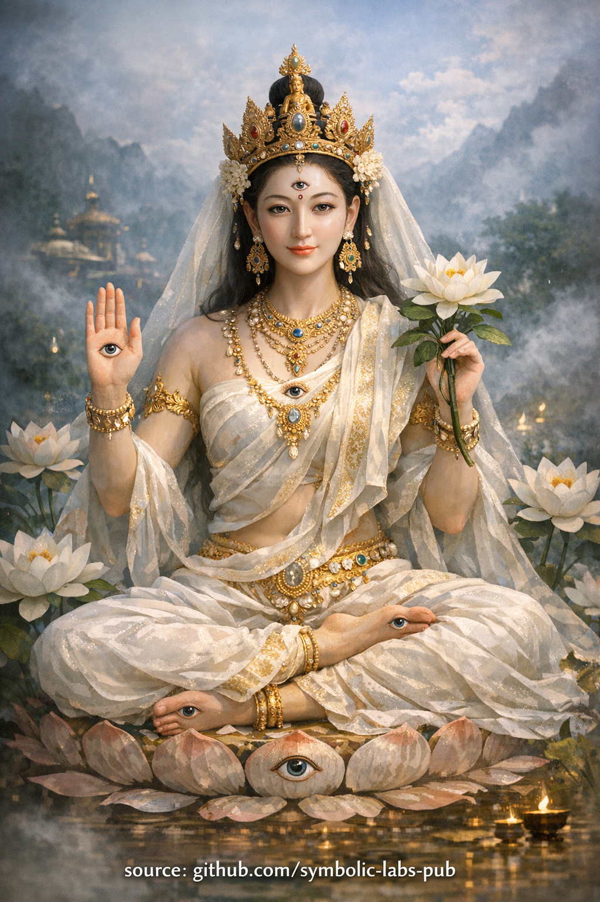

## [**White Tārā — The Teaching of Sustaining Conditions**](https://github.com/symbolic-labs-pub/a-buddhist-view/blob/master/more/08_lineage/01_white_tara/README.md#white-tārā--the-teaching-of-sustaining-conditions)

Explanation

**White Tārā** (Sanskrit: *Sitatārā*, Tibetan: *སྒྲོལ་དཀར་*, *Drolkar*) is a **female Buddha** in [Vajrayāna](../../05_yanas/README.md#4-vajrayāna-tantrayāna-mantrayāna---the-diamond-vehicle) Buddhism, embodying **[compassion](../../02_from_ignorance_to_awakening/7_compassion/README.md#compassion-as-a-structural-principle-in-buddhist-teaching) as sustaining care**. She is recognized by her **seven eyes** (on face, palms, and soles) representing continuous, distributed [awareness](../../10_concepts/README.md#2-awareness-rigpa-vijñāna-knowing) that maintains favorable conditions for [awakening](../../10_concepts/README.md#3-enlightenment-bodhi-awakening). Her white color symbolizes purity and healing, and she is traditionally associated with **longevity, health, and the protection of causal continuity**—not through miraculous intervention, but through the wisdom of maintaining viable conditions.

---

Teaching

## **White Tārā — The Teaching of Sustaining Conditions**

*(A teaching on compassion as continuity rather than rescue)*

White Tārā represents a dimension of compassion that is often overlooked:
**not compassion that intervenes after collapse, but compassion that prevents collapse from occurring.**

This teaching addresses a subtle but decisive insight:

> **[Awakening](../../10_concepts/README.md#3-enlightenment-bodhi-awakening) does not fail because insight is rare.
> It fails because conditions are not sustained.**

---

### 1. Compassion Is Not an Emotion — It Is a System Function

In this teaching, [compassion](../../02_from_ignorance_to_awakening/7_compassion/README.md#compassion-as-a-structural-principle-in-buddhist-teaching) is not defined as sympathy, kindness, or moral goodness.

Compassion is understood as:

* The **maintenance of viable conditions**
* The **stabilization of what already works**
* The **prevention of unnecessary breakdown**

White Tārā embodies compassion as **regulatory intelligence**—the way a healthy body preserves balance, or a stable ecosystem sustains diversity.

This corrects a common misunderstanding:
that compassion is primarily a response to [suffering](../../02_from_ignorance_to_awakening/2_the_four_noble_truths/README.md#1-there-is-suffering--dukkha).

In truth, the highest compassion is **pre-emptive**.

---

### 2. The Seven Eyes — Awareness of Conditions, Not Judgment

White Tārā’s **seven eyes** symbolize [awareness](../../10_concepts/README.md#2-awareness-rigpa-vijñāna-knowing) that is:

* Distributed (not centralized in ego)
* Continuous (not episodic insight)
* Non-reactive (not moralistic)

This awareness does not ask:

> “Who is right or wrong?”

It asks:

> **“What conditions are present, and are they sustainable?”**

This is why White Tārā practice is associated with **longevity and health**:
not because she grants life arbitrarily, but because she **protects causal continuity**.

---

### 3. Healing as Rebalancing, Not Correction

In this teaching, healing is not “fixing what is broken.”

Healing means:

* Removing unnecessary strain
* Restoring rhythm
* Allowing systems to self-regulate again

Thus, White Tārā does not impose awakening.
She **makes awakening survivable**.

Without this function:

* Insight becomes brittle
* Practice becomes heroic but short-lived
* [Wisdom](../../01_core_teachings/the_noble_eightfold_path/README.md#1-wisdom-paññā) burns faster than it stabilizes

---

### 4. Why This Teaching Is Essential in the Kagyü Path

The Kagyü tradition emphasizes **direct realization**—often swift, profound, and destabilizing if unsupported.

White Tārā appears here as a **counterbalance**:

* [Mahāmudrā](../../04_kayas/mahamudra_and_dzogcsen/README.md#mahāmudrā-nature-of-mind-སེམས་ཀྱི་གནས་ལུགས་) reveals the nature of mind
* White Tārā **keeps the body-mind capable of holding it**

This is why her practice emphasizes:

* Gentleness over intensity
* Continuity over peak experience
* Nurturing wisdom over forceful insight

---

### 5. The Central Instruction

> **Do not try to awaken faster than your conditions can support.**

White Tārā teaches practitioners to ask:

* Is my body supported?
* Is my nervous system stable?
* Is my life arranged to sustain clarity?

If not, insight will flicker—and fade.

---

### 6. The Ethical Implication

This teaching quietly reframes Buddhist [ethics](../../01_core_teachings/the_noble_eightfold_path/README.md#2-ethical-conduct-śīla):

Ethics is not moral compliance.
Ethics is **protecting the conditions for awakening**—in oneself and others.

To exhaust, rush, or destabilize beings in the name of progress is **anti-compassion**, even if motivated by ideals.

---

### Closing Teaching Verse

> Awakening is not lost through ignorance alone.
> It is lost through neglect of conditions.
>
> Where care is continuous,
> wisdom remains.
>
> This is the activity of White Tārā.

---

[Meditation](../README.md)

# White Tārā Meditation

> ⚠️ **Note on scope**
> What follows is a **non-empowerment contemplative form** (a *practice of meaning*).
> It does **not** replace lineage transmission (*wang, lung, tri*).
> Its function is **stabilization, aspiration, and causal alignment**, not tantric authorization.

---

**Compassion as the Condition for Awakening**

This is not a visualization to escape life.
It is a way of **stabilizing the conditions that allow awakening to continue**.

---

## 1. Preparation — Settling the Field (2–3 minutes)

Sit comfortably, spine upright but soft.
Let the breath fall into its **natural rhythm**.

Bring attention to the body as a **living system**:

* Weight supported by the ground
* Breath nourishing without effort
* Mind allowed to arrive gradually

Silently acknowledge:

> *“I am not here to force insight.
> I am here to sustain what allows insight to arise.”*

This intention aligns the practice with White Tārā’s function.

---

## 2. Generation — Presence of White Tārā (5–7 minutes)

Visualize **White Tārā** appearing **in front of you or above your crown**, formed of **luminous white light**—clear, cool, and alive.

Key features (held gently, not rigidly):

* **Seven eyes**

  * Two eyes of the face
  * One eye at the brow
  * One in each palm
  * One in each sole

These eyes **do not judge**.
They *recognize conditions*.

Her posture is relaxed, **one leg slightly extended**, indicating readiness to act without urgency.

Let her gaze rest on you with **unconditional attentiveness**—as a physician watches a patient, or a gardener watches soil.

---

## 3. Healing Light — Sustaining Life and Practice (8–12 minutes)

From White Tārā’s heart, a **soft white nectar-light** flows.

It enters:

* The crown of your head
* The throat
* The heart
* The abdomen
* The entire nervous system

This light does **three things simultaneously**:

1. **Heals** what is strained, injured, or depleted
2. **Stabilizes** breath, attention, and emotional tone
3. **Extends continuity**—of life, health, and practice

You are not “fixed.”
You are **supported**.

If the mind wanders, return not with force, but with the attitude:

> *“Even distraction is something being cared for.”*

---

## 4. Mantra (Optional but Traditional) — Rhythmic Continuity (5–10 minutes)

If [mantra](../../09_symbols/10_mantra/README.md#what-a-mantra-is-buddhist-view) is appropriate for you, recite silently or aloud:

**OM TĀRE TUTTĀRE TURE MAMĀ AYUR PUṆYE JÑĀNA PUṢṬIṂ KURU YE SVAHĀ**

Meaning (felt, not analyzed):

> *“May life, virtue, wisdom, and nourishment increase.”*

Let the mantra ride the breath naturally—
not to produce trance, but to **entrain steadiness**.

---

## 5. Dissolution — Care Becomes Innate (3–5 minutes)

White Tārā slowly dissolves into **light**, which then dissolves into **your own heart**.

Rest without imagery.

Notice:

* Breath still breathing
* Body still alive
* Awareness still present

Recognize:

> *Compassion is not outside me.*
> *It is the condition in which clarity survives.*

Remain here briefly.

---

## 6. Dedication — Extending the Field

Conclude with a simple dedication:

> *“May this stability support awakening
> wherever conditions are fragile.”*

Do not dramatize.
Dedication is **continuity extended outward**.

---

## How to Work With This Practice

**When to use it**

* During illness or exhaustion
* When practice feels brittle or forced
* When insight is present but unstable

**What it cultivates**

* Nervous-system safety
* Long-view patience
* Compassion without urgency

**Common mistake**

* Trying to *extract* insight
  White Tārā teaches **maintenance**, not extraction.

---

## Advanced Integration (Kagyü-style)

* Pair this practice with **Mahamudra resting** afterward
* Use it before sleep to stabilize subtle wind (lung)
* Practice it **even when you feel well**—that is its deepest function

---

### Core Insight

White Tārā is not mercy in response to failure.
She is **care that prevents collapse**.

Awakening does not only require insight.
It requires **conditions that last**.

---

---

< [Core Orientation of the Kagyu School](../../07_history/README.md) | [**A Kagyü Teaching on Green Tārā: Compassion That Does Not Hesitate**](../02_green_tara/README.md) >

_source: [github.com/symbolic-labs-pub](https://github.com/symbolic-labs-pub)_

---
