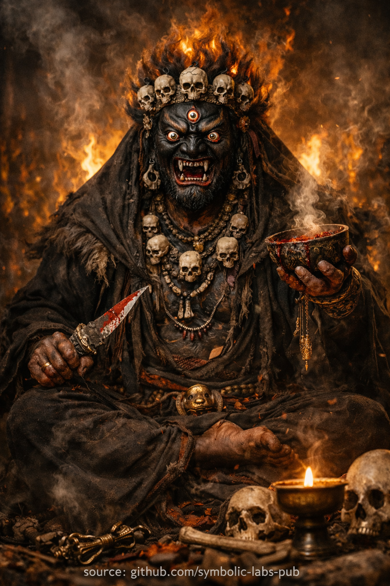

## [**Mahākāla and the Dharma of Non-Regression**](https://github.com/symbolic-labs-pub/a-buddhist-view/blob/master/more/08_lineage/03_mahakala/README.md#mahākāla-and-the-dharma-of-non-regression)

Explanation

**Mahākāla** (Sanskrit: *"Great Black One"*, Tibetan: *ནག་པོ་ཆེན་པོ་*, *Nagpo Chenpo*) is a **wrathful protector deity** in [Vajrayāna](../../05_yanas/README.md#4-vajrayāna-tantrayāna-mantrayāna---the-diamond-vehicle) Buddhism, embodying **fierce [compassion](../../02_from_ignorance_to_awakening/7_compassion/README.md#compassion-as-a-structural-principle-in-buddhist-teaching) that prevents regression on the path**. His dark blue-black color represents the **dharmakāya** (absolute reality beyond concepts), and his wrathful appearance symbolizes the **uncompromising elimination of obstacles**—both external disturbances and internal tendencies toward spiritual compromise. Mahākāla is particularly revered as a **Dharma protector** who ensures practitioners do not abandon their vows or fall back into confusion once they have entered the path.

---

Teaching

## **Mahākāla and the Dharma of Non-Regression**

### *Fierce Compassion as a Condition for Awakening*

In the [Vajrayāna](../../05_yanas/README.md#4-vajrayāna-tantrayāna-mantrayāna---the-diamond-vehicle)—and especially within the Kagyü lineage—Mahākāla is not approached as a deity who grants favors, nor as a being who protects the ego from discomfort.
Mahākāla represents a **function of awakened [compassion](../../02_from_ignorance_to_awakening/7_compassion/README.md#compassion-as-a-structural-principle-in-buddhist-teaching)**: the force that **prevents regression once the path has been entered**.

This teaching clarifies a subtle but critical point in Buddhist practice:

> **Progress on the path does not fail primarily due to external obstacles,
> but due to internal compromise.**

Mahākāla is the antidote to that compromise.

---

## 1. Wrathful Form Does Not Mean Anger

In Buddhism, appearances are **pedagogical**.

Mahākāla’s wrathful form does not express hatred or violence.
It expresses **non-negotiation with delusion**.

* Calm compassion nurtures growth
* Fierce compassion **cuts what threatens growth**

Just as a surgeon’s incision is not cruelty, Mahākāla’s wrath is **precision without sentimentality**.

This teaches us:

> Compassion is not always gentle.
> Sometimes it must be **decisive, immediate, and irreversible**.

---

## 2. Protection Is Not Comfort

A common misunderstanding is to treat protection as safety from difficulty.

Mahākāla teaches the opposite.

What truly endangers the practitioner is not hardship, but:

* Spiritual laziness
* Self-deception
* Ethical erosion
* Practice reduced to identity or aesthetics
* Subtle attachment to comfort, status, or insight

Mahākāla does not remove these threats.
He **destroys the conditions that allow them to persist**.

Thus, he is called:

> **Protector of practice, not protector of comfort.**

---

## 3. Non-Regression as a Core Dharma Principle

In [Mahāyāna](../../05_yanas/README.md#limitation-from-mahāyāna-view) and Vajrayāna, one of the gravest dangers is **regression**—not dramatic collapse, but quiet backsliding.

Regression looks like:

* [Knowing](../../10_concepts/README.md#2-awareness-rigpa-vijñāna-knowing) the Dharma but no longer embodying it
* [Meditating](../README.md) without transformation
* [Ethics](../../01_core_teachings/the_noble_eightfold_path/README.md#2-ethical-conduct-śīla) becoming negotiable
* Insight becoming conceptual instead of lived

Mahākāla symbolizes the **continuity function** of the path.

He embodies the vow:

> “Once truth is seen, it will not be betrayed.”

This is not sustained by willpower alone.
It requires a **protective clarity** that exposes self-deception instantly.

---

## 4. The True Enemy Is Ego-Clinging

Mahākāla’s wrath is always directed inward.

What he destroys is not people, events, or circumstances, but:

* Identification with thoughts
* Attachment to spiritual identity
* Fear of groundlessness
* The impulse to soften truth to preserve self-image

From a teaching perspective, Mahākāla is **[emptiness](../../10_concepts/01_emptiness/README.md#emptiness-śūnyatā-in-vajrayāna-buddhism) in action**:

* Empty of sentimentality
* Empty of hesitation
* Empty of self-reference

This teaches that [awakening](../../10_concepts/README.md#3-enlightenment-bodhi-awakening) is not fragile—it is **only obstructed by clinging**.

---

## 5. The Protector Is Not External

At the deepest level, Mahākāla is **not other**.

The teaching culminates here:

> The true protector is the moment
> when awareness refuses to lie to itself.

When clarity cuts through hesitation,
when practice continues despite discomfort,
when ethics hold even without witnesses—
Mahākāla is present.

Thus, the ultimate meaning is:

> **Mahākāla is awakened responsibility itself.**

---

## 6. Integration into Daily Life

This teaching is not confined to ritual.

Mahākāla functions whenever:

* You return to practice instead of postponing
* You tell the truth instead of preserving harmony
* You continue the path without external validation
* You allow illusion to collapse without resentment

In these moments, fierce compassion is alive.

---

## Closing Teaching Statement

> **Gentle compassion opens the path.
> Fierce compassion keeps it open.**
>
> Without Mahākāla, [wisdom](../../01_core_teachings/the_noble_eightfold_path/README.md#1-wisdom-paññā) decays into comfort.
> With Mahākāla, awakening becomes irreversible.

---

Invocation

# Mahākāla Protector Invocation

**Meditation of Fierce Compassion and Non-Regression**

*(20–30 minutes · adaptable)*

> ⚠️ **Note on scope**
> What follows is a **non-empowerment contemplative form** (a *practice of meaning*).
> It does **not** replace lineage transmission (*wang, lung, tri*).
> Its function is **stabilization, aspiration, and causal alignment**, not tantric authorization.

---

## 1. Preparation — Establish the Ground (3–5 min)

Sit in a stable posture.
If possible, **[lotus](../../09_symbols/08_lotus/README.md#the-lotus-in-buddhist-teaching) or half-lotus**, otherwise any balanced seated position.

* Spine upright, relaxed
* Chin slightly tucked
* Eyes half-open or gently closed
* Hands resting naturally

Bring attention to the breath without controlling it.

Silently establish **motivation**:

> “This practice is not for comfort, gain, or display.
> It is for the protection of truth, clarity, and continuity of awakening.”

Let this intention settle.

---

## 2. Recollection — Understanding the Protector (2–3 min)

Before visualization, **clarify meaning**.

Reflect briefly:

* Wrathful appearance = **fierce compassion**
* Destruction = **destruction of ego-clinging**
* Protection = **protection of practice**, not personality
* Fear = **what resists dissolution**

Let go of mythic literalism.
Mahākāla here is **a functional principle of awakened energy**.

---

## 3. Visualization — Arising of Mahākāla (5–7 min)

From the open space in front of you—or from the center of awareness itself—

Mahākāla **arises seated in lotus posture**.

Visual qualities (do not force detail; let it cohere):

* Body: deep black, absorbing light
* Posture: unmoving, grounded, indestructible
* Expression: wrathful yet **utterly precise**
* Surrounding: flames of wisdom, smoke of dissolving confusion
* Implements: symbols of cutting through delusion

Key point:
**He is completely still.**
Wrath here is not agitation—it is **unwavering clarity**.

Feel the presence as **closer than thought**, yet not personal.

---

## 4. Invocation — Calling the Function (5–7 min)

On the out-breath, silently invoke:

> “Protector of the Dharma,
> Guardian of continuity,
> Destroyer of regression—
> Be present.”

With each repetition, feel:

* Laziness exposed
* Self-deception illuminated
* Avoidance made impossible
* Practice stabilized

Do **not** ask Mahākāla to remove difficulties.
Let difficulties be **cut cleanly**.

If fear arises, do not suppress it.
Let Mahākāla **face it directly through you**.

---

## 5. Union — Protector as Your Own Capacity (3–5 min)

Now dissolve the visualization.

Mahākāla does **not remain external**.

Feel:

* The same unwavering clarity in your posture
* The same uncompromising honesty in awareness
* The same fierce care for truth in your intention

Rest in this **protector-quality** without imagery.

This is the crucial point:

> Mahākāla is not protecting *you*.
> He protects **awakening functioning through you**.

---

## 6. Dedication — Seal the Practice (2–3 min)

Gently conclude:

> “May this clarity prevent regression.
> May confusion be cut without hatred.
> May compassion remain fierce and precise.
> May practice continue until awakening is complete.”

Let the breath return to normal.

Remain still for a few moments before moving.

---

## Integration Notes (Important)

* This practice is **especially effective** when motivation weakens
* Use it **before retreat sessions**, difficult work, or ethical challenges
* Avoid overuse if emotionally unstable—ground with breath and ethics first
* Pair with **daily discipline**, not emotional intensity

---

## One-Line Essence (to remember during daily life)

> **“Fierce compassion protects what comfort would destroy.”**

---

< [**A Kagyü Teaching on Green Tārā: Compassion That Does Not Hesitate**](../02_green_tara/README.md) | [The Teaching of Infinite Responsiveness](../04_avalokitesvara/README.md) >

_source: [github.com/symbolic-labs-pub](https://github.com/symbolic-labs-pub)_

---
