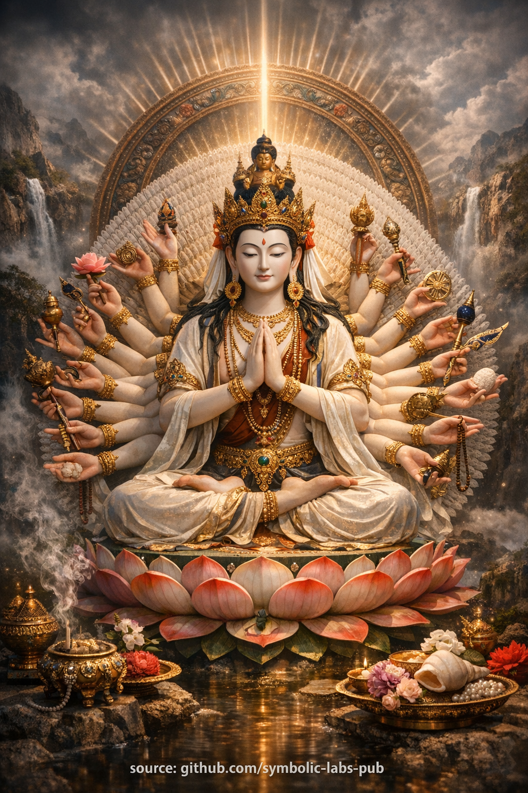

## [The Teaching of Infinite Responsiveness](https://github.com/symbolic-labs-pub/a-buddhist-view/blob/master/more/08_lineage/04_avalokitesvara/README.md#the-teaching-of-infinite-responsiveness)

Teaching

## The Teaching of Infinite Responsiveness

### Compassion as Structure, Not Sentiment

### Central Figure

Avalokiteśvara
in the **thousand-armed form** is not presented as a deity to worship, but as a **map of awakened function**.

---

## 1. The Core Problem: Self-Fixation

According to Buddhist analysis, [suffering](../../02_from_ignorance_to_awakening/2_the_four_noble_truths/README.md#1-there-is-suffering--dukkha) does not primarily arise from pain, loss, or difficulty.

It arises from **self-fixation**:

* The constant referencing of experience to a central “me”
* The contraction of [awareness](../../10_concepts/README.md#2-awareness-rigpa-vijñāna-knowing) around identity, fear, and control
* The habit of responding to the world through defense or grasping

Even compassion, when filtered through self-fixation, becomes distorted:

* “I am compassionate”
* “I should help”
* “Why isn’t this working?”

This creates **burnout, pride, guilt, and aversion**.

---

## 2. The Radical Shift: Compassion Without a Center

The thousand-armed form teaches something radical:

> **Compassion does not require a self.**

The many arms symbolize:

* Not emotional intensity
* Not heroic effort
* But **decentralized responsiveness**

Each arm acts **where needed**, without consulting an ego.

This is why the teaching emphasizes:

* **Availability over intention**
* **Responsiveness over identity**
* **Function over feeling**

Compassion is not something *you do*.
It is what happens when **self-reference loosens**.

---

## 3. Skillful Means Everywhere

In [Mahāyāna](../../05_yanas/README.md#limitation-from-mahāyāna-view) Buddhism, compassion is inseparable from **prajñā** ([wisdom](../../01_core_teachings/the_noble_eightfold_path/README.md#1-wisdom-paññā)).

The thousand arms represent:

* Infinite **skillful means (upāya)**
* The ability to respond **appropriately**, not uniformly
* Action shaped by conditions, not ideology

This means:

* Sometimes compassion is gentle
* Sometimes it is firm
* Sometimes it is silent
* Sometimes it withdraws

There is no single compassionate behavior.
There is only **context-sensitive response**.

---

## 4. Why This Practice Softens Without Weakening

The teaching explicitly avoids two extremes:

### ❌ Sentimental Compassion

* Over-identification with suffering
* Emotional flooding
* Loss of clarity

### ❌ Detached Indifference

* Withdrawal from suffering
* Spiritual bypassing
* Cold neutrality

The thousand-armed teaching shows a **third way**:

> **Softness of heart + stability of structure**

Self-fixation softens → reactivity decreases
Resolve strengthens → action becomes reliable

This is compassion that **does not collapse under pressure**.

---

## 5. Lojong Integration: Structural Mind Training

In the Kagyü tradition, this teaching integrates directly with **lojong (mind training)**.

Key transformation:

* From “How do I feel about this?”
* To “What response reduces suffering here?”

This re-orients the entire cognitive system.

Over time, practitioners notice:

* Less hesitation when help is needed
* Less drama when helping fails
* Less identity tied to outcomes

This is not moral improvement.
It is **architectural change in mind**.

---

## 6. The Deepest Point: No Owner of Compassion

At the deepest level, the teaching points to **non-ownership**.

There is:

* Compassion happening
* Response unfolding
* Care expressing itself

But **no central agent** required.

This aligns with:

* [Emptiness (śūnyatā)](../../10_concepts/01_emptiness/README.md#emptiness-śūnyatā-in-vajrayāna-buddhism)
* [Non-self (anātman)](../../02_from_ignorance_to_awakening/1_the_three_marks_of_existence/README.md#3-non-self-anattā)
* [Dependent origination](../../02_from_ignorance_to_awakening/3_dependent_origination/README.md#the-twelve-links-the-classic-formulation)

Compassion is **a property of awakened awareness**, not a personality trait.

---

## 7. Practical Teaching Summary

You can carry this teaching into daily life with one principle:

> **When suffering appears, release self-reference first.
> Then respond.**

If you remember only this, the teaching is alive.

---

## Closing Instruction

Do not try to *be* compassionate.

Practice instead:

* Relaxing fixation
* Remaining available
* Acting without ownership

When that happens,
**a thousand arms are already moving.**

---

Meditation

## Thousand-Armed Chenrezig

### Meditation on Infinite Compassion as Action

**Purpose**
To stabilize the mind in **non-self-referential compassion**, dissolving self-fixation while strengthening the capacity to respond skillfully to suffering.

This is not emotional cultivation.
It is **structural re-orientation of mind**.

> ⚠️ **Note on scope**
> What follows is a **non-empowerment contemplative form** (a *practice of meaning*).
> It does **not** replace lineage transmission (*wang, lung, tri*).
> Its function is **stabilization, aspiration, and causal alignment**, not tantric authorization.

---

## 1. Preparation (2–3 minutes)

Sit comfortably. Spine upright but relaxed.
Hands resting naturally.

Let the breath settle **without manipulation**.

Briefly recall:

> “May this practice benefit all beings without exception.”

Do not dramatize this intention.
Let it be **quiet and sincere**.

---

## 2. Visualization (3–5 minutes)

Visualize **Thousand-Armed Chenrezig** appearing in front of you or above your head.

Key qualities (do not over-detail):

* Body luminous, white like moonlight
* Expression **serene, unstrained**
* A thousand arms radiating outward in all directions
* Each hand an **expression of response**, not force

At the heart center, see **clear light**, calm and stable.

Understand:

> This form represents **function**, not personality.
> Compassion as *capacity*, not sentiment.

---

## 3. Identification (2–3 minutes)

Now gently **merge the visualization with yourself**.

* The form dissolves into light
* The light enters your heart
* Your body becomes the body of Chenrezig
* Your awareness becomes **unobstructed responsiveness**

There is no pride here.
No “becoming a deity.”

Only this recognition:

> Compassion is not something you generate.
> It is what remains when self-fixation relaxes.

---

## 4. Mantra with Structural Attention (5–10 minutes)

Recite softly or silently:

**OM MANI PADME HUM**

Do not focus on sound alone.

With each repetition:

* **OM** — Stabilize awareness
* **MANI** — Recognize suffering
* **PADME** — Non-attachment
* **HUM** — Integration into action

Let the [mantra](../../09_symbols/10_mantra/README.md#what-a-mantra-is-buddhist-view) synchronize with breath and presence.

If thoughts arise:

* Do not suppress
* Do not follow
* Let them dissolve **into compassionate space**

---

## 5. Compassion as Field (3–5 minutes)

Now release mantra.

Rest in open awareness.

Visualize the thousand arms **continuously extending**:

* Not outward effort
* Not inward contraction
* Simply **availability**

Include:

* Yourself
* People you know
* Difficult beings
* All forms of visible and invisible suffering

Nothing is excluded.
Nothing is forced.

---

## 6. Dedication (1 minute)

Conclude gently:

> “May whatever clarity or stability arose
> become a condition for the relief of suffering.”

Let the visualization dissolve completely.

Remain briefly in **ordinary awareness**, unchanged, grounded.

---

## Key Practice Insight (Very Important)

This meditation trains **capacity**, not emotion.

If compassion feels absent:

* The practice is still working.

If compassion feels strong:

* Do not cling to it.

The true sign of progress is this:

> **Less hesitation in responding to suffering.
> Less self-reference in action.**

---

## Practical Integration (Off-Cushion)

During daily life:

* When encountering suffering → recall **one arm extending**
* When reacting defensively → soften the chest, breathe once
* When overwhelmed → return to *availability*, not solutions

Compassion is **structural orientation**, not mood.

---

---

< [Mahākāla Protector Invocation](../03_mahakala/README.md) | [Buddhist Teaching: **Awakening as Skillful Adaptation**](../05_padmasambhava/README.md) >

_source: [github.com/symbolic-labs-pub](https://github.com/symbolic-labs-pub)_

---
