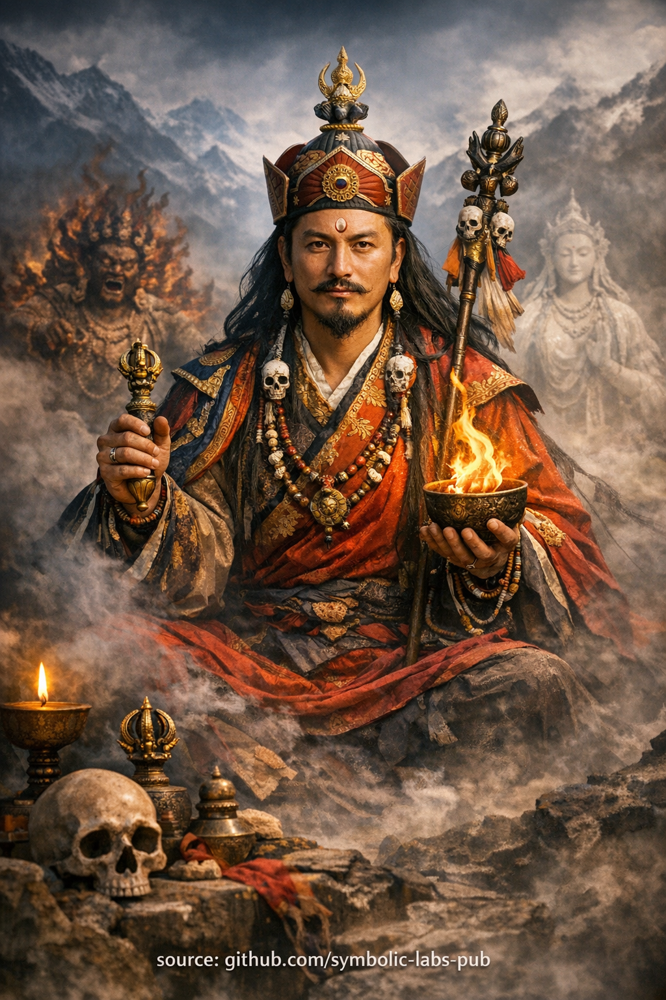

## [Buddhist Teaching: **Awakening as Skillful Adaptation**](https://github.com/symbolic-labs-pub/a-buddhist-view/blob/master/more/08_lineage/05_padmasambhava/README.md#buddhist-teaching-awakening-as-skillful-adaptation)

Teaching

## Buddhist Teaching: **Awakening as Skillful Adaptation**

### Based on the Principle of **Guru Rinpoche**

---

### 1. The Problem the Teaching Addresses

Most spiritual struggle comes from **misunderstanding [awakening](../../10_concepts/README.md#3-enlightenment-bodhi-awakening)**.

People assume awakening means:

* Becoming permanently peaceful
* Avoiding conflict or intensity
* Maintaining a fixed “holy” identity

This creates **fragile spirituality**:

* Calm that collapses under pressure
* [Ethics](../../01_core_teachings/the_noble_eightfold_path/README.md#2-ethical-conduct-śīla) that fail in complexity
* Insight that cannot act

Buddhism does not teach escape from conditions.
It teaches **freedom within conditions**.

---

### 2. Core Teaching: Awakening Is Not a State — It Is a Capacity

Guru Rinpoche embodies a central Vajrayāna insight:

> **Awakening is the ability to respond appropriately to whatever arises.**

This means:

* Peaceful when peace is needed
* Wrathful when obstruction must be cut
* Silent when words would distort
* Active when delay would cause harm

There is **no single enlightened personality**.
There is only **unobstructed responsiveness**.

---

### 3. Wrathful and Peaceful Are Not Opposites

In ordinary thinking:

* Peaceful = good
* Wrathful = bad

In Vajrayāna understanding:

* Both are **expressions of [compassion](../../02_from_ignorance_to_awakening/7_compassion/README.md#compassion-as-a-structural-principle-in-buddhist-teaching)**
* The difference is **function**, not morality

Wrathful forms:

* Destroy ignorance, not beings
* Cut ego-clinging, not people
* Protect practice, not comfort

Peaceful forms:

* Stabilize, heal, and nurture
* Create conditions for insight

**[Wisdom](../../01_core_teachings/the_noble_eightfold_path/README.md#1-wisdom-paññā) chooses form.**

---

### 4. Why This Teaching Is Dangerous Without Grounding

This teaching is **not permission for ego**.

Without:

* Ethics (śīla)
* Discipline
* Compassion

“Wrathful means” becomes:

* Anger justified as spirituality
* Power confused with wisdom

Therefore, this teaching is traditionally given:

* After refuge
* After ethical stabilization
* After some [meditative](../README.md) clarity

Adaptation without clarity is chaos.
Clarity without adaptation is impotence.

---

### 5. The Middle Way of Vajrayāna Action

This teaching avoids two extremes:

**1. Rigid Purity**

* Fear of action
* Avoidance of complexity
* Spiritual bypassing

**2. Reactive Impulsivity**

* Acting from emotion
* Justifying harm
* Losing [awareness](../../10_concepts/README.md#2-awareness-rigpa-vijñāna-knowing)

Guru Rinpoche represents the **third mode**:

> Action without ego-reference.

---

### 6. Practical Implication for Practitioners

Ask not:

> “What should an enlightened person do?”

Ask:

> “What reduces confusion *here*, *now*, with least distortion?”

This shifts practice from:

* Identity → Function
* Appearance → Effect
* Belief → Precision

---

### 7. Final Teaching Statement

> Awakening is not purity.
> Awakening is **accuracy**.
>
> When wisdom meets conditions without fear,
> whatever arises becomes the path.

---

Explanation

### Based on the Principle of **Guru Rinpoche**

---

### 1. The Problem the Teaching Addresses

Most spiritual struggle comes from **misunderstanding awakening**.

People assume awakening means:

* Becoming permanently peaceful
* Avoiding conflict or intensity
* Maintaining a fixed “holy” identity

This creates **fragile spirituality**:

* Calm that collapses under pressure
* Ethics that fail in complexity
* Insight that cannot act

Buddhism does not teach escape from conditions.
It teaches **freedom within conditions**.

---

### 2. Core Teaching: Awakening Is Not a State — It Is a Capacity

Guru Rinpoche embodies a central Vajrayāna insight:

> **Awakening is the ability to respond appropriately to whatever arises.**

This means:

* Peaceful when peace is needed
* Wrathful when obstruction must be cut
* Silent when words would distort
* Active when delay would cause harm

There is **no single enlightened personality**.
There is only **unobstructed responsiveness**.

---

### 3. Wrathful and Peaceful Are Not Opposites

In ordinary thinking:

* Peaceful = good
* Wrathful = bad

In Vajrayāna understanding:

* Both are **expressions of compassion**
* The difference is **function**, not morality

Wrathful forms:

* Destroy ignorance, not beings
* Cut ego-clinging, not people
* Protect practice, not comfort

Peaceful forms:

* Stabilize, heal, and nurture
* Create conditions for insight

**Wisdom chooses form.**

---

### 4. Why This Teaching Is Dangerous Without Grounding

This teaching is **not permission for ego**.

Without:

* Ethics (śīla)
* Discipline
* Compassion

“Wrathful means” becomes:

* Anger justified as spirituality
* Power confused with wisdom

Therefore, this teaching is traditionally given:

* After refuge
* After ethical stabilization
* After some meditative clarity

Adaptation without clarity is chaos.
Clarity without adaptation is impotence.

---

### 5. The Middle Way of Vajrayāna Action

This teaching avoids two extremes:

**1. Rigid Purity**

* Fear of action
* Avoidance of complexity
* Spiritual bypassing

**2. Reactive Impulsivity**

* Acting from emotion
* Justifying harm
* Losing awareness

Guru Rinpoche represents the **third mode**:

> Action without ego-reference.

---

### 6. Practical Implication for Practitioners

Ask not:

> “What should an enlightened person do?”

Ask:

> “What reduces confusion *here*, *now*, with least distortion?”

This shifts practice from:

* Identity → Function
* Appearance → Effect
* Belief → Precision

---

### 7. Final Teaching Statement

> Awakening is not purity.
> Awakening is **accuracy**.
>
> When wisdom meets conditions without fear,
> whatever arises becomes the path.

---

### 1. Preparation — Establish the Ground (2–3 minutes)

Sit comfortably with a straight spine.
Let the breath settle naturally.

Bring to mind this intention:

> *“I practice not to escape conditions,
> but to awaken **within** them.”*

Allow the mind to become clear and alert—neither tense nor dull.

> ⚠️ **Note on scope**
> What follows is a **non-empowerment contemplative form** (a *practice of meaning*).
> It does **not** replace lineage transmission (*wang, lung, tri*).
> Its function is **stabilization, aspiration, and causal alignment**, not tantric authorization.

---

### 2. Visualization — Presence of the Master (5–7 minutes)

Visualize **Guru Rinpoche** appearing in front of you, or above the crown of your head.

Key features (held lightly, not forced):

* Radiant yet grounded
* Peaceful presence with **latent power**
* Wrathful and gentle energies integrated, not opposed

He is not distant or symbolic—
he represents **the awakened response already possible in your own mindstream**.

Let the image stabilize.

---

### 3. Core Contemplation — Adaptive Awakening (8–10 minutes)

Reflect silently:

* Awakening is **not fixed behavior**
* Awakening **adapts without losing clarity**
* Wisdom chooses form according to conditions

Bring to mind situations in your life:

* Conflict
* Complexity
* Uncertainty
* Pressure

For each, notice:

* Where rigidity appears
* Where fear resists adaptation

Now imagine Guru Rinpoche **meeting the same situation**:

* No hesitation
* No collapse
* No excess

Let that **quality of response** dissolve into you.

Do not imitate behavior—
**absorb orientation**.

---

### 4. Mantric Stabilization (optional, 5 minutes)

Softly recite (aloud or silently):

> **OM AH HUM VAJRA GURU PADMA SIDDHI HUM**

With each repetition:

* **OM** — awaken clarity
* **AH** — open expression
* **HUM** — integrate power

Let sound, breath, and awareness synchronize.

---

### 5. Dissolution — Integration (3–5 minutes)

Visualize Guru Rinpoche dissolving into light,
which then dissolves **into your heart**.

Rest in open awareness.

Nothing special to hold.
Nothing to reject.

---

### 6. Closing Dedication

Conclude with this reflection:

> *“May awakened adaptability arise
> wherever conditions demand it—
> for myself and for all beings.”*

---

## Key Insight of the Practice

This meditation trains **non-fragile awakening**.

* Not purity, but **precision**
* Not avoidance, but **fearless responsiveness**
* Not identity, but **function**

---

Meditation

### 1. Preparation — Establish the Ground (2–3 minutes)

Sit comfortably with a straight spine.
Let the breath settle naturally.

Bring to mind this intention:

> *“I practice not to escape conditions,
> but to awaken **within** them.”*

Allow the mind to become clear and alert—neither tense nor dull.

> ⚠️ **Note on scope**
> What follows is a **non-empowerment contemplative form** (a *practice of meaning*).
> It does **not** replace lineage transmission (*wang, lung, tri*).
> Its function is **stabilization, aspiration, and causal alignment**, not tantric authorization.

---

### 2. Visualization — Presence of the Master (5–7 minutes)

Visualize **Guru Rinpoche** appearing in front of you, or above the crown of your head.

Key features (held lightly, not forced):

* Radiant yet grounded
* Peaceful presence with **latent power**
* Wrathful and gentle energies integrated, not opposed

He is not distant or symbolic—
he represents **the awakened response already possible in your own mindstream**.

Let the image stabilize.

---

### 3. Core Contemplation — Adaptive Awakening (8–10 minutes)

Reflect silently:

* Awakening is **not fixed behavior**
* Awakening **adapts without losing clarity**
* Wisdom chooses form according to conditions

Bring to mind situations in your life:

* Conflict
* Complexity
* Uncertainty
* Pressure

For each, notice:

* Where rigidity appears
* Where fear resists adaptation

Now imagine Guru Rinpoche **meeting the same situation**:

* No hesitation
* No collapse
* No excess

Let that **quality of response** dissolve into you.

Do not imitate behavior—
**absorb orientation**.

---

### 4. Mantric Stabilization (optional, 5 minutes)

Softly recite (aloud or silently):

> **OM AH HUM VAJRA GURU PADMA SIDDHI HUM**

With each repetition:

* **OM** — awaken clarity
* **AH** — open expression
* **HUM** — integrate power

Let sound, breath, and awareness synchronize.

---

### 5. Dissolution — Integration (3–5 minutes)

Visualize Guru Rinpoche dissolving into light,
which then dissolves **into your heart**.

Rest in open awareness.

Nothing special to hold.
Nothing to reject.

---

### 6. Closing Dedication

Conclude with this reflection:

> *“May awakened adaptability arise
> wherever conditions demand it—
> for myself and for all beings.”*

---

## Key Insight of the Practice

This meditation trains **non-fragile awakening**.

* Not purity, but **precision**
* Not avoidance, but **fearless responsiveness**
* Not identity, but **function**

Guru Rinpoche here is not worshipped—
he is **activated**.

---

< [The Teaching of Infinite Responsiveness](../04_avalokitesvara/README.md) | [Medicine Buddha](../06_medicine_buddha/README.md) >

_source: [github.com/symbolic-labs-pub](https://github.com/symbolic-labs-pub)_

---
