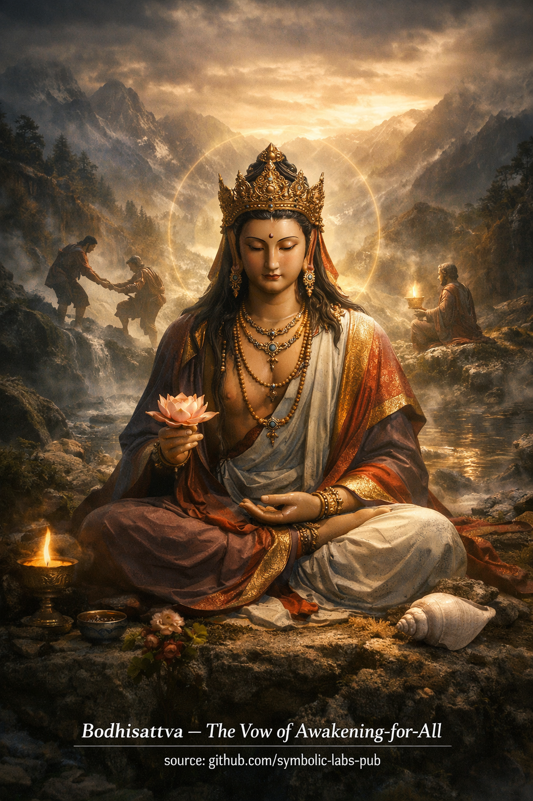

## [Awakening Is Not Private](https://github.com/symbolic-labs-pub/a-buddhist-view/blob/master/more/08_lineage/08_bodhisattva/README.md#awakening-is-not-private)

Teaching

# The Bodhisattva Path

## Awakening Is Not Private

### A Teaching on Awakening-in-Relation

---

## 1. The Core Reversal

Ordinary thinking assumes:

> *I awaken, then I help others.*

The **bodhisattva path reverses this**:

> *Awakening occurs only in relation to others.*

This is not moral idealism.
It is a **diagnosis of how mind actually functions**.

As long as awakening is imagined as *personal attainment*, subtle self-clinging remains.
Where self-clinging remains, awakening is incomplete.

---

## 2. Why Enlightenment Cannot Be Private

From the Buddhist view:

* [Suffering](../../02_from_ignorance_to_awakening/2_the_four_noble_truths/README.md#1-there-is-suffering--dukkha) arises through **misperception of separation**
* Liberation arises through **seeing relationality clearly**

If [awakening](../../10_concepts/README.md#3-enlightenment-bodhi-awakening) were private, it would reinforce the very illusion it claims to end.

Thus, the bodhisattva vow is not altruism.
It is **ontological correctness**.

To awaken while excluding others would be like trying to breathe while denying air.

---

## 3. Wisdom and Compassion: Not Two Things

In early practice, wisdom and compassion appear distinct:

* **Wisdom** sees [impermanence](../../01_core_teachings/impermanence/README.md#2-impermanence-anicca-is-structural-not-accidental), [emptiness](../../10_concepts/01_emptiness/README.md#emptiness-śūnyatā-in-vajrayāna-buddhism), [non-self](../../02_from_ignorance_to_awakening/1_the_three_marks_of_existence/README.md#3-non-self-anattā)
* **Compassion** responds to suffering

On the bodhisattva path, they are understood as **two expressions of one insight**:

* Wisdom without compassion becomes cold detachment
* Compassion without wisdom becomes exhaustion

When emptiness is truly seen, separation collapses.
When separation collapses, care becomes automatic.

Thus, compassion is **emptiness in action**.

---

## 4. The Bodhisattva Vow as Structural Alignment

The vow is often misunderstood as a promise to *save all beings*.

This is impossible if taken literally — and Buddhism does not teach impossibilities.

The vow actually does this:

* It **removes self-exemption**
* It aligns perception with interdependence
* It prevents awakening from crystallizing into identity

The vow reshapes **how perception functions**, not what outcomes must occur.

It is a **direction**, not a finish line.

---

## 5. Awakening in Motion

A Buddha represents **complete realization at rest**.
A bodhisattva represents **realization in movement**.

This distinction matters.

Life is dynamic:

* Conditions shift
* Suffering changes form
* Responses must adapt

The bodhisattva embodies awakening that:

* Thinks
* Speaks
* Acts
* Adjusts

Not perfectly — but responsively.

Awakening is no longer a state.
It is a **way of functioning**.

---

## 6. The Ethical Consequence

Because awakening is relational:

* [Ethics](../../01_core_teachings/the_noble_eightfold_path/README.md#2-ethical-conduct-śīla) are not rules
* They are expressions of clarity

A bodhisattva does not ask:

> *Is this allowed?*

But:

> *Does this reduce confusion or increase it?*

Ethical conduct emerges naturally when:

* Self-centered reference weakens
* Cause and effect are seen clearly

This is why morality precedes, supports, and expresses realization.

---

## 7. The Silent Criterion

A simple test reveals bodhisattva alignment:

> Does this thought, word, or action
> make awakening more available — or less — for others?

If it contracts the field, it is not yet complete.
If it opens the field, it accords with the path.

This test applies equally to:

* Speech
* Work
* Politics
* Technology
* Teaching
* Silence

The bodhisattva path does not retreat from the world.
It **inhabits it intelligently**.

---

## 8. Final Pointing

The bodhisattva is not a saint, savior, or hero.

A bodhisattva is someone who has understood one thing clearly:

> There is no liberation that excludes.

Therefore:

* Awakening continues
* Practice continues
* Responsiveness continues

Not because enlightenment is lacking —
but because **reality is alive**.

---

### Closing Line (Traditional in Spirit)

> May wisdom clarify perception.
> May compassion guide response.
> May awakening move freely through the world.

This is the **bodhisattva teaching**.

---

Meditation

## Bodhisattva Meditation

### *Awakening-in-Relation Practice*

This is not a visualization of a deity.
It is a **training in orientation**.

> ⚠️ **Note on scope**
> What follows is a **non-empowerment contemplative form** (a *practice of meaning*).
> It does **not** replace lineage transmission (*wang, lung, tri*).
> Its function is **stabilization, aspiration, and causal alignment**, not tantric authorization.

---

## 1. Preparation — Establish the Ground

Sit comfortably. Spine upright, body relaxed.
Let the breath settle without controlling it.

Bring to mind:

> *Awakening is not for me alone.*

Do not make this emotional.
Let it land as a **structural fact**.

---

## 2. Opening Contemplation — The Bodhisattva Vow

Silently reflect:

* Every being seeks relief from suffering
* No being awakens in isolation
* Wisdom without compassion fractures
* Compassion without wisdom exhausts

Let these reflections **re-pattern motivation**, not mood.

Then gently form the intention:

> *May this practice benefit all beings, directly or indirectly.*

This intention is the **axis** of the meditation.

---

## 3. Core Practice — Co-Arising of Wisdom and Compassion

### Phase A: Wisdom (Seeing Clearly)

Rest [awareness](../../10_concepts/README.md#2-awareness-rigpa-vijñāna-knowing) on experience as it is:

* Sensations arise
* Thoughts arise
* Emotions arise

Notice:

* None are solid
* None remain
* None belong to a fixed “self”

Do not analyze.
Just **see arising and dissolving**.

This is **prajñā** — clarity without commentary.

---

### Phase B: Compassion (Responding Without Grasping)

Now widen awareness to include others:

* People you know
* People you don’t know
* Beings struggling in obvious and invisible ways

Do not imagine stories.
Simply recognize:

> *This suffering feels real to them.*

Allow a **non-sentimental warmth** to emerge.

This is **karuṇā** — responsiveness without self-reference.

---

### Phase C: Integration — Awakening in Motion

Now drop the distinction.

Let clarity and care function **together**:

* Seeing suffering clearly
* Responding without clinging
* Acting without needing credit

Rest here.

This is the **bodhisattva mode**:

> Awareness that moves.

---

## 4. Working with Obstacles

If pride arises:

* Recognize it as fixation
* Let it dissolve

If fatigue arises:

* Recognize compassion-and-compassion-not-two-things) without wisdom
* Return to clarity

If emptiness feels cold:

* Let compassion warm it

If compassion feels heavy:

* Let wisdom lighten it

Obstacles are **diagnostics**, not failures.

---

## 5. Dedication — Sealing the Practice

Conclude with dedication:

> *Whatever clarity or benefit arose here
> may it become a cause for the awakening of all beings.*

Do not dramatize this.
Dedication **stabilizes causality**.

---

## 6. Off-Cushion Continuation — The Real Practice

The bodhisattva vow lives **outside meditation**.

Train in three daily recognitions:

1. **Before speaking**
   Ask: *Does this reduce or increase confusion?*

2. **Before acting**
   Ask: *Does this tighten or loosen suffering?*

3. **When reacting**
   Ask: *What would clarity plus care look like here?*

No heroics.
No perfectionism.

Just **consistent orientation**.

---

## Key Insight to Carry

> A bodhisattva is not someone who saves the world.
> A bodhisattva is someone who **stops excluding others from awakening**.

This is **awakening in motion**.

---

---

< [Kalu Rinpoche](../07_kalu_rinpoche/README.md) | [**A Buddhist Teaching: Milarepa and the Law of Irreversible Transformation**](../09_milarepa/README.md) >

_source: [github.com/symbolic-labs-pub](https://github.com/symbolic-labs-pub)_

---
