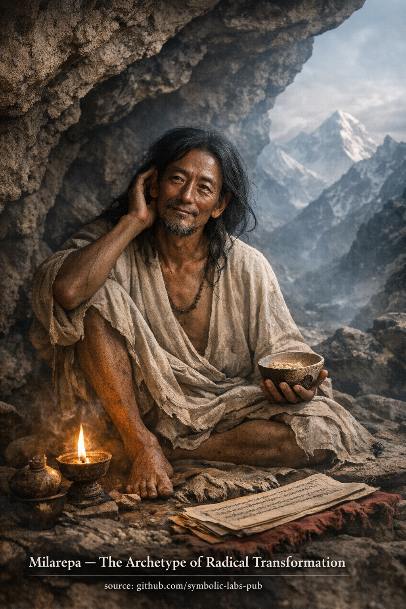

## [**A Buddhist Teaching: Milarepa and the Law of Irreversible Transformation**](https://github.com/symbolic-labs-pub/a-buddhist-view/blob/master/more/08_lineage/09_milarepa/README.md#a-buddhist-teaching-milarepa-and-the-law-of-irreversible-transformation)

Teaching

## **A Buddhist Teaching: Milarepa and the Law of Irreversible Transformation**

**Milarepa** stands in the Buddhist tradition not as a saintly ideal, but as a **proof of principle**.
His life demonstrates a core [Dharma](../../01_core_teachings/the_three_jewels/README.md#2-dharma--the-path-and-the-law-of-reality) law:

> **[Awakening](../../10_concepts/README.md#3-enlightenment-bodhi-awakening) is determined by conditions, not by history.**

This teaching dismantles one of the most persistent obstacles on the path:
the belief that one’s past actions, character, or psychological makeup *disqualify* realization.

---

## 1. The Error of Moral Determinism

Many practitioners unconsciously hold this view:

> “Because I have done X, I cannot attain Y.”

Buddhism rejects this completely.

According to [**dependent origination**](../../02_from_ignorance_to_awakening/3_dependent_origination/README.md#the-twelve-links-the-classic-formulation), the present mind is not the product of a fixed essence, but of **current causes and conditions**.
Past karma conditions the field—but **does not lock the outcome**.

Milarepa’s early life involved grave harm.
If awakening were a moral reward system, his story would be impossible.

His realization proves:

> Karma is **transformable**, not cumulative destiny.

---

## 2. Renunciation as Structural Clarity

Milarepa did not renounce society out of hatred or fear.
He renounced **distraction**.

Renunciation here means:

* Reducing inputs
* Simplifying conditions
* Removing escape routes

This reveals a key teaching:

> **When conditions are simplified enough, truth becomes unavoidable.**

Modern practitioners often seek insight while preserving complexity.
Milarepa shows the opposite:
**simplify the world until the mind can no longer hide.**

---

## 3. Devotion Without Sentimentality

Milarepa’s devotion to [Marpa](../10_marpa/README.md#a-buddhist-teaching-marpa-the-translator--the-dharma-that-refuses-to-be-softened) was not emotional dependence.
It was **total alignment with the path**, even when painful.

This illustrates a subtle Buddhist point:

> Devotion is not about liking the teacher.
> It is about surrendering the ego’s negotiation power.

When devotion is genuine:

* Self-justification collapses
* Resistance becomes visible
* Practice becomes non-optional

This is why devotion accelerates realization—not mystically, but **mechanically**.

---

## 4. Perseverance as the Engine of Liberation

Milarepa’s practice was extreme, but the principle is universal:

> **Liberation emerges where perseverance outlasts resistance.**

Most [suffering](../../02_from_ignorance_to_awakening/2_the_four_noble_truths/README.md#1-there-is-suffering--dukkha) persists not because it is strong,
but because attention withdraws too early.

Milarepa stayed.

He stayed with:

* Cold
* Hunger
* Fear
* Mental torment
* Boredom

And something critical happened:

> The mind exhausted its strategies.

When grasping fails repeatedly, **clarity remains**.

---

## 5. The Doctrine of Irreversibility

A central lesson of Milarepa’s life is this:

> **True transformation is irreversible.**

Not because one becomes perfect,
but because **delusion loses credibility**.

After genuine insight:

* Confusion may arise
* Emotions may fluctuate
* Difficulties continue

But the belief in a solid, fixed self does not return.

This is why the Kagyu lineage emphasizes **direct experience over conceptual purity**.

---

## 6. The Teaching in One Sentence

Milarepa teaches:

> **Nothing disqualifies awakening except refusal to practice under real conditions.**

Not lack of intelligence
Not emotional wounds
Not past actions

Only avoidance.

---

## Closing Reflection

This teaching is demanding—but profoundly hopeful.

It places responsibility exactly where Buddhism always places it:
not in identity, not in merit, not in belief—

but in **what conditions you are willing to sustain long enough for truth to appear**.

---

Meditation

### **Milarepa Meditation Practice — Radical Transformation in One Lifetime**

**Milarepa** embodies the truth that **no past action disqualifies awakening**.
This practice uses his life as a *functional template* for inner transformation.

> ⚠️ **Note on scope**
> What follows is a **non-empowerment contemplative form** (a *practice of meaning*).
> It does **not** replace lineage transmission (*wang, lung, tri*).
> Its function is **stabilization, aspiration, and causal alignment**, not tantric authorization.

---

## 1. Intention (5 minutes)

Sit comfortably. Let the body settle.

Silently establish this intention:

> *“Nothing in my past disqualifies awakening.
> What matters is sincerity of practice now.”*

This frames the session correctly: **practice over self-judgment**.

---

## 2. Grounding the Body (5 minutes)

Bring attention to:

* Weight of the body
* Breath entering and leaving naturally
* The raw simplicity of being here

Imagine yourself in a **mountain cave**:

* Sparse
* Silent
* Unprotected by distraction

This represents **renunciation**, not as rejection of life, but as **freedom from excess**.

---

## 3. Contemplation: The Weight of Karma (10 minutes)

Gently bring to mind:

* Past actions you regret
* Habits you feel trapped by
* Narratives of “I am too late” or “I am flawed”

Do **not** analyze.
Do **not** justify.
Simply acknowledge.

Then reflect:

> *“Milarepa carried heavier karma than this—and transformed it through practice.”*

Let the weight be **seen**, not resisted.

---

## 4. Turning the Mind (Devotion Phase) (10 minutes)

Visualize Milarepa seated above you:

* Lean
* Unadorned
* Radiating calm certainty

He does **not** judge.
He does **not** console.

He **knows** transformation is possible.

Silently repeat (or adapt):

> *“Through devotion, perseverance, and honesty,
> may obscurations dissolve.”*

Let this devotion be **structural**, not emotional:
trust in the *path itself*.

---

## 5. Perseverance Meditation (15–20 minutes)

Now release imagery.

Sit with:

* Breath
* Sensations
* Thoughts arising and dissolving

Key instruction:

> **Do not improve experience.
> Do not escape discomfort.
> Stay.**

This is the core Milarepa instruction:
**liberation through endurance without self-hatred**.

Each time the mind wants to quit, label softly:

> *“This is the edge of transformation.”*

Return to presence.

---

## 6. Sealing the Practice (5 minutes)

Dedicate the session:

> *“May this practice contribute to irreversible transformation—
> for myself and all beings.”*

Feel the **directionality** of the path:
once walked sincerely, it does not reverse.

---

## Practice Notes (Very Important)

* This practice is **not gentle**—but it is [compassionate](../../02_from_ignorance_to_awakening/7_compassion/README.md#compassion-as-a-structural-principle-in-buddhist-teaching).
* Progress here is measured by:

  * Reduced self-deception
  * Increased stability in hardship
  * Willingness to practice *without results*

Milarepa teaches:

> **Awakening is not granted.
> It is endured into clarity.**

---

---

< [The Bodhisattva Path](../08_bodhisattva/README.md) | [**A Buddhist Teaching: Marpa the Translator — The Dharma That Refuses to Be Softened**](../10_marpa/README.md) >

_source: [github.com/symbolic-labs-pub](https://github.com/symbolic-labs-pub)_

---
