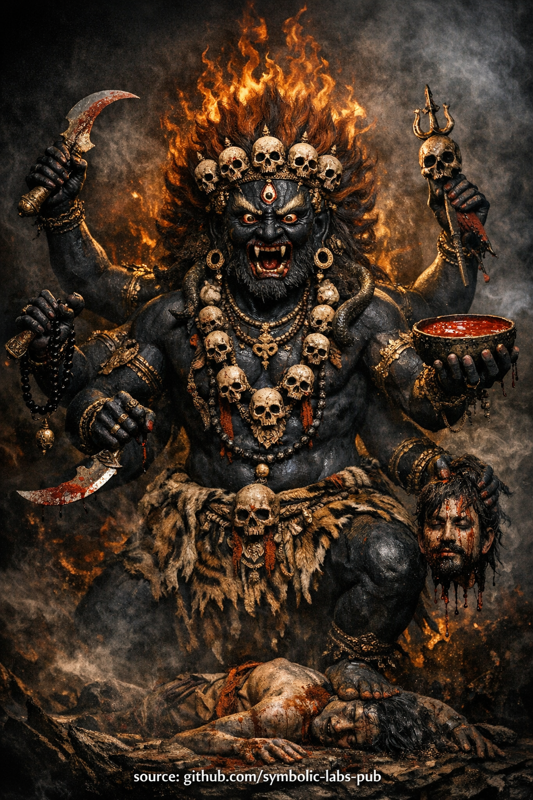

## [Mahākāla as the Discipline of Awakening](https://github.com/symbolic-labs-pub/a-buddhist-view/blob/master/more/08_lineage/12_six_armed_mahakala/README.md#mahākāla-as-the-discipline-of-awakening)

Teaching

# [The Teaching of the Wrathful Protector](https://github.com/symbolic-labs-pub/a-buddhist-view/blob/master/more/08_lineage/12_six_armed_mahakala/README.md#the-teaching-of-the-wrathful-protector)

## [Mahākāla as the Discipline of Awakening](https://github.com/symbolic-labs-pub/a-buddhist-view/blob/master/more/08_lineage/12_six_armed_mahakala/README.md#mahākāla-as-the-discipline-of-awakening)

### 1. Why Wrath Appears on the Path

In Buddhism, **wrath is not anger**.

Wrathful forms arise **only when gentler methods fail**.
They appear when compassion must act **without delay**, **without negotiation**, and **without sentimentality**.

Mahākāla embodies this principle:

> *When ignorance no longer responds to patience,
> [wisdom](../../01_core_teachings/the_noble_eightfold_path/README.md#1-wisdom-paññā) appears as force.*

This is not violence.
It is **surgical clarity**.

---

### 2. What Mahākāla Actually Protects

A common misunderstanding is that protectors guard **people**, **comfort**, or **success**.

Mahākāla protects **only one thing**:

> **The conditions for realization.**

This includes:

* Discipline
* Ethical integrity
* Continuity of practice
* Fidelity to lineage
* Non-deviation from truth

Anything that undermines these—even if it feels pleasant or spiritual—is treated as an **obstacle**.

Thus the teaching is uncompromising:

> *If something obstructs [awakening](../../10_concepts/README.md#3-enlightenment-bodhi-awakening), it is not your ally—
> no matter how familiar or comforting it feels.*

---

### 3. The Six Arms — Mastery Over the Six Realms

The six arms symbolize **command over the six realms of cyclic existence**:

* Gods (pride, distraction)
* Demi-gods (competition, jealousy)
* Humans (desire, restlessness)
* Animals (ignorance, habit)
* Hungry ghosts (addiction, lack)
* Hell beings (hatred, collapse)

These realms are not locations.
They are **patterns of mind**.

Mahākāla does not destroy beings in these realms.
He **cuts the mental dynamics that bind [awareness](../../10_concepts/README.md#2-awareness-rigpa-vijñāna-knowing) to them**.

The teaching here is precise:

> *Liberation is not achieved by escaping states of mind,
> but by cutting the mechanisms that generate them.*

---

### 4. Wrathful Compassion vs. Emotional Compassion

Ordinary [compassion](../../02_from_ignorance_to_awakening/7_compassion/README.md#compassion-as-a-structural-principle-in-buddhist-teaching) often tries to **reduce discomfort**.

Wrathful compassion prioritizes **truth over comfort**.

It does not ask:

* “Do you feel safe?”
* “Are you reassured?”
* “Is this pleasant?”

It asks:

* “Is ignorance weakening?”
* “Is attachment dissolving?”
* “Is awareness stabilizing?”

Thus Mahākāla’s presence can feel **intense**, **sobering**, or **exposing**.

That is intentional.

> *What feels harsh to ego
> is often kindness to awakening.*

---

### 5. Inner Obstacles Are the True Adversary

Mahākāla’s fiercest activity is **internal**.

The primary enemies are:

* Laziness disguised as balance
* Comfort disguised as wisdom
* Insight without discipline
* Devotion without practice
* [Emptiness](../../10_concepts/01_emptiness/README.md#emptiness-śūnyatā-in-vajrayāna-buddhism) used to avoid responsibility

These are subtle, not dramatic.
That is why a fierce protector is needed.

The teaching is clear:

> *Gross [suffering](../../02_from_ignorance_to_awakening/2_the_four_noble_truths/README.md#1-there-is-suffering--dukkha) wakes beginners.
> Subtle corruption derails advanced practitioners.*

Mahākāla guards against the latter.

---

### 6. Why This Practice Is Restricted

Wrathful protector practices are not restricted because they are “dangerous” in a mystical sense.

They are restricted because:

* Without ethical grounding, wrath turns into aggression
* Without wisdom, force becomes ego
* Without humility, protection becomes identity

Therefore, the teaching states:

> *Only when compassion is stable
> may wrath be trusted.*

This preserves the **integrity of the path**.

---

### 7. The Final Point: Mahākāla Is Not Other

At the deepest level, Mahākāla is **not a separate being**.

He represents:

* The **self-protecting intelligence of awakened mind**
* Awareness that **cuts through self-deception**
* Wisdom that **will not compromise with ignorance**

When practice matures, the protector is recognized as:

> *Awareness defending itself
> against its own obscurations.*

At that point, no invocation is needed.
The function is **internalized**.

---

## [Closing Instruction](https://github.com/symbolic-labs-pub/a-buddhist-view/blob/master/more/08_lineage/12_six_armed_mahakala/README.md#closing-instruction)

> **Do not ask the protector to make life easier.**
> Ask him to make **awakening unavoidable**.

When this teaching is understood correctly:

* Fear decreases
* Discipline stabilizes
* Practice becomes non-negotiable
* Compassion becomes precise

That is the real protection.

---

Invocation

# [Black Six-Armed Mahākāla](https://github.com/symbolic-labs-pub/a-buddhist-view/blob/master/more/08_lineage/12_six_armed_mahakala/README.md#black-six-armed-mahākāla)

> ⚠️ **Note on scope**
> What follows is a **non-empowerment contemplative form** (a *practice of meaning*).
> It does **not** replace lineage transmission (*wang, lung, tri*).
> Its function is **stabilization, aspiration, and causal alignment**, not tantric authorization.

## [Protector Invocation Meditation](https://github.com/symbolic-labs-pub/a-buddhist-view/blob/master/more/08_lineage/12_six_armed_mahakala/README.md#protector-invocation-meditation)

*(For Protection of Realization and Discipline)*

> **Purpose**
> This practice is not for comfort, emotional soothing, or wish-fulfillment.
> It is to **cut obstacles**, **stabilize discipline**, and **protect the integrity of awakening**.

---

## [1. Preparation — Establish the Ground (2–3 minutes)](https://github.com/symbolic-labs-pub/a-buddhist-view/blob/master/more/08_lineage/12_six_armed_mahakala/README.md#1-preparation--establish-the-ground-23-minutes)

Sit in **stable meditation posture**.

Let the spine be upright, the breath natural.

Briefly generate **bodhicitta**:

> *“May this practice remove all inner and outer obstacles
> so that realization may arise for the benefit of all beings.”*

Let the mind become **clear, sober, and alert** — not relaxed, not tense.

---

## [2. Visualization — The Protector Presence (3–5 minutes)](https://github.com/symbolic-labs-pub/a-buddhist-view/blob/master/more/08_lineage/12_six_armed_mahakala/README.md#2-visualization--the-protector-presence-35-minutes)

In the space **in front of you**, slightly above eye level, visualize:

**Black Six-Armed Mahākāla**, vast and luminous, arising from emptiness.

* Body: **deep black**, like space absorbing all light
* Expression: **wrathful, awake, uncompromising**
* Six arms holding implements of **cutting, binding, and offering**
* Surrounded by **roaring wisdom fire** — not burning you, but burning **obstacles**
* Standing upon forces of ignorance and corruption — already subdued

Important:
You do **not** imagine aggression.
You recognize **precision**.

This is **compassion that does not negotiate with ego**.

---

## [3. Invocation — Calling the Protector (3–5 minutes)](https://github.com/symbolic-labs-pub/a-buddhist-view/blob/master/more/08_lineage/12_six_armed_mahakala/README.md#3-invocation--calling-the-protector-35-minutes)

From your heart, recite slowly (aloud or silently):

> *Mahākāla, Great Protector of the [Dharma](../../01_core_teachings/the_three_jewels/README.md#2-dharma--the-path-and-the-law-of-reality),*
> *Emanation of awakened compassion in wrathful form,*
> *Guardian of the Kagyü lineage and [Vajrayāna](../../05_yanas/README.md#4-vajrayāna-tantrayāna-mantrayāna---the-diamond-vehicle) path,*
>
> *Turn your attention here.*
> *Remove obstacles to realization.*
> *Destroy ego-clinging, laziness, corruption, and distraction.*
> *Protect discipline, clarity, and unwavering commitment to truth.*

Let the words come from **resolve**, not fear.

After the verbal invocation, remain silent and **feel the presence stabilize**.

---

## [4. Cutting Phase — Inner Obstacle Removal (5–10 minutes)](https://github.com/symbolic-labs-pub/a-buddhist-view/blob/master/more/08_lineage/12_six_armed_mahakala/README.md#4-cutting-phase--inner-obstacle-removal-510-minutes)

Now shift focus inward.

One by one, **allow obstacles to surface**:

* Procrastination
* Spiritual pride
* Emotional avoidance
* Comfort-seeking
* Doubt mixed with laziness
* Dilution of practice

Do **not analyze**.

As each arises, visualize Mahākāla’s implements **instantly severing** it — cleanly, without drama.

Nothing personal.
Nothing emotional.
Just **removal**.

Feel the **space that remains**.

---

## [5. Absorption — Protector and Mind Unite (3–5 minutes)](https://github.com/symbolic-labs-pub/a-buddhist-view/blob/master/more/08_lineage/12_six_armed_mahakala/README.md#5-absorption--protector-and-mind-unite-35-minutes)

Mahākāla dissolves into **black light**.

That light flows **into your heart**, merging with awareness itself.

No deity remains “outside.”

What remains is:

* **Uncompromising clarity**
* **Fearless presence**
* **Non-negotiable commitment to awakening**

Rest in this state **without visualization**.

---

## [6. Dedication — Seal the Practice (1 minute)](https://github.com/symbolic-labs-pub/a-buddhist-view/blob/master/more/08_lineage/12_six_armed_mahakala/README.md#6-dedication--seal-the-practice-1-minute)

Dedicate the energy:

> *May this protection guard the path of realization.*
> *May all obstacles collapse into wisdom.*
> *May this force serve the liberation of all beings.*

Let the image fade completely.

Remain still for a few breaths.

---

## [Key Practice Notes (Important)](https://github.com/symbolic-labs-pub/a-buddhist-view/blob/master/more/08_lineage/12_six_armed_mahakala/README.md#key-practice-notes-important)

* This is a **protector invocation**, not a tantric self-generation.
* It should **support** [Mahāmudrā](../../04_kayas/mahamudra_and_dzogcsen/README.md#mahāmudrā-nature-of-mind-སེམས་ཀྱི་གནས་ལུགས་), śamatha-vipaśyanā, or retreat discipline.
* If strong emotions arise, **ground in breath and posture** — do not dramatize.
* Regular short practice is better than rare intensity.

---

## [When to Use This Practice](https://github.com/symbolic-labs-pub/a-buddhist-view/blob/master/more/08_lineage/12_six_armed_mahakala/README.md#when-to-use-this-practice)

✔ Before retreat or intensive practice
✔ When discipline weakens
✔ When practice becomes diluted or sentimental
✔ When obstacles repeat despite insight

❌ Not for emotional soothing
❌ Not for worldly gain
❌ Not as a substitute for [ethical conduct](../../01_core_teachings/the_noble_eightfold_path/README.md#2-ethical-conduct-śīla) or meditation

---

### Core Insight

> **Mahākāla does not protect you from difficulty.**
> **He protects you from deviation.**

---

< [Vajradhara and the Teaching of Recognition](../11_vajradhara/README.md) | [Vajrasattva (Dorje Sempa)](../13_vajrasattva/README.md) >

_source: [github.com/sybolic-labs-pub](https://github.com/sybolic-labs-pub)_

---
