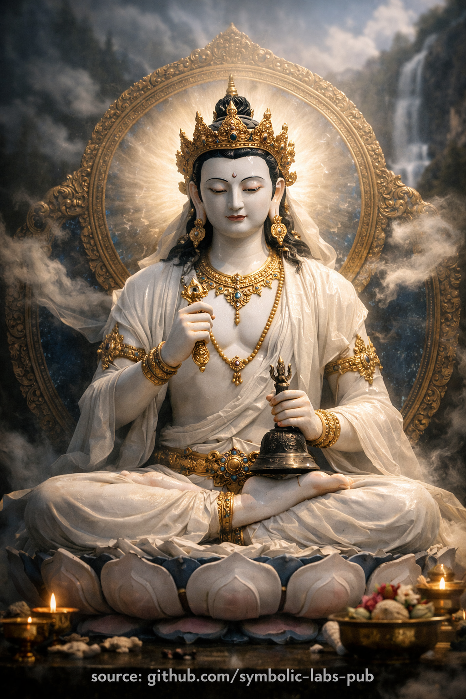

## [Vajrasattva (Dorje Sempa)](https://github.com/symbolic-labs-pub/a-buddhist-view/blob/master/more/08_lineage/13_vajrasattva/README.md#vajrasattva-dorje-sempa)

Teaching

## A Buddhist Teaching on **Vajrasattva**

**Purification as Recognition of the Diamond Mind**

### 1) The Pointing-Out

All Buddhist paths converge on a single insight: **mind is workable**.
[Vajrayāna](../../05_yanas/README.md#4-vajrayāna-tantrayāna-mantrayāna---the-diamond-vehicle) sharpens this by stating something stronger: **mind is already pure**. What appears as confusion is not a flaw in mind itself, but **temporary obscuration**—like clouds crossing an open sky.

Vajrasattva embodies this teaching in form: the **diamond mind** that cannot be damaged by error, emotion, or karma.

---

### 2) What “Purification” Really Means

Purification is often misunderstood as moral repair. In this teaching, it is **epistemic** rather than punitive.

* Karma is **habitual momentum**, not sin.
* Obscurations are **patterns**, not stains.
* Purification is **recognition**, not erasure.

When recognition occurs, patterns lose coherence—**they dissolve without force**.

---

### 3) The Union That Liberates

Vajrasattva holds:

* **Vajra** → method, [compassionate](../../02_from_ignorance_to_awakening/7_compassion/README.md#compassion-as-a-structural-principle-in-buddhist-teaching) engagement
* **Bell** → [wisdom](../../01_core_teachings/the_noble_eightfold_path/README.md#1-wisdom-paññā), [emptiness](../../10_concepts/01_emptiness/README.md#emptiness-śūnyatā-in-vajrayāna-buddhism)

Separated, method becomes blind effort; wisdom becomes sterile insight.
United, they form the **diamond cognition** that acts without clinging and knows without fixation.

**Teaching:** Liberation is not withdrawal from life, but **precise participation without grasping**.

---

### 4) The Four Powers as a Complete Path

The Four Powers are not steps to earn forgiveness; they are **a complete cycle of [awakening](../../10_concepts/README.md#3-enlightenment-bodhi-awakening)**:

1. **Recognition** — seeing cause and effect clearly
2. **Orientation** — aligning with awakened direction
3. **Application** — embodied [awareness](../../10_concepts/README.md#2-awareness-rigpa-vijñāna-knowing) through mantra and visualization
4. **Stability** — resolving to remain aligned, not through vows but insight

This cycle repeats naturally until **self-correction becomes spontaneous**.

---

### 5) Mantra as Structural Medicine

Mantra works because mind responds to **pattern**, not belief.

Sound + image + attention:

* re-tune the nervous system,
* interrupt recursive thought loops,
* allow latent clarity to surface.

Thus mantra is **medicine for structure**, not affirmation for emotion.

---

### 6) Why This Teaching Comes First

Higher teachings—[Mahāmudrā](../../04_kayas/mahamudra_and_dzogcsen/README.md#mahāmudrā-nature-of-mind-སེམས་ཀྱི་གནས་ལུགས་), [Dzogchen](../../04_kayas/mahamudra_and_dzogcsen/README.md#dzogchen-rigpa-རིག་པ་---direct-introduction)—point directly to the nature of mind.
Without purification, that pointing lands on **unprepared ground**.

Vajrasattva ensures:

* clarity before insight,
* integrity before power,
* humility before realization.

**Teaching:** purification is not preliminary because it is lesser, but because it is **foundational**.

---

### 7) The Ethical Consequence

When one recognizes the diamond nature of mind:

* harm loses justification,
* compassion becomes structural,
* [ethics](../../01_core_teachings/the_noble_eightfold_path/README.md#2-ethical-conduct-śīla) arise **without enforcement**.

Right action flows naturally from **unobscured perception**.

---

### 8) Closing Instruction

Do not try to become pure.
Do not struggle to remove impurity.

**Rest in recognition.**
What cannot be destroyed will reveal itself.

This is the teaching of Vajrasattva:
**Awakening is subtraction, not construction.**

---

Explanation

### 1. Who is Vajrasattva according to Buddhist teachings?

Vajrasattva is **not a historical Buddha**, but a **symbolic embodiment of the mind’s original purity**.
The term *vajra* means *diamond* or *thunderbolt*—that which is **indestructible and perfectly clear**. *Sattva* means *being*. Together, they signify **the indestructible awakened awareness** that cannot be damaged by confusion, emotion, or karma.

In Vajrayāna Buddhism, Vajrasattva represents the **pure ground of mind** that is always present, even when obscured by habitual patterns. Practice is not about creating purity, but **revealing what has always been there**.

---

### 2. Why is Vajrasattva white?

White symbolizes **total purity and transparency**.
It is not moral “goodness,” but **clarity without distortion**. White contains all colors, just as awakened mind contains all experiences without being stained by them.

Vajrasattva’s whiteness teaches that awakening is **uncovering**, not improvement.

---

### 3. Iconography as direct teaching

Every detail is instructional, not decorative:

* **Vajra (right hand)** → skillful means, compassionate action
* **Bell (left hand)** → wisdom, emptiness (*śūnyatā*)
* **Royal ornaments** → awakening expressed **within the world**, not withdrawal from it
* **Lotus posture** → purity that arises **through conditions**, not apart from them

> **Key teaching:** the Diamond Mind is the **union of method and wisdom**.

---

### 4. The Four Powers of purification

Vajrasattva practice is structured around the **Four Powers**, a core Vajrayāna framework:

1. **Recognition / remorse** – clear seeing of cause and effect, not guilt
2. **Reliance** – taking refuge in awakened awareness and direction
3. **Antidotal application** – mantra, visualization, mindful presence
4. **Resolution** – structural reorientation of mind and behavior

This is a **deep cognitive and karmic re-patterning**, not a moral judgment.

---

### 5. The mantra: why it works

The most common mantra is:

> **OM VAJRASATTVA HUM**
> (or the long Hundred-Syllable Mantra)

The mantra is not a prayer for forgiveness. It functions through:

* **sound** (vibration),
* **image** (visualization),
* **attention** (awareness).

Together, they synchronize **body, speech, and mind**, allowing obscurations to dissolve naturally.

---

### 6. Vajrasattva’s role on the path

* Central to **Ngöndro** (preliminary practices)
* Foundation for **Mahāmudrā** and **Dzogchen**
* Considered **structural purification**, not optional devotion

Without purification, higher realization becomes unstable.

---

### 7. Common misunderstandings

* ❌ Not a confessional or guilt-based practice
* ❌ Not an external deity granting absolution
* ❌ Not mere relaxation

✅ It is **self-liberating awareness recognizing its own diamond nature**.

---

### 8. In one sentence

**Vajrasattva teaches that the mind is originally pure, and practice removes obscurations rather than adding anything new.**

---

Meditation

## Vajrasattva Meditation

> ⚠️ **Note on scope**
> What follows is a **non-empowerment contemplative form** (a *practice of meaning*).
> It does **not** replace lineage transmission (*wang, lung, tri*).
> Its function is **stabilization, aspiration, and causal alignment**, not tantric authorization.

---

*(Purification of obscurations & restoration of samaya)*

### Purpose (Why this practice exists)

Vajrasattva practice is used to:

* Purify **negative karma** (actions, speech, and thoughts)
* Purify **mental obscurations** (ignorance, fixation, emotional patterns)
* Repair **broken samaya** (tantric commitments)
* Reconnect awareness with its **primordially pure nature**

In Vajrayāna, purification is **not moralistic**.
It is the *recognition that impurity was never intrinsic*.

---

## Preconditions (Traditional framing)

Ideally, this practice is received after:

* Refuge and Bodhicitta
* Oral transmission (*lung*) of the mantra
  However, **non-initiated practitioners** may still practice **visualization + mantra with humility**, focusing on purification and compassion rather than deity-identity.

---

## Structure of the Practice (Four-Part Architecture)

1. **Refuge & Bodhicitta**
2. **Visualization**
3. **Mantra Recitation**
4. **Dissolution into Emptiness**

This mirrors the **Four Opponent Powers**, a key Vajrayāna purification framework:

* Support
* Regret
* Remedy
* Resolve

---

## 1. Refuge & Bodhicitta

Sit comfortably. Spine upright, breath natural.

Silently or aloud:

> *I take refuge in the Buddha, Dharma, and Sangha.*
> *For the benefit of all sentient beings,*
> *I engage in this practice to purify obscurations*
> *and awaken fully for the welfare of all.*

Pause. Let intention settle—not as thought, but as orientation.

---

## 2. Visualization

Above the crown of your head, about one forearm’s length away, visualize **Vajrasattva**:

* **Brilliant white**, luminous like clear crystal
* Youthful, peaceful, compassionate
* Seated in vajra posture on a moon disc and lotus
* Right hand holds a **vajra** at the heart
* Left hand holds a **bell** at the hip
* Adorned with silks and jewels (symbol of awakened qualities)
* At his heart: a **moon disc**, with a **seed syllable HŪṂ**

He is **not external** in the ordinary sense—
He is the **pure nature of your own mind**, appearing in form.

Above Vajrasattva’s head, visualize a lineage of awakened teachers if that is meaningful to you; otherwise, keep the visualization simple and stable.

---

## 3. Confession & Regret (Non-Judgmental)

From the heart, acknowledge:

> *Through ignorance and habit, I have created harmful actions,*
> *spoken harmful words, and entertained confused thoughts.*
> *I acknowledge them openly, without denial and without shame.*

Important:
This is **clarity**, not guilt.
Regret means *recognition*, not self-attack.

---

## 4. Mantra Recitation (The Purification Engine)

From the **HŪṂ** at Vajrasattva’s heart, a stream of **white nectar-light** flows:

* Enters through the crown of your head
* Fills your body completely
* Washes away all obscurations:

  * Illness, emotional residues, karmic imprints
* They exit as **dark smoke or liquid**, dissolving into emptiness below

Recite slowly, clearly, or mentally:

### The Hundred-Syllable Mantra (Sanskrit – standard form)

> **Oṁ Vajrasattva Samaya
> Manupālaya
> Vajrasattva Tvenopatiṣṭha
> Dṛḍho Me Bhava
> Sutoṣyo Me Bhava
> Supoṣyo Me Bhava
> Anurakto Me Bhava
> Sarva Siddhiṁ Me Prayaccha
> Sarva Karma Su Ca Me
> Cittaṁ Śreyaḥ Kuru Hūṁ
> Ha Ha Ha Ha Hoḥ
> Bhagavan Sarva Tathāgata
> Vajra Mā Me Muñca
> Vajrī Bhava Mahā Samaya Sattva Āḥ**

You may recite:

* 21 times (minimum)
* 108 times (traditional)
* Or continuously for a set period

If this mantra is too long, the **short mantra** is also widely used:

> **Oṁ Vajrasattva Hūṁ**

---

## 5. Resolution

After recitation, gently form the resolve:

> *As much as I am able,*
> *I will refrain from repeating these harmful patterns,*
> *and cultivate clarity, compassion, and wisdom.*

No perfectionism. Just sincerity.

---

## 6. Dissolution into Emptiness (Critical Step)

Vajrasattva smiles.

* He dissolves into **light**
* The light descends through your crown
* Dissolves into your heart
* **No deity remains**
* No subject, no object
* Just **clear, open awareness**

Rest here.

This is the **actual purification**.

---

## 7. Dedication

> *May the merit of this practice*
> *Benefit all sentient beings,*
> *Removing suffering and its causes,*
> *And establishing all in awakening.*

---

## Key Clarifications (Often Misunderstood)

* **Vajrasattva is not “forgiving you”**
  → Purification occurs through *recognition of primordial purity*

* **Mantra is not magical sound alone**
  → It works through *body, speech, and mind alignment*

* **Visualization quality matters less than sincerity**
  → Stability > vividness

---

## Practical Advice (Modern, realistic)

* 10–15 minutes daily is powerful
* Best practiced **before sleep** or **after emotional turbulence**
* If emotions arise → let purification imagery *continue through them*
* Avoid turning this into self-criticism

---

< [Six Armed Mahakala](../12_six_armed_mahakala/README.md) | [Amitabha](../14_amitabha/README.md) >

_source: [github.com/symbolic-labs-pub](https://github.com/symbolic-labs-pub)_

---
