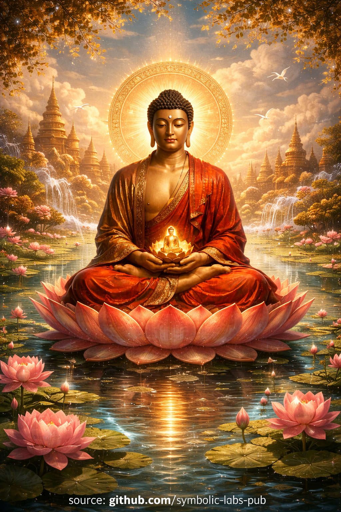

## [**Amitābha** — according to Buddhist teachings](https://github.com/symbolic-labs-pub/a-buddhist-view/blob/master/more/08_lineage/14_amitabha/README.md#amitābha--according-to-buddhist-teachings)

Teaching

## A Buddhist Teaching on **Amitābha**

**The Path of Infinite Light and Trust**

### 1. The Human Condition

All beings seek happiness and fear suffering, yet wander endlessly in **saṃsāra** because the mind is obscured by ignorance, attachment, and habitual patterns. Even when we understand the Dharma intellectually, our capacity to practice is weakened by distraction, emotional turbulence, and karmic momentum.

Recognizing this, the Buddhas do not offer a single path, but **many skillful means**, adapted to the capacities of beings.

The teaching of Amitābha arises from this compassion.

---

### 2. The Great Vow

In immeasurable past ages, the bodhisattva Dharmākara contemplated the suffering of beings and made a vow unlike any other:

> *“If beings, even with limited virtue and wisdom, sincerely entrust themselves, aspire toward awakening, and remember my name, I will bring them to a realm free from obstruction, where enlightenment is certain.”*

This vow became the activity of **Amitābha Buddha**, whose wisdom shines without limit and whose compassion never withdraws.

This is not myth in the ordinary sense. It is **a teaching about how awakening meets beings where they are**.

---

### 3. The Pure Land Is a Skillful Means

The **Pure Land (Sukhāvatī)** is described as a realm without the conditions that reinforce ignorance:

* No involuntary suffering
* No regression on the path
* Continuous presence of Dharma
* Perfect support for realization

The Buddha taught this not as an escape from reality, but as **a conditionally optimized field for awakening**.

For some, Sukhāvatī is a literal rebirth destination.
For others, it is the **purified dimension of mind itself**.

Both understandings are valid within the Dharma.

---

### 4. The Practice of Remembrance

The core practice is **mindfulness of the Buddha** (*buddhānusmṛti*).

When one recites:

> *Namo Amitābhāya Buddhāya*

one is not petitioning an external savior.

One is:

* Reorienting the mind away from fixation
* Aligning with awakened qualities
* Softening the sense of isolated self-effort

Faith (*śraddhā*) here does not mean belief without insight.
It means **trusting a path that does not rely on egoic control**.

---

### 5. Other-Power and Self-Power

Most spiritual struggle comes from trying to **force awakening through self-power alone**.

Amitābha’s path teaches:

* When effort becomes grasping, release it
* When confidence collapses, rely on vow
* When the self cannot awaken itself, let wisdom carry it

This is not passivity.
It is **non-grasping participation**.

---

### 6. The Deeper Meaning

At the deepest level, the teachings say:

* Amitābha is not separate from mind
* The Pure Land is not separate from awareness
* The calling of the Name dissolves the illusion of separation

Thus it is said:

> *“When the mind is pure, the land is pure.”*

The Buddha of Infinite Light reveals what has always been present.

---

### 7. Instruction for Practice

A simple and complete instruction:

1. Sit or stand naturally
2. Let the breath settle without control
3. Gently recite the Name—aloud or silently
4. Do not concentrate forcefully
5. Do not analyze
6. When thoughts arise, let the Name carry them

Trust replaces tension.
Awareness replaces effort.

---

### 8. The Result

Through this practice:

* Fear of death diminishes
* Fixation softens
* Compassion naturally arises
* Confidence in awakening stabilizes

Whether one understands the Pure Land literally or symbolically, **the fruit is the same**:
the mind turns toward liberation.

---

### 9. Closing Reflection

Amitābha’s teaching reminds us:

> Awakening does not depend on perfection.
> It depends on sincerity, trust, and turning the mind toward wisdom.

For beings living in complex, exhausted, fragmented times, this path remains **radically compassionate and profoundly realistic**.

---

Explanation

## **Amitābha in Buddhist Teachings**

**Amitābha** (Sanskrit: *Amitābha*; Tibetan: *’Od dpag med*; Chinese: *Āmítuó Fó*; Japanese: *Amida Butsu*) is one of the most revered Buddhas in **Mahāyāna Buddhism**, especially within **Pure Land** traditions. His name means **“Infinite Light”** (and closely related, *Amitāyus*, “Infinite Life”), pointing to limitless wisdom and compassion.

---

## 1. Origin and Vows

According to the **Larger Sukhāvatīvyūha Sūtra**, Amitābha was once a bodhisattva named **Dharmākara**. After making **48 great vows**, he vowed not to attain Buddhahood until he had established a pure realm where all beings—regardless of capacity—could awaken.

The most famous is the **18th Vow** (the *Primal Vow*):

> *If beings sincerely entrust themselves to me, wish to be born in my land, and call my name even ten times, they will be born there.*

This vow forms the doctrinal heart of Pure Land practice.

---

## 2. The Pure Land: Sukhāvatī

Amitābha presides over **Sukhāvatī**, the **Western Pure Land**, a realm described not as a heaven but as an **optimal environment for enlightenment**:

* No lower rebirths
* No involuntary suffering
* Perfect conditions for hearing and practicing the Dharma
* Continuous presence of Buddhas and bodhisattvas (notably Avalokiteśvara and Mahāsthāmaprāpta)

Rebirth in Sukhāvatī is seen as a **skillful means** (*upāya*): enlightenment becomes accessible even in the degenerate age (*Dharma Ending Age*).

---

## 3. Core Practice: Mindfulness of Amitābha

The central practice is **Buddha-remembrance** (*buddhānusmṛti*), commonly expressed as:

* **Sanskrit:** *Namo Amitābhāya Buddhāya*
* **Chinese:** *Namo Amituofo*
* **Japanese:** *Namu Amida Butsu*

This is not mere repetition. In classical doctrine, it integrates:

* **Faith** (*śraddhā*)
* **Aspiration** (vow to awaken)
* **Practice** (recitation, visualization, ethical living)

Advanced texts emphasize that **recitation stabilizes awareness**, aligns the mind with Buddha-nature, and dissolves ego-fixation—making it compatible with **Zen**, **Tiantai**, and even **Vajrayāna** interpretations.

---

## 4. Symbolism and Iconography

Amitābha is typically depicted:

* Red in color (transmuting desire into discriminating wisdom)
* In meditation posture (*dhyāna mudrā*)
* Seated on a lotus (purity amid samsara)
* Associated with the **western direction** and the **setting sun**, symbolizing the end of ignorance

Esoterically, Amitābha corresponds to the **lotus family** and the transformation of attachment into wisdom.

---

## 5. Philosophical Interpretation (Deeper Layer)

From a non-dual Mahāyāna perspective:

* **Amitābha is not separate from one’s own awakened mind**
* Sukhāvatī can be understood as:

  * a literal rebirth realm (**conventional truth**)
  * or the **purified field of awareness itself** (**ultimate truth**)

Zen-Pure Land syntheses often state:

> *“The Pure Land is mind-only; Amitābha is one’s own true nature.”*

Thus, Pure Land is not escapism—it is **a pragmatic path of awakening through trust rather than self-power**.

---

## 6. Amitābha Across Traditions

* **Chinese Pure Land:** Emphasizes chanting + ethical life
* **Japanese Jōdo / Jōdo Shinshū:** Radical reliance on Amitābha’s vow (other-power)
* **Tibetan Buddhism:** Amitābha as a meditational Buddha and post-death guide (especially in *phowa*)
* **Zen:** Integrated as silent nembutsu or koan-like recollection

---

## 7. Why Amitābha Matters Today

Amitābha represents:

* Compassion without conditions
* Awakening accessible to ordinary beings
* A path resilient to modern distraction, exhaustion, and doubt

In contemporary terms: **Amitābha is a fault-tolerant enlightenment protocol**—designed for beings with limited bandwidth, fragmented attention, and deep karmic inertia.

---

Meditation

## **A Pure Land Meditation Practice — Amitābha Path of Vow and Trust**

> ⚠️ **Note on scope**
> What follows is a **non-empowerment contemplative form** (a *practice of meaning*).
> It does **not** replace lineage transmission (*wang, lung, tri*).
> Its function is **stabilization, aspiration, and causal alignment**, not tantric authorization.

---

## 1. Intention (Orientation of the Mind)

Sit comfortably. Formal posture is helpful but not required.
Let the body settle naturally.

Silently establish this intention:

> *“I aspire to awaken for the benefit of all beings.
> I entrust this path to the vow and compassion of* **Amitābha***.”*

This step **reorients agency**:

* Not ego striving
* Not passivity
* But **alignment with awakened vow-force**

---

## 2. Grounding the Breath (Stabilization)

For 1–3 minutes:

* Inhale gently through the nose
* Exhale slowly through the mouth
* Let thoughts rise and fall **without correction**

This prepares the nervous system.
Pure Land practice works best on a **settled but ordinary mind**, not a forced one.

---

## 3. Name-Recitation (Core Practice)

Begin **audible or silent recitation**:

> **Namo Amitābhāya**
> (or *Namo Amituofo / Namu Amida Butsu*)

Rhythm:

* One recitation per breath is ideal
* No counting required
* Speed does **not** matter

### What to do with the mind

* Do **not** visualize at first
* Do **not** analyze meaning
* Let the **sound carry [awareness](../../10_concepts/README.md#2-awareness-rigpa-vijñāna-knowing)**

If thoughts arise:

* Do nothing
* Return gently to the Name

> The Name is not a label.
> It is a **cognitive anchor tuned to compassion**.

---

## 4. Subtle Visualization (Optional, Later)

Only if the mind naturally stabilizes:

* Sense a **warm red-golden light** in front of you or within the chest
* No detailed imagery
* Just the *feeling* of warmth, openness, and safety

Understand this correctly:

* You are **not imagining a place**
* You are **entraining awareness** to awakened qualities

If visualization fades → return to recitation.

---

## 5. Trust Phase (The Essential Point)

At some point, let go of **doing** the practice.

Continue reciting while allowing this understanding to settle:

> *“[Awakening](../../10_concepts/README.md#3-enlightenment-bodhi-awakening) does not depend on my perfection.
> The vow already includes me.”*

This is the **heart of Pure Land**:

* Self-power relaxes
* Practice becomes **continuous rather than effortful**

---

## 6. Dedication of Merit (Closure)

Conclude with:

> *“May this practice benefit all beings.
> May all who suffer find conditions for awakening.”*

Stop reciting. Sit quietly for a few breaths.

---

## 7. Integration into Daily Life (Critical)

Pure Land practice **must leak into life**:

* Recite while walking, waiting, or resting
* One sincere recitation > a thousand distracted ones
* Especially powerful during:

  * Fear
  * Illness
  * Exhaustion
  * Dying processes

This is why Pure Land has survived centuries—it **meets people where they actually are**.

---

## Key Clarifications (Very Important)

* ❌ This is **not** blind faith
* ❌ This is **not** reward-based heaven belief
* ❌ This is **not** escapism

✔ It is **training attention, trust, and aspiration**
✔ It leverages **relational cognition** instead of ego control
✔ It assumes **awakening is cooperative**, not solitary

---

## One-Line Essence

> **Pure Land meditation trains the mind to rest in compassion when control is exhausted.**

---

< [Vajrasattva (Dorje Sempa)](../13_vajrasattva/README.md) | [Amitāyus — The Buddha of Boundless Life](../15_amitayus/README.md) >

_source: [github.com/symbolic-labs-pub](https://github.com/symbolic-labs-pub)_

---
