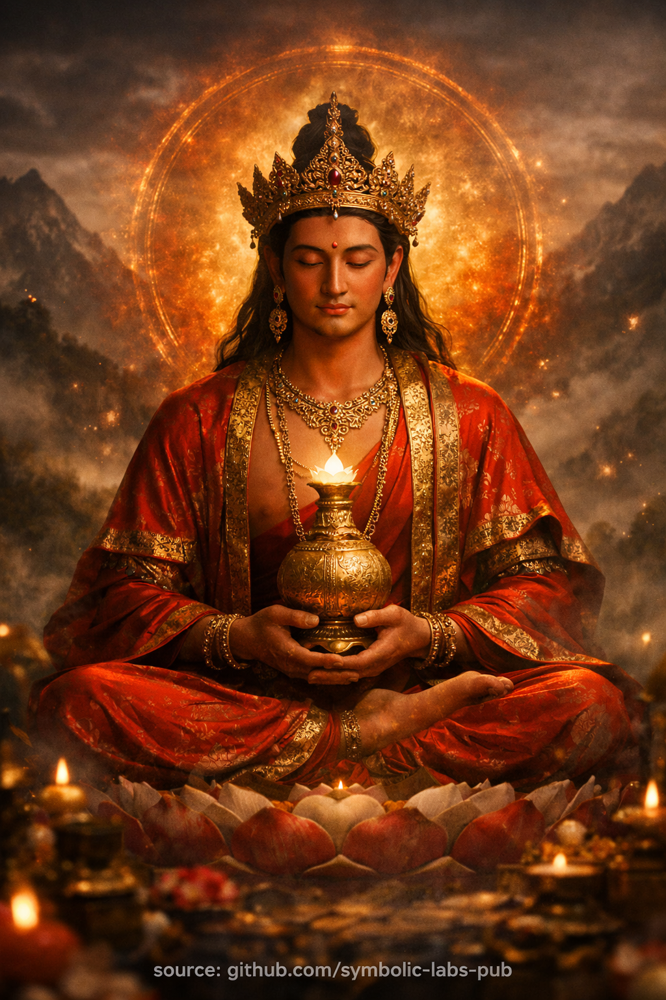

## [Amitāyus — The Buddha of Boundless Life](https://github.com/symbolic-labs-pub/a-buddhist-view/blob/master/more/08_lineage/15_amitayus/README.md#amitāyus--the-buddha-of-boundless-life)

Teaching

## [**The Teaching of Boundless Life**](https://github.com/symbolic-labs-pub/a-buddhist-view/blob/master/more/08_lineage/15_amitayus/README.md#the-teaching-of-boundless-life)

*A Buddhist instruction revealed through Amitāyus practice*

### 1. The Problem the Teaching Addresses

Ordinary beings fear death and pursue longevity as **extension of possession**:
more time to secure identity, comfort, memory, name.

Buddhism observes something more precise:

> Life does not end primarily because the body fails.
> Life erodes because **[awareness](../../10_concepts/README.md#2-awareness-rigpa-vijñāna-knowing) leaks**.

Distraction, grasping, aggression, and confusion drain vitality long before the final breath.

The teaching of **Amitāyus** addresses this root cause.

---

### 2. The Central Insight

**Longevity is not duration.
Longevity is continuity of awakened awareness.**

A life filled with confusion is short even if it lasts a hundred years.
A life aligned with clarity is long even if it is brief.

Thus Amitāyus does not promise *more time* —
he reveals **why time collapses or stabilizes**.

---

### 3. Two Forms, One Truth

Buddhist teaching presents two inseparable aspects:

* **Amitābha** — clarity, illumination, truth seen
* **Amitāyus** — continuity, stability, truth sustained

Light without continuity flashes and fades.
Continuity without clarity decays into habit.

[Awakening](../../10_concepts/README.md#3-enlightenment-bodhi-awakening) requires **both**.

---

### 4. The Vase of Long Life (Teaching Symbol)

Amitāyus holds a vase of *amṛta* (deathless nectar).

This does **not** mean a magical substance.

It teaches:

* Vitality flows when [ethics](../../01_core_teachings/the_noble_eightfold_path/README.md#2-ethical-conduct-śīla) are clean
* Life stabilizes when the mind is undivided
* Longevity increases when [compassion](../../02_from_ignorance_to_awakening/7_compassion/README.md#compassion-as-a-structural-principle-in-buddhist-teaching) replaces self-defense

The vase is filled **automatically** when causes are correct.

---

### 5. The Ethical Dimension

Amitāyus is inseparable from conduct.

The teaching states:

> Actions rooted in violence shorten life.
> Actions rooted in care extend it.

This is not moralism.
It is **causal physics of mind**.

Aggression burns energy.
Greed fragments attention.
Deception creates internal friction.

Clarity conserves life.

---

### 6. Why Longevity Practice Is Not Selfish

In [Mahāyāna](../../05_yanas/README.md#limitation-from-mahāyāna-view) and [Vajrayāna](../../05_yanas/README.md#4-vajrayāna-tantrayāna-mantrayāna---the-diamond-vehicle), one does not pray for long life to enjoy it.

One aspires:

> “May this life last long enough
> to complete realization
> and benefit beings.”

Longevity without purpose is karmic debt.
Longevity with [wisdom](../../01_core_teachings/the_noble_eightfold_path/README.md#1-wisdom-paññā) is **service**.

Thus Amitāyus practice is often dedicated to:

* teachers
* elders
* lineage holders
* communities sustaining the [Dharma](../../01_core_teachings/the_three_jewels/README.md#2-dharma--the-path-and-the-law-of-reality)

---

### 7. The Meditative Instruction Encoded

The meditation teaches three structural truths:

1. **Stability extends life**
2. **Clarity prevents decay**
3. **Self-forgetting preserves vitality**

When awareness no longer wastes energy maintaining a false self,
life naturally **slows, deepens, and coheres**.

This is why the meditation emphasizes:

* calm posture
* unified breath
* absence of striving

---

### 8. Death Reinterpreted

Amitāyus does not deny death.

He reframes it:

> Death is the collapse of confused continuity,
> not the end of awareness.

A life trained in continuity does not break suddenly.
It **transitions**.

Thus longevity practice is also **preparation for dying well**.

---

### 9. The Final Teaching Sentence

The entire teaching of Amitāyus can be stated precisely:

> **What is aligned does not decay.
> What is clear does not rush.
> What is compassionate does not end prematurely.**

This is not belief.
It is observation.

---

### 10. Closing Instruction

Do not ask:

> “How can I live longer?”

Ask instead:

> “Where does my life leak?”

Where attention is reclaimed,
life naturally **lengthens itself**.

That is the teaching of Amitāyus.

---

Explanation

**Amitāyus** (Sanskrit: *"Boundless Life"*) is the **[sambhogakāya (enjoyment-body)](../../04_kayas/README.md#2-sambhogakāya--the-body-of-enjoyment)** form of **Amitābha**, revered across Mahāyāna and Vajrayāna as the embodiment of **life sustained by wisdom**. Where Amitābha emphasizes *infinite light* (clarity), Amitāyus emphasizes *infinite life* (continuity). They are two aspects of the same awakened reality.

---

### Core Meaning in Buddhist Teaching

Amitāyus does **not** promise immortality of the ego or body. His teaching is subtler and more rigorous:

* **Life is lengthened when obscurations are removed**
* **Vitality increases when mind and conduct align with Dharma**
* **Longevity is a *function of wisdom*, not chance**

In this sense, Amitāyus represents **life-force purified by realization**.

---

### Iconography (Why He Looks the Way He Does)

Each element of Amitāyus’ depiction is instructional:

* **Red body** – life-energy refined into compassion and warmth
* **Seated in meditation posture** – longevity arises from *stability*, not activity
* **Vase of long life (amṛta)** – inexhaustible vitality born from insight
* **Ornamented (sambhogakāya)** – awakened qualities *fully enjoyed*, not renounced
* **Serene, youthful appearance** – freedom from decay caused by ignorance

This is **symbolic anatomy**, not decoration.

---

### Function of Amitāyus Practice

In Vajrayāna contexts, Amitāyus practice is used to:

* Support **long life of practitioners, teachers, and lineages**
* Restore **vitality depleted by illness, trauma, or imbalance**
* Stabilize **conditions necessary for deep meditation**
* Extend time **not for pleasure, but for realization**

Longevity here means *time made meaningful*.

---

### Philosophical Insight

Amitāyus teaches a precise causal law:

> **Short life is often the karmic result of confusion, aggression, and neglect of mind.
> Long life is the natural expression of clarity, restraint, and compassion.**

Thus, longevity is **ethical, meditative, and cognitive**—not merely biological.

---

### Relationship to Other Buddhas

* **Amitābha** → infinite light (clarity of mind)
* **Amitāyus** → infinite life (continuity of realization)
* **Pure Land** → environment where both are perfected together

You could say:

> *Amitābha reveals truth; Amitāyus gives you time to live it.*

---

### Meditative Principle (Concise)

When contemplating Amitāyus, the practitioner reflects:

* *May my life be long enough to awaken fully*
* *May my vitality serve compassion, not distraction*
* *May clarity protect life, and life protect clarity*

This is **life aligned with awakening**, not survival.

---

### Essential Summary

Amitāyus is not about living forever.
He is about **living without inner erosion**.

**Longevity = sustained clarity.
Clarity = freedom from fear.
Freedom from fear = awakened life.**

---

Meditation

## [**Amitāyus Longevity Meditation**](https://github.com/symbolic-labs-pub/a-buddhist-view/blob/master/more/08_lineage/15_amitayus/README.md#amitāyus-longevity-meditation)

> ⚠️ **Note on scope**
> What follows is a **non-empowerment contemplative form** (a *practice of meaning*).
> It does **not** replace lineage transmission (*wang, lung, tri*).
> Its function is **stabilization, aspiration, and causal alignment**, not tantric authorization.

---

## [0. Preparation (2–3 minutes)](https://github.com/symbolic-labs-pub/a-buddhist-view/blob/master/more/08_lineage/15_amitayus/README.md#0-preparation-23-minutes)

**Posture**

* Seated upright ([lotus](../../09_symbols/08_lotus/README.md#the-lotus-in-buddhist-teaching), half-lotus, or stable chair)
* Spine vertical, chin slightly tucked
* Hands resting in **equanimity mudrā** or on knees

**Mindset**

* Not seeking longer life *for self*, but **to complete awakening for the benefit of beings**

Silently establish the motivation:

> *“May this life be long enough, clear enough, and stable enough
> to fully realize the Dharma and benefit others.”*

---

## [1. Refuge & Orientation (1–2 minutes)](https://github.com/symbolic-labs-pub/a-buddhist-view/blob/master/more/08_lineage/15_amitayus/README.md#1-refuge--orientation-12-minutes)

Bring awareness to the **field of awakened support**:

> *I take refuge in Buddha, Dharma, and Sangha—
> not as external saviors,
> but as awakened structure already present.*

Feel the body relax into **trust**.

Longevity begins when **fear dissolves**.

---

## [2. Visualization of Amitāyus (5–7 minutes)](https://github.com/symbolic-labs-pub/a-buddhist-view/blob/master/more/08_lineage/15_amitayus/README.md#2-visualization-of-amitāyus-57-minutes)

Visualize **Amitāyus** appearing in the space before you, at eye level:

* Body of **deep ruby red light**
* Youthful, serene, luminous
* Seated on a lotus and moon disc
* Holding a **vase of amṛta** (nectar of deathless awareness)
* Surrounded by a soft field of **golden-red radiance**

This is **sambhogakāya**—perfect form, not flesh.

Do not strain.
Let the image be **clear but gentle**.

---

## [3. Identity Alignment (3–5 minutes)](https://github.com/symbolic-labs-pub/a-buddhist-view/blob/master/more/08_lineage/15_amitayus/README.md#3-identity-alignment-35-minutes)

Shift from observer to resonance.

Silently reflect:

> *Amitāyus is not outside me.*
> *His boundless life is the natural continuity of awakened mind.*

From Amitāyus’ heart, a **warm red-golden light** flows:

* Enters your crown
* Fills the body
* Stabilizes at the heart

This light:

* Repairs karmic fatigue
* Dissolves inner decay
* Reconnects **life force with wisdom**

Feel **time slow down**.
Presence deepens.

---

## [4. Longevity Mantra (Optional, 5–10 minutes)](https://github.com/symbolic-labs-pub/a-buddhist-view/blob/master/more/08_lineage/15_amitayus/README.md#4-longevity-mantra-optional-510-minutes)

If you use [mantra](../../09_symbols/10_mantra/README.md#what-a-mantra-is-buddhist-view), recite softly or mentally:

> **OM AMARANI JIVANTIYE SVAHA**

(Meaning: *O deathless one, sustain life and awareness*)

With each recitation:

* The nectar fills the vase
* The light stabilizes your breath
* Life becomes **coherent**, not merely extended

If mantra feels artificial, rest instead in **wordless continuity**.

---

## [5. Absorption (3–5 minutes)](https://github.com/symbolic-labs-pub/a-buddhist-view/blob/master/more/08_lineage/15_amitayus/README.md#5-absorption-35-minutes)

Let the visualization **dissolve into light**.

Amitāyus melts into your heart.
No form remains.

Rest in:

* Clear awareness
* Steady breath
* Timeless presence

This is the **true longevity**:
life no longer leaking through distraction.

---

## [6. Dedication of Life (2 minutes)](https://github.com/symbolic-labs-pub/a-buddhist-view/blob/master/more/08_lineage/15_amitayus/README.md#6-dedication-of-life-2-minutes)

Conclude with deliberate dedication:

> *May whatever length this life has
> be used without waste.*
> *May clarity protect vitality.*
> *May vitality serve awakening.*
> *May all beings have the conditions for realization.*

Feel resolve—not emotion.

---

## [Key Teaching Encoded in This Practice](https://github.com/symbolic-labs-pub/a-buddhist-view/blob/master/more/08_lineage/15_amitayus/README.md#key-teaching-encoded-in-this-practice)

* **Longevity is not biological luck**
* **Longevity is karmic coherence**
* **Clarity reduces entropy**
* **Awakening preserves life**

Amitāyus does not *add* years.
He **removes what shortens them**.

---

## [When This Practice Is Especially Appropriate](https://github.com/symbolic-labs-pub/a-buddhist-view/blob/master/more/08_lineage/15_amitayus/README.md#when-this-practice-is-especially-appropriate)

* During illness or recovery
* When practice feels fragmented or rushed
* When working to support teachers, elders, or lineages
* When facing fear of time, aging, or death

---

---

< [**Amitābha** — according to Buddhist teachings](../14_amitabha/README.md) | [**Vairocana** — the Buddha of **Universal Illumination**](../16_vairocana/README.md) >

_source: [github.com/sybolic-labs-pub](https://github.com/sybolic-labs-pub)_

---
