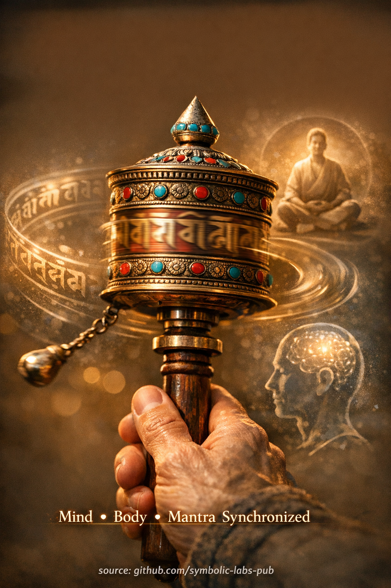

## [Prayer Wheel (Mani Wheel) — Explained Through Buddhist Teachings](https://github.com/symbolic-labs-pub/a-buddhist-view/blob/master/more/09_symbols/03_prayer_wheel/README.md#prayer-wheel-mani-wheel--explained-through-buddhist-teachings)

---

The **prayer wheel** (*mani wheel*) is not a shortcut, superstition, or mechanical trick. In authentic Buddhist understanding—especially within **Tibetan [Vajrayāna](../../05_yanas/README.md#4-vajrayāna-tantrayāna-mantrayāna---the-diamond-vehicle)**—it is a **training device for continuity of [awakening](../../10_concepts/README.md#3-enlightenment-bodhi-awakening)**.

---

## 1. What the Prayer Wheel Really Represents

At its core, the prayer wheel embodies **[dependent origination](../../02_from_ignorance_to_awakening/3_dependent_origination/README.md#the-twelve-links-the-classic-formulation) in action**.

Inside the wheel are written [mantra](../10_mantra/README.md#what-a-mantra-is-buddhist-view)s—most commonly **Om Mani Padme Hum**, the mantra of [compassion](../../02_from_ignorance_to_awakening/7_compassion/README.md#compassion-as-a-structural-principle-in-buddhist-teaching). These are not “stored prayers” but **imprints of awakened speech**.

When the wheel turns:

* **Body** performs a disciplined action
* **Speech** is represented by mantra
* **Mind** holds intention and [awareness](../../10_concepts/README.md#2-awareness-rigpa-vijñāna-knowing)

This unifies the **Three Gates** (body, speech, mind), which is the **entire path of practice in condensed form**.

> In Buddhism, awakening happens **when the Three Gates align**.

---

## 2. Why Clockwise Rotation Matters

Clockwise movement is not arbitrary.

It mirrors:

* The **cosmic order** (sun, stars, [mandala](../07_mandala/README.md#mandala--explained-according-to-buddhist-teachings) circumambulation)
* The **direction of enlightened activity**
* The traditional direction of **circumambulating [stupas](../05_stupa/README.md#1-what-a-stupa-is-beyond-architecture) and teachers**

Turning counter-clockwise symbolically **unwinds** rather than supports conditioned awakening patterns.

So clockwise turning is an **act of harmony with [Dharma](../../01_core_teachings/the_three_jewels/README.md#2-dharma--the-path-and-the-law-of-reality)**, not a rule for its own sake.

---

## 3. “Each Turn Equals a Recitation” — What This Really Means

This does **not** mean mechanical merit accumulation.

Rather:

* A full rotation represents **continuity of intention**
* It trains the mind to **stay with one wholesome orientation**
* It replaces scattered thought with **stable repetition**

In Buddhist psychology, **continuity beats intensity**.

A distracted person reciting 1,000 mantras gains less clarity than a focused person turning a wheel with calm presence.

---

## 4. The Deeper Purpose: Training Non-Fragmentation

The prayer wheel trains something subtle but critical:

> **Staying aligned while moving**

Most [suffering](../../02_from_ignorance_to_awakening/2_the_four_noble_truths/README.md#1-there-is-suffering--dukkha) arises because:

* The body does one thing
* The speech says another
* The mind is somewhere else entirely

The mani wheel gently reverses this fragmentation.

It teaches:

* Rhythm instead of force
* Consistency instead of emotional highs
* Practice embedded in daily movement

This is why prayer wheels appear **on paths, walls, bridges, and villages**—they integrate Dharma into ordinary life.

---

## 5. Why Speed Is Discouraged

Fast spinning driven by ego (“more turns = more merit”) **misses the point**.

Speed feeds:

* Restlessness
* Spiritual materialism
* Quantification of awakening

Correct use emphasizes:

* Even pacing
* Relaxed awareness
* Stable intention

In Vajrayāna, **quality of mind defines the result**, not the quantity of motion.

---

## 6. What the Prayer Wheel Is *Not*

It is **not**:

* A substitute for [meditation](../../08_lineage/README.md)
* A way to bypass [ethics](../../01_core_teachings/the_noble_eightfold_path/README.md#2-ethical-conduct-śīla) or insight
* A magical object that “works by itself”

It **is**:

* A support for [mindfulness](../../01_core_teachings/the_noble_eightfold_path/README.md#7-right-mindfulness-sammā-sati)
* A stabilizer for intention
* A bridge between ritual and realization

Without awareness, it is decoration.
With awareness, it becomes **practice-in-motion**.

---

## 7. The Essential Teaching in One Line

> The prayer wheel teaches that awakening is not something you stop life to do—
> **it is something you rotate through life with, again and again, without breaking continuity.**

---

< [Dorje (Vajra) — explained according to Buddhist teachings](../02_dorje/README.md) | [Prayer Flags (Lungta) — Explained Through Buddhist Teachings](../04_prayer_flags/README.md) >

_source: [github.com/symbolic-labs-pub](https://github.com/symbolic-labs-pub)_

---
